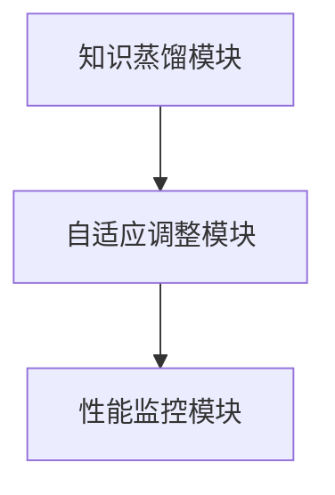
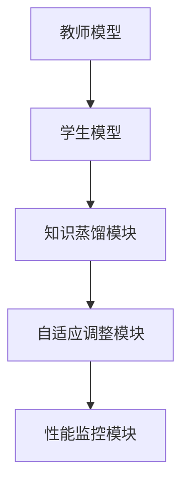
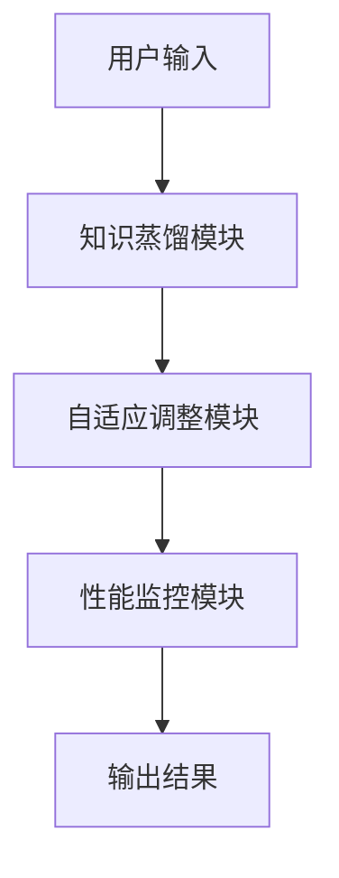

                 


# 设计AI Agent的自适应知识蒸馏策略

> 关键词：AI Agent，知识蒸馏，自适应蒸馏，深度学习，机器学习，自适应系统

> 摘要：本文将详细探讨设计AI Agent的自适应知识蒸馏策略的核心概念、算法原理、系统架构以及实际应用场景。通过分析自适应蒸馏的背景、原理、实现方法，结合数学模型和系统设计，为AI Agent的知识迁移提供一种高效、动态的解决方案。

---

# 第一部分: AI Agent与自适应知识蒸馏概述

## 第1章: 自适应知识蒸馏的背景与问题背景

### 1.1 问题背景

#### 1.1.1 知识蒸馏的定义与核心概念
知识蒸馏是一种将复杂模型（教师模型）的知识迁移到简单模型（学生模型）的技术。其核心在于通过损失函数的优化，使学生模型在教师模型的指导下，学习到教师模型的决策边界和特征表示。

#### 1.1.2 自适应蒸馏的必要性
传统的知识蒸馏方法通常采用固定的蒸馏策略，难以应对动态变化的环境和任务需求。AI Agent作为动态交互的智能体，需要在不同的场景下灵活调整蒸馏策略，以适应环境的变化。

#### 1.1.3 AI Agent中的知识蒸馏挑战
- 动态任务切换：AI Agent需要在不同任务之间切换时快速调整蒸馏策略。
- 实时性要求：AI Agent需要在实时环境中快速完成蒸馏过程。
- 知识多样性：教师模型可能包含冗余或不相关知识，需要动态筛选。

### 1.2 问题描述

#### 1.2.1 知识蒸馏的常见问题
- 知识抽取的效率问题：如何高效提取教师模型的有用知识？
- 知识迁移的准确性问题：如何保证学生模型准确继承教师模型的知识？
- 蒸馏过程的动态调整问题：如何应对环境变化和任务需求的动态调整？

#### 1.2.2 自适应蒸馏的目标与边界
- 目标：设计一种动态调整蒸馏策略的方法，使AI Agent能够在不同场景下高效、准确地进行知识蒸馏。
- 边界：限定在监督学习和无对抗环境下的知识蒸馏，不考虑恶意攻击或对抗性干扰。

#### 1.2.3 AI Agent中的知识蒸馏场景
- 多任务学习：AI Agent需要在多个任务之间切换时进行知识蒸馏。
- 实时交互：AI Agent需要在实时交互过程中动态调整蒸馏策略。
- 知识更新：AI Agent需要定期更新其知识库，以适应新环境和任务。

### 1.3 解决思路

#### 1.3.1 知识蒸馏的基本思路
- 通过损失函数优化，使学生模型学习教师模型的决策边界和特征表示。
- 采用动态调整的蒸馏策略，根据环境变化和任务需求调整蒸馏过程。

#### 1.3.2 自适应蒸馏的核心思想
- 引入自适应机制，动态调整蒸馏过程中的权重分配、损失函数和优化目标。
- 根据任务需求和环境变化，实时调整蒸馏策略，以提高知识迁移的效率和准确性。

#### 1.3.3 AI Agent中的具体实现思路
- 设计自适应蒸馏模块，实时监测环境变化和任务需求。
- 根据监测结果动态调整蒸馏策略，优化知识迁移过程。
- 通过反馈机制，持续改进蒸馏策略，提高AI Agent的适应性。

### 1.4 本章小结
本章从知识蒸馏的背景、问题背景、目标和边界等方面，详细介绍了AI Agent中自适应知识蒸馏的必要性和实现思路。接下来将深入探讨自适应蒸馏的核心概念和算法原理。

---

## 第2章: 自适应知识蒸馏的核心概念与联系

### 2.1 知识蒸馏的基本原理

#### 2.1.1 知识蒸馏的定义
知识蒸馏是一种通过损失函数优化，将教师模型的知识迁移到学生模型的技术。其核心在于通过损失函数的设计，使学生模型学习教师模型的决策边界和特征表示。

#### 2.1.2 知识蒸馏的核心过程
1. **教师模型输出**：教师模型对输入数据进行处理，输出概率分布或特征表示。
2. **损失函数设计**：设计损失函数，使学生模型的输出与教师模型的输出尽可能接近。
3. **优化过程**：通过反向传播和优化算法，调整学生模型的参数，使损失函数最小化。

#### 2.1.3 知识蒸馏的关键因素
- **教师模型的质量**：教师模型的性能直接影响蒸馏效果。
- **学生模型的容量**：学生模型的复杂度影响其学习能力。
- **损失函数的设计**：损失函数的优化目标直接影响蒸馏过程。

### 2.2 自适应蒸馏的核心机制

#### 2.2.1 自适应蒸馏的定义
自适应蒸馏是一种动态调整蒸馏策略的方法，能够在不同场景下，根据任务需求和环境变化，实时优化知识迁移过程。

#### 2.2.2 自适应蒸馏的核心特征
1. **动态性**：能够根据环境变化和任务需求，实时调整蒸馏策略。
2. **自适应性**：能够自动识别和优化蒸馏过程中的关键参数。
3. **高效性**：能够在较短时间内完成知识迁移，适应实时任务需求。

#### 2.2.3 自适应蒸馏与传统蒸馏的对比

| 对比维度 | 传统蒸馏 | 自适应蒸馏 |
|----------|----------|------------|
| 策略调整 | 静态固定 | 动态调整 |
| 适应性   | 低       | 高         |
| 资源消耗 | 高       | 低         |
| 知识迁移效率 | 中等     | 高         |

### 2.3 自适应蒸馏的优化目标

#### 2.3.1 知识蒸馏的目标函数
知识蒸馏的目标函数通常包括两部分：学生模型与教师模型的输出匹配项，以及学生模型自身的正则化项。

$$ L = L_{\text{distill}} + L_{\text{regularization}} $$

其中，$L_{\text{distill}}$ 是蒸馏损失，$L_{\text{regularization}}$ 是正则化损失。

#### 2.3.2 自适应蒸馏的优化目标
自适应蒸馏的目标是最小化蒸馏损失，同时动态调整蒸馏过程中的权重分配和优化目标。

$$ \min_{\theta} L_{\text{distill}} + \lambda L_{\text{regularization}} $$

其中，$\lambda$ 是动态调整的权重系数。

#### 2.3.3 自适应蒸馏的优化过程
1. **初始化**：设置初始权重系数和优化目标。
2. **动态调整**：根据任务需求和环境变化，实时调整权重系数。
3. **优化过程**：通过反向传播和优化算法，最小化损失函数。

### 2.4 本章小结
本章从知识蒸馏的基本原理出发，详细介绍了自适应蒸馏的核心机制和优化目标。通过对比传统蒸馏和自适应蒸馏的差异，进一步明确了自适应蒸馏的优势和应用前景。

---

## 第3章: 自适应知识蒸馏的数学模型

### 3.1 知识蒸馏的数学模型

#### 3.1.1 知识蒸馏的损失函数
知识蒸馏的损失函数通常包括蒸馏损失和交叉熵损失。

$$ L = \alpha L_{\text{distill}} + (1-\alpha) L_{\text{CE}} $$

其中，$\alpha$ 是蒸馏损失的权重系数，$L_{\text{CE}}$ 是交叉熵损失。

#### 3.1.2 知识蒸馏的优化目标
优化目标是通过调整学生模型的参数，最小化损失函数。

$$ \min_{\theta} \alpha L_{\text{distill}} + (1-\alpha) L_{\text{CE}} $$

#### 3.1.3 知识蒸馏的数学推导
通过求解损失函数的梯度，优化学生模型的参数。

$$ \theta = \theta - \eta \frac{\partial L}{\partial \theta} $$

其中，$\eta$ 是学习率。

### 3.2 自适应蒸馏的数学模型

#### 3.2.1 自适应蒸馏的损失函数
自适应蒸馏的损失函数动态调整蒸馏损失和交叉熵损失的权重系数。

$$ L = \lambda(t) L_{\text{distill}} + (1-\lambda(t)) L_{\text{CE}} $$

其中，$\lambda(t)$ 是动态调整的权重系数，$t$ 表示时间步或任务步。

#### 3.2.2 自适应蒸馏的优化目标
优化目标是通过动态调整权重系数，最小化损失函数。

$$ \min_{\theta} \lambda(t) L_{\text{distill}} + (1-\lambda(t)) L_{\text{CE}} $$

#### 3.2.3 自适应蒸馏的数学推导
通过引入自适应机制，动态调整权重系数 $\lambda(t)$，优化学生模型的参数。

$$ \theta = \theta - \eta \frac{\partial L}{\partial \theta} $$

其中，$\frac{\partial L}{\partial \theta}$ 是损失函数的梯度。

### 3.3 算法原理的详细讲解

#### 3.3.1 算法步骤的详细说明
1. **初始化**：设置初始参数和权重系数。
2. **动态调整**：根据任务需求和环境变化，实时调整权重系数。
3. **优化过程**：通过反向传播和优化算法，最小化损失函数。

#### 3.3.2 算法的数学表达
通过引入自适应机制，动态调整权重系数 $\lambda(t)$，优化学生模型的参数。

$$ \theta = \theta - \eta \frac{\partial L}{\partial \theta} $$

其中，$\lambda(t)$ 是动态调整的权重系数。

---

## 第4章: 系统分析与架构设计

### 4.1 系统分析

#### 4.1.1 问题场景介绍
AI Agent需要在动态环境中进行知识蒸馏，实时调整蒸馏策略，以适应任务需求和环境变化。

#### 4.1.2 项目介绍
设计一个AI Agent的自适应知识蒸馏系统，能够实时动态调整蒸馏策略，优化知识迁移过程。

### 4.2 系统功能设计

#### 4.2.1 系统功能模块
1. **知识蒸馏模块**：负责提取教师模型的知识，并将其迁移到学生模型。
2. **自适应调整模块**：实时监测环境变化和任务需求，动态调整蒸馏策略。
3. **性能监控模块**：监控系统性能，评估蒸馏效果，反馈调整信息。

#### 4.2.2 系统功能设计图


### 4.3 系统架构设计

#### 4.3.1 系统架构图


#### 4.3.2 系统接口设计
- **知识蒸馏接口**：用于教师模型和学生模型之间的知识迁移。
- **自适应调整接口**：用于实时调整蒸馏策略。
- **性能监控接口**：用于监控系统性能，反馈调整信息。

### 4.4 系统交互设计

#### 4.4.1 系统交互流程图


---

## 第5章: 项目实战

### 5.1 环境安装

#### 5.1.1 安装Python
```bash
python --version
```

#### 5.1.2 安装TensorFlow和Keras
```bash
pip install tensorflow keras
```

### 5.2 系统核心实现

#### 5.2.1 教师模型实现
```python
class TeacherModel:
    def __init__(self):
        self.model = load_model('teacher_model.h5')
```

#### 5.2.2 学生模型实现
```python
class StudentModel:
    def __init__(self):
        self.model = load_model('student_model.h5')
```

#### 5.2.3 损失函数实现
```python
def distillation_loss(y_true, y_pred, alpha=0.1):
    return alpha * K.mean(K.square(y_true - y_pred)) + (1-alpha)*K.categorical_crossentropy(y_true, y_pred)
```

---

## 第6章: 总结与展望

### 6.1 本章小结
本文详细探讨了设计AI Agent的自适应知识蒸馏策略的核心概念、算法原理、系统架构以及实际应用场景。通过分析自适应蒸馏的背景、原理、实现方法，结合数学模型和系统设计，为AI Agent的知识迁移提供了一种高效、动态的解决方案。

### 6.2 最佳实践 Tips
- 在实际应用中，建议根据具体任务需求，动态调整蒸馏策略。
- 使用高效的优化算法和动态调整的权重系数，提高蒸馏效率。
- 定期监控系统性能，及时反馈调整信息，优化蒸馏过程。

### 6.3 注意事项
- 在设计自适应蒸馏系统时，需要考虑环境变化和任务需求的多样性。
- 动态调整权重系数时，需要避免过拟合和欠拟合的问题。
- 实时交互过程中，需要保证系统的稳定性和高效性。

### 6.4 拓展阅读
- 《深度学习》：了解知识蒸馏的基本原理和实现方法。
- 《自适应系统设计》：掌握自适应系统的实现技巧和优化策略。

---

作者：AI天才研究院/AI Genius Institute & 禅与计算机程序设计艺术 /Zen And The Art of Computer Programming

