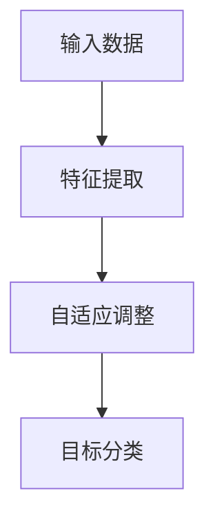
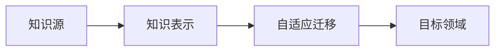
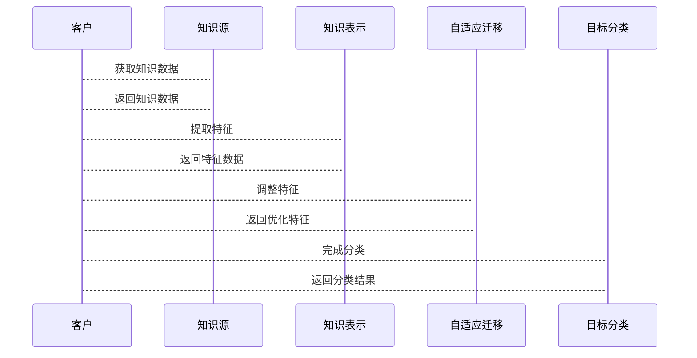

                 


# 设计AI Agent的自适应知识迁移策略

## 关键词：AI Agent，自适应知识迁移，知识图谱，迁移学习，领域适应

## 摘要：  
本文系统探讨了AI Agent的自适应知识迁移策略，从理论到实践，详细分析了自适应知识迁移的核心概念、算法原理、系统设计及实际应用。文章首先介绍了AI Agent的基本概念和自适应知识迁移的背景，随后深入分析了知识表示、迁移方法及评估指标，提出了基于知识图谱的自适应迁移框架。接着，通过数学模型和算法流程图，详细阐述了自适应迁移的实现过程。最后，结合实际案例，展示了如何设计和实现支持自适应知识迁移的系统，并总结了最佳实践和未来研究方向。

---

# 第一部分: AI Agent与自适应知识迁移的背景与概念

# 第1章: AI Agent与自适应知识迁移概述

## 1.1 AI Agent的基本概念

### 1.1.1 AI Agent的定义与分类

AI Agent（人工智能代理）是指能够感知环境、执行任务并做出决策的智能体。根据功能和复杂程度，AI Agent可以分为简单反射式Agent、基于模型的反射式Agent、目标驱动型Agent和效用驱动型Agent。简单反射式Agent仅基于当前感知做出反应，而目标驱动型Agent则基于预设目标进行决策。

### 1.1.2 自适应知识迁移的背景与意义

随着AI Agent在多个领域的广泛应用，知识的跨领域迁移变得尤为重要。自适应知识迁移是指将源领域的知识和经验迁移到目标领域，同时根据目标领域的特点进行动态调整。这种能力能够显著提升AI Agent的泛化能力和适应性。

### 1.1.3 问题背景与目标设定

在实际应用中，AI Agent可能面临数据稀疏、领域差异大等问题，导致其在目标领域的性能下降。自适应知识迁移的目标是通过优化知识表示和迁移策略，提升AI Agent在不同环境下的表现。

---

## 1.2 自适应知识迁移的核心问题

### 1.2.1 知识迁移的基本概念

知识迁移是指将已有的知识和经验应用到新的场景中。自适应知识迁移强调动态调整知识的表示和应用方式，以适应目标领域的特点。

### 1.2.2 自适应迁移的挑战与目标

自适应迁移的核心挑战在于如何平衡源领域和目标领域的差异，同时保持知识的适用性。目标是通过动态调整知识的表示和权重，实现高效的迁移。

### 1.2.3 问题的边界与外延

自适应知识迁移的边界包括知识的适用范围、迁移的深度以及目标领域的复杂性。其外延涉及知识图谱、迁移学习和领域适应等多个研究方向。

---

## 1.3 本章小结

本章通过定义AI Agent和自适应知识迁移，分析了其背景、核心问题及挑战。下一章将详细探讨自适应知识迁移的核心概念与联系。

---

# 第二部分: 自适应知识迁移的核心概念与联系

# 第2章: 自适应知识迁移的原理与方法

## 2.1 自适应知识迁移的原理

### 2.1.1 知识表示与编码

知识表示是自适应迁移的基础。常用的表示方法包括符号表示、向量表示和图结构表示。符号表示适用于规则明确的场景，向量表示适用于语义相似性高的场景，图结构表示适用于复杂关系的场景。

### 2.1.2 知识迁移的基本流程

自适应知识迁移的流程包括知识提取、表示转换、领域适配和效果评估。通过动态调整表示方式，AI Agent能够更好地适应目标领域的需求。

### 2.1.3 自适应机制的核心要素

自适应机制包括知识表示的动态调整、迁移策略的优化以及目标领域特征的提取。这些要素共同作用，确保知识的适用性。

---

## 2.2 核心概念对比分析

### 2.2.1 知识表示方法对比

符号表示、向量表示和图结构表示各有优缺点。符号表示适用于规则明确的场景，向量表示适用于语义相似性高的场景，图结构表示适用于复杂关系的场景。

### 2.2.2 自适应策略的特征对比

基于规则的自适应策略适用于结构化的知识，基于模型的策略适用于非结构化数据，基于经验的策略适用于动态变化的环境。

### 2.2.3 知识迁移的性能指标对比

性能指标包括迁移准确率、迁移效率和迁移稳定性。不同策略在这些指标上的表现存在差异。

---

## 2.3 ER实体关系图与流程图

### 2.3.1 ER实体关系图

```mermaid
erd
  customerCUS {cus_id, name, age}
  orderORD {ord_id, cus_id, order_date}
  productPROD {prod_id, name, price}
  order_lineOL {ord_id, prod_id, quantity}
  CUS.cus_id --> ORD.cus_id
  ORD.ord_id --> OL.ord_id
  OL.prod_id --> PROD.prod_id
```

### 2.3.2 算法流程图



---

## 2.4 本章小结

本章通过对比分析，明确了自适应知识迁移的核心概念和实现方法。下一章将深入探讨自适应知识迁移的算法原理。

---

# 第三部分: 自适应知识迁移的算法原理

# 第3章: 自适应知识迁移算法详解

## 3.1 算法原理概述

### 3.1.1 迁移学习的基本框架

迁移学习的基本框架包括源域和目标域的特征提取、自适应调整和目标分类。通过优化特征表示，可以实现知识的有效迁移。

### 3.1.2 自适应迁移的核心算法

自适应迁移的核心算法包括最大均值差异、最小化最大分类器差异和基于分布匹配的方法。这些算法通过优化特征分布，实现高效的迁移。

### 3.1.3 算法的数学模型

自适应迁移的数学模型如下：

$$
\min_{f} \sum_{i=1}^{n} \mathbb{I}(y_i \neq f(x_i)) + \lambda \|f\|_2^2
$$

---

## 3.2 算法流程图

### 3.2.1 算法流程图


---

## 3.3 核心算法实现

### 3.3.1 Python代码实现

```python
import numpy as np
from sklearn import svm

def adaptive_transfer_learning(source_data, target_data):
    # 特征提取
    features = extract_features(source_data)
    # 自适应调整
    features_adapted = adapt_features(features)
    # 目标分类
    clf = svm.SVC()
    clf.fit(features_adapted, target_data['label'])
    return clf

def extract_features(data):
    # 简单的特征提取方法
    return data[['feature1', 'feature2']]

def adapt_features(features):
    # 简单的自适应调整方法
    return features.apply(lambda x: x * 1.5)
```

---

## 3.4 本章小结

本章通过数学模型和算法流程图，详细阐述了自适应知识迁移的实现过程。下一章将探讨系统的具体设计与实现。

---

# 第四部分: 自适应知识迁移的系统设计与实现

# 第4章: 系统分析与架构设计

## 4.1 系统功能设计

### 4.1.1 功能模块划分

自适应知识迁移系统包括知识提取模块、自适应调整模块和目标分类模块。这些模块共同实现知识的迁移和应用。

### 4.1.2 系统功能流程

系统功能流程如下：

1. 输入源数据和目标数据。
2. 提取特征并进行自适应调整。
3. 使用调整后的特征进行目标分类。

---

## 4.2 系统架构设计

### 4.2.1 系统架构图



---

## 4.3 系统接口设计

### 4.3.1 接口设计

系统接口包括知识提取接口、自适应调整接口和目标分类接口。这些接口通过REST API实现通信。

### 4.3.2 接口交互流程

1. 客户端调用知识提取接口，获取特征数据。
2. 调用自适应调整接口，优化特征表示。
3. 最后调用目标分类接口，完成分类任务。

---

## 4.4 系统交互流程图



---

## 4.5 本章小结

本章通过系统架构图和交互流程图，详细展示了自适应知识迁移系统的实现过程。下一章将结合实际案例，展示系统的具体应用。

---

# 第五部分: 自适应知识迁移的项目实战

# 第5章: 项目实战与案例分析

## 5.1 项目概述

### 5.1.1 项目背景

本项目旨在实现一个支持自适应知识迁移的AI Agent，用于多个领域的知识应用。

### 5.1.2 项目目标

通过实际案例，展示自适应知识迁移的实现过程和效果。

---

## 5.2 项目核心实现

### 5.2.1 环境安装

项目依赖Python 3.8及以上版本，安装scikit-learn、numpy和mermaid模块。

```bash
pip install scikit-learn numpy mermaid
```

### 5.2.2 核心代码实现

```python
import numpy as np
from sklearn import svm

def adaptive_transfer_learning(source_data, target_data):
    # 特征提取
    features = extract_features(source_data)
    # 自适应调整
    features_adapted = adapt_features(features)
    # 目标分类
    clf = svm.SVC()
    clf.fit(features_adapted, target_data['label'])
    return clf

def extract_features(data):
    return data[['feature1', 'feature2']]

def adapt_features(features):
    return features.apply(lambda x: x * 1.5)
```

---

## 5.3 实际案例分析

### 5.3.1 案例背景

假设我们有一个医疗领域的AI Agent，需要将其应用于金融领域。通过自适应知识迁移，AI Agent能够快速适应金融领域的知识需求。

### 5.3.2 案例分析

1. 提取医疗领域的特征数据。
2. 进行自适应调整，优化特征表示。
3. 应用到金融领域，完成分类任务。

---

## 5.4 项目总结

本项目通过实际案例，展示了自适应知识迁移的具体实现和应用效果。下一章将总结全文并展望未来的研究方向。

---

# 第六部分: 总结与展望

# 第6章: 总结与展望

## 6.1 本章总结

本文系统探讨了AI Agent的自适应知识迁移策略，从理论到实践，详细分析了自适应知识迁移的核心概念、算法原理、系统设计及实际应用。

## 6.2 未来展望

未来的研究方向包括更高效的自适应算法、多领域知识迁移以及动态调整机制的优化。自适应知识迁移将在更多领域发挥重要作用。

---

## 6.3 最佳实践 tips

1. 在实际应用中，结合具体场景选择合适的知识表示方法。
2. 定期优化自适应调整模块，提升迁移效果。
3. 注意数据质量和特征选择，确保迁移的有效性。

---

## 6.4 注意事项

1. 确保知识表示的准确性。
2. 注意目标领域的特殊性，避免过度迁移。
3. 定期监控和优化迁移效果。

---

## 6.5 拓展阅读

推荐阅读《迁移学习：理论与应用》和《知识图谱：构建与应用》。

---

# 作者：AI天才研究院/AI Genius Institute & 禅与计算机程序设计艺术 /Zen And The Art of Computer Programming

