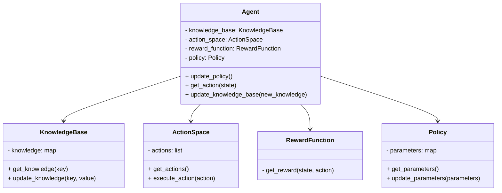
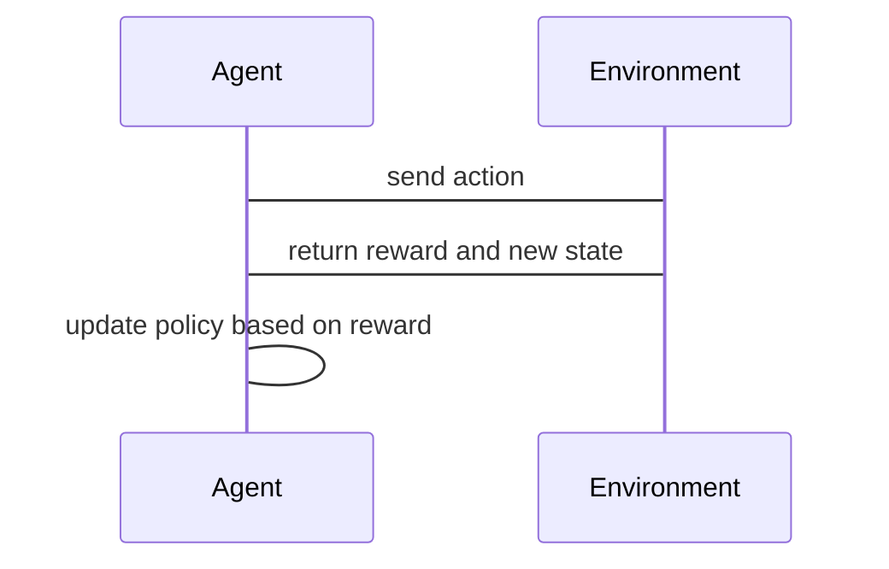

                 


# 设计AI Agent的自适应终身学习策略

---

## 关键词

- AI Agent
- 自适应学习
- 终身学习
- 强化学习
- 系统架构
- 项目实战

---

## 摘要

本文系统地探讨了设计AI Agent的自适应终身学习策略的核心理论、算法设计和实际应用。首先，我们介绍了AI Agent的基本概念和自适应学习的重要性，分析了传统机器学习的局限性以及自适应学习的必要性。接着，深入探讨了元学习和迁移学习的理论基础，以及它们在自适应终身学习中的应用。随后，我们详细讲解了知识表示与经验重用的机制，并结合强化学习设计了自适应策略。在系统架构部分，我们通过领域模型类图和架构图展示了系统的整体设计，分析了系统的功能模块和交互流程。最后，通过一个具体的项目实战，我们展示了如何实现一个自适应终身学习的AI Agent，并总结了最佳实践和未来的研究方向。

---

## 第一章: AI Agent的基本概念与自适应学习的重要性

### 1.1 AI Agent的定义与特点

#### 1.1.1 AI Agent的基本概念

AI Agent（人工智能代理）是指能够感知环境、自主决策并采取行动的智能实体。AI Agent的核心目标是通过与环境的交互，实现特定任务的目标，例如问题求解、数据分析、自动驾驶等。

#### 1.1.2 AI Agent的核心特点

1. **自主性**：AI Agent能够在没有外部干预的情况下自主决策。
2. **反应性**：AI Agent能够实时感知环境并做出反应。
3. **目标导向**：AI Agent的行为以实现特定目标为导向。
4. **学习能力**：AI Agent能够通过学习提升自身的性能。

#### 1.1.3 自适应学习在AI Agent中的作用

自适应学习是AI Agent实现智能的关键能力，它使AI Agent能够在动态环境中不断优化自身行为，适应新的任务和环境变化。

---

### 1.2 自适应学习的背景与挑战

#### 1.2.1 传统机器学习的局限性

传统机器学习模型通常需要大量标注数据，并且在训练完成后，难以适应新的数据分布和任务变化。例如，监督学习模型在训练数据之外的新数据上表现可能下降。

#### 1.2.2 自适应学习的必要性

在动态和不确定的环境中，AI Agent需要不断更新其知识和策略以应对新的挑战。自适应学习能够使AI Agent在不重新训练整个模型的情况下，快速适应新任务和环境变化。

#### 1.2.3 自适应学习的主要挑战

1. **数据稀疏性**：在某些领域，新数据可能非常稀少，导致难以有效更新模型。
2. **计算效率**：频繁的模型更新可能导致计算成本过高。
3. **稳定性**：自适应学习需要在更新过程中保持模型的稳定性，避免性能下降。

---

### 1.3 自适应终身学习的定义与目标

#### 1.3.1 自适应终身学习的定义

自适应终身学习是指AI Agent在面对不断变化的环境时，能够持续学习和优化自身知识和策略的能力。它强调AI Agent能够在不中断现有任务的情况下，逐步吸收新知识并适应新任务。

#### 1.3.2 自适应终身学习的核心目标

1. **持续学习**：AI Agent能够不断学习新知识，适应新任务。
2. **知识整合**：AI Agent能够有效地将新知识与已有知识整合，避免知识冲突。
3. **策略优化**：AI Agent能够根据新知识优化其决策策略，提高任务成功率。

#### 1.3.3 自适应终身学习与AI Agent的结合

自适应终身学习是AI Agent实现智能的核心能力，它使AI Agent能够在复杂和动态的环境中保持高性能。

---

## 第二章: 元学习与迁移学习

### 2.1 元学习的基本原理

#### 2.1.1 元学习的定义

元学习（Meta-Learning）是指学习如何学习的高级学习方法。它通过训练模型在多个任务上快速适应新任务的能力，从而减少对新任务的训练数据需求。

#### 2.1.2 元学习的核心机制

1. **任务嵌入**：将每个任务表示为一个向量，用于捕捉任务的特征。
2. **元优化器**：通过优化元损失函数，更新模型的参数，使其能够在新任务上快速适应。

#### 2.1.3 元学习的应用场景

元学习在AI Agent中的应用场景包括：
- 快速适应新任务。
- 处理数据稀疏的任务。
- 提高模型的泛化能力。

---

### 2.2 迁移学习的核心概念

#### 2.2.1 迁移学习的定义

迁移学习（Transfer Learning）是指将一个领域学到的知识应用到另一个领域的方法。它通过共享不同任务或领域的特征，减少新任务的训练数据需求。

#### 2.2.2 迁移学习的主要方法

1. **直接迁移**：直接将源领域的模型应用到目标领域。
2. **特征提取**：提取源领域的特征，并将其应用于目标领域。
3. **领域适配**：通过调整模型参数，使源领域和目标领域的特征对齐。

#### 2.2.3 迁移学习与自适应学习的关系

迁移学习是自适应学习的重要组成部分，它使AI Agent能够利用已有的知识快速适应新任务。

---

## 第三章: 知识表示与经验重用

### 3.1 知识表示的方法

#### 3.1.1 符号表示法

符号表示法通过符号和规则表示知识，例如使用逻辑规则和语义网络。

#### 3.1.2 向量表示法

向量表示法将知识表示为向量，例如使用Word2Vec将单词表示为向量。

#### 3.1.3 图结构表示法

图结构表示法将知识表示为图结构，例如知识图谱。

---

### 3.2 经验重用的策略

#### 3.2.1 直接重用

直接重用是指将已有经验直接应用于新任务，例如将已解决的分类任务直接应用于新的分类任务。

#### 3.2.2 修改后重用

修改后重用是指在已有经验的基础上，通过修改部分参数或结构，使其适用于新任务。

#### 3.2.3 综合重用

综合重用是指将已有经验中的多个部分进行综合，形成新的解决方案，例如结合多个任务的经验解决新任务。

---

## 第四章: 强化学习在自适应策略中的应用

### 4.1 强化学习的基本原理

#### 4.1.1 强化学习的定义

强化学习（Reinforcement Learning）是指通过智能体与环境的交互，学习最优策略以最大化累积奖励的过程。

#### 4.1.2 强化学习的核心要素

1. **状态空间**：环境的状态描述。
2. **动作空间**：智能体可执行的动作。
3. **奖励函数**：对智能体行为的评价。

#### 4.1.3 强化学习与监督学习的区别

- 监督学习：基于样本的标签进行学习。
- 强化学习：基于与环境的交互进行学习，强调探索与利用。

---

### 4.2 基于强化学习的自适应策略设计

#### 4.2.1 策略梯度方法

策略梯度方法通过优化策略的参数，直接优化策略的对数概率，例如REINFORCE算法。

#### 4.2.2 Q-learning算法

Q-learning算法通过学习状态-动作值函数，找到最优策略。

#### 4.2.3 多目标优化策略

多目标优化策略通过同时优化多个目标，使智能体在多个方面实现平衡。

---

## 第五章: 系统架构与实现

### 5.1 系统功能设计

#### 5.1.1 领域模型设计

领域模型通过类图描述系统的功能模块及其交互关系。



#### 5.1.2 系统架构设计

系统架构通过分层设计，将AI Agent的各个模块有机地结合起来。


#### 5.1.3 系统交互设计

系统交互通过序列图展示AI Agent与环境的交互流程。



---

### 5.2 项目实战

#### 5.2.1 环境安装

安装必要的库：

```bash
pip install numpy matplotlib tensorflow
```

---

#### 5.2.2 核心代码实现

实现一个简单的强化学习AI Agent：

```python
import numpy as np

class Agent:
    def __init__(self, state_space, action_space):
        self.state_space = state_space
        self.action_space = action_space
        self.theta = np.random.randn(1)

    def get_action(self, state):
        return np.argmax(self.theta * state)

    def update_policy(self, reward, state, action):
        self.theta += 0.1 * (reward - np.mean(self.theta)) * state[action]

# 初始化环境
state_space = [1, 2, 3]
action_space = [0, 1]
agent = Agent(state_space, action_space)

# 训练过程
for _ in range(100):
    state = np.random.choice(state_space)
    action = agent.get_action(state)
    reward = 1 if action == 1 else 0
    agent.update_policy(reward, state, action)
```

#### 5.2.3 代码解读与分析

1. **初始化**：创建一个AI Agent，初始化参数theta。
2. **获取动作**：根据当前状态，选择动作。
3. **更新策略**：根据奖励更新参数theta。

---

### 5.3 实际案例分析

通过一个简单的环境案例，展示AI Agent如何通过强化学习优化其策略。

---

### 5.4 项目小结

通过项目实战，我们展示了如何设计和实现一个简单的自适应终身学习的AI Agent。这为我们后续的设计提供了参考。

---

## 第六章: 总结与展望

### 6.1 总结

本文系统地探讨了设计AI Agent的自适应终身学习策略的核心理论、算法设计和实际应用。通过元学习、迁移学习和强化学习的方法，我们展示了如何实现AI Agent的自适应学习能力。

### 6.2 未来研究方向

1. **更高效的知识表示方法**：研究更高效的表示方法，提高知识重用的效率。
2. **多任务学习**：研究如何在多任务场景下实现自适应学习。
3. **边缘计算环境下的自适应学习**：研究在边缘计算环境下，AI Agent的自适应学习方法。

### 6.3 最佳实践

1. **数据预处理**：在实际应用中，数据预处理非常重要，尤其是数据清洗和特征工程。
2. **模型选择**：选择合适的模型和算法，根据任务需求进行选择。
3. **持续优化**：定期优化模型和策略，保持AI Agent的高性能。

---

## 作者

作者：AI天才研究院/AI Genius Institute & 禅与计算机程序设计艺术 /Zen And The Art of Computer Programming

