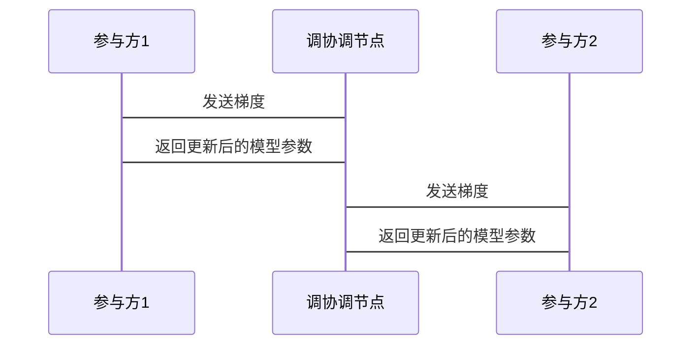

                 


# 设计基于联邦学习的跨境支付风险评估系统

## 关键词：联邦学习、跨境支付、风险评估、数据隐私、人工智能、支付安全

## 摘要：本文详细介绍了基于联邦学习的跨境支付风险评估系统的设计与实现。通过联邦学习技术，本文解决了跨境支付中的数据隐私和安全问题，实现了高精度的风险评估。文章从联邦学习的基本概念、算法原理、系统架构设计到项目实战进行了全面的分析和讲解，最后给出了系统的最佳实践和优化建议。

---

# 第一部分：背景介绍

## 第1章：联邦学习与跨境支付风险评估概述

### 1.1 联邦学习的基本概念

#### 1.1.1 联邦学习的定义与特点
- 联邦学习是一种分布式机器学习技术，允许多个参与方在不共享原始数据的情况下进行模型训练。
- 其特点包括数据隐私保护、模型可扩展性、去中心化等。

#### 1.1.2 联邦学习的优势与应用场景
- 数据隐私保护：通过联邦学习，各方可以在不共享数据的情况下协同训练模型。
- 模型可扩展性：适用于数据分布广泛、数据量大的场景，如跨境支付。

#### 1.1.3 跨境支付风险评估的背景与挑战
- 跨境支付涉及多国法律、金融系统差异，风险评估复杂。
- 数据隐私和安全问题：各国对数据共享有严格规定，如何在不共享数据的情况下进行风险评估是关键。

### 1.2 聯合学习在跨境支付中的核心问题

#### 1.2.1 跨境支付的主要风险类型
- 洗钱风险：非法资金流动。
- 诈骗风险：虚假交易。
- 账户盗用风险：未经授权的交易。

#### 1.2.2 数据隐私与安全的挑战
- 各国对数据隐私的法律要求不同，数据共享难度大。
- 数据分布不均，如何在异构数据源上训练模型是挑战。

#### 1.2.3 联邦学习在风险评估中的作用
- 通过联邦学习，可以在不共享数据的情况下，协同训练风险评估模型。
- 提高模型的泛化能力，应对跨境支付中的多样化风险。

---

## 第2章：联邦学习的核心概念与联系

### 2.1 联邦学习的原理与机制

#### 2.1.1 联邦学习的基本原理
- 参与方（如银行、支付机构）各自持有数据，通过通信协议协同训练模型。
- 模型参数在各参与方之间传递和更新，最终得到一个全局模型。

#### 2.1.2 联邦学习的通信机制
- 数据不出域：模型参数更新在本地进行，不传输原始数据。
- 模型同步：定期将模型参数同步到其他参与方。

#### 2.1.3 联邦学习的同步与异步模式
- 同步模式：所有参与方同时更新模型参数。
- 异步模式：参与方按顺序更新模型参数，不同时同步。

### 2.2 联邦学习的模型与算法

#### 2.2.1 横向联邦学习与纵向联邦学习
| 对比维度 | 横向联邦学习 | 纵向联邦学习 |
|----------|--------------|--------------|
| 数据分布 | 特征独立 | 样本独立 |
| 适用场景 | 数据维度相同，适合横向扩展 | 数据样本独立，适合纵向扩展 |

#### 2.2.2 联邦学习的主流算法
- 基于安全多方计算的联邦学习：通过加密计算保护数据隐私。
- 基于区块链的联邦学习：利用区块链的不可篡改性保证模型更新的透明性。

#### 2.2.3 联邦学习的数学模型
- 模型参数更新公式：$\theta_{i+1} = \theta_i + \eta \cdot g_i$，其中$\theta_i$是模型参数，$\eta$是学习率，$g_i$是梯度。
- 损失函数：$L(\theta) = \sum_{i=1}^n L_i(\theta)$，其中$L_i$是各参与方的损失函数。

### 2.3 联邦学习与跨境支付的结合

#### 2.3.1 跨境支付数据的特点与需求
- 数据异构性：不同国家的支付数据格式、字段可能不同。
- 数据量大：跨境支付涉及大量的交易数据，需要高效的模型处理。

#### 2.3.2 联邦学习在风险评估中的应用
- 模型训练：在不共享数据的情况下，协同训练风险评估模型。
- 实时监控：通过联邦学习模型实时监控交易风险。

#### 2.3.3 联邦学习与数据隐私保护
- 数据不出域：通过联邦学习，数据始终保留在本地，仅模型参数进行同步。
- 数据加密：通过加密技术保护模型参数传输的安全性。

---

# 第二部分：算法原理讲解

## 第3章：联邦学习算法的数学模型与公式

### 3.1 联邦学习的基本数学模型

#### 3.1.1 模型参数更新公式
$$\theta_{i+1} = \theta_i + \eta \cdot \sum_{j=1}^k \lambda_j g_j(\theta_i)$$
其中，$\theta_i$是当前模型参数，$\eta$是学习率，$\lambda_j$是参与方$j$的权重，$g_j(\theta_i)$是参与方$j$的梯度。

#### 3.1.2 联邦学习的损失函数
$$L(\theta) = \sum_{j=1}^k \lambda_j L_j(\theta)$$
其中，$L_j(\theta)$是参与方$j$的损失函数，$\lambda_j$是参与方的权重。

#### 3.1.3 模型收敛性分析
- 联邦学习的模型收敛性依赖于参与方的损失函数和权重分配。
- 通过适当的权重分配和优化算法，可以保证模型的收敛性。

### 3.2 联邦学习的通信与同步机制

#### 3.2.1 参数更新的数学推导
$$\Delta \theta = \sum_{j=1}^k \lambda_j g_j(\theta)$$
$$\theta_{new} = \theta_{old} + \eta \cdot \Delta \theta$$

#### 3.2.2 同步与异步模式的数学分析
- 同步模式：所有参与方同时更新模型参数，保证参数一致性。
- 异步模式：参与方按顺序更新模型参数，可能导致参数不一致，但可以提高训练效率。

#### 3.2.3 模型融合的数学方法
- 线性加权：$\theta_{new} = \sum_{j=1}^k \lambda_j \theta_j$
- 非线性加权：$\theta_{new} = \sigma(\sum_{j=1}^k \lambda_j \theta_j)$，其中$\sigma$是激活函数。

## 第4章：联邦学习算法的实现与案例分析

### 4.1 联邦学习算法的实现步骤

#### 4.1.1 数据预处理与特征提取
- 数据清洗：处理缺失值、异常值。
- 特征提取：提取支付交易的关键特征，如交易金额、时间、参与方等。

#### 4.1.2 模型训练与参数更新
- 在每个参与方本地训练模型，计算梯度。
- 将梯度按权重发送到协调节点，更新全局模型参数。

#### 4.1.3 模型评估与优化
- 使用验证集评估模型性能。
- 调整学习率、权重分配等参数，优化模型性能。

### 4.2 联邦学习的Python实现示例

#### 4.2.1 简单联邦学习算法实现
```python
import numpy as np

def update_parameters(theta, gradients, learning_rate):
    return theta + learning_rate * np.sum(gradients, axis=0)

# 示例：多个参与方的梯度更新
theta = np.array([0.1, 0.2])
gradients = [np.array([0.1, 0.2]), np.array([0.3, 0.4])]
learning_rate = 0.1

new_theta = update_parameters(theta, gradients, learning_rate)
print(new_theta)
```

#### 4.2.2 数据通信与同步代码
```python
import requests

# 发送梯度到协调节点
url = "http://coordination_node:8080/update"
data = {"gradients": gradients.tolist()}
response = requests.post(url, json=data)
print(response.status_code)
```

#### 4.2.3 模型评估与可视化
```python
from sklearn.metrics import accuracy_score

# 评估模型性能
y_pred = model.predict(X_test)
accuracy = accuracy_score(y_test, y_pred)
print(f"Accuracy: {accuracy}")
```

### 4.3 联邦学习的数学模型与公式详细解读

#### 4.3.1 联邦学习的数学基础
- 概率论与统计学基础：包括概率分布、贝叶斯定理等。
- 优化算法与梯度下降：包括随机梯度下降、Adam优化器等。
- 联邦学习的数学推导：包括参数更新公式、损失函数等。

#### 4.3.2 联邦学习的核心公式
$$\theta_{new} = \theta_{old} + \eta \cdot \sum_{j=1}^k \lambda_j g_j(\theta_{old})$$
其中，$\theta_{old}$是当前模型参数，$\eta$是学习率，$\lambda_j$是参与方$j$的权重，$g_j(\theta_{old})$是参与方$j$的梯度。

---

## 第5章：联邦学习的数学模型与公式详细解读

### 5.1 联邦学习的数学基础

#### 5.1.1 概率论与统计学基础
- 概率分布：如高斯分布、贝塔分布等。
- 期望值与方差：期望值是数据的平均值，方差是数据的离散程度。

#### 5.1.2 优化算法与梯度下降
- 梯度下降：通过计算损失函数的梯度，更新模型参数，降低损失。
- 随机梯度下降：在大数据集上，使用小批量数据计算梯度，加速训练。

#### 5.1.3 联邦学习的数学推导
- 模型参数更新公式推导：通过优化理论，推导出模型参数的更新公式。
- 损失函数优化：通过求解损失函数的极小值，得到最优模型参数。

### 5.2 联邦学习的核心公式

#### 5.2.1 模型参数更新公式
$$\Delta \theta = \sum_{j=1}^k \lambda_j g_j(\theta)$$
$$\theta_{new} = \theta_{old} + \eta \cdot \Delta \theta$$

#### 5.2.2 损失函数与优化目标
$$L(\theta) = \sum_{j=1}^k \lambda_j L_j(\theta)$$
$$\min_{\theta} L(\theta)$$

#### 5.2.3 模型融合公
$$\theta_{new} = \sigma\left(\sum_{j=1}^k \lambda_j \theta_j\right)$$
其中，$\sigma$是激活函数，如sigmoid函数。

---

# 第三部分：系统分析与架构设计

## 第6章：系统分析与架构设计方案

### 6.1 问题场景介绍

#### 6.1.1 跨境支付风险评估的场景描述
- 跨境支付涉及多国金融系统，数据隐私要求高。
- 需要实时监控交易风险，防止洗钱、诈骗等违法行为。

#### 6.1.2 系统目标与范围
- 实时风险评估：基于联邦学习模型，实时监控交易风险。
- 数据隐私保护：通过联邦学习，保护参与方的数据隐私。

### 6.2 系统功能设计

#### 6.2.1 领域模型设计
```mermaid
classDiagram
    class 跨境支付交易
    {
        交易ID: string
        时间: datetime
        参与方: array
        金额: float
        状态: string
    }
    class 风险评估模型
    {
        模型参数: array
        模型版本: int
        损失函数: function
    }
    class 系统架构
    {
        协调节点: string
        参与方1: string
        参与方2: string
        ...
    }
```

#### 6.2.2 系统架构设计


#### 6.2.3 系统接口设计
- 梯度更新接口：参与方发送梯度到协调节点。
- 模型参数同步接口：协调节点将更新后的模型参数分发给参与方。

#### 6.2.4 系统交互设计


---

## 第7章：项目实战

### 7.1 环境安装与配置

#### 7.1.1 环境要求
- Python 3.8+
- 安装必要的库：Flask、numpy、pandas、scikit-learn

#### 7.1.2 安装步骤
```bash
pip install flask numpy pandas scikit-learn
```

### 7.2 系统核心实现源代码

#### 7.2.1 联邦学习模型实现
```python
from flask import Flask, request, jsonify
import numpy as np

app = Flask(__name__)

@app.route('/update', methods=['POST'])
def update_model():
    data = request.json
    gradients = np.array(data['gradients'])
    global model_weights
    model_weights += learning_rate * gradients
    return jsonify({'status': 'success'})

if __name__ == '__main__':
    model_weights = np.array([0.1, 0.2])
    app.run(port=8080)
```

#### 7.2.2 数据处理与特征提取
```python
import pandas as pd
from sklearn.preprocessing import StandardScaler

# 加载数据
data = pd.read_csv('transaction_data.csv')

# 特征提取
features = data[['amount', 'time', 'participant']]
scaler = StandardScaler()
features_scaled = scaler.fit_transform(features)

# 标签提取
labels = data['risk']
```

#### 7.2.3 模型评估与优化
```python
from sklearn.metrics import accuracy_score

# 评估模型性能
y_pred = model.predict(X_test)
accuracy = accuracy_score(y_test, y_pred)
print(f"Accuracy: {accuracy}")
```

### 7.3 实际案例分析与详细解读

#### 7.3.1 实际案例分析
- 案例描述：某银行使用联邦学习模型，实时监控跨境交易风险。
- 数据来源：银行A、银行B、银行C的交易数据。
- 模型训练：在不共享数据的情况下，协同训练风险评估模型。

#### 7.3.2 系统运行流程
1. 参与方收集交易数据，进行预处理和特征提取。
2. 在本地训练模型，计算梯度。
3. 将梯度发送到协调节点，更新全局模型参数。
4. 协调节点将更新后的模型参数分发给参与方。
5. 参与方使用更新后的模型，实时监控交易风险。

### 7.4 项目小结

#### 7.4.1 项目总结
- 成功实现了基于联邦学习的跨境支付风险评估系统。
- 在不共享数据的情况下，实现了高精度的风险评估。

#### 7.4.2 经验与教训
- 数据预处理和特征提取是关键，需要仔细处理。
- 模型优化需要根据实际场景进行调整，不能一成不变。

---

## 第四部分：最佳实践

### 第8章：最佳实践、小结与注意事项

#### 8.1 最佳实践
- 数据预处理：仔细处理数据，确保特征提取准确。
- 模型优化：根据实际场景，调整学习率、权重分配等参数。
- 安全保障：加强数据隐私保护，确保模型参数传输的安全性。

#### 8.2 小结
- 本文详细介绍了基于联邦学习的跨境支付风险评估系统的设计与实现。
- 通过联邦学习技术，解决了跨境支付中的数据隐私和安全问题。

#### 8.3 注意事项
- 数据隐私保护：确保模型训练过程中数据不被泄露。
- 系统安全性：加强系统防护，防止黑客攻击。
- 模型维护：定期更新模型，保证模型性能。

### 第9章：拓展阅读与参考资料

#### 9.1 拓展阅读
- 联邦学习的最新研究进展。
- 跨境支付领域的其他先进技术。

#### 9.2 参考资料
- 《联邦学习：原理与应用》
- 《跨境支付：风险与安全》

---

## 作者：AI天才研究院 & 禅与计算机程序设计艺术

