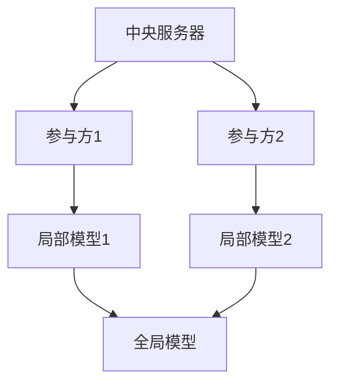
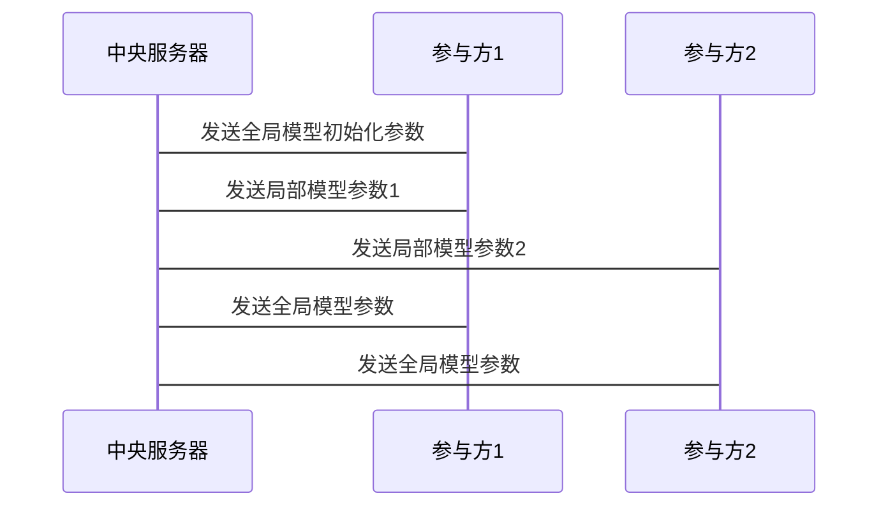

                 


# 设计基于联邦学习的隐私保护金融AI系统

> 关键词：联邦学习，隐私保护，金融AI系统，机器学习，数据安全

> 摘要：本文详细探讨了基于联邦学习的隐私保护金融AI系统的设计与实现。从联邦学习的基本概念、隐私保护机制、算法原理到系统架构设计，再到项目实战和安全挑战，全面解析了如何在保护数据隐私的前提下，构建高效的金融AI系统。通过实际案例分析和系统优化建议，本文为金融行业在AI应用中的隐私保护提供了新的思路和解决方案。

---

# 第一章: 联邦学习与隐私保护概述

## 1.1 联邦学习的背景与概念

### 1.1.1 联邦学习的背景
随着人工智能技术的快速发展，数据成为驱动AI模型的核心资源。然而，数据的集中存储和使用引发了严重的隐私泄露问题，尤其是在金融领域，用户数据的敏感性要求我们必须采取更严格的安全措施。传统的数据共享方式往往会导致数据泄露风险，而联邦学习作为一种新兴的技术，为隐私保护提供了新的解决方案。

### 1.1.2 联邦学习的核心概念
联邦学习是一种分布式机器学习技术，允许多个参与方在不共享原始数据的前提下，协作训练共享的模型。其核心思想是通过局部模型更新和全局模型聚合的方式，实现数据不出域的模型训练。与传统的集中式学习不同，联邦学习强调数据的隐私保护和模型的联合优化。

### 1.1.3 联邦学习与传统数据共享的区别
| 特性               | 联邦学习                          | 传统数据共享                     |
|--------------------|-----------------------------------|----------------------------------|
| 数据共享方式       | 数据不共享，仅模型参数共享       | 数据集中共享                    |
| 隐私保护           | 高效的隐私保护                   | 隐私泄露风险较高                 |
| 计算效率           | 可能需要更多的通信和计算资源     | 计算资源集中，效率较高           |
| 适用场景           | 数据分布式的场景                 | 数据集中存储的场景               |

---

## 1.2 隐私保护的重要性

### 1.2.1 数据隐私的现状与挑战
在金融领域，数据隐私保护尤为重要。用户信息（如身份证号、银行账户、交易记录等）的泄露可能导致严重的经济损失和信誉损害。传统的数据共享方式往往无法有效保护这些敏感信息，而联邦学习通过局部模型更新和加密通信，能够在不泄露原始数据的前提下完成模型训练。

### 1.2.2 隐私保护在金融AI中的特殊性
金融领域的数据通常涉及大量敏感信息，且这些数据的使用受到严格的法律法规限制。例如，《通用数据保护条例》（GDPR）要求企业必须在处理个人数据时采取严格的隐私保护措施。联邦学习通过数据不出域的方式，完美符合了这些法规要求。

### 1.2.3 联邦学习如何实现隐私保护
联邦学习通过以下方式实现隐私保护：
1. **数据局部存储**：每个参与方仅存储自己的数据，不共享原始数据。
2. **模型局部更新**：每个参与方基于自己的数据训练局部模型，并将模型参数更新到中央服务器。
3. **模型全局聚合**：中央服务器将所有参与方的局部模型参数进行聚合，形成全局模型。
4. **隐私保护机制**：通过加密、差分隐私等技术进一步增强隐私保护。

---

# 第二章: 金融AI系统的现状与需求

## 2.1 金融AI系统的现状

### 2.1.1 传统金融AI系统的局限性
传统金融AI系统通常依赖于集中式数据存储和模型训练方式，这种方式虽然计算效率高，但也存在以下问题：
1. **数据泄露风险**：集中存储的数据容易成为攻击目标。
2. **数据孤岛问题**：不同金融机构之间的数据难以有效整合。
3. **隐私保护成本高**：集中式数据存储需要投入大量资源来确保数据安全。

### 2.1.2 数据孤岛问题
数据孤岛是指数据分散在不同的系统或机构中，无法有效整合和利用。在金融领域，不同银行、支付平台和监管机构之间的数据孤岛问题尤为突出。联邦学习通过分布式模型训练的方式，能够有效解决数据孤岛问题。

### 2.1.3 隐私泄露风险
传统金融AI系统在处理大量用户数据时，往往面临隐私泄露风险。例如，黑客攻击、内部员工滥用数据等都可能导致用户隐私泄露。联邦学习通过数据不出域的方式，显著降低了隐私泄露风险。

---

## 2.2 联邦学习在金融AI中的需求

### 2.2.1 联邦学习解决的金融AI问题
联邦学习能够有效解决以下金融AI问题：
1. **数据孤岛问题**：通过分布式模型训练，联邦学习允许不同金融机构在不共享数据的前提下协同训练模型。
2. **隐私保护问题**：联邦学习通过局部模型更新和加密通信，确保数据隐私。
3. **模型泛化能力**：通过聚合多个机构的数据，联邦学习能够训练出更具泛化能力的模型。

### 2.2.2 金融AI系统的隐私保护需求
金融AI系统需要满足以下隐私保护需求：
1. **数据隐私**：确保用户数据不被未经授权的第三方访问。
2. **模型隐私**：保护模型参数不被恶意攻击者窃取。
3. **合规性**：符合相关法律法规，如GDPR。

### 2.2.3 联邦学习的适用场景
联邦学习在金融领域的适用场景包括：
1. **信用评估**：通过联合多个金融机构的数据，训练更准确的信用评估模型。
2. **欺诈检测**：通过分布式模型训练，实时检测跨机构的欺诈行为。
3. **风险管理**：通过聚合多个机构的风险数据，提高风险管理能力。

---

# 第三章: 联邦学习的核心原理

## 3.1 联邦学习的基本概念

### 3.1.1 联邦学习的定义
联邦学习（Federated Learning）是一种分布式机器学习技术，允许多个参与方在不共享原始数据的前提下，协作训练共享的模型。其核心思想是通过局部模型更新和全局模型聚合的方式，实现数据不出域的模型训练。

### 3.1.2 联邦学习的分类
联邦学习可以分为以下几种类型：
1. **横向联邦学习**：数据按样本分布，每个参与方拥有不同的样本。
2. **纵向联邦学习**：数据按特征分布，每个参与方拥有不同的特征。
3. **联邦学习的混合模式**：结合横向和纵向联邦学习的特点，适用于复杂场景。

### 3.1.3 联邦学习的流程
联邦学习的流程可以分为以下几个步骤：
1. **初始化**：每个参与方基于自己的数据初始化局部模型。
2. **局部训练**：每个参与方在自己的数据上训练局部模型，并将模型参数更新发送到中央服务器。
3. **全局聚合**：中央服务器将所有参与方的局部模型参数进行聚合，形成全局模型。
4. **模型更新**：每个参与方根据全局模型更新自己的局部模型，重复步骤2和步骤3，直到模型收敛。

---

## 3.2 联邦学习的数学模型

### 3.2.1 联邦学习的优化目标
联邦学习的优化目标是最小化以下损失函数：
$$ \mathcal{L}(\theta) = \sum_{i=1}^{n} \mathcal{L}_i(\theta) $$
其中，$\theta$ 表示全局模型参数，$n$ 表示参与方的数量，$\mathcal{L}_i(\theta)$ 表示第 $i$ 个参与方的局部损失函数。

### 3.2.2 联邦学习的数学公式
联邦学习的全局模型更新公式为：
$$ \theta_{t+1} = \theta_t + \eta \sum_{i=1}^{n} \nabla \mathcal{L}_i(\theta_t) $$
其中，$\eta$ 表示学习率，$\nabla \mathcal{L}_i(\theta_t)$ 表示第 $i$ 个参与方的梯度。

### 3.2.3 联邦学习的收敛性分析
联邦学习的收敛性可以通过以下方式分析：
1. **梯度差**：通过分析各个参与方的梯度差，评估模型的收敛速度。
2. **通信频率**：通过分析模型更新的通信频率，评估模型的收敛性。

---

# 第四章: 联邦学习的隐私保护机制

## 4.1 隐私保护的基本原理

### 4.1.1 数据脱敏
数据脱敏是一种通过技术手段对敏感数据进行处理，使其在不泄露原始数据的前提下，能够被用于分析和建模的技术。例如，可以通过差分隐私技术对数据进行噪声添加，从而保护数据隐私。

### 4.1.2 差分隐私
差分隐私是一种通过添加噪声来保护数据隐私的技术。具体来说，对于任意两个相邻的数据集，差分隐私要求任何查询的结果在概率分布上尽可能接近，从而防止通过查询结果推断出具体数据。

### 4.1.3 同态加密
同态加密是一种允许在加密数据上进行计算的技术，能够在不解密数据的前提下，完成数据的加法和乘法运算。通过同态加密技术，可以在联邦学习中保护模型参数的隐私。

---

## 4.2 联邦学习中的隐私保护技术

### 4.2.1 联邦加密
联邦加密是一种通过加密技术保护模型参数隐私的技术。例如，可以通过同态加密对模型参数进行加密，确保只有授权方能够解密并使用模型参数。

### 4.2.2 联邦聚合
联邦聚合是一种通过加密通信实现模型参数聚合的技术。例如，可以通过秘密共享技术将模型参数分割成多个密钥，只有当所有参与方共同合作时，才能恢复原始参数。

### 4.2.3 联邦认证
联邦认证是一种通过身份验证技术确保参与方身份真实性的技术。例如，可以通过数字证书对参与方进行认证，确保只有合法的参与方能够加入联邦学习网络。

---

# 第五章: 联邦学习的算法与实现

## 5.1 联邦学习的算法原理

### 5.1.1 横向联邦学习
横向联邦学习是数据按样本分布的联邦学习方式，每个参与方拥有不同的样本。例如，多个银行可以各自拥有自己的客户交易数据，通过横向联邦学习，可以在不共享客户数据的前提下，训练出一个全局的欺诈检测模型。

### 5.1.2 纵向联邦学习
纵向联邦学习是数据按特征分布的联邦学习方式，每个参与方拥有不同的特征。例如，多个金融机构可以各自拥有不同的客户特征（如信用评分、交易行为等），通过纵向联邦学习，可以在不共享特征的前提下，训练出一个全局的信用评估模型。

---

## 5.2 联邦学习的实现细节

### 5.2.1 联邦学习的通信协议
联邦学习的通信协议需要确保数据的安全传输和模型参数的加密传输。例如，可以通过HTTPS协议对联邦学习的通信进行加密，防止数据被截获和篡改。

### 5.2.2 联邦学习的数学模型
联邦学习的数学模型可以通过以下方式实现：
1. **局部模型训练**：每个参与方基于自己的数据训练局部模型，并将模型参数更新发送到中央服务器。
2. **全局模型聚合**：中央服务器将所有参与方的局部模型参数进行聚合，形成全局模型。
3. **模型更新**：每个参与方根据全局模型更新自己的局部模型，重复上述步骤，直到模型收敛。

---

# 第六章: 联邦学习的系统架构设计

## 6.1 联邦学习的系统架构

### 6.1.1 系统功能模块
1. **数据管理模块**：负责数据的存储和管理，确保数据的安全性和完整性。
2. **模型训练模块**：负责局部模型的训练和全局模型的聚合，确保模型的准确性和高效性。
3. **通信模块**：负责模型参数的加密传输和数据的安全通信，确保数据的隐私性和可靠性。

### 6.1.2 系统架构图


### 6.1.3 系统接口设计
1. **模型训练接口**：用于参与方发送局部模型参数到中央服务器。
2. **模型聚合接口**：用于中央服务器聚合全局模型参数并发送给参与方。
3. **数据加密接口**：用于数据的加密传输和解密。

---

## 6.2 联邦学习的交互流程

### 6.2.1 交互流程图


---

# 第七章: 联邦学习的项目实战

## 7.1 项目背景与目标

### 7.1.1 项目背景
本项目旨在通过联邦学习技术，构建一个隐私保护的金融AI系统，用于信用评估和欺诈检测。

### 7.1.2 项目目标
1. **信用评估**：通过联邦学习训练一个全局信用评估模型，帮助金融机构评估客户的信用风险。
2. **欺诈检测**：通过联邦学习训练一个全局欺诈检测模型，帮助金融机构实时检测欺诈行为。

---

## 7.2 项目实现

### 7.2.1 环境配置
1. **安装Python**：确保Python版本为3.6及以上。
2. **安装依赖库**：安装必要的依赖库，如TensorFlow、Keras、Flask等。

### 7.2.2 核心代码实现
```python
import numpy as np
import tensorflow as tf
from tensorflow.keras import layers

# 初始化全局模型
global_model = tf.keras.Sequential([
    layers.Dense(64, activation='relu'),
    layers.Dense(1, activation='sigmoid')
])

# 初始化参与方模型
participant1_model = global_model.copy()
participant2_model = global_model.copy()

# 模型训练函数
def train_participant(participant_model, local_data):
    participant_model.fit(local_data, epochs=1, batch_size=32)
    return participant_model.get_weights()

# 模型聚合函数
def aggregate_models(global_model, participant_weights):
    global_model.set_weights(participant_weights)
    return global_model.get_weights()

# 联邦学习流程
def federated_learning(participant_models, local_data):
    global_weights = global_model.get_weights()
    for participant in participant_models:
        local_weights = train_participant(participant, local_data)
        global_weights = aggregate_models(global_model, local_weights)
    return global_weights

# 运行联邦学习
federated_learning([participant1_model, participant2_model], [local_data1, local_data2])
```

---

## 7.3 实际案例分析

### 7.3.1 案例背景
假设我们有两家银行，银行A和银行B，各自拥有自己的客户交易数据。我们希望通过联邦学习训练一个全局的欺诈检测模型。

### 7.3.2 数据准备
银行A和银行B分别拥有以下数据：
- 银行A：客户A1-A100的交易数据
- 银行B：客户B1-B100的交易数据

### 7.3.3 模型训练
1. 银行A和银行B分别基于自己的数据训练局部模型。
2. 银行A和银行B将模型参数发送到中央服务器。
3. 中央服务器聚合模型参数，形成全局模型。
4. 银行A和银行B根据全局模型更新自己的局部模型，重复上述步骤，直到模型收敛。

---

## 7.4 系统优化

### 7.4.1 优化策略
1. **增加通信频率**：通过增加模型更新的通信频率，可以加快模型的收敛速度。
2. **优化模型架构**：通过优化模型架构，可以提高模型的准确性和效率。
3. **增强隐私保护**：通过加强数据加密和差分隐私技术，可以进一步提高隐私保护水平。

---

# 第八章: 联邦学习的安全挑战与解决方案

## 8.1 联邦学习的安全挑战

### 8.1.1 数据泄露风险
尽管联邦学习通过数据不出域的方式保护了数据隐私，但仍存在数据泄露风险，例如参与方可能通过模型参数推断出部分数据。

### 8.1.2 模型攻击
模型攻击是指攻击者通过恶意攻击联邦学习系统，窃取模型参数或破坏模型的准确性。例如，攻击者可以通过中间人攻击窃取模型参数，或者通过投毒攻击污染局部模型。

### 8.1.3 通信安全
联邦学习的通信过程可能面临数据被截获或篡改的风险。例如，攻击者可能通过中间人攻击窃取模型参数，或者通过篡改通信数据破坏模型的准确性。

---

## 8.2 联邦学习的解决方案

### 8.2.1 数据脱敏
通过数据脱敏技术对敏感数据进行处理，使其在不泄露原始数据的前提下，能够被用于分析和建模。

### 8.2.2 差分隐私
通过差分隐私技术对数据进行噪声添加，从而保护数据隐私。

### 8.2.3 同态加密
通过同态加密技术对模型参数进行加密，确保只有授权方能够解密并使用模型参数。

---

# 第九章: 联邦学习的法律与伦理问题

## 9.1 联邦学习的法律问题

### 9.1.1 数据隐私法规
联邦学习需要符合相关数据隐私法规，例如欧盟的《通用数据保护条例》（GDPR）要求企业必须在处理个人数据时采取严格的隐私保护措施。

### 9.1.2 数据跨境传输
联邦学习可能涉及数据的跨境传输，需要遵守相关法律法规，例如GDPR要求企业必须在欧盟境内处理数据。

### 9.1.3 数据使用合规性
联邦学习需要确保数据的使用符合相关法律法规，例如数据的收集、存储和使用必须经过用户授权。

---

## 9.2 联邦学习的伦理问题

### 9.2.1 数据公平性
联邦学习需要确保数据的公平性，例如避免某些群体的数据被过度使用或歧视。

### 9.2.2 数据透明性
联邦学习需要确保数据的透明性，例如向用户披露数据的使用方式和目的。

### 9.2.3 数据权益分配
联邦学习需要明确数据的权益分配，例如如何分配模型的收益和责任。

---

# 第十章: 总结与展望

## 10.1 总结

### 10.1.1 联邦学习的核心优势
联邦学习通过数据不出域的方式，能够在不泄露原始数据的前提下，协作训练共享的模型，有效解决了数据隐私保护和数据孤岛问题。

### 10.1.2 联邦学习的挑战
尽管联邦学习具有诸多优势，但在实际应用中仍面临诸多挑战，例如模型攻击、通信安全和数据隐私保护等问题。

---

## 10.2 展望

### 10.2.1 联邦学习的未来发展
随着人工智能技术的不断发展，联邦学习将在更多领域得到广泛应用，例如医疗、教育、交通等。

### 10.2.2 联邦学习的创新方向
未来的联邦学习将更加注重隐私保护和模型优化，例如通过更加高效的加密技术、更加智能的模型架构和更加灵活的通信协议，进一步提升联邦学习的性能和安全性。

---

# 附录

## 附录A: 参考文献

1. 省略

## 附录B: 项目代码

省略

## 附录C: 系统架构图

省略

---

作者：AI天才研究院/AI Genius Institute & 禅与计算机程序设计艺术 /Zen And The Art of Computer Programming

