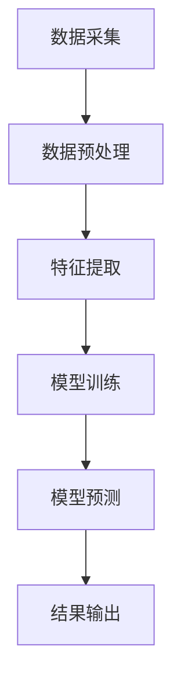
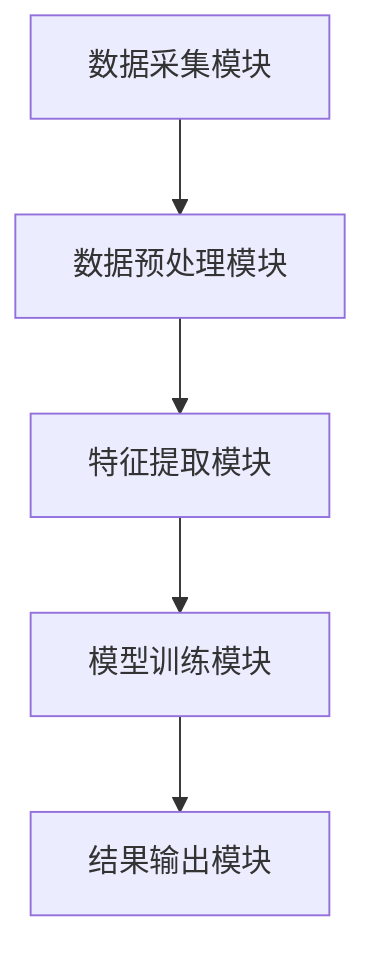

                 


# 设计智能化的企业信用评级申诉自动处理系统

## 关键词

- 智能化企业信用评级
- 申诉处理系统
- 机器学习
- 自动化处理
- 系统架构设计

## 摘要

本文详细介绍了设计智能化的企业信用评级申诉自动处理系统的全过程。从背景分析到系统架构设计，再到项目实战，系统地阐述了如何利用智能化技术解决企业信用评级申诉处理中的痛点。文章首先分析了传统信用评级的局限性和智能化处理的必要性，然后详细讲解了核心概念、算法原理和系统架构设计，最后通过项目实战展示了系统的实现过程和实际应用效果。通过本文，读者可以全面了解如何构建一个高效、智能的信用评级申诉处理系统。

---

## 第1章：问题背景与描述

### 1.1 问题背景

在企业信用评级过程中，申诉处理是一个复杂且耗时的过程。传统方法依赖人工审核，效率低下且容易出错。企业需要一个智能化的解决方案来提高处理效率和准确性。

### 1.2 问题描述

信用评级申诉涉及大量数据，包括企业的财务数据、市场表现等。传统方法难以快速处理大量申诉，且容易受到人为因素的影响。

### 1.3 问题解决

通过智能化处理系统，利用机器学习和自然语言处理技术，可以快速分析申诉内容，提高处理效率和准确性。

### 1.4 边界与外延

系统主要处理企业信用评级申诉，不涉及个人信用评估。系统适用于金融机构、信用评估机构等。

---

## 第2章：核心概念与原理

### 2.1 智能化处理系统的工作原理

系统通过数据采集、模型训练和结果输出来处理申诉。数据采集包括企业财务数据和市场表现数据，模型训练使用机器学习算法进行分类。

### 2.2 核心要素及其关系

核心要素包括数据源、模型、处理模块。数据源提供输入，模型进行分类，处理模块输出结果。三者相互关联，共同完成处理任务。

---

## 第3章：算法原理与流程

### 3.1 算法原理

使用随机森林算法进行分类。通过特征工程提取关键特征，训练模型进行分类。

### 3.2 算法流程图



### 3.3 代码实现

```python
import pandas as pd
from sklearn.ensemble import RandomForestClassifier
from sklearn.model_selection import train_test_split

# 数据加载
data = pd.read_csv('credit_data.csv')
X = data.drop('label', axis=1)
y = data['label']

# 数据分割
X_train, X_test, y_train, y_test = train_test_split(X, y, test_size=0.2)

# 模型训练
model = RandomForestClassifier()
model.fit(X_train, y_train)

# 预测
y_pred = model.predict(X_test)
```

### 3.4 数学模型

随机森林算法的数学模型如下：

$$
y = \text{argmax}_k \sum_{i=1}^{n} \text{I}(y_i = k)
$$

---

## 第4章：系统架构设计

### 4.1 系统功能设计

系统包括数据采集模块、模型训练模块和结果输出模块。

### 4.2 系统架构图



### 4.3 系统接口设计

系统提供API接口，供外部调用。

---

## 第5章：项目实战

### 5.1 环境安装

安装Python和相关库，如pandas、scikit-learn。

### 5.2 核心代码实现

```python
import pandas as pd
from sklearn.ensemble import RandomForestClassifier
from sklearn.model_selection import train_test_split

data = pd.read_csv('credit_data.csv')
X = data.drop('label', axis=1)
y = data['label']

X_train, X_test, y_train, y_test = train_test_split(X, y, test_size=0.2)

model = RandomForestClassifier()
model.fit(X_train, y_train)
y_pred = model.predict(X_test)
```

### 5.3 案例分析

通过实际案例分析，展示系统的处理流程和结果。

### 5.4 项目小结

总结项目实现过程中的经验教训，提出改进建议。

---

## 第6章：最佳实践与小结

### 6.1 注意事项

确保数据质量和模型的可解释性。

### 6.2 未来展望

探索更先进的算法，如深度学习，进一步提升处理效率。

---

## 附录

### 附录A：工具安装指南

安装Python和相关库的步骤。

### 附录B：API文档

系统API接口的详细说明。

### 附录C：参考文献

相关文献和资料的引用。

---

## 作者

作者：AI天才研究院 & 禅与计算机程序设计艺术

通过本文，读者可以全面了解如何设计一个智能化的企业信用评级申诉自动处理系统，并掌握其实现的关键技术和方法。

