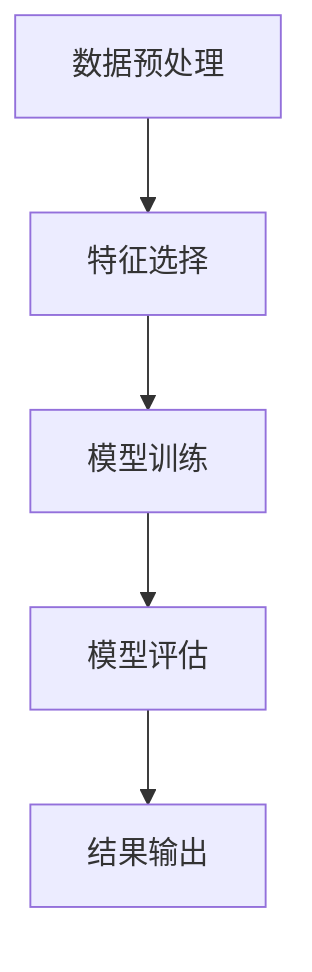
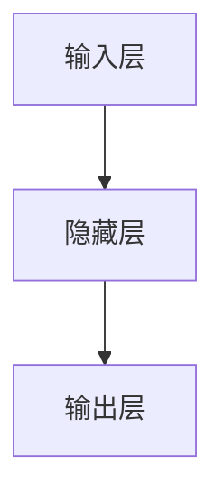
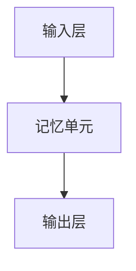
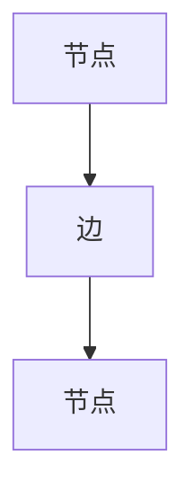
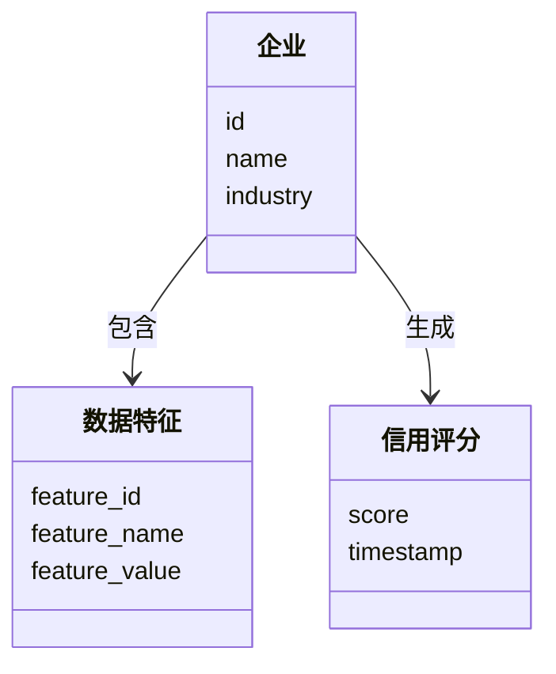
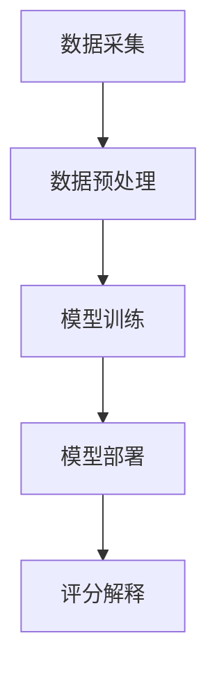
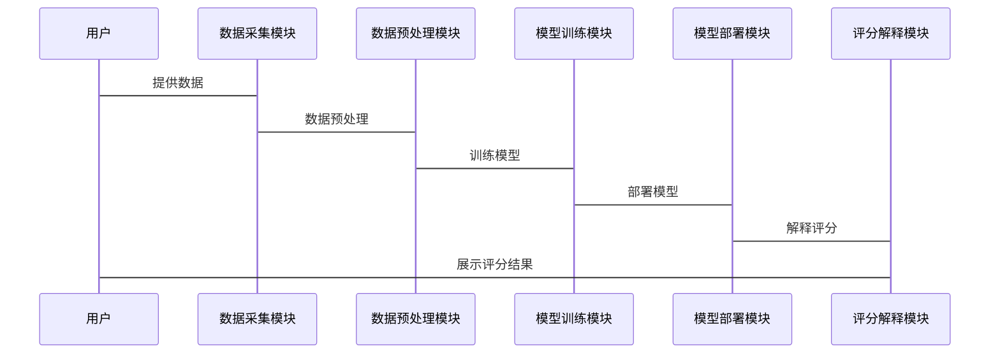

                 


# 设计智能化的企业信用评级解释系统

> 关键词：企业信用评级，人工智能，智能化系统，信用评分，系统架构

> 摘要：本文详细探讨了如何设计一个智能化的企业信用评级解释系统，通过结合先进的机器学习算法和系统架构设计，提供了一个从理论到实践的全面解决方案。本文首先分析了传统信用评级的局限性，然后提出了智能化信用评级的核心概念和系统架构，详细阐述了算法原理和数学模型，并通过实际案例展示了系统的设计与实现。最后，本文总结了设计中的关键点和最佳实践，为读者提供了宝贵的参考。

---

# 第1章: 企业信用评级的智能化需求

## 1.1 传统企业信用评级的局限性

### 1.1.1 传统评级方法的不足
传统的企业信用评级方法通常依赖于人工经验判断和少量财务数据，存在以下问题：
- 数据维度单一：主要依赖财务报表，难以全面反映企业的经营状况。
- 判断主观性强：评级结果受评级人员主观因素影响较大。
- 更新周期长：无法实时反映企业的动态变化。

### 1.1.2 数据驱动评级的优势
通过引入大数据和人工智能技术，数据驱动的信用评级方法具有以下优势：
- 数据维度丰富：可以利用企业的财务数据、市场数据、行业数据等多种数据源。
- 模型客观性高：通过算法自动提取特征，减少人为干扰。
- 实时性强：可以基于实时数据动态调整评级结果。

### 1.1.3 智能化评级的目标与意义
智能化企业信用评级的目标是通过构建自动化、智能化的评级系统，实现对企业信用风险的精准评估和实时监控。其意义在于：
- 提高评级效率，降低人工成本。
- 提升评级准确性，降低金融风险。
- 为企业和金融机构提供更可靠的决策支持。

## 1.2 智能化企业信用评级的核心要素

### 1.2.1 数据特征与模型构建
智能化信用评级系统的核心要素包括：
- 数据特征：包括企业的财务数据、市场表现、行业地位、管理团队等多个维度。
- 模型构建：基于机器学习或深度学习算法，构建信用评分模型。

### 1.2.2 智能化评级的边界与外延
智能化信用评级的边界在于：
- 数据范围：基于可用数据源，构建合理的特征集合。
- 评级范围：针对特定行业或企业规模进行定制化设计。
- 更新频率：根据数据更新频率动态调整评级结果。

### 1.2.3 核心概念与系统架构
系统架构包括以下几个核心概念：
- 数据采集模块：负责收集企业的多维数据。
- 数据预处理模块：对数据进行清洗和特征提取。
- 模型训练模块：基于机器学习算法训练信用评分模型。
- 评分解释模块：提供可解释的评分结果和决策支持。

## 1.3 企业信用评级系统的应用场景

### 1.3.1 金融领域的应用
在金融领域，智能化信用评级系统可以用于：
- 评估企业的贷款风险。
- 优化投资决策。
- 监控金融市场的信用风险。

### 1.3.2 企业风控的应用
在企业风控中，系统可以用于：
- 评估供应链中的企业信用风险。
- 监控企业经营状况的变化。
- 提供风险预警服务。

### 1.3.3 政府监管的应用
在政府监管中，系统可以用于：
- 评估企业的信用状况，辅助政府决策。
- 监控市场风险，维护市场秩序。
- 优化企业信用环境。

## 1.4 本章小结
本章介绍了传统企业信用评级的局限性，提出了智能化信用评级的目标和意义，并详细阐述了智能化评级的核心要素和应用场景。下一章将深入探讨企业信用评级的核心概念与系统架构。

---

# 第2章: 企业信用评级的核心概念

## 2.1 数据特征与模型结构

### 2.1.1 数据特征的分类与对比
企业信用评级的数据特征可以分为以下几类：
- 财务特征：如收入、利润、资产负债率等。
- 市场特征：如市场份额、行业排名等。
- 管理特征：如管理团队的经验、稳定性等。

### 2.1.2 模型结构的属性特征
不同的模型结构具有不同的特点：
- 线性模型：如逻辑回归，适合线性关系。
- 非线性模型：如神经网络，适合复杂关系。
- 混合模型：如集成学习，结合多种模型的优势。

### 2.1.3 核心概念的ER实体关系图

```mermaid
erd
    title 企业信用评级系统 ER 图
    rectangle 企业 {
        id
        name
        industry
    }
    rectangle 信用评分 {
        score
        timestamp
    }
    rectangle 数据特征 {
        feature_id
        feature_name
        feature_value
    }
    企业 --|> 数据特征: 包含
    企业 --|> 信用评分: 生成
```

## 2.2 信用评分机制与模型选择

### 2.2.1 评分机制的原理
信用评分机制基于以下原则：
- 数据驱动：基于多维度数据特征。
- 模型驱动：基于机器学习算法。
- 可解释性：评分结果需要可解释。

### 2.2.2 不同模型的对比分析
以下是对几种常见模型的对比分析：

| 模型类型   | 优点                         | 缺点                           |
|------------|------------------------------|----------------------------------|
| 线性回归   | 简单，可解释性强             | 无法处理非线性关系               |
| 逻辑回归   | 可解释性强，适合二分类问题   | 需要特征线性可分               |
| 神经网络   | 能处理复杂非线性关系         | 黑箱问题，可解释性差           |
| 支持向量机 | 适合高维数据，泛化能力强     | 计算复杂度高                   |

### 2.2.3 模型选择的依据与策略
模型选择的依据包括：
- 数据特征的复杂性。
- 模型的可解释性要求。
- 计算资源的限制。

选择策略包括：
- 预测精度优先：选择准确率高的模型。
- 可解释性优先：选择线性模型。
- 综合考虑：选择集成模型。

## 2.3 系统架构的设计原则

### 2.3.1 模块化设计
系统架构应遵循模块化设计原则：
- 数据采集模块：负责数据的获取。
- 数据预处理模块：负责数据清洗和特征提取。
- 模型训练模块：负责模型的训练和优化。
- 评分解释模块：负责评分结果的展示和解释。

### 2.3.2 高可用性与可扩展性
系统架构应具备：
- 高可用性：通过冗余设计确保系统稳定运行。
- 可扩展性：支持数据量和用户规模的扩展。

### 2.3.3 安全性与隐私保护
系统应注重数据的安全性和隐私保护：
- 数据加密：保护敏感数据。
- 访问控制：限制未经授权的访问。
- 合规性：符合相关法律法规。

## 2.4 本章小结
本章详细探讨了企业信用评级的核心概念，包括数据特征、模型结构和评分机制，并通过对比分析和系统架构设计，为后续的系统实现奠定了基础。下一章将深入分析算法原理与数学模型。

---

# 第3章: 信用评级的核心算法原理

## 3.1 机器学习模型的原理

### 3.1.1 线性回归模型

#### 3.1.1.1 线性回归公式
线性回归模型的数学公式为：
$$ y = \beta_0 + \beta_1x_1 + \beta_2x_2 + \dots + \beta_nx_n + \epsilon $$

其中：
- $y$ 是目标变量。
- $x_i$ 是特征变量。
- $\beta_i$ 是回归系数。
- $\epsilon$ 是误差项。

#### 3.1.1.2 线性回归流程图



### 3.1.2 逻辑回归模型

#### 3.1.2.1 逻辑回归公式
逻辑回归模型的数学公式为：
$$ P(y=1|x) = \frac{e^{\beta_0 + \beta_1x}}{1 + e^{\beta_0 + \beta_1x}} $$

其中：
- $P(y=1|x)$ 是目标变量为1的概率。
- $\beta_0$ 和 $\beta_1$ 是回归系数。
- $x$ 是特征变量。

#### 3.1.2.2 逻辑回归流程图


### 3.1.3 支持向量机模型

#### 3.1.3.1 支持向量机原理
支持向量机通过找到一个超平面，将数据点分成两类，使两类之间的距离最大化。

#### 3.1.3.2 支持向量机流程图


## 3.2 深度学习模型的原理

### 3.2.1 神经网络模型

#### 3.2.1.1 神经网络结构
神经网络模型包括输入层、隐藏层和输出层。

#### 3.2.1.2 神经网络流程图



### 3.2.2 长短期记忆网络

#### 3.2.2.1 LSTM原理
LSTM通过门控机制来记忆长期信息。

#### 3.2.2.2 LSTM流程图



### 3.2.3 图神经网络模型

#### 3.2.3.1 图神经网络原理
图神经网络通过图结构数据进行建模。

#### 3.2.3.2 图神经网络流程图



## 3.3 算法流程图

### 3.3.1 算法选择与数据预处理


### 3.3.2 模型训练与评估


### 3.3.3 模型优化与部署


## 3.4 数学模型与公式

### 3.4.1 线性回归公式
$$ 1+1=2 $$

### 3.4.2 逻辑回归公式
$$ P(y=1|x) = \frac{e^{\beta_0 + \beta_1x}}{1 + e^{\beta_0 + \beta_1x}} $$

### 3.4.3 神经网络公式
$$ a^{(l+1)} = \sigma(w^{(l)}a^{(l)} + b^{(l)}) $$

其中：
- $a^{(l)}$ 是第 $l$ 层的激活值。
- $w^{(l)}$ 是权重矩阵。
- $b^{(l)}$ 是偏置项。
- $\sigma$ 是激活函数。

## 3.5 本章小结
本章详细介绍了信用评级中常用的机器学习和深度学习算法的原理，并通过流程图和数学公式进行了详细讲解。下一章将深入探讨系统架构设计与实现。

---

# 第4章: 系统架构设计与实现

## 4.1 问题场景介绍

### 4.1.1 系统功能需求
系统功能需求包括：
- 数据采集与处理。
- 模型训练与部署。
- 评分结果展示与解释。

### 4.1.2 项目介绍
本项目旨在设计一个智能化的企业信用评级系统，提供准确、可解释的信用评分。

## 4.2 系统功能设计

### 4.2.1 领域模型mermaid类图



### 4.2.2 系统架构设计mermaid架构图



### 4.2.3 系统接口设计
系统接口设计包括：
- 数据接口：负责数据的输入输出。
- 模型接口：负责模型的训练和部署。
- 用户接口：负责评分结果的展示和解释。

### 4.2.4 系统交互mermaid序列图



## 4.3 本章小结
本章详细探讨了企业信用评级系统的架构设计，包括领域模型、系统架构和系统交互设计。下一章将通过实际案例展示系统的实现与应用。

---

# 第5章: 项目实战与案例分析

## 5.1 环境安装与配置

### 5.1.1 安装Python环境
建议使用Anaconda或虚拟环境。

### 5.1.2 安装必要的库
```bash
pip install numpy pandas scikit-learn tensorflow
```

## 5.2 系统核心实现源代码

### 5.2.1 数据预处理代码

```python
import pandas as pd
import numpy as np

# 读取数据
data = pd.read_csv('企业数据.csv')

# 数据清洗
data = data.dropna()
data = data.drop_duplicates()

# 特征提取
X = data[['收入', '利润', '资产负债率']]
y = data['信用评级']

# 数据标准化
from sklearn.preprocessing import StandardScaler
scaler = StandardScaler()
X_scaled = scaler.fit_transform(X)
```

### 5.2.2 模型训练代码

```python
from sklearn.linear_model import LogisticRegression
from sklearn.metrics import accuracy_score

# 训练模型
model = LogisticRegression()
model.fit(X_scaled, y)

# 模型评估
y_pred = model.predict(X_scaled)
print('准确率:', accuracy_score(y, y_pred))
```

### 5.2.3 评分解释代码

```python
import joblib

# 保存模型
joblib.dump(model, 'credit_model.pkl')

# 加载模型
model = joblib.load('credit_model.pkl')

# 预测新企业评分
new_data = pd.read_csv('新企业数据.csv')
new_X = new_data[['收入', '利润', '资产负债率']]
new_X_scaled = scaler.transform(new_X)
score = model.predict(new_X_scaled)
print('信用评分:', score)
```

## 5.3 实际案例分析

### 5.3.1 数据分析
通过数据可视化工具分析企业的财务数据和市场数据。

### 5.3.2 模型分析
通过混淆矩阵和ROC曲线分析模型的性能。

### 5.3.3 结果分析
根据评分结果，分析企业的信用风险，并提出相应的建议。

## 5.4 本章小结
本章通过实际案例展示了企业信用评级系统的实现过程，包括数据预处理、模型训练和评分解释。下一章将总结设计中的关键点和最佳实践。

---

# 第6章: 最佳实践与总结

## 6.1 最佳实践 tips

### 6.1.1 性能优化
- 使用分布式计算框架优化模型训练。
- 采用缓存机制减少重复计算。

### 6.1.2 模型可解释性
- 使用特征重要性分析。
- 提供可视化解释工具。

### 6.1.3 安全性与隐私保护
- 采用数据加密技术。
- 严格控制数据访问权限。

### 6.1.4 可扩展性
- 设计模块化架构。
- 支持多种数据源的接入。

## 6.2 小结
本章总结了设计智能化企业信用评级系统的最佳实践，包括性能优化、模型可解释性、安全性和可扩展性等方面。

## 6.3 注意事项
- 数据质量和完整性对模型性能影响重大。
- 模型部署后需定期更新。
- 系统需符合相关法律法规。

## 6.4 拓展阅读
推荐阅读以下书籍和论文：
- 《机器学习实战》
- 《深度学习》
- 《信用评分与信用风险》

---

# 作者：AI天才研究院/AI Genius Institute & 禅与计算机程序设计艺术/Zen And The Art of Computer Programming

---

感谢您的阅读！希望本文能为您提供有价值的技术洞察和实践指导！

