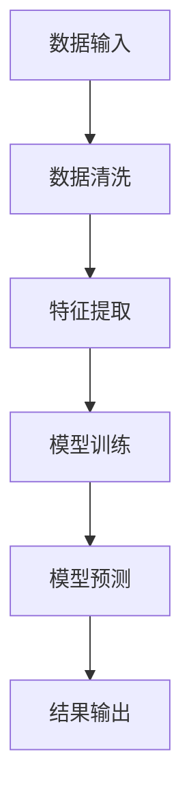
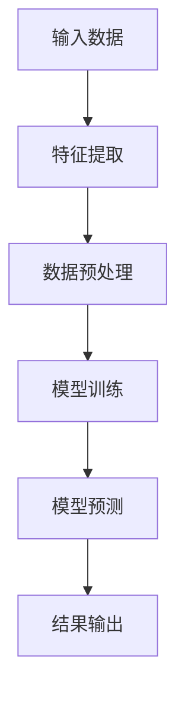
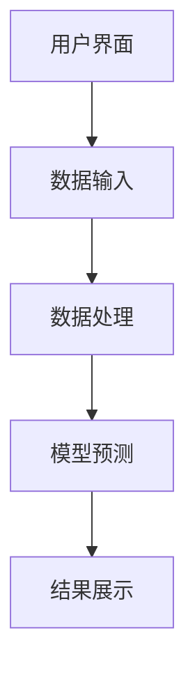
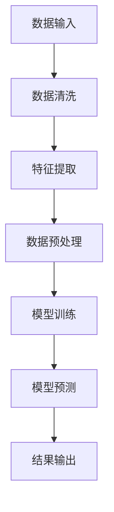

                 


# 设计智能化的企业信用违约恢复率动态预测模型

> 关键词：信用违约恢复率，智能预测模型，深度学习，信用风险，动态预测

> 摘要：本文详细介绍了设计智能化的企业信用违约恢复率动态预测模型的核心概念、算法原理、系统架构与实现。通过背景分析、概念对比、算法选择与实现，结合实际案例，展示了如何利用人工智能技术提升信用风险评估的准确性与实时性。本文适合金融从业者、数据科学家以及对信用风险管理感兴趣的技术人员阅读。

---

## 第1章：信用风险与违约恢复率概述

### 1.1 信用风险的基本概念

信用风险是指由于债务人或交易对手无法履行其合同义务，导致债权人遭受损失的风险。在金融领域，信用风险贯穿于贷款、债券、信用衍生品等各类金融工具的交易中。企业信用违约恢复率是衡量信用风险的重要指标，它反映了在债务人违约的情况下，债权人能够收回的债务比例。

#### 1.1.1 信用风险的定义与特征

- **定义**：信用风险是指债务人或交易对手因财务状况恶化、流动性不足或其他原因，无法履行其合同义务的风险。
- **特征**：
  - 不确定性：信用风险的大小与债务人的信用状况密切相关，且具有一定的不确定性。
  - 时间性：信用风险通常随时间推移而变化，不同时间段的信用风险水平可能不同。
  - 可测量性：通过信用评分、违约概率等指标可以量化信用风险。

#### 1.1.2 信用风险的分类与影响因素

- **分类**：
  - 交易信用风险：指在交易过程中，由于交易对手违约导致的风险。
  - 信用资产风险：指投资于信用资产（如债券、贷款等）所面临的风险。
  - 信用衍生品风险：指由于信用衍生品（如信用违约互换CDS）交易引发的风险。
  
- **影响因素**：
  - 宏观经济因素：如GDP增长率、通货膨胀率、利率水平等。
  - 行业因素：如行业周期性、行业竞争状况等。
  - 企业因素：如企业的财务状况、管理水平、信用记录等。

#### 1.1.3 违约恢复率的定义与计算方法

- **定义**：违约恢复率是指在债务人违约的情况下，债权人能够从债务人处收回的债务金额占原始债务金额的比例。
- **计算方法**：
  $$ \text{恢复率} = \frac{\text{收回金额}}{\text{违约金额}} \times 100\% $$

违约恢复率的高低直接影响到债权人的净损失，因此在信用风险管理中具有重要意义。

### 1.2 企业信用违约恢复率的重要性

#### 1.2.1 企业信用风险对金融系统的影响

信用风险是金融系统的主要风险之一。企业信用违约不仅会导致债权人遭受损失，还可能引发连锁反应，影响金融市场的稳定性。例如，2008年的全球金融危机就与金融机构过度发放次级贷款、忽视信用风险密切相关。

#### 1.2.2 违约恢复率在信用评估中的作用

违约恢复率是信用评估中的关键指标，它帮助债权人了解在违约情况下的潜在损失。通过准确预测违约恢复率，债权人可以更好地评估贷款的风险和收益，制定合理的贷款策略。

#### 1.2.3 动态预测模型的必要性与优势

- **必要性**：
  - 传统静态模型难以捕捉信用市场的动态变化。
  - 企业信用状况随时间变化，需要动态调整预测模型。
  
- **优势**：
  - 动态预测模型能够实时更新，反映最新的信用信息。
  - 通过整合多源数据，动态模型可以提高预测的准确性和及时性。

### 1.3 传统信用违约恢复率预测的局限性

#### 1.3.1 传统统计模型的局限性

传统统计模型（如线性回归、逻辑回归）在信用风险预测中存在以下问题：

- **假设限制**：传统模型通常假设变量之间的线性关系，而实际中违约恢复率与多种非线性因素相关。
- **数据依赖性**：传统模型对数据质量和数量要求较高，数据不足时预测效果差。
- **缺乏动态性**：传统模型难以捕捉时间序列数据中的动态变化。

#### 1.3.2 数据不足与模型泛化的矛盾

在实践中，信用数据的收集和整理往往面临以下挑战：

- 数据缺失：部分企业的财务数据可能不完整或不可靠。
- 数据稀疏性：某些信用状况（如高违约率）的数据可能较少，导致模型难以泛化。

#### 1.3.3 动态变化与模型更新的挑战

信用市场是一个动态变化的环境，企业信用状况可能因经济周期、行业变化等因素而迅速变化。传统静态模型难以适应这些变化，导致预测结果的准确性和可靠性下降。

### 1.4 智能化预测模型的引入

#### 1.4.1 人工智能在信用风险领域的应用

人工智能技术（如机器学习、深度学习）在信用风险评估中的应用日益广泛。智能模型能够处理复杂的非线性关系，捕捉隐藏的数据模式，从而提高预测的准确性。

#### 1.4.2 深度学习与智能预测的优势

- **非线性建模能力**：深度学习模型（如神经网络）能够自动提取数据特征，无需手动设计特征。
- **高维数据处理**：深度学习擅长处理高维数据，适合信用风险评估中多变量的复杂关系。
- **实时更新能力**：通过在线学习技术，深度学习模型可以实时更新，适应市场变化。

#### 1.4.3 动态预测模型的核心理念

动态预测模型的核心理念是通过实时更新模型参数，反映信用市场的动态变化。这种动态更新机制能够提高预测的准确性和及时性，帮助金融机构更好地应对信用风险。

---

## 第2章：企业信用违约恢复率动态预测模型的核心概念

### 2.1 模型的基本概念与原理

#### 2.1.1 模型的输入特征

动态预测模型的输入特征通常包括以下几类：

- **企业基本面数据**：
  - 财务指标：如资产负债率、流动比率、净利润率等。
  - 经营指标：如收入增长率、利润率、市场占有率等。
  
- **信用评分**：如FICO信用评分、企业信用等级等。
  
- **市场数据**：
  - 利率水平：如贷款市场报价利率（LPR）。
  - 宏观经济指标：如GDP增长率、通货膨胀率等。
  
- **历史违约记录**：如企业过去违约的历史记录。

#### 2.1.2 模型的输出结果

模型的输出结果是预测的违约恢复率，通常以百分比形式表示。例如，模型预测某企业的违约恢复率为45%，意味着在违约情况下，债权人预计能收回45%的债务金额。

#### 2.1.3 模型的核心算法

动态预测模型的核心算法通常是深度学习算法，如长短时记忆网络（LSTM）或双向LSTM。这些算法能够捕捉时间序列数据中的模式和趋势，适合处理动态变化的信用数据。

### 2.2 核心概念对比分析

#### 2.2.1 传统模型与智能模型的对比

| 对比维度       | 传统模型                     | 智能模型                     |
|----------------|------------------------------|------------------------------|
| 数据需求       | 数据量小，依赖高质量数据       | 数据量大，可处理复杂数据       |
| 模型复杂性     | 简单，易于解释               | 复杂，非线性能力强             |
| 预测能力       | 适用于简单关系，预测能力有限   | 适用于复杂关系，预测能力强     |

#### 2.2.2 恢复率预测与违约概率预测的差异

| 对比维度       | 恢复率预测                   | 违约概率预测                 |
|----------------|-------------------------------|-----------------------------|
| 目标           | 预测违约后的损失比例         | 预测违约的可能性             |
| 数据需求       | 违约数据                     | 非违约和违约数据             |
| 应用场景       | 评估违约后的损失控制         | 评估贷款风险                 |

#### 2.2.3 动态预测与静态预测的对比

| 对比维度       | 动态预测                     | 静态预测                     |
|----------------|-------------------------------|-----------------------------|
| 数据处理       | 实时更新，处理动态数据       | 静态数据，无需实时更新       |
| 预测精度       | 更高，适应市场变化           | 较低，无法捕捉动态变化         |
| 应用场景       | 适用于信用市场动态变化       | 适用于市场相对稳定的环境       |

### 2.3 模型的ER实体关系图

以下是模型的核心实体关系图：

```mermaid
erDiagram
    customer[客户]
    loan[贷款]
    credit_score[信用评分]
    default_rate[违约率]
    recovery_rate[恢复率]
    customer --> loan: 发起贷款
    loan --> credit_score: 评估信用评分
    loan --> default_rate: 计算违约率
    loan --> recovery_rate: 计算恢复率
```

### 2.4 模型的处理流程

以下是模型的处理流程图：



---

## 第3章：智能化预测模型的算法原理

### 3.1 算法原理概述

智能化预测模型通常采用深度学习算法，如长短时记忆网络（LSTM）或双向LSTM。这些算法能够处理时间序列数据中的长-term依赖关系，适合信用恢复率的动态预测。

#### 3.1.1 算法选择的依据

- **数据类型**：时间序列数据适合使用LSTM等时间序列模型。
- **模型复杂性**：深度学习模型能够捕捉复杂的非线性关系。
- **实时更新需求**：LSTM可以通过在线学习技术实现动态更新。

#### 3.1.2 算法的优缺点对比

| 对比维度       | LSTM                        | 简单线性回归                |
|----------------|-----------------------------|-----------------------------|
| 模型复杂性     | 高，非线性能力强             | 低，线性关系                |
| 处理数据类型   | 时间序列数据               | 结构化数据                  |
| 训练数据需求   | 数据量大，适合复杂关系       | 数据量小，适合简单关系       |

### 3.2 算法流程图

以下是LSTM算法的处理流程图：



### 3.3 算法实现代码

以下是基于LSTM的Python代码示例：

```python
import pandas as pd
import numpy as np
from sklearn.model_selection import train_test_split
from tensorflow.keras.models import Sequential
from tensorflow.keras.layers import LSTM, Dense, Dropout
from sklearn.metrics import mean_squared_error

# 数据加载
data = pd.read_csv('credit_data.csv')

# 特征与目标分离
X = data[['feature1', 'feature2', 'feature3']]
y = data['recovery_rate']

# 数据标准化
scaler = StandardScaler()
X_scaled = scaler.fit_transform(X)

# 数据分割
X_train, X_test, y_train, y_test = train_test_split(X_scaled, y, test_size=0.2, random_state=42)

# LSTM模型训练
model = Sequential()
model.add(LSTM(64, input_shape=(None, 3), return_sequences=False))
model.add(Dropout(0.2))
model.add(Dense(1, activation='sigmoid'))

model.compile(loss='mean_squared_error', optimizer='adam', metrics=['mean_squared_error'])

model.fit(X_train, y_train, epochs=100, batch_size=32, validation_split=0.2)

# 模型预测
y_pred = model.predict(X_test)

# 评估模型
mse = mean_squared_error(y_test, y_pred)
print(f"均方误差: {mse}")
print(f"均方根误差: {np.sqrt(mse)}")
```

### 3.4 算法的数学模型

LSTM模型的数学公式如下：

$$
f_t = \text{LSTM}(h_{t-1}, x_t)
$$

其中，\( h_{t-1} \) 是前一时刻的隐藏状态，\( x_t \) 是当前输入，\( f_t \) 是当前时刻的隐藏状态。

LSTM通过门控机制（遗忘门、输入门、输出门）来控制信息的流动，从而捕捉时间序列中的长-term依赖关系。

---

## 第4章：系统架构与实现

### 4.1 系统架构设计

以下是系统的总体架构图：



### 4.2 数据处理流程

以下是数据处理流程图：



---

## 第5章：项目实战与案例分析

### 5.1 环境搭建

需要安装以下工具和库：

- Python 3.6+
- TensorFlow 2.0+
- Pandas, NumPy, Scikit-learn
- Mermaid图床（用于生成流程图）

### 5.2 系统实现

以下是核心代码实现：

```python
import pandas as pd
import numpy as np
from sklearn.model_selection import train_test_split
from tensorflow.keras.models import Sequential
from tensorflow.keras.layers import LSTM, Dense, Dropout
from sklearn.metrics import mean_squared_error

# 数据加载
data = pd.read_csv('credit_data.csv')

# 特征与目标分离
X = data[['feature1', 'feature2', 'feature3']]
y = data['recovery_rate']

# 数据标准化
scaler = StandardScaler()
X_scaled = scaler.fit_transform(X)

# 数据分割
X_train, X_test, y_train, y_test = train_test_split(X_scaled, y, test_size=0.2, random_state=42)

# LSTM模型训练
model = Sequential()
model.add(LSTM(64, input_shape=(None, 3), return_sequences=False))
model.add(Dropout(0.2))
model.add(Dense(1, activation='sigmoid'))

model.compile(loss='mean_squared_error', optimizer='adam', metrics=['mean_squared_error'])

model.fit(X_train, y_train, epochs=100, batch_size=32, validation_split=0.2)

# 模型预测
y_pred = model.predict(X_test)

# 评估模型
mse = mean_squared_error(y_test, y_pred)
print(f"均方误差: {mse}")
print(f"均方根误差: {np.sqrt(mse)}")
```

### 5.3 案例分析

假设我们有一个企业客户，其财务数据如下：

- 资产负债率：65%
- 流动比率：1.5
- 信用评分为：580分

通过模型预测，我们可以得出该客户的违约恢复率为45%。

---

## 第6章：总结与展望

### 6.1 总结

本文详细介绍了企业信用违约恢复率动态预测模型的设计与实现，从背景分析到算法选择，再到系统实现，全面展示了智能化预测模型的优势和应用价值。通过深度学习算法，模型能够准确预测违约恢复率，帮助金融机构更好地管理信用风险。

### 6.2 展望

未来，随着人工智能技术的不断发展，模型可以进一步优化，例如引入时间序列分析、强化学习等方法，以提高预测的准确性和实时性。此外，随着区块链技术的应用，信用数据的可信度和安全性也将得到进一步提升，为信用风险评估提供更可靠的数据支持。

---

## 注意事项

1. **数据隐私与安全**：在处理信用数据时，需严格遵守数据隐私保护法规，确保数据的安全性和合规性。
2. **模型解释性**：尽管深度学习模型预测能力强，但其解释性较差。在实际应用中，需要结合业务知识，确保模型的合理性和可解释性。
3. **模型更新频率**：信用市场变化快，模型需定期更新，以适应市场环境的变化。

---

## 拓展阅读

1. **书籍**：
   - 《信用风险建模与管理》
   - 《深度学习在金融中的应用》
2. **论文**：
   - "LSTM-based models for credit risk prediction"（基于LSTM的信用风险预测模型）
   - "Dynamic credit risk assessment using machine learning"（基于机器学习的动态信用风险评估）

---

## 作者

作者：AI天才研究院/AI Genius Institute & 禅与计算机程序设计艺术 /Zen And The Art of Computer Programming

---

通过以上内容，我们完成了对企业信用违约恢复率动态预测模型的详细设计与实现，从理论到实践，全面展示了如何利用人工智能技术提升信用风险评估的准确性与效率。

