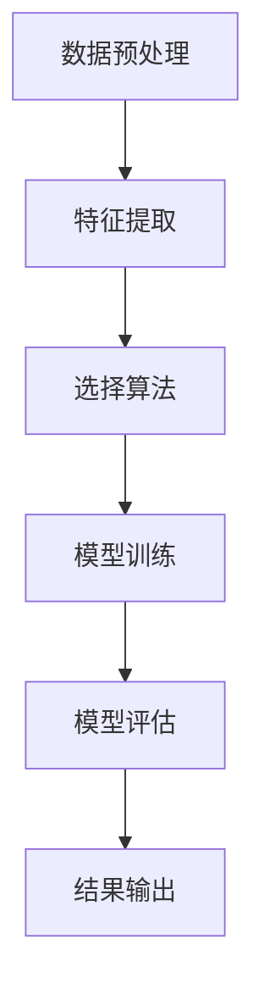

                 


# 设计智能化的企业信用违约损失率预测模型

---

## 关键词：
企业信用违约，损失率预测，机器学习，深度学习，智能化模型

---

## 摘要：
本文详细探讨了设计智能化的企业信用违约损失率预测模型的关键步骤，从背景介绍、核心概念、算法原理到系统架构、项目实战及最佳实践，全面解析了如何利用人工智能技术提升信用风险的预测能力。文章通过丰富的案例分析和详细的代码实现，帮助读者掌握构建高效、准确的损失率预测模型的方法，为企业信用风险管理提供有力支持。

---

## 第一部分: 企业信用违约损失率预测模型的背景与核心概念

### 第1章: 信用违约与损失率预测的背景介绍

#### 1.1 信用违约的基本概念
信用违约是指债务人在约定的期限内未能履行其债务偿还义务，导致债权人遭受损失的情况。信用违约的核心要素包括债务人的信用状况、还款能力和还款意愿等。违约的类型主要分为本金违约、利息违约和全面违约三种，每种违约类型对企业的财务影响也各不相同，可能导致企业声誉受损、资金链断裂甚至破产。

#### 1.2 损失率预测的重要性
损失率预测是信用风险管理中的关键环节，其目的是通过预测违约事件发生后的损失程度，帮助企业和金融机构制定更合理的风险应对策略。损失率预测不仅能够量化违约带来的经济损失，还能为信用评级、资产定价和资本分配提供重要依据。传统的损失率预测方法，如专家评分法和线性回归模型，由于其局限性，往往难以捕捉复杂的信用风险特征，尤其是在经济环境剧烈变化的情况下。

#### 1.3 传统损失率预测方法的局限性
传统的信用风险预测方法存在以下主要问题：
- **线性回归模型**：假设变量之间的关系是线性的，无法处理复杂的非线性关系。
- **专家评分法**：依赖人工经验，主观性强，难以量化和优化。
- **传统机器学习模型**：如逻辑回归和随机森林，虽然能够处理非线性关系，但难以捕捉高维数据中的深层特征。

#### 1.4 智能化预测模型的必要性
随着大数据和人工智能技术的发展，智能化的信用违约损失率预测模型逐渐成为可能。智能化模型能够利用机器学习和深度学习算法，从海量数据中提取有用的特征，并通过复杂的模型结构捕捉数据中的隐含规律，从而提高预测的准确性和鲁棒性。

---

### 第2章: 企业信用违约损失率预测模型的核心概念与联系

#### 2.1 核心概念原理
- **企业信用风险**：企业信用风险是指企业在履行其债务义务时发生违约的可能性。信用风险的核心要素包括企业的财务状况、经营历史、市场环境等因素。
- **违约概率（PD）**：违约概率是指企业在未来一定时间内发生违约的可能性。PD的计算通常基于信用评分模型，如FICO评分和穆迪的信用评级。
- **损失率（LGD）**：损失率是指在违约发生后，债权人能够回收的金额占违约金额的比例。LGD的预测需要考虑多种因素，如债务人的资产状况、担保情况和法律环境等。

#### 2.2 核心概念属性特征对比表
以下表格对比了企业信用风险、违约概率（PD）和损失率（LGD）的核心属性特征：

| 概念       | 属性                 | 特征描述                                                                 |
|------------|----------------------|--------------------------------------------------------------------------|
| 企业信用风险 | 数据类型             | 数值型（如财务指标）和文本型（如企业背景信息）                                           |
| 违约概率（PD） | 计算方法             | 风险评分模型（如逻辑回归）、统计模型（如泊松回归）                                       |
| 损失率（LGD） | 影响因素             | 债务人资产状况、担保情况、法律环境、市场条件                                             |

#### 2.3 ER实体关系图
以下是一个简单的ER实体关系图，展示了企业信用违约损失率预测模型中的核心实体及其关系：

```mermaid
erd
    企业信息表
    + 企业ID (主键)
    + 信用评分
    + 财务状况
    + 经营历史
    
    违约记录表
    + 记录ID (主键)
    + 企业ID (外键)
    + 违约时间
    + 损失金额
    
    损失率预测模型表
    + 模型ID (主键)
    + 模型类型
    + 模型参数
    + 预测结果
```

---

## 第二部分: 企业信用违约损失率预测模型的算法原理

### 第3章: 企业信用违约损失率预测模型的算法原理

#### 3.1 算法原理概述
智能化的信用违约损失率预测模型通常采用机器学习和深度学习算法，这些算法能够从大量数据中提取复杂的特征，并通过非线性关系提高预测的准确性。以下是几种常用的算法：

- **逻辑回归（Logistic Regression）**：适用于二分类问题，可以用来预测违约概率（PD）。
- **随机森林（Random Forest）**：一种基于决策树的集成学习方法，能够处理高维数据。
- **神经网络（Neural Networks）**：通过多层神经元模拟人脑的神经网络，能够捕捉数据中的深层特征。
- **梯度提升树（Gradient Boosting Trees）**：如XGBoost和LightGBM，能够处理复杂的非线性关系。

#### 3.2 算法流程图
以下是一个典型的信用违约损失率预测模型的算法流程图：



#### 3.3 算法实现代码示例
以下是基于Python的逻辑回归模型实现代码示例：

```python
import pandas as pd
from sklearn.linear_model import LogisticRegression
from sklearn.model_selection import train_test_split
from sklearn.metrics import accuracy_score

# 加载数据
data = pd.read_csv('credit_data.csv')

# 数据分割
X = data[['credit_score', 'annual_income', 'debt_to_income_ratio']]
y = data['default_flag']

# 划分训练集和测试集
X_train, X_test, y_train, y_test = train_test_split(X, y, test_size=0.2, random_state=42)

# 模型训练
model = LogisticRegression()
model.fit(X_train, y_train)

# 模型预测
y_pred = model.predict(X_test)

# 模型评估
print("Accuracy:", accuracy_score(y_test, y_pred))
```

#### 3.4 数学模型
违约概率（PD）的计算公式如下：

$$ PD = \frac{\text{违约次数}}{\text{样本总数}} $$

损失率（LGD）的预测可以采用线性回归模型：

$$ LGD = \beta_0 + \beta_1 X_1 + \beta_2 X_2 + \ldots + \beta_n X_n $$

其中，$X_i$ 是各个特征变量，$\beta_i$ 是对应的系数。

---

### 第4章: 企业信用违约损失率预测模型的系统分析与架构设计

#### 4.1 系统功能设计
- **数据采集模块**：从企业征信报告、财务报表等数据源获取相关数据。
- **数据预处理模块**：清洗、归一化和特征提取。
- **模型训练模块**：基于机器学习算法训练违约概率和损失率预测模型。
- **结果展示模块**：可视化预测结果和模型性能评估。

#### 4.2 系统架构设计
以下是系统的整体架构图：


---

## 第三部分: 企业信用违约损失率预测模型的项目实战

### 第5章: 项目实战

#### 5.1 环境安装
安装所需的Python库：

```bash
pip install pandas scikit-learn matplotlib
```

#### 5.2 系统核心实现源代码
以下是信用违约损失率预测模型的核心代码：

```python
import pandas as pd
from sklearn.ensemble import RandomForestRegressor
from sklearn.metrics import mean_squared_error

# 加载数据
data = pd.read_csv('loss_given_default.csv')

# 数据分割
X = data[['loan_amount', 'credit_score', 'borrower_age']]
y = data['loss_rate']

# 划分训练集和测试集
X_train, X_test, y_train, y_test = train_test_split(X, y, test_size=0.2, random_state=42)

# 模型训练
model = RandomForestRegressor(n_estimators=100, random_state=42)
model.fit(X_train, y_train)

# 模型预测
y_pred = model.predict(X_test)

# 模型评估
print("RMSE:", mean_squared_error(y_test, y_pred, squared=False))
```

#### 5.3 案例分析
以下是一个实际案例的分析：

假设我们有一家企业的历史数据，包括贷款金额、信用评分和借款人的年龄。通过模型预测，我们可以得到该企业的损失率，并据此制定相应的风险管理策略。

---

## 第四部分: 最佳实践与总结

### 第6章: 最佳实践 tips

#### 6.1 小结
智能化的企业信用违约损失率预测模型能够显著提高信用风险管理的准确性和效率。通过机器学习和深度学习算法的应用，模型能够捕捉复杂的信用风险特征，并提供更精准的预测结果。

#### 6.2 注意事项
- 数据的质量和完整性对模型的性能至关重要。
- 模型的解释性和可 interpretability 是实际应用中的重要考量因素。
- 定期更新模型以应对市场环境的变化。

#### 6.3 拓展阅读
- 《信用风险建模与管理》
- 《机器学习在金融中的应用》
- 《深度学习与信用评分》

---

## 作者：AI天才研究院/AI Genius Institute & 禅与计算机程序设计艺术 /Zen And The Art of Computer Programming

---

**本文结束**

