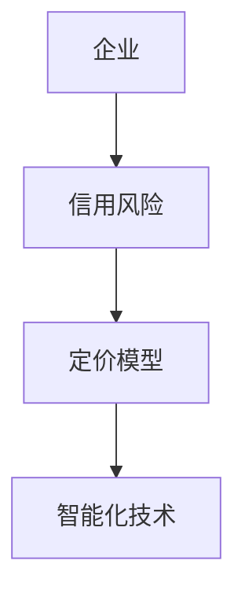
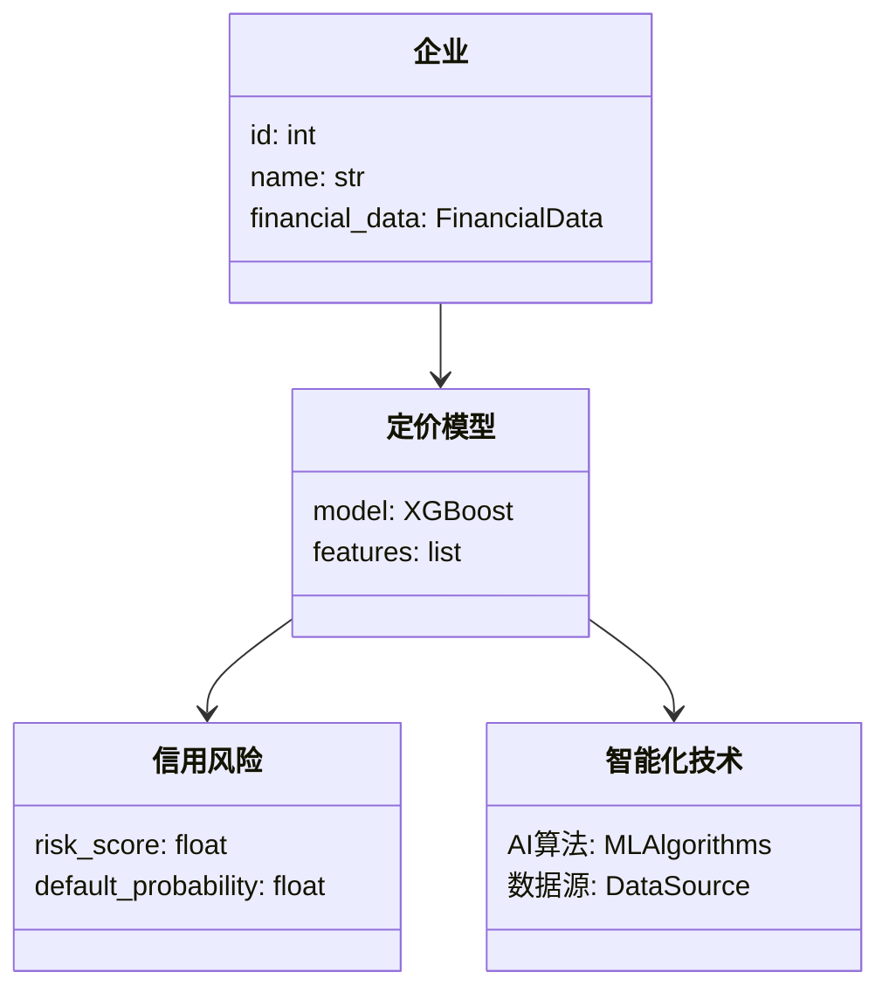
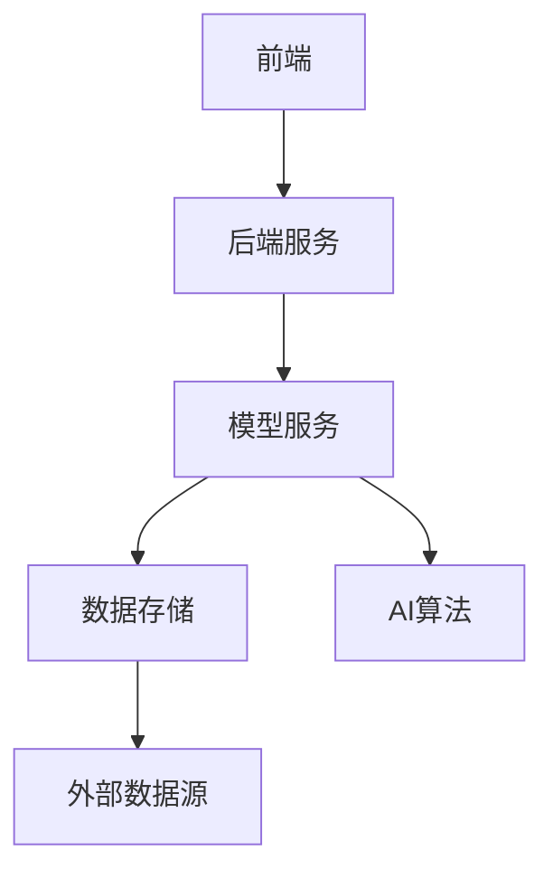
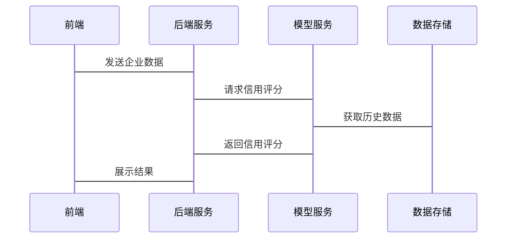

                 


# 设计智能化的企业信用风险定价模型

## 关键词：企业信用风险，定价模型，智能化，机器学习，风险管理

## 摘要：随着企业融资需求的增加和金融市场复杂性的加剧，信用风险定价已成为企业风险管理的核心问题。本文系统介绍了设计智能化企业信用风险定价模型的背景、核心概念、算法原理、系统架构、项目实战以及最佳实践。通过对比分析和案例研究，展示了如何利用大数据和人工智能技术提升信用风险定价的准确性和效率，为企业风险管理提供科学依据。

---

# 第一部分: 企业信用风险定价模型的背景与概念

## 第1章: 企业信用风险定价模型的背景介绍

### 1.1 问题背景与描述

#### 1.1.1 信用风险的定义与特征
信用风险是指由于企业或个人无法履行其债务义务而给债权人带来的损失风险。其主要特征包括不确定性、传染性和关联性。

#### 1.1.2 传统信用风险定价的局限性
传统信用风险定价方法主要依赖于简单的财务指标，如资产负债率、流动比率等，难以捕捉企业的动态风险变化，且缺乏对市场环境的敏感性。

#### 1.1.3 智能化定价的必要性与优势
随着数据量的爆炸式增长和计算能力的提升，智能化定价模型能够利用机器学习和大数据技术，捕捉更多风险因素，提高定价的准确性和效率。

### 1.2 企业信用风险定价模型的概念

#### 1.2.1 模型的核心要素与组成
- **输入数据**：企业财务数据、市场数据、行业数据等。
- **模型算法**：逻辑回归、决策树、随机森林等机器学习算法。
- **输出结果**：信用评分、违约概率、定价建议等。

#### 1.2.2 模型的分类与应用场景
- **零售银行**：针对个人客户的信用评分。
- **批发银行**：针对企业客户的信用评估。
- **投资银行**：用于评估债券发行人的信用风险。

#### 1.2.3 模型的边界与外延
- **适用范围**：适用于需要进行信用评估的企业和个人客户。
- **限制条件**：模型的有效性依赖于数据质量和模型的训练样本。

### 1.3 智能化定价模型的框架

#### 1.3.1 数据驱动的定价逻辑
智能化定价模型通过收集和分析大量数据，利用机器学习算法构建定价逻辑，实现更精准的信用风险评估。

#### 1.3.2 模型的输入与输出
- **输入**：企业财务数据、市场数据、行业趋势等。
- **输出**：信用评分、违约概率预测、风险定价建议。

#### 1.3.3 模型的评估与优化
模型的评估包括准确率、召回率、F1分数等指标，优化方法包括参数调优、模型集成等。

### 1.4 信用风险定价的数据特征

#### 1.4.1 数据的维度与结构
- **时间序列数据**：企业的历史财务数据。
- **结构化数据**：如资产负债表、损益表等。
- **非结构化数据**：如新闻、社交媒体信息等。

#### 1.4.2 数据的清洗与预处理
- **缺失值处理**：使用均值、中位数或插值法填充缺失值。
- **异常值处理**：通过统计方法或模型检测异常值并进行处理。
- **数据标准化**：对特征进行标准化或归一化处理。

#### 1.4.3 数据的特征工程
- **特征选择**：使用相关性分析、Lasso回归等方法选择重要特征。
- **特征组合**：将多个特征进行组合，形成新的特征。
- **特征转换**：如对数变换、正交变换等。

### 1.5 模型的边界条件与假设

#### 1.5.1 模型适用的行业与场景
- **行业适用性**：模型适用于制造业、批发零售业等数据充足的行业。
- **场景适用性**：适用于企业贷款审批、债券发行定价等场景。

#### 1.5.2 数据的假设与限制
- 数据的完整性：假设输入数据经过清洗和预处理，数据质量较高。
- 数据的独立性：假设训练数据和测试数据独立。

#### 1.5.3 模型的鲁棒性与稳定性
- 模型需要具有良好的鲁棒性，能够适应数据分布的变化。
- 模型需要具有稳定性，在小规模数据变化下，模型性能不会大幅波动。

### 1.6 信用风险定价的业务价值

#### 1.6.1 提升企业风险管理能力
智能化定价模型能够更准确地评估企业的信用风险，帮助企业制定更有效的风险管理策略。

#### 1.6.2 优化定价策略与效率
通过智能化模型，企业可以实现更精准的定价，提高定价效率，降低人工成本。

#### 1.6.3 增强客户信任与市场竞争力
精准的定价策略能够增强客户信任，同时提高企业在市场中的竞争力。

---

# 第二部分: 核心概念与原理

## 第2章: 核心概念与联系

### 2.1 核心概念的定义与属性

#### 信用风险
- **定义**：企业或个人无法履行债务义务的风险。
- **属性**：不确定性、传染性、关联性。

#### 定价模型
- **定义**：用于评估信用风险并生成定价建议的数学模型。
- **属性**：数据驱动、动态调整、高准确性。

#### 智能化技术
- **定义**：利用人工智能和大数据技术进行数据分析和决策的技术。
- **属性**：高效性、精准性、适应性。

### 2.2 核心概念的对比分析

| 概念       | 属性                     | 描述                                   |
|------------|--------------------------|--------------------------------------|
| 信用风险   | 定义                     | 企业或个人无法履行债务的风险         |
| 定价模型    | 输入数据                 | 企业财务数据、市场数据               |
| 智能化技术  | 核心技术                 | 机器学习、大数据分析                 |

### 2.3 实体关系图（ER图）



---

# 第三部分: 算法原理与数学模型

## 第3章: 智能化定价模型的算法原理

### 3.1 算法选择与原理

#### 3.1.1 逻辑回归模型

逻辑回归是一种常用的分类算法，适用于二分类问题。其核心思想是通过logit函数将线性回归的结果映射到概率空间。

**算法步骤：**

1. 数据预处理：对输入数据进行标准化、缺失值处理等。
2. 特征选择：选择对信用风险影响较大的特征。
3. 模型训练：使用逻辑回归算法训练模型，得到模型参数。
4. 模型评估：通过准确率、召回率等指标评估模型性能。
5. 模型部署：将模型部署到生产环境，提供信用评分服务。

**数学公式：**

$$ P(y=1|x) = \frac{1}{1 + e^{-(\beta_0 + \beta_1 x_1 + \cdots + \beta_n x_n)}} $$

其中，$\beta_0$ 是截距项，$\beta_1, \cdots, \beta_n$ 是特征的系数，$x_1, \cdots, x_n$ 是特征变量。

**Python代码实现：**

```python
import pandas as pd
from sklearn.linear_model import LogisticRegression
from sklearn.model_selection import train_test_split
from sklearn.metrics import accuracy_score

# 加载数据
data = pd.read_csv('credit_data.csv')

# 特征选择
X = data[['revenue', 'profit', 'debt']]
y = data['default']

# 数据分割
X_train, X_test, y_train, y_test = train_test_split(X, y, test_size=0.2, random_state=42)

# 模型训练
model = LogisticRegression()
model.fit(X_train, y_train)

# 模型预测
y_pred = model.predict(X_test)

# 模型评估
print('准确率:', accuracy_score(y_test, y_pred))
```

#### 3.1.2 XGBoost模型

XGBoost是一种基于树的集成算法，适用于分类和回归问题。其核心思想是通过多棵树的组合，提高模型的准确性和鲁棒性。

**算法步骤：**

1. 数据预处理：对输入数据进行清洗和特征工程。
2. 特征选择：选择对信用风险影响较大的特征。
3. 模型训练：使用XGBoost算法训练模型，调整参数如学习率、树的深度等。
4. 模型评估：通过准确率、F1分数等指标评估模型性能。
5. 模型部署：将模型部署到生产环境，提供信用评分服务。

**数学公式：**

$$ y = \sum_{i=1}^{n} \theta_i t_i + \sum_{j=1}^{m} \omega_{j} q_j(x) $$

其中，$\theta_i$ 是树的权重，$t_i$ 是树的结构，$\omega_j$ 是叶子节点的权重，$q_j(x)$ 是叶子节点的指示函数。

**Python代码实现：**

```python
import pandas as pd
import xgboost as xgb
from sklearn.model_selection import train_test_split
from sklearn.metrics import accuracy_score

# 加载数据
data = pd.read_csv('credit_data.csv')

# 特征选择
X = data[['revenue', 'profit', 'debt']]
y = data['default']

# 数据分割
X_train, X_test, y_train, y_test = train_test_split(X, y, test_size=0.2, random_state=42)

# 模型训练
model = xgb.XGBClassifier(n_estimators=100, learning_rate=0.1, max_depth=3)
model.fit(X_train, y_train)

# 模型预测
y_pred = model.predict(X_test)

# 模型评估
print('准确率:', accuracy_score(y_test, y_pred))
```

---

# 第四部分: 系统架构与设计

## 第4章: 系统架构设计

### 4.1 问题场景介绍

设计智能化的企业信用风险定价系统，旨在帮助企业更准确地评估客户的信用风险，优化定价策略，降低风险损失。

### 4.2 领域模型设计

使用Mermaid类图展示系统中的主要实体及其关系：



### 4.3 系统架构设计

使用Mermaid架构图展示系统的整体结构：



### 4.4 接口设计与交互流程

使用Mermaid序列图展示系统的交互流程：



---

# 第五部分: 项目实战

## 第5章: 项目实战

### 5.1 环境安装与配置

安装必要的Python库：

```bash
pip install pandas scikit-learn xgboost flask
```

### 5.2 核心代码实现

#### 5.2.1 数据预处理

```python
import pandas as pd

data = pd.read_csv('credit_data.csv')
data = data.dropna()
data = (data - data.mean()) / data.std()
```

#### 5.2.2 模型训练与评估

```python
from sklearn.model_selection import train_test_split
from sklearn.metrics import classification_report
from xgboost import XGBClassifier

X = data[['revenue', 'profit', 'debt']]
y = data['default']

X_train, X_test, y_train, y_test = train_test_split(X, y, test_size=0.2, random_state=42)

model = XGBClassifier()
model.fit(X_train, y_train)
y_pred = model.predict(X_test)

print(classification_report(y_test, y_pred))
```

#### 5.2.3 模型部署

使用Flask部署模型：

```python
from flask import Flask, request, jsonify
import joblib

app = Flask(__name__)
model = joblib.load('credit_risk_model.pkl')

@app.route('/predict', methods=['POST'])
def predict():
    data = request.json
    X = pd.DataFrame([data])
    y_pred = model.predict(X)
    return jsonify({'default_probability': float(y_pred[0])})

if __name__ == '__main__':
    app.run(debug=True)
```

### 5.3 模型部署与应用

将模型部署为API服务，企业可以通过调用API获取信用评分和违约概率。

### 5.4 案例分析与总结

通过实际案例分析模型的效果，总结经验教训，优化模型参数和特征工程。

---

# 第六部分: 总结与展望

## 第6章: 总结与展望

### 6.1 总结

本文详细介绍了设计智能化企业信用风险定价模型的背景、核心概念、算法原理、系统架构和项目实战。通过对比分析和案例研究，展示了如何利用机器学习和大数据技术提升信用风险定价的准确性和效率。

### 6.2 未来发展方向

随着人工智能和大数据技术的不断发展，未来智能化信用风险定价模型将更加精准和高效。发展方向包括引入更复杂的算法、多模态数据的融合、实时风险评估等。

### 6.3 注意事项与建议

在实际应用中，需要注意数据隐私和安全问题，确保模型的透明性和可解释性。同时，建议企业在实施智能化定价模型前，进行充分的市场调研和需求分析。

---

# 作者：AI天才研究院/AI Genius Institute & 禅与计算机程序设计艺术 /Zen And The Art of Computer Programming

