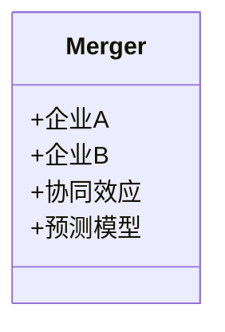
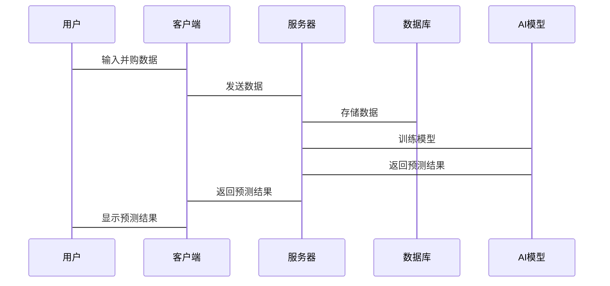

                 


# 设计智能化的企业并购协同效应实现度量与预测模型

> 关键词：企业并购、协同效应、度量模型、预测算法、人工智能

> 摘要：本文详细探讨了如何利用智能化的方法设计企业并购中的协同效应实现度量与预测模型。文章从企业并购的背景出发，分析了协同效应的构成要素与度量指标，提出了基于机器学习的协同效应预测算法，并通过系统架构设计与项目实战，展示了如何构建智能化的协同效应实现度量与预测系统。本文内容涵盖理论与实践，旨在为企业并购决策提供科学依据。

---

## 第一部分: 企业并购协同效应实现度量与预测模型背景介绍

### 第1章: 企业并购协同效应概述

#### 1.1 企业并购的基本概念
##### 1.1.1 企业并购的定义与类型
企业并购（Mergers and Acquisitions, M&A）是指一家企业与其他企业合并或收购其资产、股权等行为。常见的企业并购类型包括：

1. **吸收合并**：一家企业吸收另一家企业，后者失去法人资格。
2. **新设合并**：两家或多家企业合并成立一家新企业。
3. **股权收购**：通过购买目标企业的股权进行并购。
4. **资产收购**：通过购买目标企业的部分或全部资产进行并购。

##### 1.1.2 协同效应的定义与分类
协同效应（Synergy）是指企业并购后，由于资源整合、效率提升等因素带来的价值增加。协同效应可以分为以下几类：

- **财务协同效应**：通过规模经济、成本节约等方式实现的协同。
- **管理协同效应**：通过优化管理流程、共享管理资源等方式实现的协同。
- **技术协同效应**：通过技术整合、知识共享等方式实现的协同。

##### 1.1.3 协同效应在企业并购中的重要性
协同效应是企业并购成功的关键因素之一。通过实现协同效应，企业可以降低运营成本、提高市场竞争力、增强抗风险能力。

#### 1.2 协同效应的实现机制
##### 1.2.1 协同效应的实现路径
协同效应的实现路径包括：

1. **资源整合**：充分利用双方的资源，实现优势互补。
2. **流程优化**：通过优化业务流程，提高效率。
3. **文化融合**：通过企业文化的融合，促进员工协作。

##### 1.2.2 协同效应的关键影响因素
影响协同效应的关键因素包括：

- **企业规模**：规模较大的企业更容易实现协同效应。
- **行业特性**：不同行业的协同效应实现难度不同。
- **管理水平**：高效的管理水平是实现协同效应的重要保障。

##### 1.2.3 协同效应的度量与预测的必要性
协同效应的度量与预测是企业并购决策的重要依据。通过准确的度量与预测，企业可以制定科学的并购策略，降低并购风险。

---

### 第2章: 智能化企业并购协同效应的背景与挑战

#### 2.1 当前企业并购中的智能化趋势
##### 2.1.1 大数据与人工智能在企业并购中的应用
随着大数据和人工智能技术的快速发展，企业并购中的协同效应分析逐渐智能化。通过分析海量数据，人工智能可以帮助企业更好地识别协同效应。

##### 2.1.2 智能化协同效应度量与预测的必要性
智能化的协同效应度量与预测可以提高企业并购决策的科学性和准确性。

##### 2.1.3 智能化技术对企业并购决策的支持
人工智能可以通过数据挖掘、机器学习等技术，帮助企业识别潜在的协同效应，优化并购策略。

#### 2.2 智能化协同效应实现中的主要挑战
##### 2.2.1 数据获取与处理的挑战
企业并购数据分散、复杂，数据清洗和处理的难度较大。

##### 2.2.2 模型构建与优化的难点
协同效应预测模型的构建需要考虑多个因素，模型优化需要大量数据支持。

##### 2.2.3 实际应用中的伦理与风险
企业并购中的数据使用需要遵守相关法律法规，同时需要考虑数据隐私和伦理问题。

---

## 第二部分: 协同效应实现度量与预测的核心概念与理论基础

### 第3章: 协同效应实现的核心要素与度量指标

#### 3.1 协同效应的构成要素
##### 3.1.1 财务协同效应
财务协同效应是指企业并购后，通过资源整合、成本节约等方式实现的财务价值提升。例如，通过合并财务部门，减少管理费用。

##### 3.1.2 管理协同效应
管理协同效应是指企业并购后，通过优化管理流程、共享管理资源等方式实现的管理效率提升。例如，通过共享供应链管理，降低采购成本。

##### 3.1.3 技术协同效应
技术协同效应是指企业并购后，通过技术整合、知识共享等方式实现的技术优势提升。例如，通过整合研发团队，提高技术创新能力。

#### 3.2 协同效应度量指标体系
##### 3.2.1 财务指标
- 营业收入增长率
- 净利润率
- 资产周转率

##### 3.2.2 市场指标
- 市场占有率
- 品牌价值
- 客户满意度

##### 3.2.3 管理指标
- 管理效率提升率
- 组织结构优化程度
- 管理成本降低率

#### 3.3 度量指标的权重分配与综合评价方法
##### 3.3.1 指标权重的确定方法
- 层次分析法（AHP）
- 主成分分析法（PCA）

##### 3.3.2 综合评价模型的构建
综合评价模型可以通过加权平均的方式，将各指标的权重与指标值相乘，求和得到综合得分。

##### 3.3.3 度量指标的动态调整
协同效应的度量指标需要根据企业并购的具体情况动态调整。

---

## 第三部分: 协同效应实现度量与预测的算法原理

### 第4章: 协同效应预测的数学模型与算法

#### 4.1 协同效应预测的数学模型
##### 4.1.1 线性回归
线性回归是一种常用的数据分析方法，可以用于预测协同效应的大小。例如，可以通过线性回归模型，预测企业并购后的收入增长率。

##### 4.1.2 随机森林
随机森林是一种基于决策树的机器学习算法，可以用于分类和回归问题。在企业并购协同效应预测中，随机森林可以用于分类协同效应的实现程度。

##### 4.1.3 支持向量机（SVM）
支持向量机是一种监督学习算法，可以用于分类和回归问题。在协同效应预测中，SVM可以用于预测协同效应的具体数值。

#### 4.2 协同效应预测算法的实现步骤
##### 4.2.1 数据预处理
- 数据清洗
- 数据标准化

##### 4.2.2 模型训练
- 确定算法参数
- 训练模型

##### 4.2.3 模型评估
- 评估指标（准确率、召回率、F1分数）

##### 4.2.4 模型优化
- 调参
- 交叉验证

#### 4.3 协同效应预测模型的实现代码
```python
import pandas as pd
from sklearn.ensemble import RandomForestRegressor
from sklearn.metrics import mean_squared_error

# 加载数据
data = pd.read_csv('merger_data.csv')

# 特征与标签分离
X = data.drop('synergy', axis=1)
y = data['synergy']

# 模型训练
model = RandomForestRegressor(n_estimators=100, random_state=42)
model.fit(X, y)

# 模型预测
y_pred = model.predict(X)

# 模型评估
 mse = mean_squared_error(y, y_pred)
 print(f'Mean Squared Error: {mse}')
```

---

## 第四部分: 系统分析与架构设计

### 第5章: 系统分析与架构设计方案

#### 5.1 问题场景介绍
企业并购协同效应实现度量与预测系统的应用场景包括企业并购决策支持、企业战略规划、投资评估等。

#### 5.2 系统功能设计
##### 5.2.1 领域模型设计


##### 5.2.2 系统架构设计


##### 5.2.3 系统接口设计
- 数据接口：数据导入、数据导出
- 模型接口：模型训练、模型预测
- 用户接口：用户输入、结果展示

##### 5.2.4 系统交互流程


---

## 第五部分: 项目实战

### 第6章: 项目实战与案例分析

#### 6.1 环境安装与配置
- 安装Python
- 安装相关库（pandas, scikit-learn, mermaid）

#### 6.2 系统核心代码实现
##### 6.2.1 数据加载与预处理
```python
import pandas as pd
from sklearn.ensemble import RandomForestRegressor
from sklearn.metrics import mean_squared_error

data = pd.read_csv('merger_data.csv')
X = data.drop('synergy', axis=1)
y = data['synergy']
```

##### 6.2.2 模型训练与预测
```python
model = RandomForestRegressor(n_estimators=100, random_state=42)
model.fit(X, y)
y_pred = model.predict(X)
print(f'Mean Squared Error: {mean_squared_error(y, y_pred)}')
```

##### 6.2.3 模型评估与优化
```python
importances = model.feature_importances_
print(importances)
```

#### 6.3 案例分析与结果解读
通过实际案例分析，展示模型的预测效果，并解读结果。

---

## 第六部分: 总结与展望

### 第7章: 总结与展望

#### 7.1 最佳实践与小结
- 数据质量是模型准确性的关键
- 模型选择需要根据具体场景
- 模型优化需要结合业务需求

#### 7.2 注意事项与建议
- 数据隐私保护
- 模型解释性
- 业务与技术的结合

#### 7.3 拓展阅读与学习资源
- 推荐书籍：《企业并购的协同效应分析》、《机器学习实战》
- 推荐课程： Coursera上的《机器学习》课程

---

作者：AI天才研究院/AI Genius Institute & 禅与计算机程序设计艺术 /Zen And The Art of Computer Programming

