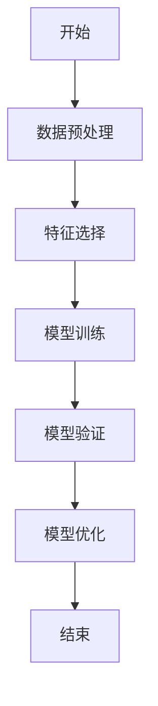
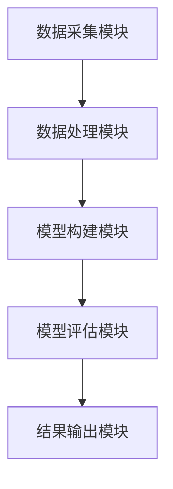

                 


```markdown
# 设计智能化的企业并购协同效应实现度量模型

---

## 关键词
企业并购、协同效应、度量模型、智能化、数据分析、系统架构

---

## 摘要
本文旨在设计并实现一个智能化的企业并购协同效应实现度量模型。通过分析企业并购中的协同效应，构建一个基于数据分析和人工智能的度量模型，帮助企业在并购过程中更准确地评估和实现协同效应。本文从协同效应的定义、度量指标、模型构建方法入手，结合实际案例，详细阐述了模型的设计思路、算法实现和系统架构，并提出了未来研究方向和最佳实践。

---

# 第一部分: 企业并购协同效应实现度量模型的背景与基础

---

## 第1章: 企业并购与协同效应概述

### 1.1 企业并购的基本概念
#### 1.1.1 企业并购的定义与类型
企业并购是指一家企业收购另一家企业部分或全部资产或股权的行为。根据并购的方式，可以分为横向并购、纵向并购和混合并购。

#### 1.1.2 协同效应的定义与分类
协同效应是指企业在并购后，通过整合资源、优化流程、共享能力等方式实现的效率提升和价值创造。协同效应可以分为财务协同、经营协同和战略协同。

#### 1.1.3 智能化度量模型的必要性
随着企业并购的复杂化，传统的协同效应评估方法逐渐显现出局限性。智能化度量模型可以通过大数据分析和人工智能技术，更精准地预测和评估协同效应。

---

## 第2章: 企业并购中的协同效应实现问题

### 2.1 协同效应实现的挑战
协同效应的实现需要克服整合过程中的文化冲突、资源分配不均和管理不善等挑战。

### 2.2 协同效应实现的关键因素
关键因素包括企业战略一致性、资源整合能力、管理层支持和员工参与度。

### 2.3 协同效应实现的度量意义
准确度量协同效应可以帮助企业评估并购的价值，优化整合策略，并为未来的并购决策提供数据支持。

---

## 第3章: 智能化度量模型的必要性

### 3.1 智能化技术在企业并购中的应用
人工智能和大数据技术可以用于企业并购的全流程，包括目标筛选、估值、整合和协同效应评估。

### 3.2 智能化度量模型的优势
智能化度量模型可以通过数据挖掘和机器学习算法，发现传统方法难以捕捉的潜在协同效应。

### 3.3 智能化度量模型的实现路径
实现路径包括数据收集、模型构建、算法优化和结果验证。

---

# 第二部分: 协同效应实现度量模型的核心概念与联系

---

## 第4章: 协同效应实现度量模型的核心概念

### 4.1 协同效应的组成要素
#### 4.1.1 企业资源协同
企业资源协同包括资产协同、人力资源协同和财务协同。

#### 4.1.2 企业能力协同
企业能力协同包括技术研发协同、市场协同和管理协同。

#### 4.1.3 企业战略协同
企业战略协同包括战略一致性、协同目标和协同规划。

### 4.2 协同效应实现度量模型的度量指标
#### 4.2.1 财务指标
财务指标包括协同收益、成本节约和投资回报率。

#### 4.2.2 经营指标
经营指标包括市场份额、客户满意度和运营效率。

#### 4.2.3 战略指标
战略指标包括战略一致性、协同目标达成度和企业竞争力提升。

### 4.3 协同效应实现度量模型的构建方法
#### 4.3.1 数据采集与处理
数据采集包括企业财务数据、市场数据和管理数据。

#### 4.3.2 模型构建与验证
模型构建包括特征选择、模型训练和模型验证。

#### 4.3.3 模型的应用与优化
模型应用包括协同效应预测、整合优化和动态调整。

---

## 第5章: 协同效应实现度量模型的核心要素与关系

### 5.1 协同效应实现的核心要素
#### 5.1.1 企业并购前的评估
企业并购前的评估包括目标企业评估、协同潜力评估和风险评估。

#### 5.1.2 并购后的整合
并购后的整合包括组织整合、资源整合和文化整合。

#### 5.1.3 协同效应的实现过程
协同效应的实现过程包括整合计划制定、整合实施和协同效果评估。

### 5.2 模型构建的核心要素
#### 5.2.1 数据源的选择
数据源的选择包括内部数据和外部数据。

#### 5.2.2 模型参数的设置
模型参数的设置包括特征权重、算法参数和模型超参数。

#### 5.2.3 模型的验证与优化
模型的验证与优化包括交叉验证、参数调优和模型评估。

### 5.3 协同效应实现度量模型的ER实体关系图
```
```mermaid
er
    entity 企业并购 (id, name, acquisition_date, acquisition_cost)
    entity 协同效应 (id, synergy_value, synergy_type)
    entity 模型参数 (id, parameter_name, parameter_value)
    relation 实现 (企业并购 --> 协同效应)
    relation 影响 (模型参数 --> 协同效应)
```
```

---

# 第三部分: 协同效应实现度量模型的算法原理

---

## 第6章: 协同效应实现度量模型的算法实现

### 6.1 协同效应度量的算法选择
#### 6.1.1 协同评分计算
协同评分计算包括加权平均、回归分析和聚类分析。

#### 6.1.2 协同效应预测
协同效应预测包括时间序列分析、机器学习算法和深度学习算法。

### 6.2 协同效应实现度量模型的数学模型

#### 协同效应度量模型的数学表达式
$$
\text{协同效应} = \sum_{i=1}^{n} w_i \times x_i
$$
其中，$w_i$ 是第 $i$ 个特征的权重，$x_i$ 是第 $i$ 个特征的值。

#### 协同效应预测模型的数学表达式
$$
\hat{y} = \beta_0 + \beta_1 x_1 + \beta_2 x_2 + \dots + \beta_k x_k + \epsilon
$$
其中，$\hat{y}$ 是预测的协同效应值，$\beta_0$ 是截距，$\beta_1, \beta_2, \dots, \beta_k$ 是回归系数，$\epsilon$ 是误差项。

### 6.3 协同效应实现度量模型的算法流程图
```

```

### 6.4 协同效应实现度量模型的Python实现
```python
import pandas as pd
import numpy as np
from sklearn.linear_model import LinearRegression
from sklearn.metrics import mean_squared_error

# 数据加载
data = pd.read_csv('synergy_data.csv')

# 特征选择
features = ['feature1', 'feature2', 'feature3']
target = 'synergy_value'

X = data[features]
y = data[target]

# 模型训练
model = LinearRegression()
model.fit(X, y)

# 模型预测
y_pred = model.predict(X)

# 模型评估
mse = mean_squared_error(y, y_pred)
print('均方误差:', mse)
```

---

# 第四部分: 协同效应实现度量模型的系统分析与架构设计

---

## 第7章: 协同效应实现度量模型的系统分析

### 7.1 系统功能设计
#### 7.1.1 数据采集模块
数据采集模块负责采集企业并购的相关数据，包括财务数据、市场数据和管理数据。

#### 7.1.2 数据处理模块
数据处理模块负责对采集到的数据进行清洗、转换和标准化处理。

#### 7.1.3 模型构建模块
模型构建模块负责根据处理后的数据构建协同效应实现度量模型。

#### 7.1.4 模型评估模块
模型评估模块负责对构建的模型进行评估和优化。

### 7.2 系统架构设计
#### 7.2.1 系统架构图
```

```

#### 7.2.2 接口设计
接口设计包括数据接口、模型接口和结果接口。

#### 7.2.3 交互设计
交互设计包括用户界面、用户操作流程和反馈机制。

### 7.3 协同效应实现度量模型的系统实现
```python
# 数据接口实现
class DataInterface:
    def __init__(self, data_source):
        self.data_source = data_source

    def load_data(self):
        # 加载数据
        pass

    def process_data(self):
        # 数据处理
        pass

# 模型接口实现
class ModelInterface:
    def __init__(self, model_type):
        self.model_type = model_type

    def train_model(self, X, y):
        # 模型训练
        pass

    def predict_model(self, X):
        # 模型预测
        pass
```

---

# 第五部分: 协同效应实现度量模型的项目实战

---

## 第8章: 协同效应实现度量模型的项目实战

### 8.1 项目环境安装
#### 8.1.1 环境要求
需要安装Python、NumPy、Pandas、Scikit-learn和Mermaid工具。

#### 8.1.2 安装步骤
```bash
pip install numpy pandas scikit-learn
```

### 8.2 项目核心代码实现
#### 8.2.1 数据加载与处理
```python
import pandas as pd
import numpy as np

# 加载数据
data = pd.read_csv('synergy_data.csv')

# 数据处理
data_processed = data.dropna()
```

#### 8.2.2 模型构建与评估
```python
from sklearn.linear_model import LinearRegression
from sklearn.metrics import mean_squared_error

# 模型训练
model = LinearRegression()
model.fit(X_train, y_train)

# 模型预测
y_pred = model.predict(X_test)

# 模型评估
mse = mean_squared_error(y_test, y_pred)
print('均方误差:', mse)
```

### 8.3 实际案例分析
#### 8.3.1 案例背景
以某企业并购案例为例，分析协同效应实现度量模型的应用。

#### 8.3.2 案例分析
通过模型计算协同效应，评估整合效果，并提出优化建议。

### 8.4 案例解读与分析
通过案例分析，总结协同效应实现度量模型的应用价值和实际意义。

---

# 第六部分: 协同效应实现度量模型的总结与展望

---

## 第9章: 协同效应实现度量模型的总结与展望

### 9.1 最佳实践 tips
#### 9.1.1 数据质量的重要性
数据质量是模型准确性的基础，需要确保数据的完整性和准确性。

#### 9.1.2 模型选择的合理性
根据具体场景选择合适的模型，避免盲目使用复杂的算法。

#### 9.1.3 模型的持续优化
定期更新数据和模型参数，确保模型的适应性和准确性。

### 9.2 小结
本文通过分析企业并购中的协同效应，设计并实现了一个智能化的度量模型，为企业的并购决策提供了有力支持。

### 9.3 注意事项
在实际应用中，需要注意模型的局限性，结合企业的实际情况进行调整和优化。

### 9.4 未来研究方向
未来可以进一步研究多目标优化、动态调整和实时监控等技术，提升模型的智能化水平。

---

## 作者：AI天才研究院/AI Genius Institute & 禅与计算机程序设计艺术 /Zen And The Art of Computer Programming
```

