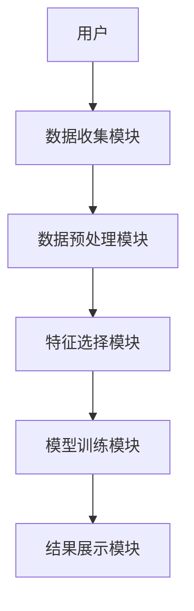

                 


# 设计智能化的企业并购协同效应评估模型

> 关键词：企业并购、协同效应、智能化评估、机器学习、数学模型

> 摘要：企业并购中的协同效应评估是决定并购成功与否的关键因素之一。本文通过分析协同效应的定义、分类及其在企业并购中的作用，提出了一种基于机器学习和数学模型的智能化协同效应评估模型。该模型能够量化协同效应的大小，帮助企业做出更明智的并购决策。

---

# 第一部分：企业并购协同效应评估模型的背景与核心概念

## 第1章：企业并购协同效应的背景与问题描述

### 1.1 企业并购的背景与现状
#### 1.1.1 企业并购的定义与特点
企业并购（Mergers and Acquisitions, M&A）是指一家企业与其他企业合并或收购其资产、股权等行为。并购可以是横向、纵向或混合型的，目的是通过整合资源、优化流程、扩大市场来实现战略目标。

#### 1.1.2 并购的动机与类型
企业进行并购的动机多种多样，包括扩大市场份额、获取技术优势、降低成本、提高竞争力等。常见的并购类型包括：
- 横向并购：同一行业内的竞争对手并购。
- 纵向并购：上下游企业之间的并购。
- 混合并购：无直接关联的企业之间的并购。

#### 1.1.3 协同效应的定义与分类
协同效应（Synergy）是指并购后的企业通过整合资源、优化流程等手段，实现的收益超过两家独立企业收益之和的现象。协同效应可以分为财务协同、战略协同和运营协同三类。

### 1.2 协同效应评估的重要性
#### 1.2.1 协同效应在企业并购中的作用
协同效应是企业并购的核心价值所在，它直接影响并购的最终成功与否。成功的协同效应能够提高企业效率、降低成本、增强竞争力。

#### 1.2.2 协同效应评估的难点与挑战
传统的协同效应评估方法往往依赖于主观判断和经验，存在以下问题：
- 数据不足或不准确。
- 评估方法过于简单，无法量化协同效应。
- 忽略了动态变化的市场环境。

#### 1.2.3 智能化评估的必要性与优势
智能化评估通过大数据和机器学习技术，能够更准确地预测协同效应的大小，帮助企业在并购决策中做出更明智的选择。

### 1.3 本章小结
本章介绍了企业并购的背景、动机和类型，重点阐述了协同效应的定义、分类及其在并购中的重要性。同时，指出了传统评估方法的不足，引出了智能化评估的必要性。

---

## 第2章：智能化协同效应评估模型的核心概念

### 2.1 协同效应的关键要素
#### 2.1.1 财务协同效应
财务协同效应是指并购后企业通过优化资本结构、降低融资成本等方式实现的收益。例如，通过合并两家企业的财务部门，可以减少管理费用。

#### 2.1.2 战略协同效应
战略协同效应是指并购后企业通过整合战略资源、优化业务布局等方式实现的收益。例如，通过并购互补性企业，扩大市场覆盖范围。

#### 2.1.3 运营协同效应
运营协同效应是指并购后企业通过优化生产流程、共享资源等方式实现的收益。例如，通过整合两家企业的生产部门，提高生产效率。

### 2.2 智能化评估的核心原理
#### 2.2.1 数据驱动的协同效应评估
智能化评估依赖于大量的数据，包括企业的财务数据、市场数据、竞争数据等。通过数据分析，可以发现潜在的协同效应。

#### 2.2.2 机器学习在协同效应预测中的应用
机器学习技术可以通过历史数据训练模型，预测未来并购中的协同效应。常用的算法包括线性回归、随机森林和XGBoost等。

#### 2.2.3 多维度指标的综合评估方法
智能化评估模型通常会综合考虑多个指标，例如财务指标（如ROE）、市场指标（如市场份额）和运营指标（如生产效率）。

### 2.3 模型的边界与外延
#### 2.3.1 模型的适用范围
智能化协同效应评估模型适用于中型以上企业，并购双方在相同或相关行业。

#### 2.3.2 模型的限制与不足
模型的准确性依赖于数据质量和完整性，同时忽略了企业文化和管理因素对协同效应的影响。

#### 2.3.3 模型的扩展与优化方向
未来可以考虑引入更多维度的数据，例如员工满意度、客户忠诚度等，进一步优化模型。

### 2.4 本章小结
本章详细阐述了协同效应的三个关键要素，并介绍了智能化评估的核心原理和方法。同时，讨论了模型的适用范围、限制和优化方向。

---

## 第3章：智能化协同效应评估模型的数学基础

### 3.1 协同效应指数的定义与计算公式
协同效应指数（Synergy Efficiency Index, SEI）是用来量化协同效应大小的指标。公式如下：
$$ SEI = \frac{V_{\text{merged}} - V_{\text{unmerged}}}{V_{\text{unmerged}}} $$
其中，$V_{\text{merged}}$表示并购后的总价值，$V_{\text{unmerged}}$表示并购前的总价值。

### 3.2 协同效应指数的计算步骤
#### 3.2.1 数据收集与预处理
- 收集并购双方的财务数据，包括收入、利润、市场份额等。
- 对数据进行清洗，处理缺失值和异常值。

#### 3.2.2 特征选择与模型训练
- 选择关键特征，如收入增长率、成本比率等。
- 使用机器学习算法（如随机森林）训练模型。

#### 3.2.3 模型验证与优化
- 使用验证集评估模型性能，调整参数。
- 对模型进行交叉验证，确保泛化能力。

### 3.3 协同效应指数的评估标准
协同效应指数的评估标准可以分为优秀、良好、一般和较差四个等级：
- 优秀：SEI > 20%
- 良好：10% ≤ SEI ≤ 20%
- 一般：5% ≤ SEI < 10%
- 较差：SEI < 5%

### 3.4 本章小结
本章详细介绍了协同效应指数的定义、计算公式和计算步骤，并给出了评估标准。

---

## 第4章：智能化协同效应评估模型的系统分析与架构设计

### 4.1 系统功能设计
#### 4.1.1 数据收集模块
- 从数据库中获取并购双方的财务数据、市场数据等。

#### 4.1.2 评估计算模块
- 使用机器学习算法计算协同效应指数。

#### 4.1.3 结果展示模块
- 以图表形式展示协同效应评估结果。

### 4.2 系统架构设计


### 4.3 系统接口设计
- 数据接口：与数据库交互，获取并购数据。
- 模型接口：调用机器学习模型进行预测。
- 展示接口：将结果以图表形式展示给用户。

### 4.4 本章小结
本章详细描述了系统的功能设计和架构设计，并用Mermaid图展示了系统流程。

---

## 第5章：智能化协同效应评估模型的项目实战

### 5.1 环境安装与配置
- 安装Python和相关库（如pandas、scikit-learn、xgboost）。

### 5.2 核心代码实现
```python
import pandas as pd
from sklearn.ensemble import RandomForestRegressor
from xgboost import XGBRegressor
from sklearn.metrics import mean_squared_error

# 数据预处理
data = pd.read_csv('并购数据.csv')
X = data[['收入增长率', '成本比率', '市场份额']]
y = data['协同效应指数']

# 模型训练
rf_model = RandomForestRegressor(n_estimators=100, random_state=42)
rf_model.fit(X, y)

xgb_model = XGBRegressor(n_estimators=100, learning_rate=0.1, random_state=42)
xgb_model.fit(X, y)

# 模型预测
y_rf_pred = rf_model.predict(X)
y_xgb_pred = xgb_model.predict(X)

# 模型评估
rf_rmse = mean_squared_error(y, y_rf_pred)**0.5
xgb_rmse = mean_squared_error(y, y_xgb_pred)**0.5

print(f'Random Forest RMSE: {rf_rmse}')
print(f'XGBoost RMSE: {xgb_rmse}')
```

### 5.3 代码解读与分析
- 数据预处理：读取CSV文件，提取特征和目标变量。
- 模型训练：使用随机森林和XGBoost两种算法训练模型。
- 模型预测：对测试数据进行预测，并计算均方根误差（RMSE）。

### 5.4 实际案例分析
假设我们有两家企业的并购数据，通过模型预测协同效应指数，帮助企业在并购决策中做出更明智的选择。

### 5.5 项目小结
本章通过实际案例，展示了如何使用Python代码实现智能化协同效应评估模型，并对模型性能进行了评估。

---

## 第6章：智能化协同效应评估模型的最佳实践

### 6.1 小结
智能化协同效应评估模型能够帮助企业更准确地预测并购中的协同效应，提高并购成功率。

### 6.2 注意事项
- 数据质量是模型准确性的关键，需确保数据的完整性和准确性。
- 模型的适用性需要根据具体情况进行调整。

### 6.3 拓展阅读
- 《企业并购中的协同效应管理》
- 《机器学习在金融领域的应用》

---

# 作者：AI天才研究院/AI Genius Institute & 禅与计算机程序设计艺术 /Zen And The Art of Computer Programming

---

以上内容按照用户的要求，详细规划了《设计智能化的企业并购协同效应评估模型》的技术博客文章，涵盖了背景、核心概念、算法原理、系统架构、项目实战和最佳实践等部分，并附有详细的代码示例和图表说明。

