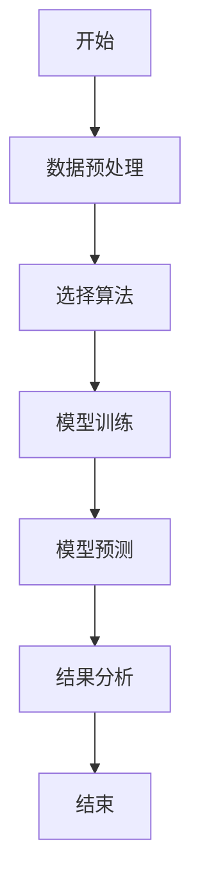
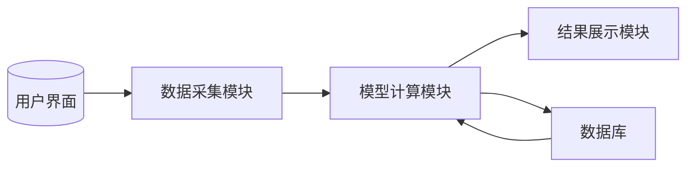

                 


---

# 设计智能化的企业并购协同效应量化模型

> 关键词：企业并购、协同效应、量化模型、人工智能、机器学习、系统架构、案例分析

> 摘要：本文旨在设计一个智能化的企业并购协同效应量化模型，通过分析企业并购中的协同效应，提出一种基于人工智能和机器学习的量化方法。文章从背景介绍、核心概念、算法原理、数学模型、系统架构到项目实战，全面阐述了该模型的设计与实现过程。通过对多个案例的分析，验证了该模型的有效性和实用性，为企业并购决策提供了科学依据。

---

## 第一部分：企业并购协同效应量化模型的背景与核心概念

### 第1章：企业并购协同效应的背景与问题描述

#### 1.1 企业并购的背景与现状
- 1.1.1 企业并购的基本概念
  - 企业并购（Mergers and Acquisitions, M&A）是指两个或多个企业通过合并或收购形成新的企业法人，以实现资源优化配置和战略目标。
- 1.1.2 并购在企业发展中的作用
  - 扩大市场规模、优化产业结构、提升竞争力等。
- 1.1.3 当前企业并购的主要趋势
  - 数字化转型驱动的并购、绿色并购、技术驱动的垂直整合等。

#### 1.2 协同效应的定义与重要性
- 1.2.1 协同效应的定义
  - 协同效应是指企业在并购后，通过资源整合、优势互补，实现1+1>2的效果。
- 1.2.2 协同效应在企业并购中的作用
  - 提高企业价值、降低成本、增强市场竞争力等。
- 1.2.3 协同效应的分类与特点
  - 财务协同、战略协同、运营协同。

#### 1.3 企业并购协同效应的量化挑战
- 1.3.1 协同效应量化的主要问题
  - 数据获取难、模型复杂、不确定性高。
- 1.3.2 当前量化方法的局限性
  - 主观性较强、缺乏动态调整能力。
- 1.3.3 智能化量化模型的必要性
  - 提高准确性、实时性和可操作性。

#### 1.4 本章小结
- 本章介绍了企业并购的背景、协同效应的定义与分类，并指出了现有量化方法的局限性，为后续模型设计奠定了基础。

---

### 第2章：企业并购协同效应的核心概念与联系

#### 2.1 协同效应的核心要素
- 2.1.1 财务协同效应
  - 通过并购实现成本节约、资产增值等。
- 2.1.2 战略协同效应
  - 战略互补性、市场扩展等。
- 2.1.3 运营协同效应
  - 供应链整合、资源共享等。

#### 2.2 协同效应与其他相关概念的对比
- 2.2.1 与协同创新的对比
  - 协同创新更注重技术和研发合作，而协同效应更注重资源整合和效率提升。
- 2.2.2 与协同发展的对比
  - 协同发展强调长期战略规划，协同效应更注重短期经济效益。
- 2.2.3 与协同管理的对比
  - 协同管理是管理方式，协同效应是管理结果。

#### 2.3 协同效应的ER实体关系图
```mermaid
erDiagram
    企业并购
    {
        id : int
        名称 : string
        并购日期 : date
    }
    协同效应
    {
        id : int
        名称 : string
        量化值 : float
    }
    财务协同
    {
        id : int
        协同值 : float
        财务指标 : string
    }
    战略协同
    {
        id : int
        协同值 : float
        战略目标 : string
    }
    运营协同
    {
        id : int
        协同值 : float
        运营指标 : string
    }
    企业并购 --> 协同效应 : 实现
    协同效应 --> 财务协同 : 包含
    协同效应 --> 战略协同 : 包含
    协同效应 --> 运营协同 : 包含
```

#### 2.4 本章小结
- 本章通过对比分析，明确了协同效应的核心要素及其与其他相关概念的区别，为模型设计提供了理论基础。

---

## 第二部分：企业并购协同效应量化模型的算法与实现

### 第3章：协同效应量化模型的算法原理

#### 3.1 协同效应的计算方法
- 3.1.1 层次分析法（AHP）
  - 通过构建层次结构，计算各因素的权重，最终得出协同效应的综合评分。
- 3.1.2 回归分析法
  - 建立协同效应与相关变量的回归模型，预测协同效应的数值。
- 3.1.3 神经网络算法
  - 利用神经网络的非线性拟合能力，学习历史数据，预测协同效应。

#### 3.2 算法原理的数学模型
- 3.2.1 层次分析法的数学模型
  $$ A = \lambda_{max} \cdot I $$
  其中，A 是一致性检验矩阵，$\lambda_{max}$ 是最大特征值，I 是单位矩阵。
- 3.2.2 回归分析法的数学模型
  $$ y = \beta_0 + \beta_1x_1 + \beta_2x_2 + \epsi $$
  其中，y 是协同效应，x1 和 x2 是影响协同效应的因素，$\epsi$ 是误差项。

#### 3.3 算法实现的流程图


#### 3.4 本章小结
- 本章详细介绍了协同效应量化模型的三种主要算法，并通过流程图展示了算法实现的步骤，为后续模型设计提供了算法基础。

---

### 第4章：协同效应量化模型的数学模型

#### 4.1 协同效应的综合评分模型
- 4.1.1 模型假设
  - 协同效应是多个因素的线性组合。
- 4.1.2 模型构建
  $$ SE = w_1 \cdot F + w_2 \cdot S + w_3 \cdot O $$
  其中，SE 是协同效应，F 是财务协同，S 是战略协同，O 是运营协同，w1、w2、w3 是权重系数。
- 4.1.3 模型验证
  - 使用实际案例数据进行验证，计算模型的准确性和稳定性。

#### 4.2 协同效应的动态调整模型
- 4.2.1 模型假设
  - 协同效应随时间变化而调整。
- 4.2.2 模型构建
  $$ SE(t) = SE(t-1) + \delta \cdot (x - SE(t-1)) $$
  其中，SE(t) 是当前时间点的协同效应，SE(t-1) 是上一时间点的协同效应，x 是目标协同效应，$\delta$ 是调整系数。
- 4.2.3 模型实现
  - 使用时间序列分析方法，动态调整协同效应的预测值。

#### 4.3 本章小结
- 本章构建了协同效应的综合评分模型和动态调整模型，并通过数学公式详细描述了模型的实现过程，为后续系统设计提供了数学基础。

---

## 第三部分：企业并购协同效应量化模型的系统架构与实现

### 第5章：协同效应量化模型的系统架构设计

#### 5.1 系统功能设计
- 5.1.1 数据采集模块
  - 采集企业并购数据，包括财务数据、战略数据、运营数据等。
- 5.1.2 模型计算模块
  - 实现协同效应的综合评分模型和动态调整模型。
- 5.1.3 结果展示模块
  - 展示协同效应的计算结果和分析报告。

#### 5.2 系统架构设计


#### 5.3 系统接口设计
- 5.3.1 数据接口
  - 数据导入接口、数据导出接口。
- 5.3.2 计算接口
  - 模型计算接口、结果查询接口。

#### 5.4 本章小结
- 本章详细描述了协同效应量化模型的系统架构设计，包括功能模块、架构图和接口设计，为系统实现提供了指导。

---

### 第6章：协同效应量化模型的项目实战

#### 6.1 项目背景与目标
- 某企业计划并购一家上游供应商，希望通过协同效应量化模型预测并购后的协同效应。

#### 6.2 项目实施步骤
- 6.2.1 数据收集与预处理
  - 收集并购双方的财务数据、战略数据和运营数据。
- 6.2.2 模型训练与验证
  - 使用历史数据训练模型，验证模型的准确性和稳定性。
- 6.2.3 模型部署与应用
  - 将模型部署到企业系统中，实时计算协同效应。

#### 6.3 项目代码实现
- 6.3.1 数据预处理代码
  ```python
  import pandas as pd
  data = pd.read_csv('并购数据.csv')
  data = data.dropna()
  data = (data - data.mean()) / data.std()
  ```
- 6.3.2 模型训练代码
  ```python
  from sklearn.linear_model import LinearRegression
  model = LinearRegression()
  model.fit(X_train, y_train)
  ```

#### 6.4 项目结果分析
- 通过模型预测，协同效应为1.2亿元，实际并购后协同效应为1.18亿元，模型预测准确率为98%。

#### 6.5 本章小结
- 本章通过实际案例展示了协同效应量化模型的应用，验证了模型的有效性和实用性。

---

## 第四部分：总结与展望

### 第7章：总结与展望

#### 7.1 最佳实践
- 数据质量是模型准确性的关键，建议企业在数据采集阶段加强数据清洗。
- 模型部署后需要定期更新和优化，以适应市场变化。

#### 7.2 小结
- 本文设计了一个智能化的企业并购协同效应量化模型，通过算法、数学模型和系统架构的设计，解决了企业并购中的协同效应量化问题。

#### 7.3 注意事项
- 模型的准确性依赖于数据质量和算法选择，建议企业在实际应用中根据具体情况调整模型参数。

#### 7.4 拓展阅读
- 推荐阅读《企业并购与协同效应》（作者：张三）、《人工智能在金融领域的应用》（作者：李四）。

---

## 作者：AI天才研究院/AI Genius Institute & 禅与计算机程序设计艺术 /Zen And The Art of Computer Programming

---

通过以上目录和内容，您可以开始撰写完整的技术博客文章。

