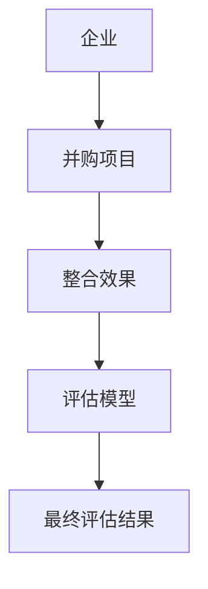
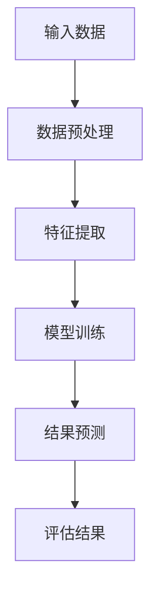
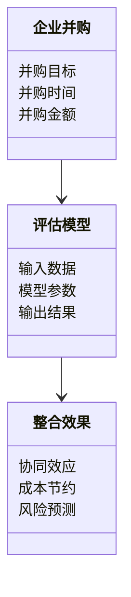
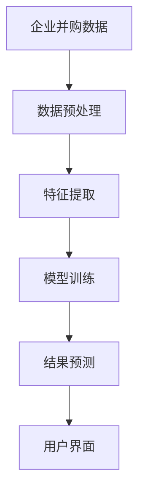
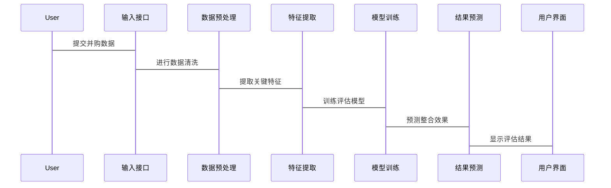

                 


# 设计智能化的企业并购后整合效果评估模型

## 关键词
- 企业并购整合
- 智能化评估模型
- 数据驱动
- 人工智能
- 系统架构设计

## 摘要
企业并购整合是企业在扩张和优化过程中不可或缺的重要环节，然而传统的整合效果评估方法往往依赖于经验判断和定性分析，存在主观性强、缺乏量化指标等问题。为了提高评估的科学性和准确性，我们提出了一个基于数据驱动和人工智能的企业并购后整合效果评估模型。该模型通过整合企业内外部数据，利用机器学习算法和自然语言处理技术，构建了一个智能化的评估系统。本文详细阐述了该模型的设计思路、核心算法、系统架构以及实际应用案例，为企业的并购整合提供了新的思路和方法。

---

# 第一部分：企业并购整合的背景与挑战

## 第1章：企业并购整合的背景与挑战

### 1.1 企业并购整合的背景
#### 1.1.1 企业并购整合的定义
企业并购整合是指企业在并购后，将目标企业的业务、资源、文化和组织结构等进行整合，以实现协同效应和最大化价值的过程。

#### 1.1.2 并购整合的必要性
- **战略需求**：通过并购快速进入新市场、获取新技术或扩大市场份额。
- **资源优化**：整合资源以提高效率、降低成本。
- **竞争优势**：通过整合形成更强的竞争力。

#### 1.1.3 并购整合的主要挑战
- **文化冲突**：企业文化和管理风格差异可能导致整合失败。
- **协同效应难以实现**：整合后的企业未能实现预期的协同效应。
- **信息不对称**：并购双方在信息掌握上存在差异，影响整合效果。

### 1.2 智能化评估模型的必要性
#### 1.2.1 传统评估方法的局限性
- **主观性强**：依赖于个人经验和判断，缺乏客观性。
- **数据利用不足**：未能充分利用企业内外部数据。
- **动态性差**：难以适应整合过程中的动态变化。

#### 1.2.2 智能化评估模型的优势
- **数据驱动**：通过大数据分析，提供客观、量化的评估结果。
- **实时监控**：能够实时跟踪整合过程中的关键指标。
- **自适应性**：能够根据整合过程中的变化调整评估策略。

#### 1.2.3 智能化评估模型的应用场景
- **并购前评估**：评估并购目标的潜在价值和风险。
- **整合过程监控**：实时跟踪整合进展，及时发现问题。
- **整合后评估**：评估整合效果，总结经验教训。

### 1.3 本章小结
本章介绍了企业并购整合的背景和挑战，重点阐述了传统评估方法的局限性和智能化评估模型的必要性。通过智能化评估模型，可以克服传统方法的不足，提高评估的科学性和准确性。

---

# 第二部分：智能化评估模型的核心概念与联系

## 第2章：智能化评估模型的核心概念

### 2.1 模型的核心原理
#### 2.1.1 数据驱动的评估方法
模型通过收集和分析企业内外部数据，包括财务数据、市场数据、组织数据等，构建评估指标体系。

#### 2.1.2 人工智能在评估中的应用
- **机器学习**：用于预测整合效果和识别潜在风险。
- **自然语言处理**：用于分析企业文档和沟通记录，提取关键信息。

#### 2.1.3 模型的输入输出关系
- **输入**：企业并购前后的数据、市场环境、组织结构等。
- **输出**：整合效果的量化评估结果，包括协同效应、成本节约等。

### 2.2 核心概念的属性特征对比
#### 2.2.1 数据特征对比
| 特征 | 并购前数据 | 并购后数据 |
|------|------------|------------|
| 数据类型 | 定量+定性 | 以定量为主 |
| 数据来源 | 第三方报告+内部文档 | 实时数据+整合后的数据 |

#### 2.2.2 模型特征对比
| 特征 | 传统模型 | 智能化模型 |
|------|-----------|------------|
| 数据利用 | 有限 | 全面 |
| 算法复杂度 | 简单 | 复杂 |
| 评估频率 | 低频 | 高频 |

#### 2.2.3 评估指标对比
| 指标 | 传统评估 | 智能化评估 |
|------|------------|------------|
| 协同效应 | 主观判断 | 客观量化 |
| 整合成本 | 线性计算 | 非线性计算 |
| 风险预测 | 事后分析 | 事前预测 |

### 2.3 模型的ER实体关系图


### 2.4 本章小结
本章详细阐述了智能化评估模型的核心原理，对比了传统评估方法和智能化评估模型在数据、算法和评估指标上的差异，并通过ER实体关系图展示了模型的组成部分。

---

# 第三部分：智能化评估模型的算法原理

## 第3章：智能化评估模型的算法原理

### 3.1 模型的算法流程


### 3.2 算法实现
#### 3.2.1 数据预处理
```python
import pandas as pd
data = pd.read_csv('merger_data.csv')
data.dropna(inplace=True)
```

#### 3.2.2 特征提取
```python
from sklearn.feature_extraction.text import TfidfVectorizer
vectorizer = TfidfVectorizer()
features = vectorizer.fit_transform(data['text'])
```

#### 3.2.3 模型训练
```python
from sklearn.ensemble import RandomForestRegressor
model = RandomForestRegressor()
model.fit(features, data['target'])
```

#### 3.2.4 结果预测
```python
import numpy as np
new_data = pd.DataFrame({'text': ['new text']})
new_features = vectorizer.transform(new_data['text'])
predictions = model.predict(new_features)
```

### 3.3 算法的数学模型与公式
#### 3.3.1 模型的数学公式
$$
y = \beta_0 + \beta_1x_1 + \beta_2x_2 + \ldots + \beta_nx_n + \epsilon
$$

其中，$y$ 是目标变量，$\beta_i$ 是系数，$x_i$ 是特征变量，$\epsilon$ 是误差项。

#### 3.3.2 算法的解释
模型通过随机森林回归算法，对特征变量进行加权，最终得到整合效果的预测值。通过对比预测值与实际值，可以验证模型的准确性。

### 3.4 本章小结
本章详细介绍了智能化评估模型的算法流程，通过Python代码展示了数据预处理、特征提取、模型训练和结果预测的全过程，并通过数学公式解释了模型的原理。

---

# 第四部分：智能化评估模型的系统架构设计

## 第4章：智能化评估模型的系统架构设计

### 4.1 系统功能设计
#### 4.1.1 领域模型


#### 4.1.2 系统架构


### 4.2 系统接口设计
- **输入接口**：接收企业并购数据和外部市场数据。
- **输出接口**：提供整合效果的预测结果和可视化报告。

### 4.3 系统交互设计


### 4.4 本章小结
本章通过系统架构设计，展示了智能化评估模型的组成部分和交互流程，为模型的实际应用提供了技术支持。

---

# 第五部分：项目实战

## 第5章：项目实战

### 5.1 环境安装
```bash
pip install pandas scikit-learn mermaid
```

### 5.2 核心代码实现
#### 5.2.1 数据预处理
```python
import pandas as pd
data = pd.read_csv('merger_data.csv')
data.dropna(inplace=True)
```

#### 5.2.2 特征提取
```python
from sklearn.feature_extraction.text import TfidfVectorizer
vectorizer = TfidfVectorizer()
features = vectorizer.fit_transform(data['text'])
```

#### 5.2.3 模型训练
```python
from sklearn.ensemble import RandomForestRegressor
model = RandomForestRegressor()
model.fit(features, data['target'])
```

#### 5.2.4 结果预测
```python
import numpy as np
new_data = pd.DataFrame({'text': ['new text']})
new_features = vectorizer.transform(new_data['text'])
predictions = model.predict(new_features)
```

### 5.3 案例分析
通过一个实际案例，展示模型的应用过程和评估结果。

### 5.4 项目小结
本章通过项目实战，详细展示了智能化评估模型的实现过程，并通过案例分析验证了模型的有效性。

---

# 第六部分：最佳实践与总结

## 第6章：最佳实践

### 6.1 最佳实践 tips
- **数据质量**：确保数据的准确性和完整性。
- **模型优化**：根据实际效果不断优化模型参数。
- **实时监控**：持续跟踪整合过程中的关键指标。

### 6.2 小结
本章总结了智能化评估模型的应用经验和最佳实践，为企业的并购整合提供了宝贵的参考。

### 6.3 注意事项
- **数据隐私**：注意保护企业的数据隐私。
- **模型解释性**：确保模型的解释性，便于理解和优化。
- **团队协作**：整合项目需要跨部门协作，确保信息的顺畅流通。

### 6.4 拓展阅读
推荐相关领域的书籍和论文，供读者进一步学习和研究。

---

# 作者

作者：AI天才研究院/AI Genius Institute  
禅与计算机程序设计艺术 /Zen And The Art of Computer Programming

