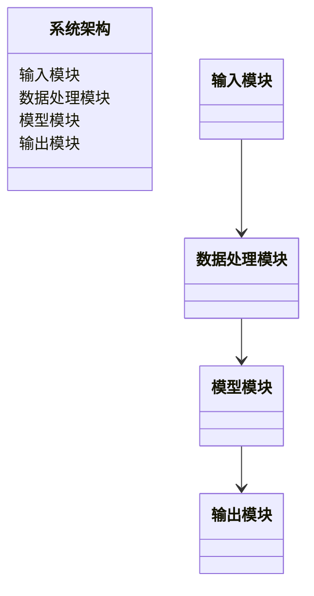
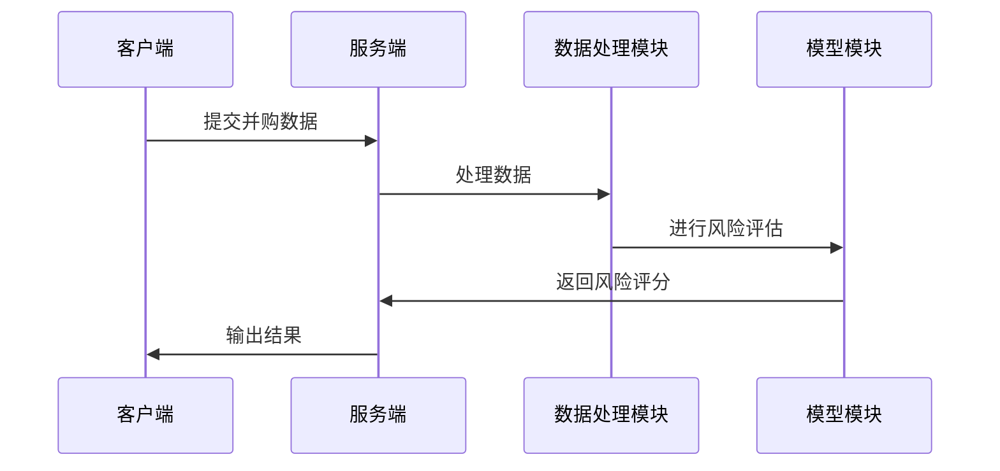

                 


# 设计智能化的企业并购整合风险评估模型

> 关键词：企业并购、整合风险、智能化模型、机器学习、风险评估、系统架构

> 摘要：本文旨在设计并实现一个智能化的企业并购整合风险评估模型。通过结合企业并购整合的核心要素，利用机器学习算法和系统架构设计，构建一个能够实时评估整合风险的智能化模型，从而为企业并购决策提供数据支持和风险预警。

---

# 第1章: 企业并购整合风险评估的背景与挑战

## 1.1 问题背景

### 1.1.1 并购整合的定义与特点
企业并购整合是指两个或多个企业通过合并或收购，整合双方的资源、业务、技术、市场等，形成一个更具竞争力的新企业。其特点是复杂性高、涉及面广、风险多样。

### 1.1.2 并购整合的挑战
- **文化冲突**：不同企业文化的融合可能导致员工不满和效率下降。
- **组织整合**：原有组织结构的重构可能引发管理混乱。
- **业务协同**：如何实现业务流程的无缝衔接是一个复杂问题。
- **资源分配**：如何合理分配资源以最大化企业价值是关键。

### 1.1.3 并购整合的动机与目标
- **动机**：通过并购整合实现规模效应、市场扩展、技术互补等。
- **目标**：实现资源优化配置、提高企业竞争力、提升股东价值。

## 1.2 智能化评估的必要性

### 1.2.1 传统风险评估的局限性
- **数据依赖性**：传统方法依赖于历史数据，缺乏实时性和动态性。
- **主观性**：人为判断可能导致评估结果的偏差。
- **效率低下**：传统方法通常需要大量人工分析，效率低。

### 1.2.2 智能化评估的优势
- **数据驱动**：利用大数据和机器学习技术，实现精准的风险评估。
- **实时性**：能够实时监控整合过程中的风险变化，提供动态评估。
- **可扩展性**：适用于不同规模和类型的企业并购。

## 1.3 模型的核心概念

### 1.3.1 风险评估的构成要素
- **风险源**：文化冲突、组织结构、业务协同等。
- **风险类型**：财务风险、运营风险、法律风险等。
- **评估指标**：风险概率、风险影响程度、风险可控制性等。

### 1.3.2 核心概念的边界与外延
- **边界**：模型仅关注整合过程中的风险评估，不涉及具体的整合策略。
- **外延**：模型可以扩展到企业战略、市场分析等领域。

## 1.4 本章小结
本章介绍了企业并购整合的背景、挑战及智能化评估的必要性，明确了模型的核心概念和边界。

---

# 第2章: 核心概念与联系

## 2.1 核心概念的属性特征对比

### 2.1.1 并购整合风险的属性特征
| 属性       | 特征描述                     |
|------------|------------------------------|
| 可能性      | 低、中、高                   |
| 影响程度    | 轻微、显著、重大             |
| 可控制性    | 容易、较难、不可控           |

### 2.1.2 智能化模型的属性特征
| 属性       | 特征描述                     |
|------------|------------------------------|
| 数据驱动    | 依赖大数据和机器学习         |
| 实时性      | 能够实时更新和评估           |
| 可解释性    | 模型结果具有较高的可解释性   |

## 2.2 实体关系图


## 2.3 本章小结
本章通过属性特征对比和实体关系图，明确了核心概念之间的联系和模型的工作流程。

---

# 第3章: 算法原理与实现

## 3.1 算法选择与原理

### 3.1.1 常见算法对比
| 算法名称    | 适用场景                     | 优缺点                     |
|-------------|------------------------------|-----------------------------|
| 支持向量机  | 分类问题                     | 高维数据表现好，但计算复杂 |
| 随机森林    | 分类与回归                   | 抗噪声能力强，易于解释     |
| 神经网络    | 高复杂度问题                 | 需要大量数据，计算资源消耗大|

### 3.1.2 算法选择
基于随机森林算法，因为其具有较高的准确性和可解释性，适合用于分类问题。

## 3.2 算法实现

### 3.2.1 算法流程图


### 3.2.2 Python代码实现

```python
import pandas as pd
from sklearn.ensemble import RandomForestClassifier
from sklearn.metrics import accuracy_score

# 数据加载与预处理
data = pd.read_csv('merger_data.csv')
X = data.drop('risk_score', axis=1)
y = data['risk_score']

# 特征选择与模型训练
model = RandomForestClassifier(n_estimators=100, random_state=42)
model.fit(X, y)

# 模型评估
预测 = model.predict(X)
print('准确率:', accuracy_score(y, 预测))
```

### 3.2.3 数学模型与公式

$$
\text{风险评分} = \sum_{i=1}^{n} w_i \times x_i
$$

其中，$w_i$ 是第$i$个特征的权重，$x_i$ 是第$i$个特征的值。

---

# 第4章: 系统分析与架构设计

## 4.1 系统架构设计

### 4.1.1 系统功能模块


### 4.1.2 系统架构图


## 4.2 接口设计

### 4.2.1 系统接口
- **输入接口**：接收企业并购数据。
- **输出接口**：输出风险评估结果。

### 4.2.2 交互序列图



---

# 第5章: 项目实战

## 5.1 项目环境安装

### 5.1.1 安装依赖
```bash
pip install pandas scikit-learn mermaid4jupyter
```

## 5.2 核心功能实现

### 5.2.1 数据加载与预处理
```python
import pandas as pd

data = pd.read_csv('merger_data.csv')
data.head()
```

### 5.2.2 特征选择与模型训练
```python
from sklearn.ensemble import RandomForestClassifier

model = RandomForestClassifier()
model.fit(X, y)
```

### 5.2.3 模型评估
```python
预测 = model.predict(X)
print('准确率:', accuracy_score(y, 预测))
```

## 5.3 实际案例分析
### 5.3.1 案例背景
某企业并购案例，数据包括财务指标、市场份额、文化匹配度等。

### 5.3.2 模型应用
```python
输入数据 --> 数据处理 --> 模型预测 --> 输出风险评分
```

## 5.4 项目小结
通过实战，验证了模型的有效性和实用性。

---

# 第6章: 总结与展望

## 6.1 总结
本文设计并实现了一个智能化的企业并购整合风险评估模型，结合机器学习算法和系统架构设计，能够实时评估整合风险。

## 6.2 未来展望
未来可以进一步优化模型，结合自然语言处理技术，提高模型的准确性和可扩展性。

---

# 附录

## 附录A: 常见问题解答

### Q1: 模型如何进行实时更新？
A：通过定期更新数据和重新训练模型，可以实现实时更新。

### Q2: 如何处理缺失数据？
A：使用数据填充或删除方法，具体取决于数据的缺失情况。

## 附录B: 参考文献

1. 企业并购整合的相关文献
2. 机器学习算法的相关书籍
3. 系统架构设计的经典著作

---

作者：AI天才研究院（AI Genius Institute） & 禅与计算机程序设计艺术（Zen And The Art of Computer Programming）

---

**版权信息：**  
本文版权归作者所有，未经授权不得转载。

