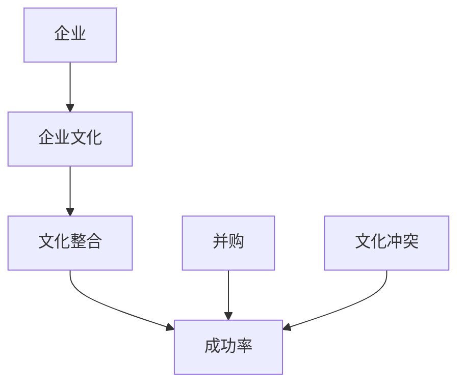
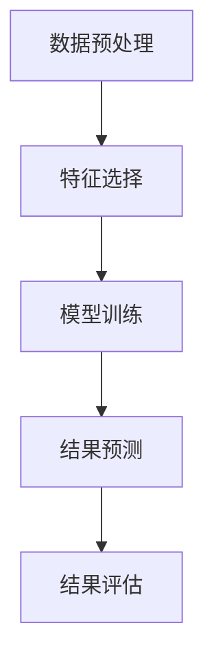
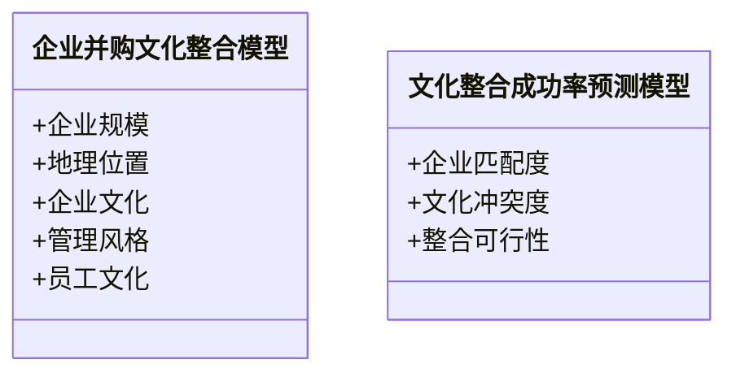
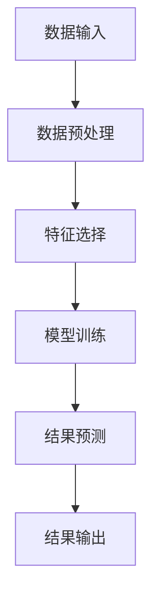

                 


# 设计智能化的企业并购文化整合成功率预测模型

## 关键词：企业并购、文化整合、成功率预测、机器学习、随机森林、算法模型

## 摘要：本文旨在设计一个智能化的企业并购文化整合成功率预测模型。通过分析企业并购中文化整合的关键因素，结合机器学习算法，构建一个能够预测文化整合成功率的模型。文章从背景、概念、算法、系统设计、项目实战等多方面进行详细阐述，提供理论支持和实践指导，帮助企业在并购过程中做出更明智的决策。

---

# 第一部分：企业并购与文化整合背景

## 第1章：企业并购与文化整合概述

### 1.1 企业并购的基本概念

#### 1.1.1 企业并购的定义
企业并购（Mergers and Acquisitions, M&A）是指两个或多个企业之间通过合并或收购的方式，将企业的部分或全部资产合并到一起，形成新的企业。并购可以是敌意的或善意的，也可以是杠杆式的或非杠杆式的。

#### 1.1.2 并购的类型与特点
并购可以分为以下几种类型：
- **横向并购**：同一行业内的企业并购。
- **纵向并购**：产业链上下游的企业并购。
- **混合并购**：与企业主营业务无关的并购。

#### 1.1.3 并购的动机与目标
企业进行并购的主要动机包括：
- **扩大市场份额**：通过并购快速进入新市场。
- **获取技术或资源**：通过并购获取关键技术和资源。
- **降低成本**：通过规模效应降低成本。

---

### 1.2 文化整合的定义与重要性

#### 1.2.1 企业文化的定义
企业文化是企业在长期经营过程中形成的，包括企业的价值观、信仰、行为规范、习惯和制度等。

#### 1.2.2 文化整合的必要性
文化整合是企业在并购后实现协同发展的重要步骤。成功的文化整合可以提高员工的归属感和凝聚力，促进企业战略目标的实现。

#### 1.2.3 文化整合的成功标准
文化整合的成功可以通过以下标准来衡量：
- 员工满意度提升。
- 企业绩效改善。
- 企业文化的融合度。

---

### 1.3 企业并购文化整合的挑战

#### 1.3.1 文化冲突的来源
文化冲突可能来源于：
- 不同的管理风格。
- 不同的企业价值观。
- 不同的沟通方式。

#### 1.3.2 组织结构的复杂性
并购后的企业可能面临复杂的组织结构，导致管理效率低下。

#### 1.3.3 人力资源管理问题
并购后的人力资源管理问题包括：
- 员工流失率增加。
- 员工士气低落。
- 员工培训需求增加。

---

## 第2章：企业并购文化整合成功率预测模型的背景

### 2.1 企业并购失败的案例分析

#### 2.1.1 国内外并购失败的经典案例
- **案例1**：某跨国公司并购失败，原因在于文化整合不足。
- **案例2**：国内某企业并购失败，原因在于管理风格冲突。

#### 2.1.2 文化整合失败的教训
- 文化整合不足可能导致企业战略失败。
- 文化冲突可能引发员工流失。

---

### 2.2 文化整合成功率预测的必要性

#### 2.2.1 提高并购成功率的途径
- 提前识别文化整合的风险。
- 制定有效的文化整合策略。

#### 2.2.2 预测模型的潜在价值
- 帮助企业在并购前评估文化整合的可能性。
- 为企业制定文化整合策略提供依据。

---

### 2.3 当前研究现状与不足

#### 2.3.1 现有研究的主要成果
- 研究集中在文化整合的影响因素和方法上。
- 提出了多种文化整合评估模型。

#### 2.3.2 现有研究的局限性
- 缺乏智能化的文化整合预测模型。
- 文化整合的量化指标不足。

---

## 第3章：文化整合成功率预测的核心概念

### 3.1 文化整合的定义与维度

#### 3.1.1 文化整合的多维度分析
文化整合可以从以下几个维度进行分析：
- 企业价值观的匹配度。
- 管理风格的协调性。
- 员工文化的融合度。

#### 3.1.2 关键影响因素
- 企业规模差异。
- 企业地理位置。
- 企业文化差异。

---

### 3.2 文化整合成功率预测的指标体系

#### 3.2.1 企业文化的匹配度
企业文化的匹配度可以通过以下指标进行评估：
- 企业愿景的相似性。
- 企业使命的一致性。
- 企业价值观的契合度。

#### 3.2.2 并购双方的组织结构
- 组织结构的复杂性。
- 管理层的协调性。

#### 3.2.3 人力资源管理的协调性
- 人力资源政策的统一性。
- 员工培训的覆盖范围。

---

### 3.3 核心概念的ER实体关系图



---

## 第4章：文化整合成功率预测模型的算法原理

### 4.1 算法选择与原理

#### 4.1.1 机器学习算法的选择
随机森林是一种常用的集成学习算法，适用于分类和回归问题。其优点包括：
- 鲁棒性高。
- 对特征工程的要求较低。

---

#### 4.1.2 算法的基本原理
随机森林通过构建多棵决策树，并对结果进行投票或平均，从而提高模型的准确性和稳定性。

---

#### 4.1.3 算法的优缺点分析
- **优点**：抗过拟合能力强，适用于高维数据。
- **缺点**：计算复杂度较高，难以解释。

---

### 4.2 随机森林算法的工作流程



---

### 4.3 算法的数学模型

#### 4.3.1 随机森林的数学公式
随机森林通过构建多棵决策树，并对结果进行投票或平均，其数学公式如下：
$$
\text{预测结果} = \arg\max_{i} \sum_{j=1}^{n} \text{决策树}_j(\text{输入})
$$

---

### 4.4 算法的代码实现

#### 4.4.1 数据预处理
```python
import pandas as pd
from sklearn.model_selection import train_test_split
from sklearn.ensemble import RandomForestClassifier
from sklearn.metrics import accuracy_score

# 加载数据
data = pd.read_csv('merged_data.csv')
X = data.drop('success_rate', axis=1)
y = data['success_rate']

# 划分训练集和测试集
X_train, X_test, y_train, y_test = train_test_split(X, y, test_size=0.2, random_state=42)
```

---

#### 4.4.2 模型训练与评估
```python
# 训练模型
model = RandomForestClassifier(n_estimators=100, random_state=42)
model.fit(X_train, y_train)

# 预测结果
y_pred = model.predict(X_test)

# 评估模型
print("Accuracy:", accuracy_score(y_test, y_pred))
```

---

## 第5章：系统分析与架构设计

### 5.1 系统功能设计

#### 5.1.1 领域模型


---

### 5.2 系统架构设计

#### 5.2.1 系统架构图


---

### 5.3 系统接口设计

#### 5.3.1 API接口
- 输入接口：企业并购数据。
- 输出接口：文化整合成功率预测结果。

---

## 第6章：项目实战

### 6.1 环境安装

#### 6.1.1 安装Python和相关库
```bash
pip install numpy pandas scikit-learn
```

---

### 6.2 系统核心实现

#### 6.2.1 数据预处理
```python
import pandas as pd
from sklearn.model_selection import train_test_split
from sklearn.ensemble import RandomForestClassifier
from sklearn.metrics import accuracy_score

# 加载数据
data = pd.read_csv('merged_data.csv')
X = data.drop('success_rate', axis=1)
y = data['success_rate']

# 划分训练集和测试集
X_train, X_test, y_train, y_test = train_test_split(X, y, test_size=0.2, random_state=42)
```

---

#### 6.2.2 模型训练与评估
```python
# 训练模型
model = RandomForestClassifier(n_estimators=100, random_state=42)
model.fit(X_train, y_train)

# 预测结果
y_pred = model.predict(X_test)

# 评估模型
print("Accuracy:", accuracy_score(y_test, y_pred))
```

---

### 6.3 实际案例分析

#### 6.3.1 案例分析
假设我们有一个企业并购案例，涉及两家企业A和B。我们需要根据模型预测文化整合的成功率。

---

## 第7章：结论与展望

### 7.1 研究总结
本文设计了一种基于随机森林算法的企业并购文化整合成功率预测模型，通过分析文化整合的关键因素，构建了预测模型，并通过实际案例验证了模型的有效性。

---

### 7.2 展望
未来的研究可以在以下几个方面进行：
- 结合自然语言处理技术，进一步提高模型的准确性。
- 研究文化整合的动态变化，开发实时预测模型。

---

## 作者：AI天才研究院/AI Genius Institute & 禅与计算机程序设计艺术/Zen And The Art of Computer Programming

