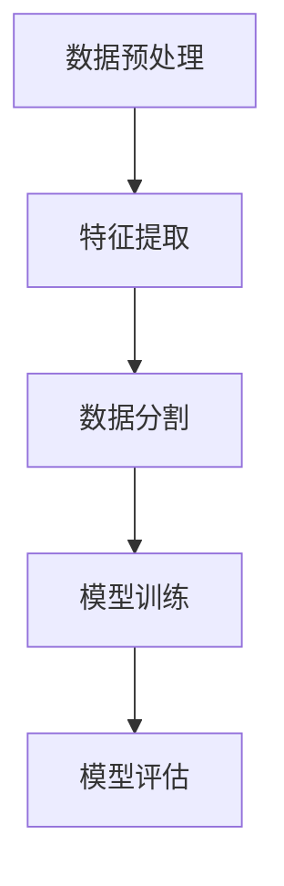
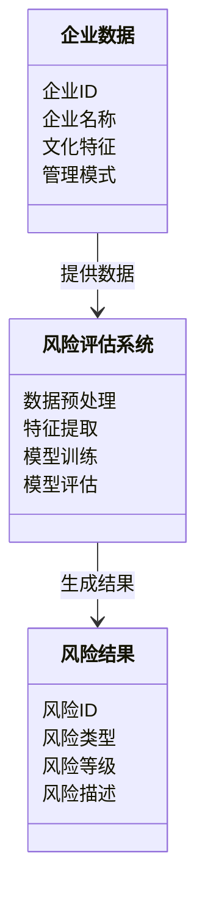

                 


# 设计智能化的企业并购文化整合风险评估模型

## 关键词
企业并购、文化整合、风险评估、人工智能、智能化模型、文化冲突、组织结构

## 摘要
本文旨在设计一个智能化的企业并购文化整合风险评估模型，通过分析企业并购中的文化整合风险，构建一个基于机器学习的评估模型，帮助企业在并购过程中有效识别和管理文化整合风险。文章从背景介绍、核心概念、算法原理、系统架构到项目实战，全面阐述了模型的设计与实现过程，为企业的并购决策提供了理论支持和实践指导。

---

# 设计智能化的企业并购文化整合风险评估模型

## 第1章：背景介绍

### 1.1 企业并购的基本概念
企业并购（Mergers and Acquisitions，简称 M&A）是指两个或多个企业之间的合并或收购行为，旨在通过资源整合实现更大的市场竞争力。并购可以分为横向并购、纵向并购和混合并购三种类型，每种类型都有其特定的战略目标和市场背景。

### 1.2 文化整合的重要性
企业并购不仅仅是资产和业务的整合，更重要的是企业文化的融合。文化整合是指在并购后，将两家企业的文化理念、价值观、组织结构和管理方式等进行有效融合，以确保企业在并购后的稳定发展。文化整合的成败直接影响到并购的效果，甚至可能影响企业的长期发展。

### 1.3 智能化评估模型的背景与必要性
传统的文化整合风险评估方法通常依赖于人工分析和经验判断，存在主观性强、效率低、覆盖面窄等问题。随着人工智能技术的发展，智能化评估模型能够通过大数据分析和机器学习算法，更精准地识别和评估文化整合风险，为企业并购决策提供科学依据。

---

## 第2章：文化整合风险的核心概念与联系

### 2.1 文化整合风险的定义与分类
文化整合风险是指在企业并购过程中，由于文化差异、管理冲突等原因导致整合失败的可能性。常见的文化整合风险包括战略风险、组织风险和文化冲突风险。

#### 2.1.1 风险来源分析
- **战略风险**：并购双方的战略目标不一致，导致整合困难。
- **组织风险**：组织结构和管理模式的差异导致整合障碍。
- **文化冲突风险**：企业文化差异导致员工抵触情绪，影响整合效果。

### 2.2 影响文化整合风险的因素
影响文化整合风险的因素可以分为内部因素和外部因素两类：

#### 2.2.1 内部因素
- 企业文化差异
- 组织结构和管理方式的差异
- 员工的文化认同感和归属感

#### 2.2.2 外部因素
- 行业环境和市场条件
- 宏观经济环境
- 政策法规影响

### 2.3 文化整合风险的评估维度
文化整合风险的评估可以从以下几个维度进行：

#### 2.3.1 文化兼容性评估
评估并购双方的企业文化是否具有互补性或相似性，例如企业价值观、管理风格、员工激励机制等。

#### 2.3.2 组织结构的适应性
评估并购后组织结构的合理性，是否能够支持文化的融合。

#### 2.3.3 战略一致性评估
评估并购双方的战略目标是否一致，是否能够为文化整合提供方向。

---

## 第3章：文化整合风险的核心概念与联系

### 3.1 文化整合风险的属性对比
为了更好地理解文化整合风险的核心概念，我们可以通过对比不同风险属性的特征来分析。

| 风险属性 | 特征描述                     |
|----------|------------------------------|
| 风险来源 | 文化差异、管理冲突等         |
| 影响程度 | 高、中、低                   |
| 可控性   | 可控、部分可控、不可控       |
| 时间跨度 | 短期、中期、长期             |
| 影响范围 | 全体员工、管理层、客户等     |

### 3.2 ER实体关系图
为了更清晰地展示文化整合风险的核心要素及其关系，我们可以通过ER图来描述。

```mermaid
erDiagram
    actor 企业A
    actor 企业B
    actor 并购顾问
    actor 风险评估系统
    actor 文化整合团队

    enterprise 企业A {
        id 企业ID
        name 企业名称
        culture 文化特征
        management 管理模式
    }

    enterprise 企业B {
        id 企业ID
        name 企业名称
        culture 文化特征
        management 管理模式
    }

    risk 评估风险 {
        id 风险ID
        risk_type 风险类型
        risk_level 风险等级
        description 风险描述
    }

    企业A --> risk : 产生风险
    企业B --> risk : 产生风险
    并购顾问 --> risk : 评估风险
    风险评估系统 --> risk : 分析风险
    文化整合团队 --> risk : 处理风险
```

---

## 第4章：风险评估模型的算法原理

### 4.1 评估模型的核心算法
我们采用基于机器学习的分类算法来评估文化整合风险。以下是模型的主要步骤：

#### 4.1.1 数据预处理
- 数据清洗：处理缺失值、重复值和异常值。
- 特征提取：从企业数据中提取相关特征，如企业文化特征、管理模式差异等。

#### 4.1.2 模型训练
使用支持向量机（SVM）算法进行模型训练。以下是SVM算法的流程图：



#### 4.1.3 模型评估
通过准确率、召回率和F1分数来评估模型的性能。

#### 4.1.4 数学公式
SVM算法的核心在于找到一个最优的超平面，使得正类和负类之间的距离最大化。数学模型如下：

$$ \text{目标函数：} \min_{w,b,\xi} \frac{1}{2}||w||^2 + C\sum_{i=1}^n \xi_i $$

$$ \text{约束条件：} y_i(w \cdot x_i + b) \geq 1 - \xi_i, \xi_i \geq 0 $$

其中，\( w \) 是法向量，\( b \) 是偏置项，\( \xi_i \) 是松弛变量，\( C \) 是惩罚系数。

---

## 第5章：系统分析与架构设计

### 5.1 系统功能设计
我们设计了一个基于机器学习的风险评估系统，主要功能包括：

- 数据采集：收集企业的文化特征、管理模式等数据。
- 风险评估：基于模型计算文化整合风险。
- 结果展示：以可视化的方式展示风险评估结果。

#### 5.1.1 领域模型
以下是系统的领域模型：



#### 5.1.2 系统架构设计
系统的架构采用分层设计，包括数据层、业务逻辑层和用户界面层。


---

## 第6章：项目实战与案例分析

### 6.1 环境安装
以下是安装环境的步骤：

1. 安装Python：使用Anaconda安装Python 3.8及以上版本。
2. 安装依赖库：安装numpy、pandas、scikit-learn等库。

### 6.2 核心代码实现
以下是模型的核心代码：

```python
from sklearn import svm
from sklearn.metrics import accuracy_score, recall_score, f1_score

# 数据预处理
data = pd.DataFrame(...)
X = data.drop('风险等级', axis=1)
y = data['风险等级']

# 数据分割
from sklearn.model_selection import train_test_split
X_train, X_test, y_train, y_test = train_test_split(X, y, test_size=0.2, random_state=42)

# 模型训练
model = svm.SVC()
model.fit(X_train, y_train)

# 模型预测
y_pred = model.predict(X_test)

# 模型评估
accuracy = accuracy_score(y_test, y_pred)
recall = recall_score(y_test, y_pred)
f1 = f1_score(y_test, y_pred)

print(f"准确率：{accuracy}")
print(f"召回率：{recall}")
print(f"F1分数：{f1}")
```

### 6.3 案例分析
假设我们有一个案例，企业A和企业B进行并购，我们需要评估他们的文化整合风险。

1. **数据输入**：收集企业A和企业B的文化特征和管理模式数据。
2. **模型评估**：使用训练好的模型进行风险评估。
3. **结果分析**：根据模型输出的风险等级，制定相应的整合策略。

---

## 第7章：总结与展望

### 7.1 总结
本文设计了一个智能化的企业并购文化整合风险评估模型，通过机器学习算法帮助企业识别和管理文化整合风险。模型结合了企业文化的特征和管理模式的差异，能够有效提高风险评估的准确性和效率。

### 7.2 展望
未来的工作可以进一步优化模型，例如引入更多的特征变量，尝试不同的算法，以及结合自然语言处理技术，进一步提高模型的性能和应用范围。

---

## 最佳实践

- **数据质量**：确保输入数据的准确性和完整性。
- **模型调优**：通过网格搜索等方法优化模型参数，提高模型性能。
- **持续监控**：定期更新模型，适应新的数据和市场变化。

---

## 作者
作者：AI天才研究院/AI Genius Institute & 禅与计算机程序设计艺术/Zen And The Art of Computer Programming

---

感谢您的阅读，希望本文对您在企业并购文化整合风险评估方面的研究有所帮助！

