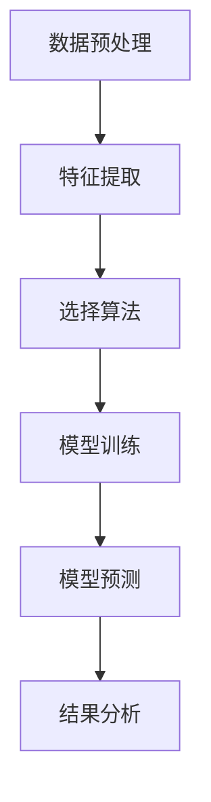
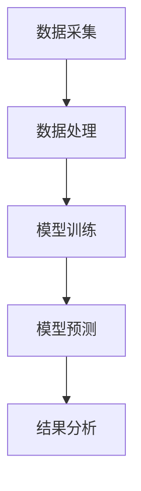
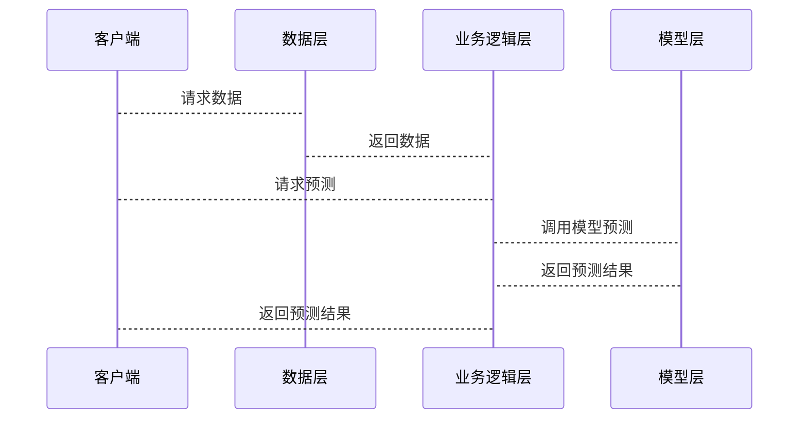

                 


# 设计智能化的企业并购目标筛选模型

---

## 关键词：企业并购，目标筛选，人工智能，机器学习，数据驱动

---

## 摘要：  
本文旨在设计一个智能化的企业并购目标筛选模型，通过结合企业战略目标、市场环境和财务数据，利用机器学习和大数据分析技术，帮助企业高效、精准地筛选出合适的并购目标。模型基于多维度数据挖掘和分析，结合专家经验，构建一个可扩展、可定制的智能化筛选系统，以降低并购风险，提高并购成功率。

---

## 第1章：企业并购目标筛选模型的背景与问题描述

### 1.1 企业并购的背景与重要性  
企业并购是企业战略发展的重要手段之一，通过并购可以快速获取技术、市场、客户资源等核心竞争力。在当前全球化和数字化的背景下，企业并购的频率和规模都在不断增加，尤其是在科技行业，技术整合和创新成为企业并购的核心驱动力。

#### 1.1.1 企业并购的定义与分类  
企业并购（Mergers and Acquisitions, M&A）是指一家企业合并或收购另一家企业，以实现资源优化配置和战略目标。根据并购方式的不同，可以分为横向并购、纵向并购和混合并购。

#### 1.1.2 并购在企业发展中的作用  
- **战略协同**：通过并购整合资源，实现1+1>2的效果。  
- **快速扩张**：通过并购快速进入新市场或领域。  
- **技术获取**：通过并购获取关键技术和专利。  

#### 1.1.3 当前企业并购的主要趋势  
- **技术驱动型并购**：尤其是科技领域的并购，如AI、大数据等技术的整合。  
- **全球化并购**：跨国并购成为主流趋势。  
- **中小型企业并购**：通过并购实现规模化和专业化。  

### 1.2 传统企业并购中的问题与挑战  
传统企业并购过程中，主要依赖人工筛选和经验判断，存在以下问题：  

#### 1.2.1 信息不对称问题  
由于信息不透明，潜在并购目标的真实情况难以全面掌握，导致决策风险高。  

#### 1.2.2 人工筛选的局限性  
人工筛选效率低、成本高，且容易受到主观因素影响，难以覆盖大量潜在目标。  

#### 1.2.3 并购失败的常见原因  
- **战略不匹配**：并购后的整合效果不佳。  
- **管理问题**：并购后的企业文化冲突。  
- **技术风险**：目标企业技术落后或存在技术瓶颈。  

### 1.3 智能化筛选模型的提出与目标  
为了克服传统并购的局限性，提出智能化企业并购目标筛选模型。其核心目标包括：  

#### 1.3.1 数据驱动的筛选  
通过大数据分析，全面、客观地评估潜在并购目标的优劣。  

#### 1.3.2 智能化匹配  
基于机器学习算法，实现企业战略与目标企业的精准匹配。  

#### 1.3.3 风险预警  
通过模型预测，并购过程中潜在风险，降低失败概率。  

---

## 第2章：企业并购目标筛选模型的核心概念与联系  

### 2.1 核心概念的定义与属性对比  
#### 2.1.1 企业并购目标的核心属性  
| 属性 | 描述 |  
|------|------|  
| 财务状况 | 盈利能力、资产负债率等财务指标。 |  
| 技术实力 | 核心技术、专利数量等。 |  
| 市场地位 | 市场份额、品牌影响力等。 |  
| 管理团队 | 团队能力、管理风格等。 |  

#### 2.1.2 智能化筛选模型的特征  
| 特征 | 描述 |  
|------|------|  
| 数据驱动 | 基于大量数据进行分析。 |  
| 智能匹配 | 通过机器学习实现精准匹配。 |  
| 实时更新 | 模型可动态更新，适应市场变化。 |  

#### 2.1.3 核心概念的对比分析（表格形式）  
| 概念 | 传统并购 | 智能化筛选模型 |  
|------|----------|----------------|  
| 筛选依据 | 主观经验 | 数据驱动 |  
| 筛选效率 | 低效 | 高效 |  
| 筛选范围 | 局限 | 全面 |  

### 2.2 实体关系图（ER图）  
以下是企业并购目标筛选模型的实体关系图：  

```mermaid
erDiagram
    管理团队 : [管理团队信息]
    技术实力 : [技术实力信息]
    财务状况 : [财务状况信息]
    市场地位 : [市场地位信息]
    模型输入 : [模型输入数据]
    模型输出 : [模型输出结果]
    模型算法 : [模型算法]
    筛选目标 : [筛选目标企业]
    管理团队 --> 模型输入
    技术实力 --> 模型输入
    财务状况 --> 模型输入
    市场地位 --> 模型输入
    模型输入 --> 模型算法
    模型算法 --> 模型输出
    模型输出 --> 筛选目标
```

---

## 第3章：企业并购目标筛选模型的算法原理  

### 3.1 算法选择与原理  
在企业并购目标筛选模型中，选择合适的算法是关键。以下是比较常见的算法及其特点：  

#### 3.1.1 机器学习算法的选择  
| 算法 | 适用场景 | 优点 |  
|------|----------|------|  
| 随机森林 | 分类问题 | 高准确性，适合特征较多的情况。 |  
| 支持向量机（SVM） | 分类问题 | 适合小样本数据，分类效果好。 |  
| 神经网络 | 非线性关系 | 适合复杂特征关系的建模。 |  

#### 3.1.2 算法的基本原理（使用mermaid流程图）  



### 3.2 数学模型与公式  
以下是模型中使用的数学公式：  

#### 3.2.1 特征选择的数学模型  
$$ \text{特征重要性} = \sum_{i=1}^{n} (w_i \times f_i) $$  
其中，\( w_i \) 是第 \( i \) 个特征的权重，\( f_i \) 是第 \( i \) 个特征的值。  

#### 3.2.2 模型训练的数学公式  
$$ \text{损失函数} = \sum_{i=1}^{m} (y_i - \hat{y_i})^2 $$  
其中，\( y_i \) 是真实值，\( \hat{y_i} \) 是预测值。  

### 3.3 算法实现与优化  
#### 3.3.1 算法的实现步骤  
1. 数据预处理：清洗数据，处理缺失值和异常值。  
2. 特征提取：从数据中提取关键特征。  
3. 模型训练：选择合适的算法进行训练。  
4. 模型预测：利用训练好的模型进行预测。  
5. 结果分析：评估模型性能，优化参数。  

#### 3.3.2 算法优化策略  
- 参数调优：通过网格搜索优化模型参数。  
- 特征选择：使用特征重要性排序，去除无关特征。  
- 模型集成：结合多种算法结果，提升准确率。  

---

## 第4章：企业并购目标筛选模型的系统架构设计  

### 4.1 系统功能设计  
#### 4.1.1 系统功能模块划分  
| 模块 | 功能描述 |  
|------|----------|  
| 数据采集 | 采集目标企业数据。 |  
| 数据处理 | 清洗和预处理数据。 |  
| 模型训练 | 训练机器学习模型。 |  
| 模型预测 | 预测目标企业匹配度。 |  

#### 4.1.2 功能模块的交互流程  
以下是功能模块的交互流程图：  



### 4.2 系统架构设计  
#### 4.2.1 系统架构的分层设计  
| 层 | 描述 |  
|----|------|  
| 数据层 | 数据存储和管理。 |  
| 业务逻辑层 | 处理业务逻辑，调用模型。 |  
| 用户界面层 | 提供用户交互界面。 |  

#### 4.2.2 架构设计图（使用mermaid图）  


### 4.3 系统接口设计  
#### 4.3.1 系统接口的定义  
- 数据接口：提供API用于数据的导入和导出。  
- 模型接口：提供API用于模型的训练和预测。  

#### 4.3.2 接口交互流程（使用mermaid序列图）  



---

## 第5章：企业并购目标筛选模型的项目实战  

### 5.1 环境安装与配置  
#### 5.1.1 开发环境的选择  
推荐使用Python作为开发语言，配合以下工具：  
- 数据处理：Pandas、NumPy  
- 可视化：Matplotlib、Seaborn  
- 机器学习：Scikit-learn、XGBoost  

#### 5.1.2 开发工具的安装与配置  
安装Python和相关库：  
```bash
pip install pandas numpy matplotlib scikit-learn xgboost
```

### 5.2 核心代码实现  
#### 5.2.1 数据预处理代码  
```python
import pandas as pd
import numpy as np

# 读取数据
data = pd.read_csv('target_companies.csv')

# 处理缺失值
data = data.dropna()

# 标准化处理
from sklearn.preprocessing import StandardScaler
scaler = StandardScaler()
scaled_data = scaler.fit_transform(data)
```

#### 5.2.2 模型训练代码  
```python
from sklearn.ensemble import RandomForestClassifier
from sklearn.model_selection import train_test_split

# 划分训练集和测试集
X_train, X_test, y_train, y_test = train_test_split(scaled_data, data['target'], test_size=0.2)

# 训练模型
model = RandomForestClassifier()
model.fit(X_train, y_train)

# 预测
y_pred = model.predict(X_test)
```

#### 5.2.3 模型预测代码  
```python
# 可视化结果
from sklearn.metrics import accuracy_score, confusion_matrix
print("Accuracy:", accuracy_score(y_test, y_pred))
print("Confusion Matrix:", confusion_matrix(y_test, y_pred))
```

### 5.3 代码应用与案例分析  
#### 5.3.1 代码的实际应用  
假设我们有一个目标企业数据集，使用上述代码进行处理和预测，最终输出预测结果和准确率。  

#### 5.3.2 实际案例的分析与解读  
通过模型预测，我们可以识别出哪些企业符合并购条件，并根据预测结果进行进一步的尽职调查。  

### 5.4 本章小结  

---

## 第6章：最佳实践与注意事项  

### 6.1 最佳实践 tips  
- 数据预处理是关键，确保数据质量。  
- 选择合适的算法，避免过拟合。  
- 定期更新模型，适应市场变化。  

### 6.2 小结  
企业并购目标筛选模型通过智能化的方法，帮助企业高效、精准地筛选目标企业，降低并购风险，提升并购成功率。  

### 6.3 注意事项  
- 数据隐私问题需严格遵守相关法律法规。  
- 模型结果仅供参考，最终决策需结合企业实际情况。  

### 6.4 拓展阅读  
- 《机器学习实战》  
- 《企业并购的策略与管理》  

---

## 作者：AI天才研究院/AI Genius Institute & 禅与计算机程序设计艺术 /Zen And The Art of Computer Programming

