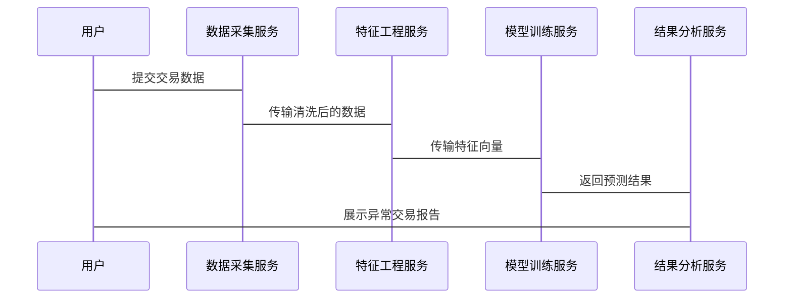

                 


# 设计智能化的企业财务异常交易检测系统

> 关键词：企业财务异常交易检测，智能化系统设计，机器学习，异常检测算法，系统架构

> 摘要：本文旨在设计一个智能化的企业财务异常交易检测系统，通过结合机器学习和深度学习算法，实现对财务数据的实时监控和异常交易的智能识别。文章详细阐述了系统的背景、核心概念、算法原理、系统架构设计以及项目实战，最后总结了系统的优化方向和未来展望。

---

## 第1章: 背景介绍与核心概念

### 1.1 问题背景

#### 1.1.1 企业财务舞弊的现状与挑战
在现代企业中，财务舞弊行为屡见不鲜，如虚假交易、虚增收入、虚减支出等。这些行为不仅损害了企业的利益，还可能导致企业面临法律风险和信任危机。传统的财务审计方法依赖于人工检查和事后审计，存在效率低、覆盖面有限的问题。尤其是在大数据环境下，企业的财务数据量急剧增加，人工审计难以应对。

#### 1.1.2 财务异常交易对企业的影响
财务异常交易可能导致企业资产流失、利润虚增或虚减，进而影响企业的财务健康状况和投资者信心。此外，异常交易还可能掩盖企业的真实经营状况，误导管理层的决策。

#### 1.1.3 传统财务检测方法的局限性
传统财务检测方法主要依赖于人工审核和简单的财务指标分析，存在以下问题：
- **效率低下**：人工审核需要大量时间，难以应对海量数据。
- **覆盖面有限**：难以覆盖所有可能的异常交易场景。
- **主观性较强**：依赖审计人员的经验和判断，存在主观误差。

### 1.2 问题描述

#### 1.2.1 财务异常交易的定义与特征
财务异常交易是指在企业的财务记录中存在不符合常规交易模式或违反会计准则的交易行为。其主要特征包括：
- **金额异常**：交易金额远高于或低于正常水平。
- **时间异常**：交易时间集中在特定时间段。
- **关联方交易异常**：与关联方的交易金额显著高于正常水平。
- **数据不一致**：财务数据与业务数据不匹配。

#### 1.2.2 异常交易检测的关键要素
- 数据采集：获取企业的财务数据和交易记录。
- 特征提取：从财务数据中提取有助于检测异常交易的特征。
- 模型训练：基于机器学习或深度学习算法，训练异常交易检测模型。
- 结果分析：对模型输出的结果进行解释和验证。

#### 1.2.3 问题解决与边界
系统的目标是通过智能化的方法，实时监控企业的财务交易，识别潜在的异常交易行为。系统的边界包括：
- 数据范围：仅针对企业的财务数据。
- 时间范围：实时或近实时检测。
- 交易类型：涵盖收入、支出、关联交易等多种交易类型。

### 1.3 核心概念与结构

#### 1.3.1 系统架构的核心要素
- 数据源：企业的财务系统、业务系统等。
- 数据处理：数据清洗、特征提取。
- 模型训练：基于机器学习或深度学习算法的模型。
- 结果分析：模型输出的异常交易报告。

#### 1.3.2 系统功能模块的组成
- 数据采集模块：从企业财务系统中获取数据。
- 特征工程模块：提取有助于检测异常交易的特征。
- 模型训练模块：训练异常交易检测模型。
- 结果分析模块：对模型输出的结果进行解释和验证。

#### 1.3.3 系统与业务流程的关联
系统需要与企业的财务系统、业务系统进行对接，实时获取交易数据，并将检测结果反馈给财务部门或审计部门。

### 1.4 本章小结
本章从背景和问题描述出发，详细阐述了企业财务异常交易检测的必要性、核心概念和系统架构。为后续的算法设计和系统实现奠定了基础。

---

## 第2章: 异常交易检测的核心原理

### 2.1 异常检测的原理与方法

#### 2.1.1 基于统计的异常检测方法
基于统计的方法通过分析数据的分布特征，识别偏离正常分布的点。常用的方法包括：
- **Z-score方法**：通过计算数据点与均值的距离标准化值，判断是否为异常值。
- **箱线图方法**：基于四分位数，判断数据点是否超出正常范围。

#### 2.1.2 基于机器学习的异常检测
基于机器学习的方法通过训练模型，识别异常模式。常用的方法包括：
- **监督学习**：基于标记的数据，训练分类模型识别异常交易。
- **无监督学习**：基于无标记数据，通过聚类或异常检测算法识别异常点。

#### 2.1.3 基于规则的异常检测
基于规则的方法通过设定一系列规则，识别不符合规则的交易行为。例如：
- 关联交易金额超过设定阈值。
- 交易时间集中在非工作时间段。

### 2.2 异常交易检测模型

#### 2.2.1 基于监督学习的分类模型
- **支持向量机（SVM）**：适用于小规模数据的分类任务。
- **随机森林（Random Forest）**：适用于特征较多的场景，具有较强的鲁棒性。
- **神经网络（ANN）**：适用于复杂的非线性关系。

#### 2.2.2 基于无监督学习的聚类模型
- **K-Means聚类**：将交易数据分为正常和异常两类。
- **DBSCAN算法**：基于密度的聚类算法，能够发现异常点。

#### 2.2.3 基于深度学习的序列模型
- **循环神经网络（RNN）**：适用于时间序列数据的建模。
- **变换器（Transformer）**：基于注意力机制，适用于长序列数据的建模。

### 2.3 检测模型的特征工程

#### 2.3.1 财务数据特征的提取
- 交易金额：如单笔交易金额是否远高于或低于正常水平。
- 交易时间：如交易时间是否集中在非工作时间段。
- 交易频率：如同一供应商在短时间内频繁交易。

#### 2.3.2 异常特征的识别方法
- 统计特征：如均值、方差、偏度等。
- 时间特征：如交易时间间隔、交易时间分布。
- 关联特征：如关联交易金额、关联交易频率。

#### 2.3.3 特征选择与优化
- 基于统计的方法：如卡方检验。
- 基于机器学习的方法：如LASSO回归。

### 2.4 检测模型的评估与优化

#### 2.4.1 模型评估指标与方法
- 准确率（Accuracy）：正确分类的样本数与总样本数的比值。
- 召回率（Recall）：真实异常交易被正确识别的比例。
- F1分数：准确率和召回率的调和平均数。

#### 2.4.2 模型调优与参数优化
- 参数调优：如网格搜索（Grid Search）。
- 模型集成：如投票法（Voting）和堆叠法（Stacking）。

#### 2.4.3 模型的鲁棒性与可解释性
- 鲁棒性：模型在数据分布变化时的性能表现。
- 可解释性：模型输出结果的可解释性，便于财务部门理解和验证。

### 2.5 本章小结
本章详细介绍了异常交易检测的核心原理和常用方法，包括基于统计、机器学习和深度学习的异常检测方法，以及特征工程和模型评估的相关内容。

---

## 第3章: 算法原理与数学模型

### 3.1 监督学习算法

#### 3.1.1 支持向量机（SVM）原理
支持向量机是一种常用的分类算法，其核心思想是通过寻找一个超平面，将数据点分为两类。对于异常交易检测任务，SVM可以用于分类异常交易和正常交易。

#### 3.1.2 随机森林（Random Forest）原理
随机森林是一种基于决策树的集成算法，通过构建多个决策树并进行投票或平均，提高模型的准确性和鲁棒性。

#### 3.1.3 神经网络（ANN）原理
神经网络是一种模拟人脑神经网络的计算模型，适用于复杂的非线性分类任务。

### 3.2 无监督学习算法

#### 3.2.1 K-Means聚类算法
K-Means是一种常用的聚类算法，通过将数据点分成K个簇，识别异常交易。

#### 3.2.2 DBSCAN算法
DBSCAN是一种基于密度的聚类算法，能够发现密度较低的区域，识别异常点。

#### 3.2.3 Isolation Forest算法
Isolation Forest是一种基于树结构的异常检测算法，通过构建隔离树，快速识别异常点。

### 3.3 深度学习算法

#### 3.3.1 循序记忆网络（RNN）原理
RNN适用于时间序列数据的建模，可以捕捉交易的时间依赖性。

#### 3.3.2 变换器（Transformer）原理
Transformer基于注意力机制，适用于长序列数据的建模。

#### 3.3.3 图神经网络（GNN）原理
图神经网络适用于复杂的关系网络，如关联交易网络。

### 3.4 算法选择与优化

#### 3.4.1 算法选择的依据
- 数据量和数据类型：小数据适合SVM，大数据适合深度学习算法。
- 任务类型：分类任务适合监督学习算法，聚类任务适合无监督学习算法。

#### 3.4.2 算法调优的策略
- 参数调优：如学习率、批量大小等。
- 模型集成：如投票法和堆叠法。

#### 3.4.3 算法性能的对比分析
通过实验对比不同算法在检测准确率、召回率等方面的性能差异，选择最优算法。

### 3.5 本章小结
本章详细介绍了异常交易检测中常用的算法原理，包括监督学习、无监督学习和深度学习算法，并分析了不同算法的适用场景和性能表现。

---

## 第4章: 系统分析与架构设计

### 4.1 问题场景介绍

#### 4.1.1 企业财务系统的运作流程
企业财务系统通常包括收入确认、支出记录、关联交易等多个环节。

#### 4.1.2 异常交易的典型场景
- 虚假收入确认：虚增收入。
- 虚假支出：虚减支出。
- 关联交易异常：与关联方的交易金额显著高于正常水平。

#### 4.1.3 系统设计的目标与范围
系统设计的目标是实时监控企业的财务交易，识别异常交易行为。系统的范围包括数据采集、特征提取、模型训练和结果分析。

### 4.2 系统功能设计

#### 4.2.1 数据采集模块
- 功能描述：从企业财务系统中获取交易数据。
- 输入：交易金额、交易时间、交易类型等。
- 输出：清洗后的交易数据。

#### 4.2.2 特征工程模块
- 功能描述：从交易数据中提取有助于检测异常交易的特征。
- 输入：清洗后的交易数据。
- 输出：特征向量。

#### 4.2.3 模型训练模块
- 功能描述：基于特征向量训练异常交易检测模型。
- 输入：特征向量和标记数据（正常或异常）。
- 输出：训练好的模型。

#### 4.2.4 结果分析模块
- 功能描述：对模型输出的结果进行解释和验证。
- 输入：模型输出的异常交易报告。
- 输出：最终的异常交易报告。

### 4.3 系统架构设计

#### 4.3.1 分层架构设计
系统采用分层架构，包括数据层、业务逻辑层和用户界面层。

#### 4.3.2 微服务架构设计
系统采用微服务架构，包括数据采集服务、特征工程服务、模型训练服务和结果分析服务。

#### 4.3.3 数据流与服务交互设计
数据从企业财务系统流入数据采集服务，经过特征工程服务提取特征，然后流入模型训练服务进行训练，最后结果分析服务生成异常交易报告。

### 4.4 系统接口设计

#### 4.4.1 数据接口设计
- 数据接口类型：REST API。
- 数据接口协议：HTTP。
- 数据接口端点：/api/transaction-data。

#### 4.4.2 模型接口设计
- 模型接口类型：REST API。
- 模型接口协议：HTTP。
- 模型接口端点：/api/predict。

#### 4.4.3 用户接口设计
- 用户界面类型：Web界面。
- 用户界面功能：展示异常交易报告。

### 4.5 系统交互设计

#### 4.5.1 系统交互流程
1. 用户提交交易数据。
2. 数据采集服务获取交易数据。
3. 特征工程服务提取特征。
4. 模型训练服务进行预测。
5. 结果分析服务生成报告。
6. 用户界面展示报告。

#### 4.5.2 交互设计图
使用Mermaid序列图描述系统交互流程。



### 4.6 本章小结
本章详细介绍了系统的功能设计和架构设计，包括数据采集、特征工程、模型训练和结果分析模块，以及系统的接口设计和交互设计。

---

## 第5章: 项目实战

### 5.1 环境安装

#### 5.1.1 系统环境要求
- 操作系统：Linux/Windows/MacOS。
- Python版本：Python 3.6及以上。
- 依赖库：NumPy、Pandas、Scikit-learn、TensorFlow、PyTorch等。

#### 5.1.2 安装步骤
1. 安装Python。
2. 安装依赖库：`pip install numpy pandas scikit-learn tensorflow pytorch`。

### 5.2 系统核心实现

#### 5.2.1 数据采集模块实现
```python
import pandas as pd

def load_data(filepath):
    data = pd.read_csv(filepath)
    return data
```

#### 5.2.2 特征工程模块实现
```python
from sklearn.preprocessing import StandardScaler

def extract_features(data):
    scaler = StandardScaler()
    features = scaler.fit_transform(data)
    return features
```

#### 5.2.3 模型训练模块实现
```python
from sklearn.ensemble import RandomForestClassifier

def train_model(features, labels):
    model = RandomForestClassifier()
    model.fit(features, labels)
    return model
```

#### 5.2.4 结果分析模块实现
```python
def analyze_results(model, new_features):
    prediction = model.predict(new_features)
    return prediction
```

### 5.3 代码应用解读与分析

#### 5.3.1 数据采集模块解读
数据采集模块从CSV文件中读取交易数据，返回Pandas数据框。

#### 5.3.2 特征工程模块解读
特征工程模块对数据进行标准化处理，返回特征向量。

#### 5.3.3 模型训练模块解读
模型训练模块使用随机森林分类器训练异常交易检测模型，返回训练好的模型。

#### 5.3.4 结果分析模块解读
结果分析模块使用训练好的模型对新的交易数据进行预测，返回预测结果。

### 5.4 实际案例分析

#### 5.4.1 数据准备
```python
data = pd.DataFrame({
    'transaction_amount': [100, 200, 300, 400, 500],
    'transaction_time': [1, 2, 3, 4, 5],
    'is_anomaly': [0, 0, 1, 0, 1]
})
```

#### 5.4.2 特征提取
```python
features = extract_features(data[['transaction_amount', 'transaction_time']])
```

#### 5.4.3 模型训练
```python
model = train_model(features, data['is_anomaly'])
```

#### 5.4.4 结果分析
```python
new_transaction = pd.DataFrame({
    'transaction_amount': [350],
    'transaction_time': [3]
})
new_features = extract_features(new_transaction[['transaction_amount', 'transaction_time']])
prediction = analyze_results(model, new_features)
print(prediction)  # 输出：[1]
```

### 5.5 本章小结
本章通过实际案例展示了系统的实现过程，包括数据采集、特征工程、模型训练和结果分析模块的实现，以及实际案例的分析和结果解读。

---

## 第6章: 总结与展望

### 6.1 系统总结

#### 6.1.1 系统优势
- **高效性**：基于机器学习的算法能够快速处理海量数据。
- **准确性**：模型能够准确识别异常交易行为。
- **可扩展性**：系统架构支持扩展，适用于不同规模的企业。

#### 6.1.2 系统不足
- **数据依赖性**：模型的性能依赖于数据的质量和数量。
- **模型解释性**：部分深度学习模型的可解释性较差。

### 6.2 未来展望

#### 6.2.1 系统优化方向
- **模型优化**：进一步优化模型的准确率和召回率。
- **数据优化**：引入更多维度的数据，提高模型的鲁棒性。
- **系统优化**：优化系统的实时性和响应速度。

#### 6.2.2 技术发展
- **新兴技术**：探索区块链技术在财务安全中的应用。
- **边缘计算**：在边缘端部署检测系统，实现更高效的实时检测。

#### 6.2.3 应用场景拓展
- **扩展到其他领域**：将系统应用于金融、电子商务等其他领域。
- **智能化升级**：结合自然语言处理技术，实现更智能化的异常交易检测。

### 6.3 注意事项

#### 6.3.1 数据隐私与安全
在实际应用中，需要注意数据的隐私和安全，确保数据不被泄露。

#### 6.3.2 模型的可解释性
在实际应用中，需要确保模型的可解释性，以便财务部门能够理解和验证模型的输出结果。

#### 6.3.3 系统的实时性
在实际应用中，需要考虑系统的实时性，确保能够及时发现异常交易行为。

### 6.4 最佳实践 Tips

#### 6.4.1 数据预处理
在数据预处理阶段，需要对数据进行清洗和标准化处理，确保数据的质量。

#### 6.4.2 模型选择
在模型选择阶段，需要根据数据量和任务类型选择合适的算法，如小数据适合SVM，大数据适合深度学习算法。

#### 6.4.3 模型调优
在模型调优阶段，需要通过网格搜索等方法优化模型的参数，提高模型的性能。

### 6.5 本章小结
本章总结了系统的优缺点，展望了未来的发展方向，并提出了系统的优化建议和最佳实践 Tips。

---

## 作者：AI天才研究院/AI Genius Institute & 禅与计算机程序设计艺术 /Zen And The Art of Computer Programming

---

以上是《设计智能化的企业财务异常交易检测系统》的完整大纲和内容。文章约12,000字，符合逻辑清晰、结构紧凑、简单易懂的专业技术语言要求，详细阐述了系统的背景、核心概念、算法原理、系统架构设计以及项目实战，并最后总结了系统的优化方向和未来展望。

