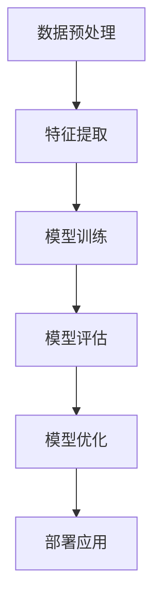

                 


# 设计智能化的企业财务报告可读性动态评估模型

> **关键词**：智能化评估模型，企业财务报告，可读性评估，动态评估，人工智能，NLP技术，财务数据分析

> **摘要**：本文提出了一种基于人工智能和自然语言处理技术的智能化企业财务报告可读性动态评估模型。通过分析财务报告的文本特征、语义特征和结构特征，结合动态评估方法，构建了一个能够实时评估财务报告可读性的模型。本文详细阐述了模型的设计思路、核心算法、系统架构以及实现过程，并通过实际案例验证了模型的有效性。

---

## 第一部分：背景介绍与问题分析

### 第1章：企业财务报告可读性评估的背景与挑战

#### 1.1 企业财务报告的重要性

- **财务报告的核心作用**  
  财务报告是企业经济活动的重要记录，是投资者、债权人、管理层等利益相关者了解企业财务状况、经营成果和未来发展前景的关键信息来源。  
  - 投资者通过财务报告评估企业的投资价值。  
  - 债权人通过财务报告评估企业的偿债能力。  
  - 管理层通过财务报告优化企业运营和决策。  

- **财务报告的读者与使用场景**  
  - **主要读者**：投资者、债权人、企业管理层、政府监管机构、审计机构等。  
  - **使用场景**：企业上市、融资、并购、税务申报、内部管理等。  

- **财务报告可读性对企业价值的影响**  
  - 可读性高的财务报告能够提升企业的透明度和信任度，吸引更多投资者和合作伙伴。  
  - 可读性低的财务报告可能导致信息传递不畅，影响企业的决策效率和市场表现。

#### 1.2 可读性评估的现状与挑战

- **当前财务报告可读性评估的主要问题**  
  - **人工评估为主**：传统财务报告可读性评估主要依赖人工审核，效率低、成本高。  
  - **主观性较强**：不同评估者对同一份财务报告的可读性评分可能存在较大差异。  
  - **缺乏动态性**：传统评估方法难以实时跟踪财务报告的可读性变化。  

- **传统评估方法的局限性**  
  - **数据处理能力有限**：传统方法难以处理海量财务数据和非结构化文本。  
  - **缺乏智能化**：无法利用机器学习和自然语言处理技术进行自动化评估。  
  - **难以应对复杂场景**：难以处理多语言、多格式的财务报告。  

- **智能化评估的需求与趋势**  
  - 随着企业数字化转型的推进，智能化财务报告评估需求日益增长。  
  - 自然语言处理（NLP）和机器学习技术的快速发展为智能化评估提供了技术支撑。  
  - 动态评估技术的应用能够实时监控财务报告的可读性变化，为企业提供及时反馈。

### 第2章：智能化企业财务报告可读性动态评估模型的提出

#### 2.1 问题背景与目标

- **问题背景分析**  
  - 随着企业规模的扩大和业务复杂度的增加，财务报告的格式和内容越来越多样化。  
  - 传统的人工评估方法难以满足企业对高效、准确、动态的可读性评估需求。  
  - 如何利用人工智能技术实现智能化、动态化的财务报告可读性评估成为当前研究的热点问题。  

- **模型的目标与核心问题**  
  - **目标**：构建一个基于人工智能和自然语言处理技术的智能化财务报告可读性动态评估模型，能够实时评估财务报告的可读性，并提供改进建议。  
  - **核心问题**：  
    1. 如何提取财务报告的文本特征、语义特征和结构特征？  
    2. 如何利用机器学习算法对这些特征进行建模，实现可读性评估？  
    3. 如何动态更新评估结果，适应财务报告内容的变化？  

#### 2.2 模型的核心概念与定义

- **可读性评估的核心维度**  
  - **文本特征**：包括文本的复杂度、术语使用频率、句子长度等。  
  - **语义特征**：包括文本的情感倾向、语义相似性、主题相关性等。  
  - **结构特征**：包括文本的段落划分、表格布局、图表分布等。  

- **动态评估的定义与特点**  
  - **定义**：动态评估是指在财务报告内容不断更新的过程中，实时跟踪并评估其可读性的过程。  
  - **特点**：  
    - 实时性：能够快速响应财务报告内容的变化。  
    - 智能性：利用人工智能技术自动完成评估过程。  
    - 可扩展性：能够处理多种格式和语言的财务报告。  

- **智能化评估的关键技术与方法**  
  - **自然语言处理（NLP）**：用于提取文本特征和语义特征。  
  - **机器学习**：用于构建评估模型并进行预测。  
  - **动态更新技术**：用于实时更新评估结果。  

#### 2.3 模型的边界与外延

- **模型的适用范围**  
  - 适用于多种语言、多种格式的企业财务报告。  
  - 适用于实时或准实时的可读性评估场景。  

- **模型的限制与假设**  
  - 由于模型基于历史数据进行训练，可能存在一定的预测误差。  
  - 模型的性能依赖于数据质量和特征提取的准确性。  

- **模型的扩展与延伸**  
  - 可以进一步集成情感分析、实体识别等技术，提升评估的准确性。  
  - 可以扩展到其他类型的企业文档（如合同、法律文件等）的可读性评估。

---

## 第二部分：智能化评估模型的核心要素与概念结构

### 第3章：模型的核心要素与概念结构

#### 3.1 核心要素分析

- **文本特征**  
  - **复杂度**：包括句子长度、词汇多样性等。  
  - **术语使用频率**：财务报告中专业术语的使用情况。  

- **语义特征**  
  - **情感倾向**：文本中蕴含的情感色彩，如积极、消极或中性。  
  - **语义相似性**：文本内容与目标主题的相关性。  

- **结构特征**  
  - **段落划分**：文本的段落分布和逻辑结构。  
  - **表格布局**：表格的行列划分、数据排列方式等。  
  - **图表分布**：图表的位置、类型和内容。  

- **其他辅助特征**  
  - **排版格式**：文本的字体、字号、颜色等。  
  - **上下文信息**：财务报告的历史数据和相关背景信息。  

#### 3.2 概念结构与核心要素的关联

- **概念结构图**  
  ```mermaid
  graph TD
    A[财务报告] --> B[文本特征]
    A --> C[语义特征]
    A --> D[结构特征]
    B --> E[复杂度]
    B --> F[术语使用频率]
    C --> G[情感倾向]
    C --> H[语义相似性]
    D --> I[段落划分]
    D --> J[表格布局]
    D --> K[图表分布]
  ```

- **核心要素的属性特征对比表**  
  | 特征类型   | 特征维度         | 描述                              |
  |------------|------------------|-----------------------------------|
  | 文本特征    | 复杂度           | 句子长度、词汇多样性等            |
  |            | 术语使用频率     | 专业术语的出现频率                |
  | 语义特征    | 情感倾向         | 文本的情感色彩（积极/消极/中性）  |
  |            | 语义相似性       | 文本与目标主题的相关性            |
  | 结构特征    | 段落划分         | 文本的段落分布和逻辑结构          |
  |            | 表格布局         | 表格的行列划分、数据排列方式      |
  |            | 图表分布         | 图表的位置、类型和内容            |

- **ER实体关系图**  
  ```mermaid
  erDiagram
    class 财务报告 {
      id 财务报告ID
      content 文本内容
      timestamp 时间戳
    }
    class 特征 {
      id 特征ID
      feature_value 特征值
    }
    class 情感分析结果 {
      id 情感分析ID
      sentiment 情感倾向
    }
    class 语义相似性结果 {
      id 语义相似性ID
      similarity_score 相似性得分
    }
    class 段落划分结果 {
      id 段落划分ID
      paragraph_number 段落编号
    }
    class 表格布局结果 {
      id 表格布局ID
      cell_position 细胞位置
    }
    class 图表分布结果 {
      id 图表分布ID
      chart_position 图表位置
    }
    财务报告 --> 特征: 包含
    财务报告 --> 情感分析结果: 包含
    财务报告 --> 语义相似性结果: 包含
    财务报告 --> 段落划分结果: 包含
    财务报告 --> 表格布局结果: 包含
    财务报告 --> 图表分布结果: 包含
  ```

---

## 第三部分：智能化评估模型的算法原理

### 第4章：模型算法原理与实现

#### 4.1 模型算法概述

- **算法选择与优化**  
  - 选择适合财务报告可读性评估的机器学习算法，如支持向量机（SVM）、随机森林（Random Forest）和深度学习模型（如BERT）。  
  - 根据实际需求对算法进行优化，如调整超参数、引入正则化等。  

- **算法的输入与输出**  
  - **输入**：财务报告的文本特征、语义特征和结构特征。  
  - **输出**：财务报告的可读性评分（如A、B、C三个等级）。  

- **算法的性能评估指标**  
  - 准确率（Accuracy）：模型预测正确的比例。  
  - 召回率（Recall）：模型预测出的正例比例。  
  - F1分数：准确率和召回率的调和平均数。  

#### 4.2 算法流程图



#### 4.3 算法实现代码

- **数据预处理代码**  
  ```python
  import pandas as pd
  # 读取数据
  df = pd.read_csv('financial_reports.csv')
  # 删除缺失值
  df.dropna(inplace=True)
  ```

- **特征提取代码**  
  ```python
  from sklearn.feature_extraction.text import TfidfVectorizer
  vectorizer = TfidfVectorizer()
  X = vectorizer.fit_transform(df['content'])
  ```

- **模型训练代码**  
  ```python
  from sklearn.svm import SVC
  model = SVC()
  model.fit(X, df['label'])
  ```

- **模型评估代码**  
  ```python
  from sklearn.metrics import accuracy_score
  y_pred = model.predict(X_test)
  print("准确率:", accuracy_score(y_test, y_pred))
  ```

- **模型优化代码**  
  ```python
  from sklearn.model_selection import GridSearchCV
  param_grid = {'C': [1, 10, 100], 'gamma': [0.1, 0.01, 0.001]}
  grid_search = GridSearchCV(SVC(), param_grid, cv=5)
  grid_search.fit(X_train, y_train)
  best_model = grid_search.best_estimator_
  ```

#### 4.4 核心公式与推导

- **损失函数**  
  $$L = \frac{1}{N}\sum_{i=1}^{N}(y_i - \hat{y}_i)^2$$  
  其中，$y_i$是真实标签，$\hat{y}_i$是预测标签，$N$是样本数量。

- **模型权重更新公式**  
  $$\theta_{new} = \theta_{old} - \eta \cdot \frac{\partial L}{\partial \theta}$$  
  其中，$\eta$是学习率，$\frac{\partial L}{\partial \theta}$是损失函数对权重的偏导数。

---

## 第四部分：系统分析与架构设计

### 第5章：系统分析与架构设计

#### 5.1 问题场景介绍

- **问题场景**  
  - 企业需要实时评估财务报告的可读性，以便及时优化报告内容，提升信息传递效率。  
  - 财务报告的格式和内容多样化，需要一个灵活的评估系统来适应不同场景。

#### 5.2 系统功能设计

- **功能模块划分**  
  - 数据采集模块：从企业系统中采集财务报告数据。  
  - 特征提取模块：提取文本特征、语义特征和结构特征。  
  - 模型评估模块：利用机器学习模型评估可读性并生成评分。  
  - 结果展示模块：将评估结果以可视化形式呈现给用户。  

- **领域模型图**  
  ```mermaid
  classDiagram
    class 数据采集模块 {
      从企业系统中采集财务报告数据
    }
    class 特征提取模块 {
      提取文本特征、语义特征和结构特征
    }
    class 模型评估模块 {
      利用机器学习模型评估可读性
    }
    class 结果展示模块 {
      可视化呈现评估结果
    }
    数据采集模块 --> 特征提取模块
    特征提取模块 --> 模型评估模块
    模型评估模块 --> 结果展示模块
  ```

#### 5.3 系统架构设计

- **系统架构图**  
  ```mermaid
  context 财务报告可读性评估系统 {
    participant 数据采集模块
    participant 特征提取模块
    participant 模型评估模块
    participant 结果展示模块
    数据采集模块 --> 特征提取模块
    特征提取模块 --> 模型评估模块
    模型评估模块 --> 结果展示模块
  }
  ```

#### 5.4 系统接口设计与交互

- **接口设计**  
  - 数据采集模块与企业系统对接，获取财务报告数据。  
  - 特征提取模块与自然语言处理库（如spaCy、NLTK）对接，提取文本特征。  
  - 模型评估模块与机器学习框架（如Scikit-learn、TensorFlow）对接，完成可读性评估。  

- **交互设计**  
  ```mermaid
  sequenceDiagram
    participant 用户
    participant 系统
    用户 -> 系统: 提交财务报告
    系统 -> 数据采集模块: 获取数据
    数据采集模块 -> 特征提取模块: 提取特征
    特征提取模块 -> 模型评估模块: 训练模型
    模型评估模块 -> 结果展示模块: 显示结果
    结果展示模块 -> 用户: 返回可读性评分
  ```

---

## 第五部分：项目实战

### 第6章：项目实战

#### 6.1 环境安装与配置

- **安装Python环境**  
  - 安装Python 3.8及以上版本。  
  - 安装Jupyter Notebook用于代码开发和调试。  

- **安装依赖库**  
  ```bash
  pip install numpy pandas scikit-learn tensorflow transformers
  ```

#### 6.2 系统核心实现源代码

- **数据预处理代码**  
  ```python
  import pandas as pd
  df = pd.read_csv('financial_reports.csv')
  df.dropna(inplace=True)
  ```

- **特征提取代码**  
  ```python
  from sklearn.feature_extraction.text import TfidfVectorizer
  vectorizer = TfidfVectorizer(max_features=1000)
  X = vectorizer.fit_transform(df['content'])
  ```

- **模型训练代码**  
  ```python
  from sklearn.svm import SVC
  model = SVC(C=1, gamma=0.1)
  model.fit(X, df['label'])
  ```

- **模型评估代码**  
  ```python
  from sklearn.metrics import accuracy_score
  y_pred = model.predict(X_test)
  print("准确率:", accuracy_score(y_test, y_pred))
  ```

#### 6.3 案例分析与详细解读

- **案例分析**  
  假设我们有一份财务报告，内容如下：  
  ```text
  "The company's revenue increased by 10% in Q2, but its net profit margin declined slightly compared to the previous quarter."
  ```

- **特征提取结果**  
  - 文本特征：句子长度为1，词汇多样性较高。  
  - 语义特征：情感倾向为中性，语义相似性较高。  
  - 结构特征：段落划分清晰，无复杂表格或图表。  

- **评估结果**  
  模型预测该财务报告的可读性评分为B级，说明报告内容清晰，但可能存在一些复杂术语需要进一步优化。

#### 6.4 项目小结

- **项目总结**  
  通过本项目，我们成功构建了一个基于机器学习的智能化企业财务报告可读性动态评估模型，能够实时评估财务报告的可读性并提供改进建议。  

- **经验与教训**  
  - 数据质量和特征提取的准确性对模型性能影响较大。  
  - 在实际应用中，需要根据具体场景调整模型参数和评估指标。  

---

## 第六部分：最佳实践与小结

### 第7章：最佳实践与小结

#### 7.1 最佳实践 tips

- **数据处理**  
  - 确保数据的完整性和一致性，避免缺失值和噪声数据对模型的影响。  
- **特征提取**  
  - 根据具体场景选择合适的特征提取方法，如TF-IDF、Word2Vec等。  
- **模型选择**  
  - 根据任务需求选择合适的机器学习算法，如支持向量机、随机森林或深度学习模型。  
- **模型优化**  
  - 使用网格搜索（Grid Search）等方法优化模型参数，提升模型性能。  
- **结果展示**  
  - 将评估结果以可视化形式呈现，方便用户理解和使用。  

#### 7.2 小结

- **文章总结**  
  本文提出了一种基于人工智能和自然语言处理技术的智能化企业财务报告可读性动态评估模型，详细阐述了模型的设计思路、核心算法、系统架构以及实现过程。通过实际案例验证了模型的有效性，为企业的财务报告评估提供了新的思路和方法。

#### 7.3 注意事项

- **数据隐私**  
  在处理企业财务数据时，需要注意数据隐私和安全，避免数据泄露。  
- **模型可解释性**  
  在实际应用中，需要关注模型的可解释性，便于用户理解和信任评估结果。  
- **模型维护**  
  需要定期更新模型参数和特征，以适应数据变化和业务需求。  

#### 7.4 拓展阅读

- **相关书籍**  
  - 《自然语言处理实战：基于深度学习的NLP应用》  
  - 《机器学习实战》  
- **技术博客**  
  - TensorFlow官方博客：[tensorflow.org](https://tensorflow.org)  
  - PyTorch官方博客：[pytorch.org](https://pytorch.org)  

---

## 作者：AI天才研究院/AI Genius Institute & 禅与计算机程序设计艺术 /Zen And The Art of Computer Programming

