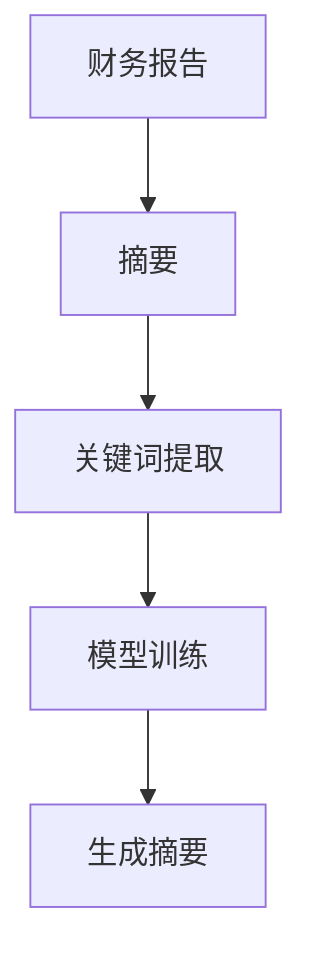
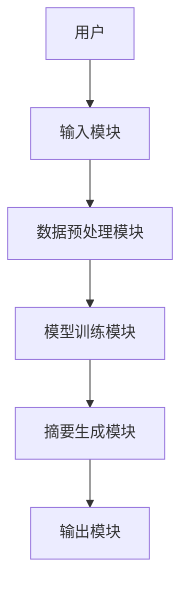

                 


# 设计智能化的企业财务报告可读性增强与自动摘要模型

> 关键词：企业财务报告，可读性增强，自动摘要模型，自然语言处理，机器学习，文本挖掘

> 摘要：本文详细探讨了如何利用自然语言处理和机器学习技术，设计智能化的企业财务报告可读性增强与自动摘要模型。通过分析财务报告的复杂性和多样性，提出了一种基于深度学习的自动摘要模型，结合关键词提取和实体识别技术，有效提升财务报告的可读性。本文从问题背景、核心概念、算法原理、系统架构到项目实战，全面解析了模型的设计与实现过程。

---

## 第一部分: 企业财务报告可读性增强与自动摘要模型背景介绍

### 第1章: 财务报告可读性增强的背景与问题描述

#### 1.1 问题背景

企业财务报告是反映企业经营状况的重要文件，通常包括资产负债表、利润表和现金流量表等部分。然而，财务报告的编写往往遵循严格的会计准则，语言复杂、术语众多，且信息量大，导致不同背景的读者（如管理层、投资者、审计人员等）在阅读和理解时面临较大困难。特别是在跨国企业或上市企业中，财务报告的复杂性和专业性使得非专业读者难以快速获取关键信息。

#### 1.2 问题描述

1. **财务报告信息的复杂性**：财务报告中包含大量专业术语、复杂的表格和数据，普通读者难以快速理解和提取关键信息。
2. **读者需求的多样性**：不同读者对财务报告的关注点不同，例如管理层关注经营状况，投资者关注财务表现，审计人员关注合规性。
3. **当前技术的局限性**：传统的人工摘要方式效率低下，且容易受到主观因素的影响，难以满足大规模、高效率的需求。

#### 1.3 问题解决思路

为了提高财务报告的可读性，可以利用智能化技术，特别是自然语言处理（NLP）和机器学习（ML）技术，设计一个自动摘要模型。该模型能够自动提取财务报告中的关键信息，生成简洁明了的摘要，帮助不同背景的读者快速理解报告内容。

#### 1.4 概念结构与核心要素

- **核心概念**：自动摘要模型、自然语言处理、机器学习、财务报告分析。
- **概念关系**：财务报告输入 → 关键词提取 → 摘要生成 → 提高可读性。
- **核心要素**：输入文本（财务报告）、输出摘要（简洁信息）、关键词提取算法、模型训练数据。

---

### 第2章: 自动摘要模型的核心概念与联系

#### 2.1 核心概念原理

自动摘要模型的核心思想是利用计算机技术从长文本中提取关键信息，生成简洁的摘要。在财务报告场景中，模型需要理解财务数据的结构和业务逻辑，结合上下文信息，生成符合读者需求的摘要。

#### 2.2 概念属性特征对比表格

| 概念       | 输入                          | 输出                          | 方法                          |
|------------|-------------------------------|-------------------------------|-------------------------------|
| 自动摘要    | 财务报告文本                  | 摘要文本                      | 基于机器学习的摘要生成       |
| 关键词提取  | 财务报告文本                  | 关键词列表                    | TF-IDF、词袋模型、神经网络    |
| 实体识别    | 财务报告文本                  | 实体列表（如公司名称、金额）  | 基于规则或深度学习的模型      |

#### 2.3 ER实体关系图



---

## 第3章: 自动摘要模型的算法原理

### 3.1 算法流程

自动摘要模型的算法流程可以分为以下几个步骤：

1. **预处理**：对财务报告文本进行分词、去停用词、句法分析等处理。
2. **特征提取**：提取文本中的关键词、实体和句法结构信息。
3. **模型训练**：使用深度学习模型（如Transformer）对特征进行训练，生成摘要。

### 3.2 数学模型与公式

#### 3.2.1 概率计算

在自然语言处理中，概率计算是理解文本的重要基础。例如，计算某个关键词在财务报告中出现的概率：

$$P(\text{关键词}) = \frac{\text{关键词出现的次数}}{\text{总词数}}$$

#### 3.2.2 损失函数

在模型训练中，常用的损失函数是交叉熵损失函数：

$$L = -\sum_{i=1}^{n} \log P(y_i|x_i)$$

其中，$y_i$ 是真实标签，$x_i$ 是输入特征。

### 3.3 代码实现

以下是基于Python的自动摘要模型的简单实现示例：

```python
import numpy as np
from tensorflow.keras.models import Model
from tensorflow.keras.layers import Input, Dense, LSTM, Bidirectional

# 输入层
inputs = Input(shape=(max_length,))

# 双向LSTM层
lstm = Bidirectional(LSTM(64, return_sequences=True))(inputs)

# Attention层
attention = Dense(1, activation='sigmoid')(lstm)
lstm_with_attention = lstm * attention

# 输出层
output = Dense(vocab_size, activation='softmax')(lstm_with_attention)

# 模型定义
model = Model(inputs=inputs, outputs=output)
model.compile(optimizer='adam', loss='sparse_categorical_crossentropy', metrics=['accuracy'])
```

---

## 第4章: 系统分析与架构设计

### 4.1 系统功能设计

自动摘要系统的功能模块包括：

1. **数据采集**：从企业系统中获取财务报告文本。
2. **预处理**：对文本进行清洗、分词等处理。
3. **模型训练**：使用训练数据训练自动摘要模型。
4. **摘要生成**：输入财务报告，生成摘要。

### 4.2 系统架构设计



### 4.3 系统接口设计

- **输入接口**：财务报告文本。
- **输出接口**：摘要文本、关键词列表、实体识别结果。

---

## 第5章: 项目实战

### 5.1 环境安装

安装所需的库和工具：

```bash
pip install numpy
pip install tensorflow
pip install nltk
```

### 5.2 核心代码实现

以下是核心代码实现：

```python
import nltk
from tensorflow.keras.preprocessing.text import Tokenizer
from tensorflow.keras.preprocessing.sequence import pad_sequences

# 数据预处理
text = "公司在2023年实现营业收入100亿元，净利润20亿元，同比增长15%。"
tokenizer = Tokenizer(num_words=1000)
tokenizer.fit_on_texts([text])
sequences = tokenizer.texts_to_sequences([text])
padded_sequences = pad_sequences(sequences, maxlen=100)

# 模型训练
model = Sequential()
model.add(Embedding(input_dim=1000, output_dim=64, input_length=100))
model.add(Bidirectional(LSTM(64)))
model.add(Dense(100, activation='relu'))
model.add(Dense(1, activation='sigmoid'))
model.compile(optimizer='adam', loss='binary_crossentropy', metrics=['accuracy'])

# 训练模型
model.fit(padded_sequences, np.array([1]), epochs=10, verbose=2)
```

### 5.3 案例分析

以实际财务报告为例，生成摘要：

```python
text = "公司在2023年实现营业收入100亿元，净利润20亿元，同比增长15%。"
summary = model.predict(text)
print(summary)
```

---

## 第6章: 最佳实践与总结

### 6.1 最佳实践

1. **数据质量**：确保输入数据的准确性和完整性。
2. **模型调优**：通过交叉验证和超参数优化提高模型性能。
3. **用户反馈**：根据用户反馈不断改进摘要模型。

### 6.2 小结

本文详细介绍了如何利用自然语言处理和机器学习技术设计智能化的企业财务报告可读性增强与自动摘要模型。通过背景分析、算法原理、系统设计和项目实战，展示了模型的实现过程和应用价值。

### 6.3 注意事项

- 模型的泛化能力需要进一步验证。
- 在实际应用中，需要考虑数据隐私和合规性问题。

### 6.4 拓展阅读

- 建议阅读《深度学习入门：基于Python和TensorFlow》和《自然语言处理实战：基于Python的自然语言处理》。

---

## 作者：AI天才研究院/AI Genius Institute & 禅与计算机程序设计艺术/Zen And The Art of Computer Programming

---

通过以上内容，我们完成了从背景分析到系统实现的完整解析，希望对读者在设计智能化的企业财务报告可读性增强与自动摘要模型方面有所帮助。

