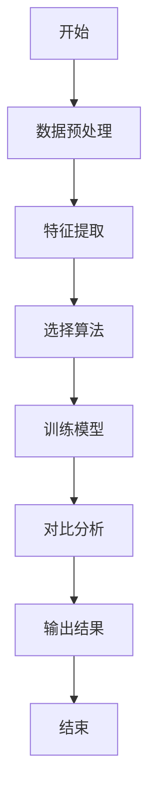
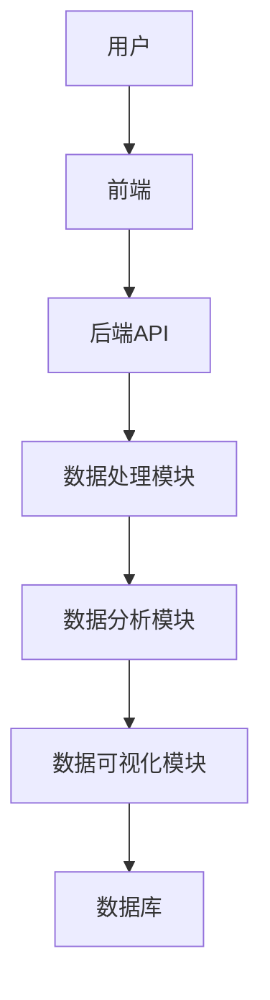
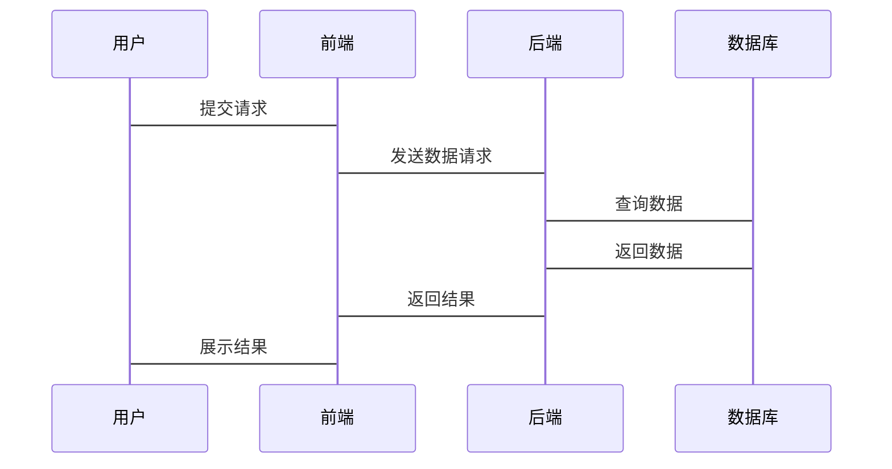

                 


# 设计智能化的企业财务报表同行业动态对比分析系统

> 关键词：智能化财务报表，同行业动态对比，机器学习，系统架构，数据分析

> 摘要：本文旨在设计一个智能化的企业财务报表同行业动态对比分析系统。通过结合机器学习、数据分析和系统架构设计，系统将实现对企业财务数据的智能处理、行业动态的实时对比以及财务状况的深度分析。本文从问题背景、核心概念、算法原理、系统架构到项目实战，详细阐述了系统的实现过程和关键点。

---

# 第一部分: 背景与概述

## 第1章: 企业财务报表分析的智能化需求

### 1.1 问题背景

#### 1.1.1 传统财务报表分析的局限性
传统的财务报表分析主要依赖人工处理，存在以下问题：
- 数据量大：企业财务数据通常包含大量历史数据，人工处理效率低下。
- 数据复杂：财务数据涉及多个科目和复杂的计算，人工分析容易出错。
- 行业动态变化快：行业动态对比需要实时或定期更新数据，人工分析难以满足时效性要求。

#### 1.1.2 行业动态对比分析的重要性
行业动态对比分析是企业财务管理的重要组成部分，能够帮助企业：
- 发现行业趋势：通过对比分析，企业可以发现行业内的发展趋势和潜在风险。
- 优化财务管理：基于行业数据，企业可以优化自身的财务策略，提升竞争力。
- 提高决策效率：实时的行业动态对比分析能够为管理层提供更高效的数据支持。

#### 1.1.3 智能化技术在财务分析中的应用潜力
随着人工智能和大数据技术的发展，智能化财务报表分析成为可能：
- 数据处理自动化：利用机器学习和自然语言处理技术，实现财务数据的自动提取和处理。
- 行业动态实时对比：通过爬虫技术获取行业数据，并结合机器学习模型，实现动态对比。
- 智能化决策支持：基于分析结果，系统可以提供智能化的财务建议，辅助企业决策。

### 1.2 问题描述

#### 1.2.1 财务数据的复杂性
企业财务数据通常包含多个维度，如收入、支出、利润、资产负债等，这些数据需要进行复杂的计算和分析。

#### 1.2.2 行业动态对比的挑战
行业动态对比需要实时获取行业数据，数据来源多样，格式复杂，且需要与企业的财务数据进行对比，存在数据清洗和处理的挑战。

#### 1.2.3 现有解决方案的不足
现有的财务报表分析工具多为静态分析，缺乏智能化和动态对比的功能，无法满足企业对实时行业动态的需求。

### 1.3 解决方案概述

#### 1.3.1 智能化财务报表分析的必要性
智能化财务报表分析能够提高数据处理效率，降低人工错误率，并提供更精准的分析结果。

#### 1.3.2 同行业动态对比的核心价值
通过实时对比行业数据，企业可以更好地了解自身财务状况在行业中的位置，从而优化财务管理策略。

#### 1.3.3 系统设计的目标与范围
- 目标：设计一个智能化的企业财务报表同行业动态对比分析系统。
- 范围：涵盖财务数据的采集、处理、分析、对比和可视化。

### 1.4 边界与外延

#### 1.4.1 系统功能的边界
- 数据采集：仅限于企业内部财务数据和公开行业数据。
- 分析功能：仅限于财务报表的分析和行业动态对比。
- 不包含：企业内部业务系统的数据集成。

#### 1.4.2 相关领域的外延
- 数据源：包括企业内部财务系统和公开行业数据库。
- 数据分析：结合机器学习算法，提供深度分析功能。
- 数据可视化：提供直观的对比图表，便于用户理解。

#### 1.4.3 与现有系统的区别与联系
- 区别：智能化、动态对比是现有系统不具备的功能。
- 联系：系统可以在现有财务管理系统的基础上进行扩展。

### 1.5 概念结构与核心要素

#### 1.5.1 核心概念的定义
- 财务数据：企业的收入、支出、利润、资产负债等数据。
- 行业动态：行业内企业的财务数据和市场动态。
- 对比分析：将企业的财务数据与行业数据进行对比，发现差异和趋势。

#### 1.5.2 核心要素的组成
- 数据采集模块：负责采集企业财务数据和行业数据。
- 数据处理模块：对采集的数据进行清洗、转换和标准化处理。
- 数据分析模块：利用机器学习算法进行深度分析和对比。
- 数据可视化模块：将分析结果以图表形式展示给用户。

---

# 第二部分: 核心概念与联系

## 第2章: 核心概念与系统架构

### 2.1 核心概念原理

#### 2.1.1 财务数据处理
- 数据清洗：去除无效数据和异常值。
- 数据转换：将数据转换为适合分析的格式。
- 数据标准化：统一数据的单位和格式。

#### 2.1.2 行业动态分析
- 数据采集：通过爬虫技术获取行业数据。
- 数据预处理：清洗和标准化行业数据。
- 动态对比：将企业数据与行业数据进行实时对比。

#### 2.1.3 对比分析模型
- 对比指标：如收入增长率、利润率、资产负债率等。
- 对比方法：基于机器学习的相似性度量和聚类分析。

### 2.2 核心概念属性对比表

| 概念       | 属性1         | 属性2         | 属性3         |
|------------|---------------|---------------|---------------|
| 财务数据处理 | 数据清洗      | 数据转换      | 数据标准化    |
| 行业动态分析 | 数据采集      | 数据预处理    | 动态对比       |
| 对比分析模型 | 对比指标      | 对比方法      | 对比结果展示   |

### 2.3 ER实体关系图架构

```mermaid
erd
entity 财务数据 {
  key id: 数据ID
  name 数据名称
  value 数据值
}

entity 行业数据 {
  key id: 数据ID
  name 数据名称
  value 数据值
}

entity 对比分析结果 {
  key id: 分析ID
  name 分析指标
  value 分析结果
}

relation 财务数据与行业数据对比 {
  财务数据 --> 行业数据: 对比分析
  财务数据 --> 对比分析结果: 输出结果
  行业数据 --> 对比分析结果: 输出结果
}
```

---

## 第3章: 算法原理讲解

### 3.1 算法原理

#### 3.1.1 数据预处理
- 数据清洗：去除无效数据和异常值。
- 数据转换：将数据转换为适合分析的格式。
- 数据标准化：统一数据的单位和格式。

#### 3.1.2 特征提取
- 选择关键特征：如收入、利润、资产负债率等。
- 特征工程：对特征进行归一化处理。

#### 3.1.3 对比分析模型
- 使用机器学习算法进行对比分析，如线性回归、聚类分析等。

### 3.2 算法实现

#### 3.2.1 算法流程图



#### 3.2.2 代码实现

```python
# 数据预处理
import pandas as pd
import numpy as np

data = pd.read_csv('financial_data.csv')
data = data.dropna()  # 去除无效数据
data = (data - data.mean()) / data.std()  # 标准化处理

# 特征提取
features = ['收入', '利润', '资产负债率']
selected_data = data[features]

# 对比分析模型
from sklearn.linear_model import LinearRegression

model = LinearRegression()
model.fit(selected_data, data['行业平均值'])

# 对比分析结果
预测结果 = model.predict(selected_data)
```

#### 3.2.3 数学模型和公式

线性回归模型的数学公式为：
$$ y = \beta_0 + \beta_1x + \epsilon $$

其中：
- \( y \) 是预测值
- \( x \) 是输入特征
- \( \beta_0 \) 是截距
- \( \beta_1 \) 是回归系数
- \( \epsilon \) 是误差项

---

## 第4章: 系统分析与架构设计方案

### 4.1 问题场景介绍

#### 4.1.1 系统功能需求
- 数据采集：采集企业财务数据和行业数据。
- 数据处理：清洗、转换和标准化数据。
- 数据分析：利用机器学习算法进行对比分析。
- 数据可视化：将分析结果以图表形式展示。

#### 4.1.2 系统性能需求
- 数据处理速度：快速处理大量数据。
- 分析效率：高效的机器学习算法实现快速对比分析。

### 4.2 系统架构设计

#### 4.2.1 系统架构图



#### 4.2.2 系统接口设计
- 前端接口：接收用户输入和展示结果。
- 后端接口：处理数据和调用分析模块。
- 数据库接口：存储和检索数据。

#### 4.2.3 系统交互流程图



---

## 第5章: 项目实战

### 5.1 环境安装

```bash
pip install pandas numpy scikit-learn matplotlib
```

### 5.2 核心代码实现

```python
import pandas as pd
import numpy as np
from sklearn.linear_model import LinearRegression
import matplotlib.pyplot as plt

# 数据预处理
data = pd.read_csv('financial_data.csv')
data = data.dropna()
data = (data - data.mean()) / data.std()

# 特征提取
features = ['收入', '利润', '资产负债率']
selected_data = data[features]

# 对比分析模型
model = LinearRegression()
model.fit(selected_data, data['行业平均值'])

# 对比分析结果
预测结果 = model.predict(selected_data)

# 数据可视化
plt.scatter(data['收入'], data['行业平均值'], color='blue')
plt.plot(data['收入'], 预测结果, color='red')
plt.xlabel('收入')
plt.ylabel('行业平均值')
plt.title('收入与行业平均值对比分析')
plt.show()
```

### 5.3 代码解读与分析

- 数据预处理：清洗数据并进行标准化处理。
- 特征提取：选择关键特征并进行归一化处理。
- 对比分析模型：使用线性回归算法进行预测。
- 数据可视化：将实际值和预测值以散点图形式展示。

### 5.4 实际案例分析

假设我们有一个企业的财务数据和行业数据，通过上述代码进行处理和分析，可以得到企业的收入与行业平均值的对比结果，帮助企业管理者了解自身收入在行业中的位置。

### 5.5 项目小结

通过本项目，我们实现了一个智能化的企业财务报表同行业动态对比分析系统，能够帮助企业快速获取行业数据，进行深度分析，并以直观的方式展示分析结果。

---

# 第六部分: 最佳实践

## 第6章: 最佳实践、小结、注意事项和拓展阅读

### 6.1 最佳实践

#### 6.1.1 数据处理
- 数据清洗和标准化是确保分析结果准确性的关键步骤。
- 特征选择和工程处理可以提高模型的性能。

#### 6.1.2 系统设计
- 系统架构设计要充分考虑扩展性和可维护性。
- 接口设计要简洁明了，便于后续开发和维护。

### 6.2 小结

本文详细阐述了设计智能化的企业财务报表同行业动态对比分析系统的背景、核心概念、算法原理、系统架构和项目实战。通过本系统的实现，企业可以更高效地进行财务分析和行业动态对比，提升财务管理的智能化水平。

### 6.3 注意事项

- 数据隐私和安全：在处理企业财务数据时，必须注意数据的安全性和隐私性。
- 系统性能优化：对于大量数据的处理和分析，需要优化算法和系统架构，确保系统的高效运行。
- 模型可解释性：选择可解释性较强的算法，方便用户理解和使用分析结果。

### 6.4 拓展阅读

- 《Python机器学习实战》
- 《数据可视化与分析》
- 《企业财务管理与数据分析》

---

# 作者

作者：AI天才研究院 & 禅与计算机程序设计艺术

