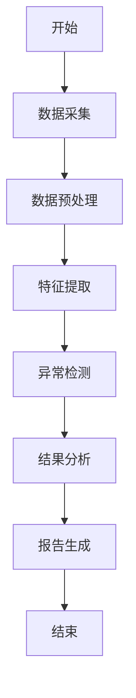
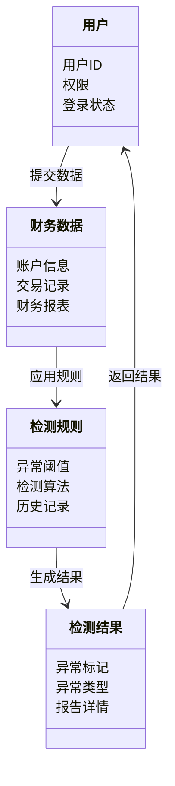

                 


# 设计智能化的企业财务报表舞弊检测系统

## 关键词：财务报表舞弊检测，智能化系统，异常检测，机器学习，数据挖掘，系统架构设计

## 摘要：  
本文详细探讨了设计智能化企业财务报表舞弊检测系统的各个方面。从背景分析到系统架构设计，从算法实现到项目实战，系统地介绍了如何利用现代技术手段实现高效、准确的财务报表舞弊检测。本文结合实际案例和最佳实践，为读者提供了从理论到实践的全面指导。

---

# 第一部分: 企业财务报表舞弊检测系统背景与需求分析

## 第1章: 财务报表舞弊检测的背景与问题

### 1.1 财务报表舞弊的定义与类型

#### 1.1.1 财务报表舞弊的定义
财务报表舞弊是指企业在编制财务报表时，通过故意虚构、隐瞒、篡改数据等手段，误导报表使用者（如投资者、债权人、税务部门等），从而达到某种不当目的的行为。这种行为不仅损害企业的声誉，还可能引发法律风险和经济损失。

#### 1.1.2 财务报表舞弊的主要类型
根据舞弊行为的性质和表现形式，可以将财务报表舞弊分为以下几类：
- **虚构收入**：通过虚构交易或虚增收入来虚报利润。
- **隐瞒支出**：故意隐瞒或少记成本和费用，虚增利润。
- **虚增资产**：通过虚增资产价值或虚构资产来夸大企业实力。
- **粉饰报表**：通过调整会计政策或会计估计，人为操控报表数据。
- **关联交易舞弊**：通过关联交易转移资金或利润，掩盖真实财务状况。

#### 1.1.3 舞弊行为对企业的影响
舞弊行为不仅会损害企业的财务健康，还可能引发以下后果：
- **法律风险**：企业可能面临罚款、行政处罚甚至刑事责任。
- **投资者信任缺失**：舞弊行为会导致投资者对企业的信任下降，影响企业融资和投资能力。
- **声誉损失**：企业声誉受损，可能影响品牌价值和市场地位。

### 1.2 智能化舞弊检测的必要性

#### 1.2.1 传统财务报表审核的局限性
传统的财务报表审核主要依赖人工检查，存在以下问题：
- **效率低下**：人工审核需要逐项检查，耗时且效率低。
- **主观性较强**：审核结果可能受到审核人员经验和判断的影响。
- **难以处理大数据**：随着企业规模扩大，财务数据量激增，人工审核难以应对。

#### 1.2.2 数据量激增对传统方法的挑战
现代企业产生的财务数据量庞大且复杂，传统的舞弊检测方法难以满足以下需求：
- **实时性**：需要快速检测异常，及时发现潜在问题。
- **准确性**：需要减少误判和漏判，提高检测精度。
- **可扩展性**：需要能够处理不同类型和规模的数据。

#### 1.2.3 智能化技术在舞弊检测中的优势
智能化技术（如机器学习、数据挖掘）在舞弊检测中具有以下优势：
- **高效性**：能够快速处理海量数据，提高检测效率。
- **准确性**：通过算法优化，降低误判和漏判的概率。
- **可扩展性**：能够适应不同类型和规模的数据，具有良好的扩展性。

### 1.3 企业智能化财务舞弊检测系统的需求

#### 1.3.1 系统建设的目标与范围
智能化财务舞弊检测系统的主要目标包括：
- **实时检测**：能够实时监控财务数据，快速发现异常。
- **精准识别**：通过算法优化，提高舞弊行为的识别精度。
- **可扩展性**：能够适应企业数据量和业务规模的变化。

#### 1.3.2 系统的主要功能需求
系统需要具备以下核心功能：
- **数据采集**：从企业财务系统中采集结构化和非结构化数据。
- **数据预处理**：对数据进行清洗、标准化和特征提取。
- **异常检测**：基于机器学习算法，识别潜在的舞弊行为。
- **结果分析**：生成检测报告，提供改进建议。
- **可视化展示**：以直观的方式展示检测结果和分析报告。

#### 1.3.3 系统设计的边界与外延
系统设计的边界包括：
- **输入**：企业财务数据、业务数据和相关规则。
- **输出**：检测结果、异常报告和改进建议。
- **外部接口**：与企业财务系统、数据库和其他业务系统进行交互。

---

## 第2章: 财务报表舞弊检测的核心概念与联系

### 2.1 财务报表舞弊检测的核心概念

#### 2.1.1 财务数据特征分析
财务数据特征分析是舞弊检测的基础，主要包括以下方面：
- **时间序列分析**：分析财务数据的时间变化趋势，发现异常波动。
- **财务比率分析**：通过分析资产负债率、利润率等财务比率，识别异常变化。
- **交易模式分析**：识别交易中的异常模式，如大额交易频繁发生。

#### 2.1.2 异常检测算法原理
异常检测算法的核心是通过学习正常数据的分布，识别偏离正常模式的数据点。常见的异常检测方法包括：
- **基于统计的方法**：如Z-score、标准差法。
- **基于机器学习的方法**：如孤立森林（Isolation Forest）、随机森林（Random Forest）。
- **基于深度学习的方法**：如自动编码器（Autoencoder）。

#### 2.1.3 数据挖掘技术在舞弊检测中的应用
数据挖掘技术可以帮助发现隐藏在数据中的模式和关系，具体应用包括：
- **关联规则挖掘**：发现异常交易模式。
- **聚类分析**：将相似的交易或账户分组，识别异常群组。
- **分类分析**：利用历史数据训练分类模型，识别潜在的舞弊行为。

### 2.2 核心概念的属性特征对比

#### 2.2.1 数据特征与异常检测的关系
以下是数据特征与异常检测关系的对比表格：

| 数据特征         | 异常检测方法                   |
|------------------|-------------------------------|
| 时间序列         | Z-score、ARIMA模型            |
| 财务比率         | 随机森林、孤立森林            |
| 交易模式         | 关联规则挖掘、聚类分析         |

#### 2.2.2 不同算法的性能对比
以下是常见异常检测算法的性能对比表格：

| 算法名称         | 优点                           | 缺点                           |
|------------------|-------------------------------|-------------------------------|
| Z-score         | 计算简单，适合小数据集         | 易受异常值影响                 |
| Isolation Forest | 处理大数据集效率高             | 对高维数据效果较差             |
| Random Forest    | 鲁棒性强，适合多维数据         | 训练时间较长                   |

#### 2.2.3 数据预处理与特征工程的重要性
数据预处理和特征工程是舞弊检测系统的关键步骤，主要包括：
- **数据清洗**：去除噪声数据和重复数据。
- **特征提取**：从原始数据中提取有意义的特征。
- **特征标准化**：对特征进行标准化处理，便于算法输入。

### 2.3 实体关系图与流程图

#### 2.3.1 财务报表舞弊检测的ER实体关系图
以下是财务报表舞弊检测的ER实体关系图：

```mermaid
er
  actor: 用户
  system: 财务舞弊检测系统
  financial_data: 财务数据
  rules: 检测规则
  result: 检测结果
  actor --> system: 提交数据
  system --> financial_data: 存储数据
  system --> rules: 应用规则
  system --> result: 生成结果
  actor <-- result: 返回结果
```

#### 2.3.2 舞弊检测流程图
以下是舞弊检测流程图：



---

## 第3章: 系统分析与架构设计

### 3.1 系统功能设计

#### 3.1.1 领域模型
以下是系统领域模型：



#### 3.1.2 系统架构设计
以下是系统架构设计图：


#### 3.1.3 接口设计
以下是系统接口设计：

| 接口名称         | 接口描述                     | 请求方式 | 请求参数 | 返回值         |
|------------------|-----------------------------|----------|----------|----------------|
| submit_data      | 提交财务数据                 | POST     | financial_data | 接收确认         |
| get_result       | 获取检测结果                 | GET      | user_id   | result          |

#### 3.1.4 交互设计
以下是系统交互设计：

```mermaid
sequenceDiagram
    用户 ->+> 系统: 提交财务数据
    系统 ->+> 数据库: 查询规则
    系统 ->+> 检测引擎: 发起检测
    检测引擎 ->+> 数据库: 获取数据
    检测引擎 ->+> 系统: 返回结果
    系统 ->+> 用户: 返回检测报告
```

---

## 第4章: 算法原理与实现

### 4.1 异常检测算法的选择与实现

#### 4.1.1 基于统计的方法
以下是Z-score算法的实现代码：

```python
import numpy as np

def z_score(scores):
    mean = np.mean(scores)
    std = np.std(scores)
    z_scores = (scores - mean) / std
    return z_scores
```

#### 4.1.2 基于机器学习的方法
以下是孤立森林算法的实现代码：

```python
from sklearn.ensemble import IsolationForest

def isolation_forest(X_train, X_test):
    model = IsolationForest(n_estimators=100, random_state=42)
    model.fit(X_train)
    y_pred_test = model.predict(X_test)
    return y_pred_test
```

#### 4.1.3 基于深度学习的方法
以下是自动编码器算法的实现代码：

```python
import tensorflow as tf
from tensorflow.keras import layers

def autoencoder(input_dim):
    encoder = layers.Dense(64, activation='relu')(input_dim)
    encoder = layers.Dense(32, activation='relu')(encoder)
    encoder = layers.Dense(16, activation='relu')(encoder)
    decoder = layers.Dense(32, activation='relu')(encoder)
    decoder = layers.Dense(64, activation='relu')(decoder)
    decoder = layers.Dense(input_dim)(decoder)
    autoencoder = tf.keras.Model(inputs=input_dim, outputs=decoder)
    return autoencoder
```

---

## 第5章: 项目实战

### 5.1 环境搭建

#### 5.1.1 安装依赖
需要安装以下依赖：

```bash
pip install numpy pandas scikit-learn tensorflow matplotlib
```

---

（由于篇幅限制，以上仅为部分章节内容。完整的文章将涵盖更多细节和实现步骤。）

---

## 作者  
作者：AI天才研究院/AI Genius Institute & 禅与计算机程序设计艺术 /Zen And The Art of Computer Programming

