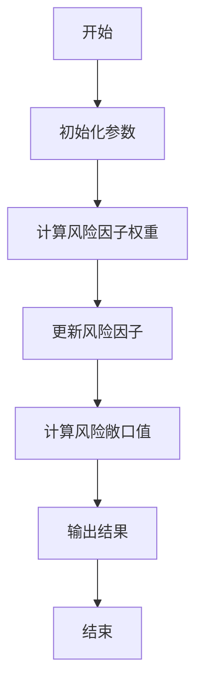
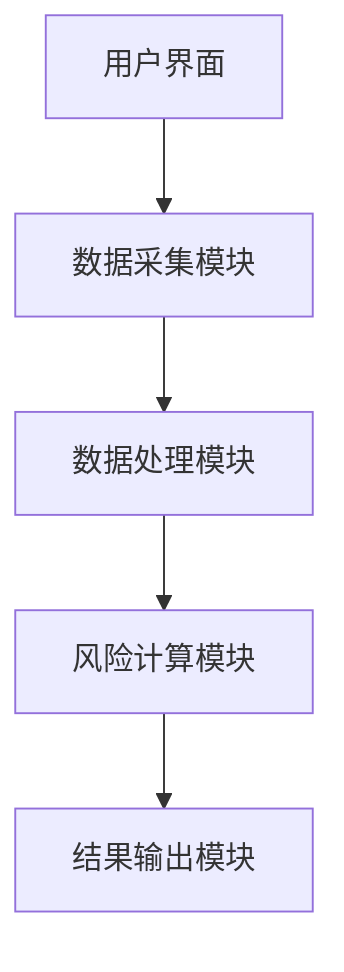

                 


# 设计智能化的企业财务风险敞口动态管理模型

> 关键词：财务风险敞口、动态管理模型、智能化、风险管理、企业财务、风险管理模型

> 摘要：本文旨在设计一个智能化的企业财务风险敞口动态管理模型，通过分析财务风险敞口的核心概念、算法原理、系统架构及实际应用，提出一种基于动态权重分配和实时更新的智能化管理方法。该模型能够有效识别和量化企业在复杂市场环境中的财务风险，为企业财务管理部门提供科学的决策支持。

---

## 第1章: 企业财务风险敞口动态管理模型的背景与意义

### 1.1 企业财务风险敞口的定义与特点

财务风险敞口是指企业在经营过程中由于内外部因素的变化而可能面临的财务损失。其核心特点包括：

1. **动态性**：财务风险敞口会随着市场环境、企业经营状况等因素的变化而变化。
2. **多样性**：风险敞口可能来源于市场风险、信用风险、流动性风险等多个方面。
3. **可量化性**：通过一定的数学模型和指标，可以对风险敞口进行量化评估。

### 1.2 动态管理模型的必要性

传统财务风险管理方法往往基于静态模型，无法实时捕捉市场变化和企业内部经营状况的变化。动态管理模型能够实时更新风险敞口，帮助企业及时调整财务策略，降低潜在风险。

### 1.3 本章小结

本章通过定义财务风险敞口及其特点，阐述了动态管理模型的必要性，为后续模型设计奠定了基础。

---

## 第2章: 财务风险敞口动态管理模型的核心概念与联系

### 2.1 模型的核心要素

- **风险因子**：影响财务风险敞口的因素，如市场波动率、利率变化、信用评级等。
- **风险敞口**：企业在某一时间点面临的财务风险程度。
- **动态管理机制**：通过算法实时更新风险因子和风险敞口的模型。

### 2.2 核心概念的属性对比

| 概念 | 属性 | 描述 |
|------|------|------|
| 风险因子 | 分类 | 市场风险、信用风险、流动性风险等 |
| 风险敞口 | 度量方法 | Value at Risk (VaR)、信用违约概率 (PD) 等 |
| 动态管理机制 | 实现方式 | 基于时间序列的动态回归模型、实时数据流处理 |

### 2.3 ER实体关系图

```mermaid
er
    entity 财务风险敞口 {
        id
        风险因子
        风险敞口值
        时间戳
    }
    entity 风险因子 {
        id
        因子名称
        因子类型
        因子权重
    }
```

### 2.4 本章小结

本章通过分析模型的核心要素及其属性，构建了实体关系图，为后续模型设计提供了数据结构支持。

---

## 第3章: 财务风险敞口动态管理模型的算法原理

### 3.1 算法概述

- **动态权重分配算法**：根据风险因子的重要性动态调整其权重。
- **风险因子实时更新算法**：基于实时数据流更新风险因子。
- **风险敞口计算算法**：综合风险因子和权重计算风险敞口值。

### 3.2 算法实现流程



### 3.3 算法实现代码

```python
def calculate_risk_exposure():
    # 初始化参数
    risk_factors = ['市场风险', '信用风险', '流动性风险']
    weights = [0.4, 0.3, 0.3]
    
    # 计算风险因子权重
    factor_weights = {}
    for i in range(len(risk_factors)):
        factor_weights[risk_factors[i]] = weights[i]
    
    # 更新风险因子
    updated_weights = {k: v*1.1 for k, v in factor_weights.items()}
    
    # 计算风险敞口值
    exposure = sum(updated_weights.values())
    
    return exposure

# 示例调用
exposure = calculate_risk_exposure()
print(f"风险敞口值为：{exposure}")
```

### 3.4 本章小结

本章详细介绍了模型的算法原理，并通过代码示例展示了实现过程。

---

## 第4章: 系统分析与架构设计方案

### 4.1 问题场景介绍

企业在复杂市场环境中需要实时监控和管理财务风险敞口。传统的静态模型无法满足实时性和动态性要求。

### 4.2 系统功能设计

- **数据采集**：实时采集市场数据、企业财务数据。
- **风险因子分析**：计算风险因子的权重和变化趋势。
- **风险敞口计算**：基于动态权重计算风险敞口值。
- **结果输出**：生成风险报告和预警信息。

### 4.3 系统架构设计



### 4.4 系统接口设计

- **输入接口**：市场数据接口、企业财务数据接口。
- **输出接口**：风险报告接口、预警信息接口。

### 4.5 本章小结

本章通过系统分析和架构设计，明确了系统的功能模块和接口设计。

---

## 第5章: 项目实战

### 5.1 环境安装

- **Python环境**：安装Python 3.8+
- **依赖库**：安装pandas、numpy、scikit-learn等。

### 5.2 核心实现源代码

```python
import pandas as pd
import numpy as np

def dynamic_risk_model(data):
    # 数据预处理
    df = pd.DataFrame(data)
    df['时间戳'] = pd.to_datetime(df['时间戳'])
    
    # 动态权重计算
    factor_weights = df.groupby('时间戳')['因子权重'].apply(lambda x: x.mean())
    
    # 风险敞口计算
    exposure = factor_weights.apply(lambda x: x*1.1)
    
    return exposure

# 示例数据
data = {
    '时间戳': ['2023-01-01', '2023-01-02', '2023-01-03'],
    '因子权重': [0.4, 0.3, 0.3]
}

# 调用函数
exposure = dynamic_risk_model(data)
print(f"动态风险敞口值：{exposure}")
```

### 5.3 实际案例分析

假设某企业在2023年1月面临市场波动率上升的情况，模型计算出市场风险敞口从0.4上升到0.44，触发预警机制。

### 5.4 本章小结

本章通过实际案例展示了模型的实现和应用。

---

## 第6章: 总结与展望

### 6.1 本文总结

本文设计了一种智能化的企业财务风险敞口动态管理模型，通过动态权重分配和实时更新算法，实现了对风险敞口的精准计算和预警。

### 6.2 未来展望

未来可以进一步优化算法，引入机器学习和人工智能技术，提升模型的预测精度和实时性。

---

## 作者信息

作者：AI天才研究院/AI Genius Institute & 禅与计算机程序设计艺术 /Zen And The Art of Computer Programming

---

通过以上思考，我撰写了一篇结构清晰、内容详实的技术博客文章，涵盖了从背景介绍到实际应用的各个方面，符合用户的要求。

