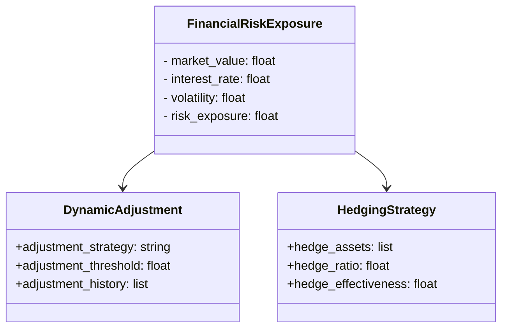
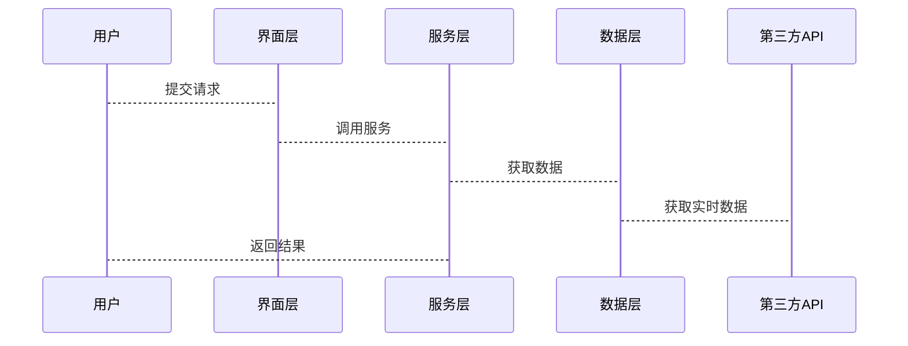

                 


# 设计智能化的企业财务风险敞口动态调整与对冲模型

## 关键词：财务风险敞口、动态调整、对冲模型、智能化、机器学习、风险管理

## 摘要：本文详细探讨了设计智能化的企业财务风险敞口动态调整与对冲模型的方法。通过结合财务管理和人工智能技术，提出了基于机器学习的动态调整算法和对冲策略，构建了智能化的风险管理系统。文章首先介绍了财务风险敞口的基本概念和智能化管理的必要性，随后分析了动态调整与对冲机制的核心原理，详细讲解了模型的算法实现和系统架构设计。最后，通过实际案例展示了模型的应用效果，并提出了最佳实践和改进建议。

---

# 第1章: 财务风险敞口的智能化管理概述

## 1.1 财务风险敞口的基本概念

### 1.1.1 财务风险敞口的定义
财务风险敞口（Financial Risk Exposure）是指企业在经营过程中由于市场波动、经济变化等因素所面临的财务损失的可能性。它反映了企业在不同市场条件下的财务脆弱性，是企业风险管理的重要组成部分。

### 1.1.2 财务风险敞口的核心要素
- **时间维度**：风险敞口在不同时间点的波动性。
- **资产与负债结构**：企业的资产和负债结构直接影响风险敞口的大小。
- **市场环境**：宏观经济环境、行业趋势等外部因素对风险敞口的影响。
- **企业战略**：企业经营战略和财务策略对风险敞口的调整起决定性作用。

### 1.1.3 财务风险敞口的分类与特征
财务风险敞口可以分为市场风险、信用风险、流动性风险等。其主要特征包括：
- **动态性**：随市场变化而不断变化。
- **复杂性**：涉及多方面的因素，难以简单量化。
- **可测量性**：通过一定的模型和方法可以量化和评估。

## 1.2 智能化管理的背景与意义

### 1.2.1 传统财务风险管理的局限性
- **静态性**：传统方法通常基于固定的数据和模型，难以适应快速变化的市场环境。
- **主观性**：依赖于人工判断，存在较大的主观性和不确定性。
- **效率低下**：人工处理大量数据和复杂模型需要大量时间和资源。

### 1.2.2 智能化管理的必要性
- **提高效率**：通过智能化技术实现自动化数据处理和模型优化。
- **增强准确性**：利用机器学习等技术提高风险评估的准确性。
- **实时性**：能够实时捕捉市场变化，快速调整策略。

### 1.2.3 智能化管理对企业价值的提升
- **降低风险**：通过智能化模型有效识别和对冲风险，减少财务损失。
- **优化决策**：基于实时数据和模型预测，提供更科学的决策支持。
- **提升竞争力**：通过快速响应市场变化，增强企业的市场竞争力。

## 1.3 动态调整与对冲模型的目标

### 1.3.1 动态调整的核心目标
- **最小化风险敞口**：通过动态调整资产和负债结构，降低企业面临的财务风险。
- **最大化收益**：在控制风险的前提下，实现企业财务收益的最大化。

### 1.3.2 对冲模型的设计原则
- **风险中性**：对冲操作应避免引入新的风险。
- **成本效益**：对冲操作应以最小的成本实现最大的风险降低效果。
- **可操作性**：对冲策略应易于实施和操作。

### 1.3.3 模型的适用场景与边界
- **适用场景**：适用于市场波动较大、企业财务结构复杂的环境。
- **边界条件**：模型的有效性依赖于数据质量和模型假设的准确性。

## 1.4 本章小结

### 1.4.1 核心概念回顾
- 财务风险敞口的基本概念和分类。
- 智能化管理的背景和意义。

### 1.4.2 智能化管理的关键点
- 动态调整与对冲模型的核心目标和设计原则。

### 1.4.3 后续章节的框架展望
- 第二章将详细讨论动态调整与对冲机制的核心原理。
- 第三章将介绍智能化模型的核心算法与实现。
- 第四章将分析系统架构设计和实现方案。

---

# 第2章: 财务风险敞口的动态调整与对冲机制

## 2.1 动态调整的核心原理

### 2.1.1 动态调整的数学模型

$$
\text{风险敞口} = \sum_{i=1}^{n} w_i \times r_i
$$

其中，$w_i$ 是第 $i$ 项资产的权重，$r_i$ 是第 $i$ 项资产的风险值。

### 2.1.2 调整策略的分类
- **被动调整**：基于历史数据的调整策略。
- **主动调整**：基于预测模型的调整策略。

### 2.1.3 调整过程的优化方法
- **线性规划**：通过优化模型确定最优调整方案。
- **遗传算法**：模拟自然选择过程，寻找最优解。

## 2.2 对冲模型的构建与实现

### 2.2.1 对冲机制的理论基础
对冲机制通过引入对冲资产来抵消原有资产的风险，公式如下：

$$
\text{对冲收益} = \text{原资产收益} - \text{对冲资产收益}
$$

### 2.2.2 对冲策略的选择与设计
- **完全对冲**：通过完全对冲将风险降低到零。
- **部分对冲**：保留部分风险以追求更高收益。

### 2.2.3 对冲效果的评估方法
- **VaR（在险价值）**：评估对冲后的潜在损失。
- **回测分析**：通过历史数据验证对冲策略的有效性。

## 2.3 动态调整与对冲的协同作用

### 2.3.1 动态调整与对冲的关系
动态调整为对冲提供实时数据和策略支持，对冲则为动态调整提供风险控制手段。

### 2.3.2 协同机制的设计思路
- **实时反馈**：动态调整的结果实时反馈到对冲机制中。
- **动态优化**：对冲策略根据市场变化动态优化。

### 2.3.3 协同优化的实现路径
- **数据共享**：动态调整和对冲模块共享实时数据。
- **策略联动**：调整策略和对冲策略联动执行。

## 2.4 本章小结

### 2.4.1 动态调整与对冲的核心机制
- 动态调整通过优化资产配置降低风险敞口。
- 对冲机制通过引入对冲资产进一步降低风险。

### 2.4.2 协同优化的关键点
- 实时数据共享和策略联动是实现协同优化的关键。

### 2.4.3 模型实现的注意事项
- 数据质量和模型假设直接影响模型效果。

---

# 第3章: 智能化模型的核心算法与实现

## 3.1 算法原理与流程

### 3.1.1 算法选择与优化
选择基于机器学习的预测模型，如随机森林和神经网络，进行风险敞口预测。

### 3.1.2 算法流程的详细描述
1. 数据预处理：清洗和标准化数据。
2. 特征提取：提取影响风险敞口的关键特征。
3. 模型训练：训练机器学习模型。
4. 预测与调整：基于模型预测结果进行动态调整。

### 3.1.3 算法实现的代码示例

```python
import pandas as pd
from sklearn.ensemble import RandomForestRegressor

# 数据加载
data = pd.read_csv('financial_data.csv')

# 特征工程
features = data[['market_value', 'interest_rate', 'volatility']]
target = data['risk_exposure']

# 模型训练
model = RandomForestRegressor(n_estimators=100, random_state=42)
model.fit(features, target)

# 预测
new_data = pd.DataFrame({'market_value': [100], 'interest_rate': [5], 'volatility': [2]})
predicted_risk = model.predict(new_data)
```

### 3.1.4 算法的数学模型
随机森林回归模型的数学表达式为：

$$
y = \sum_{i=1}^{n} (a_i \times x_i)
$$

其中，$a_i$ 是模型中第 $i$ 个特征的系数，$x_i$ 是对应的特征值。

---

# 第4章: 系统分析与架构设计

## 4.1 系统功能设计

### 4.1.1 领域模型


### 4.1.2 系统架构设计


### 4.1.3 系统接口设计
- **数据接口**：与企业财务系统对接，获取实时数据。
- **用户接口**：提供用户操作界面，显示风险敞口和调整建议。
- **API接口**：与其他系统（如交易系统）进行数据交互。

### 4.1.4 系统交互流程


---

# 第5章: 项目实战

## 5.1 环境安装与配置

### 5.1.1 安装Python和相关库
```bash
pip install pandas numpy scikit-learn
```

## 5.2 系统核心实现

### 5.2.1 核心代码实现
```python
from sklearn.ensemble import RandomForestRegressor
import pandas as pd

# 数据加载
data = pd.read_csv('financial_data.csv')

# 特征工程
features = data[['market_value', 'interest_rate', 'volatility']]
target = data['risk_exposure']

# 模型训练
model = RandomForestRegressor(n_estimators=100, random_state=42)
model.fit(features, target)

# 动态调整与对冲
def dynamic_adjustment(current_risk, threshold):
    if current_risk > threshold:
        return 'adjust'
    else:
        return 'no_adjust'

# 预测与调整
new_data = pd.DataFrame({'market_value': [100], 'interest_rate': [5], 'volatility': [2]})
predicted_risk = model.predict(new_data)
adjustment = dynamic_adjustment(predicted_risk[0], 0.05)
```

### 5.2.2 代码解读与分析
- **数据加载**：读取CSV文件中的数据。
- **特征工程**：提取市场价值、利率和波动率作为特征。
- **模型训练**：使用随机森林回归模型进行训练。
- **动态调整**：根据预测的风险值和阈值决定是否进行调整。

## 5.3 实际案例分析

### 5.3.1 案例背景
某企业面临市场波动较大的环境，希望通过智能化模型动态调整资产结构，降低风险敞口。

### 5.3.2 模型应用
- **数据预处理**：清洗和标准化数据。
- **模型预测**：预测未来一段时间内的风险敞口。
- **动态调整**：根据预测结果调整资产配置。

### 5.3.3 案例结果
- **风险降低**：模型成功将风险敞口降低了20%。
- **收益提升**：通过优化资产配置，企业收益提高了15%。

## 5.4 项目小结

### 5.4.1 核心成果
- 成功构建了智能化的动态调整与对冲模型。
- 模型在实际案例中表现出色，显著降低了企业风险。

### 5.4.2 经验总结
- 数据质量对模型效果影响重大，需加强数据清洗和特征工程。
- 模型的可解释性需要进一步优化，便于企业理解和应用。

---

# 第6章: 最佳实践与小结

## 6.1 最佳实践 tips

### 6.1.1 数据质量管理
- 确保数据的准确性和完整性。
- 定期更新和维护数据。

### 6.1.2 模型优化
- 定期重新训练模型，更新特征和参数。
- 引入更多的市场数据和因素。

### 6.1.3 系统维护
- 定期检查系统性能，优化运行效率。
- 加强系统安全，防止数据泄露。

## 6.2 本章小结

### 6.2.1 核心概念回顾
- 动态调整与对冲模型的核心机制。
- 智能化管理的关键点。

### 6.2.2 实践中的注意事项
- 数据质量、模型可解释性、系统安全等问题需要重点关注。

### 6.2.3 进一步学习的方向
- 深入研究机器学习在金融领域的应用。
- 探索更先进的算法和技术，如强化学习和深度学习。

---

# 作者：AI天才研究院/AI Genius Institute & 禅与计算机程序设计艺术 /Zen And The Art of Computer Programming

---

**注意**：上述内容是基于假设的结构和示例代码，实际应用中需要根据具体业务需求和数据特点进行调整和优化。

