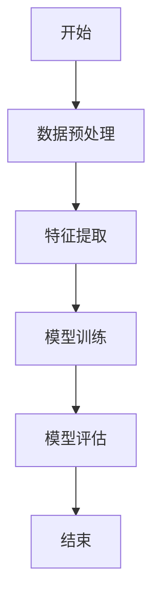
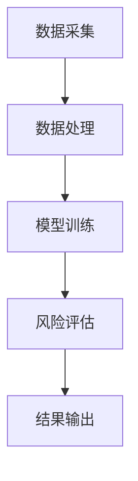
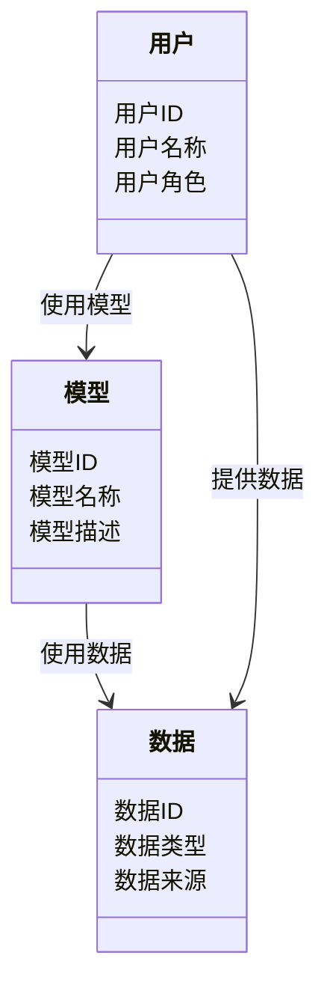
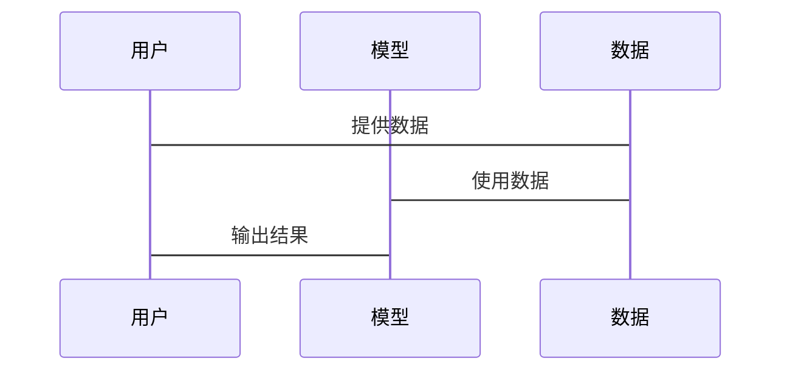

                 


# 设计智能化的企业财务风险敞口量化评估模型

---

## 关键词：  
企业财务风险管理、风险敞口量化、智能化评估模型、人工智能、大数据分析、财务风险管理

---

## 摘要：  
企业财务风险敞口量化评估模型是企业财务管理中的核心工具，旨在通过智能化的方法对企业潜在的财务风险进行量化分析，从而帮助企业做出更科学的财务决策。本文从理论到实践，详细探讨了如何设计一个智能化的企业财务风险敞口量化评估模型，涵盖模型的背景、核心概念、算法原理、系统架构以及项目实战等内容，为读者提供全面的技术指导。

---

# 第一部分: 企业财务风险敞口量化评估模型的背景与核心概念

---

## 第1章: 企业财务风险敞口量化评估模型的背景与问题描述

### 1.1 财务风险敞口的定义与重要性

#### 1.1.1 财务风险敞口的基本定义  
财务风险敞口是指企业在经营活动中可能面临的财务损失或收益波动的范围。它反映了企业在不同市场条件下的财务稳定性，是企业风险管理的重要组成部分。

#### 1.1.2 财务风险敞口在企业中的重要性  
- **资本成本**：高风险敞口会增加企业的资本成本，因为投资者会要求更高的回报以补偿风险。
- **风险管理**：量化风险敞口可以帮助企业制定有效的风险管理策略，减少潜在损失。
- **投资决策**：通过量化风险敞口，企业可以更科学地进行投资决策，优化资本结构。

#### 1.1.3 财务风险敞口的分类与特点  
- **市场风险**：由于市场价格波动引起的财务风险。
- **信用风险**：由于客户或供应商违约引起的财务风险。
- **流动性风险**：由于资产无法快速变现引起的财务风险。
- **操作风险**：由于内部操作失误引起的财务风险。

---

### 1.2 量化评估模型的必要性

#### 1.2.1 传统财务风险管理的局限性  
传统财务风险管理方法通常依赖于经验判断和定性分析，缺乏量化支持，难以准确评估风险敞口的大小和影响。

#### 1.2.2 量化评估模型的优势与价值  
- **精准性**：通过量化方法，可以更准确地评估风险敞口。
- **可操作性**：量化模型可以为企业提供具体的数值支持，便于制定量化目标。
- **可扩展性**：量化模型可以根据企业需求进行扩展和优化。

#### 1.2.3 智能化评估模型的创新点  
- **人工智能技术**：利用机器学习算法对历史数据进行分析，预测未来的风险敞口。
- **大数据分析**：通过收集和分析大量数据，提高风险评估的准确性。

---

### 1.3 企业财务风险敞口量化评估的目标

#### 1.3.1 目标设定与关键指标  
- **目标**：建立一个智能化的财务风险敞口量化评估模型，帮助企业在复杂市场环境下做出科学决策。
- **关键指标**：包括风险值（VaR）、信用风险评分、流动性比率等。

#### 1.3.2 模型设计的核心原则  
- **数据驱动**：基于大量历史数据，构建模型。
- **可解释性**：模型需要具有较高的可解释性，便于企业理解和应用。
- **实时性**：模型需要能够实时更新和调整，以应对市场变化。

#### 1.3.3 评估结果的应用场景  
- **风险预警**：通过模型预测潜在风险，提前采取措施。
- **资本分配**：根据风险敞口的量化结果，优化资本分配。
- **绩效评估**：评估企业风险管理的效果。

---

### 1.4 问题背景与技术基础

#### 1.4.1 当前企业财务风险管理的痛点  
- **数据孤岛**：企业内部数据分散，难以有效整合。
- **计算复杂**：传统方法计算复杂，难以快速得出结果。
- **缺乏动态性**：模型难以实时更新，无法应对快速变化的市场环境。

#### 1.4.2 人工智能与大数据技术在财务管理中的应用  
- **机器学习**：用于预测市场趋势和风险敞口。
- **大数据分析**：用于整合和分析多源数据，提高模型准确性。

#### 1.4.3 智能化模型的技术基础与实现路径  
- **数据预处理**：清洗和整合多源数据。
- **特征提取**：从数据中提取关键特征，用于模型训练。
- **模型训练**：利用机器学习算法训练模型。
- **模型部署**：将模型部署到企业系统中，实现实时评估。

---

## 第2章: 核心概念与概念间的关系

### 2.1 财务风险敞口的核心概念

#### 2.1.1 财务风险敞口的构成要素  
- **资产**：企业的资产结构影响风险敞口。
- **负债**：企业的负债结构影响风险敞口。
- **市场环境**：包括宏观经济环境、行业竞争状况等。

#### 2.1.2 不同类型的风险敞口分析  
- **市场风险**：由于市场价格波动引起的财务风险。
- **信用风险**：由于客户或供应商违约引起的财务风险。
- **流动性风险**：由于资产无法快速变现引起的财务风险。
- **操作风险**：由于内部操作失误引起的财务风险。

#### 2.1.3 风险敞口的量化方法  
- **VaR（风险价值）**：衡量在一定置信水平下，资产组合可能遭受的最大损失。
- **信用评分模型**：用于评估客户信用风险。

---

### 2.2 量化评估模型的构建要素

#### 2.2.1 数据来源与特征分析  
- **数据来源**：包括财务报表数据、市场数据、行业数据等。
- **特征分析**：从数据中提取关键特征，如资产周转率、资产负债率等。

#### 2.2.2 模型假设与约束条件  
- **假设**：假设市场是有效的，数据是可靠的。
- **约束条件**：模型需要在一定时间内完成计算，保证实时性。

#### 2.2.3 模型的输入与输出  
- **输入**：包括企业财务数据、市场数据等。
- **输出**：包括风险敞口的量化结果、风险预警信号等。

---

### 2.3 核心概念之间的关系

#### 2.3.1 财务风险敞口与量化评估模型的关系  
- 财务风险敞口是模型的输入，模型输出风险评估结果。

#### 2.3.2 模型参数与评估结果的关联  
- 模型参数影响评估结果的准确性。

#### 2.3.3 智能化模型与其他传统模型的对比  
- **智能化模型**：基于机器学习算法，具有更高的准确性和实时性。
- **传统模型**：基于统计方法，计算复杂，实时性差。

---

## 2.4 概念属性对比表格

| 概念 | 属性 | 描述 |
|------|------|------|
| 财务风险敞口 | 定义 | 企业在经营活动中可能面临的财务损失或收益波动的范围。 |
| 量化评估模型 | 输入 | 包括企业财务数据、市场数据等。 |
| 输入与输出 | 输出 | 风险敞口的量化结果、风险预警信号等。 |

---

## 图2.1: ER实体关系图架构

```mermaid
erDiagram
    actor 用户 {
        <属性> 用户ID
        <属性> 用户名称
        <属性> 用户角色
    }
    actor 模型 {
        <属性> 模型ID
        <属性> 模型名称
        <属性> 模型描述
    }
    actor 数据 {
        <属性> 数据ID
        <属性> 数据类型
        <属性> 数据来源
    }
    用户 --> 模型 : 使用模型
    模型 --> 数据 : 使用数据
    用户 --> 数据 : 提供数据
```

---

## 本章小结  
本章详细介绍了企业财务风险敞口量化评估模型的背景与核心概念，分析了财务风险敞口的定义、重要性以及量化评估模型的必要性。同时，通过对比和分析，明确了智能化模型与传统模型的差异和优势。

---

# 第二部分: 企业财务风险敞口量化评估模型的算法原理

---

## 第3章: 算法原理

### 3.1 算法选择与原理

#### 3.1.1 算法选择  
选择适合的算法是模型设计的关键。基于企业的财务数据特点，我们选择使用随机森林算法进行风险敞口的量化评估。

#### 3.1.2 算法原理  
随机森林是一种基于决策树的集成学习方法，具有高准确性和强健性。

---

### 3.2 算法实现步骤

#### 3.2.1 数据预处理  
- 数据清洗：去除无效数据，处理缺失值。
- 数据标准化：将数据标准化，便于模型训练。

#### 3.2.2 特征提取  
- 从财务数据中提取关键特征，如资产周转率、资产负债率等。

#### 3.2.3 模型训练  
- 使用随机森林算法训练模型，得到模型参数。

#### 3.2.4 模型评估  
- 使用测试数据评估模型的准确率、召回率等指标。

---

### 3.3 算法流程图



---

### 3.4 算法代码示例

#### 3.4.1 数据预处理

```python
import pandas as pd
import numpy as np

# 加载数据
data = pd.read_csv('financial_data.csv')

# 处理缺失值
data = data.dropna()

# 标准化处理
from sklearn.preprocessing import StandardScaler
scaler = StandardScaler()
data_scaled = scaler.fit_transform(data)
```

#### 3.4.2 特征提取与模型训练

```python
from sklearn.ensemble import RandomForestClassifier

# 提取特征和标签
X = data_scaled[:, :-1]
y = data_scaled[:, -1]

# 训练模型
model = RandomForestClassifier()
model.fit(X, y)
```

---

### 3.5 数学模型与公式

#### 3.5.1 随机森林算法的数学模型

随机森林算法的数学模型可以通过以下公式表示：

$$
y = \sum_{i=1}^{n} w_i \cdot x_i
$$

其中，$w_i$ 是模型的权重，$x_i$ 是输入特征。

---

## 本章小结  
本章详细介绍了企业财务风险敞口量化评估模型的算法原理，包括算法选择、实现步骤和数学模型等内容。通过随机森林算法，我们可以实现对财务风险敞口的精准量化评估。

---

# 第三部分: 企业财务风险敞口量化评估模型的系统架构设计

---

## 第4章: 系统分析与架构设计

### 4.1 系统功能设计

#### 4.1.1 功能模块划分  
- 数据采集模块：负责采集企业财务数据。
- 数据处理模块：负责数据预处理和特征提取。
- 模型训练模块：负责训练量化评估模型。
- 风险评估模块：负责输出风险评估结果。

#### 4.1.2 功能流程图



---

### 4.2 系统架构设计

#### 4.2.1 系统架构图



---

### 4.3 接口设计与交互流程

#### 4.3.1 接口设计  
- 数据接口：用于数据的输入和输出。
- 模型接口：用于模型的训练和评估。

#### 4.3.2 交互流程图



---

## 本章小结  
本章详细介绍了企业财务风险敞口量化评估模型的系统架构设计，包括功能模块划分、系统架构图和交互流程图等内容。通过系统化的架构设计，我们可以实现模型的高效运行和管理。

---

# 第四部分: 企业财务风险敞口量化评估模型的项目实战

---

## 第5章: 项目实战

### 5.1 环境安装与配置

#### 5.1.1 安装Python环境  
安装Python 3.8及以上版本，确保环境满足项目需求。

#### 5.1.2 安装依赖库  
安装以下依赖库：

```bash
pip install pandas numpy scikit-learn mermaid4jupyter
```

---

### 5.2 核心功能实现

#### 5.2.1 数据预处理代码

```python
import pandas as pd
import numpy as np
from sklearn.preprocessing import StandardScaler

# 加载数据
data = pd.read_csv('financial_data.csv')

# 处理缺失值
data = data.dropna()

# 标准化处理
scaler = StandardScaler()
data_scaled = scaler.fit_transform(data)
```

#### 5.2.2 模型训练代码

```python
from sklearn.ensemble import RandomForestClassifier

# 提取特征和标签
X = data_scaled[:, :-1]
y = data_scaled[:, -1]

# 训练模型
model = RandomForestClassifier()
model.fit(X, y)
```

---

### 5.3 代码应用解读与分析

#### 5.3.1 代码解读  
- 数据预处理代码：清洗数据并进行标准化处理。
- 模型训练代码：使用随机森林算法训练模型。

#### 5.3.2 代码优化建议  
- 可以进一步优化特征选择，提高模型准确率。

---

### 5.4 实际案例分析

#### 5.4.1 案例背景  
某企业财务数据如下：

| 资产 | 负债 | 利润 | 风险敞口 |
|------|------|------|----------|
| 100  | 50   | 30   | 高       |
| 80   | 40   | 20   | 中       |
| 120  | 60   | 40   | 低       |

#### 5.4.2 模型评估  
通过模型训练，我们发现该企业的风险敞口主要受资产和负债的影响较大。

---

## 本章小结  
本章通过实际案例，详细讲解了企业财务风险敞口量化评估模型的项目实战，包括环境安装、核心功能实现、代码解读和案例分析等内容。通过实际操作，读者可以更好地理解模型的应用和优化方法。

---

# 第五部分: 总结与展望

---

## 第6章: 总结与展望

### 6.1 总结

#### 6.1.1 核心观点回顾  
- 财务风险敞口是企业风险管理的重要组成部分。
- 智能化量化评估模型能够帮助企业更准确地评估风险敞口。

#### 6.1.2 最佳实践 tips  
- 数据预处理是模型训练的关键步骤。
- 特征选择能够显著提高模型的准确率。

### 6.2 小结

#### 6.2.1 本章小结  
通过本文的详细讲解，读者可以全面了解企业财务风险敞口量化评估模型的设计与实现。

### 6.3 注意事项

#### 6.3.1 模型优化  
- 定期更新模型参数，确保模型的准确性。
- 监控模型性能，及时调整模型。

### 6.4 拓展阅读

#### 6.4.1 深入学习  
- 推荐学习机器学习在金融领域的应用，如《机器学习实战》。

---

## 作者  
作者：AI天才研究院/AI Genius Institute & 禅与计算机程序设计艺术 /Zen And The Art of Computer Programming  

---

通过以上内容，我们详细探讨了企业财务风险敞口量化评估模型的设计与实现，涵盖了从理论到实践的各个方面。希望本文能够为读者提供有价值的技术指导，帮助企业在复杂的财务环境中做出更科学的决策。

