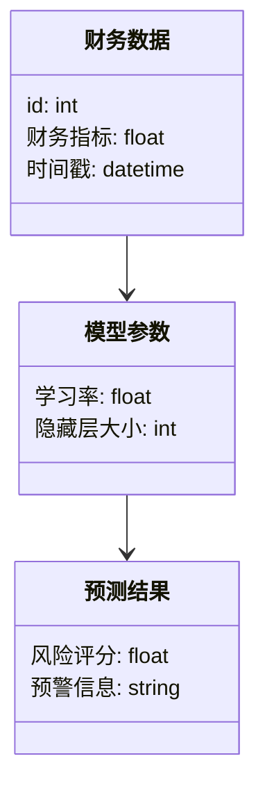
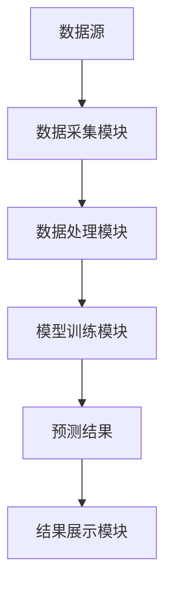

                 


# 设计智能化的企业财务风险量化评估模型

> 关键词：企业财务风险，量化评估，人工智能，大模型，风险预测

> 摘要：本文系统阐述了设计智能化的企业财务风险量化评估模型的核心方法和实现路径。文章从背景与概念出发，深入分析了传统财务风险评估的局限性，详细探讨了大模型在智能化财务风险评估中的应用原理，结合实际案例，提出了基于Transformer的大模型架构，并通过Mermaid流程图和Python代码实现了模型的设计与实现。最后，本文总结了系统架构设计方案，并给出了项目实战的详细指导。

---

# 第一部分：企业财务风险量化评估模型的背景与概念

# 第1章：财务风险量化评估模型概述

## 1.1 什么是财务风险量化评估模型

### 1.1.1 财务风险的基本概念
财务风险是指企业在经营过程中由于内外部因素的影响，导致财务状况恶化、资金链断裂或无法履行偿债义务的可能性。量化评估则是通过对财务数据的分析，将风险程度转化为具体的数值指标。

### 1.1.2 量化评估的定义与作用
量化评估是通过数学模型和数据分析方法，将定性的风险因素转化为可量化的指标，从而帮助企业更准确地识别和管理风险。其作用包括：  
1. 提供数据支持，辅助决策。  
2. 量化风险程度，便于风险控制。  
3. 实现风险预测，提前采取应对措施。

### 1.1.3 智能化评估的核心要素
智能化财务风险评估的核心要素包括：  
1. 数据采集与处理能力。  
2. 高效的算法模型。  
3. 精准的风险预测能力。  
4. 可视化的结果展示。

---

## 1.2 传统财务风险评估的局限性

### 1.2.1 传统方法的不足
传统财务风险评估方法主要依赖于财务报表分析和人工判断，存在以下问题：  
1. 数据处理能力有限，难以应对海量数据。  
2. 风险预测的准确性和实时性不足。  
3. 人工判断的主观性强，结果缺乏客观性。

### 1.2.2 数据分析的局限性
传统的数据分析方法（如线性回归、逻辑回归等）在处理非结构化数据和复杂场景时表现不佳，且难以捕捉数据中的深层关系。

### 1.2.3 人工判断的主观性
财务风险评估的最终结果往往依赖于分析师的经验和主观判断，这可能导致评估结果的不一致性和不确定性。

---

## 1.3 智能化财务风险评估的必要性

### 1.3.1 大数据时代的财务分析需求
在大数据时代，企业面临的财务数据种类繁多、规模巨大，传统的分析方法已无法满足需求。智能化财务风险评估能够高效处理海量数据，提取有价值的信息。

### 1.3.2 AI技术在财务领域的应用潜力
人工智能技术（如大模型）在自然语言处理、图像识别等方面具有显著优势，能够提升财务数据的分析效率和准确性。

### 1.3.3 企业智能化转型的驱动因素
企业智能化转型是提升竞争力的必然选择，智能化财务风险评估能够帮助企业实现高效、精准的财务管理。

---

## 1.4 本章小结

本章介绍了财务风险量化评估模型的基本概念，分析了传统财务风险评估的局限性，并阐述了智能化财务风险评估的必要性。通过对比传统方法与智能化方法的优缺点，为后续章节的深入分析奠定了基础。

---

# 第二部分：智能化财务风险评估的核心概念与联系

# 第2章：大模型与财务风险评估的核心概念

## 2.1 大模型的基本原理

### 2.1.1 大模型的定义与特点
大模型是指基于深度学习的大型神经网络模型，具有参数规模大、计算能力强、泛化能力好的特点。其核心优势在于能够处理复杂的非结构化数据，并通过自监督学习提升模型的通用性。

### 2.1.2 大模型的核心算法
大模型的核心算法包括：  
1. Transformer架构：通过自注意力机制捕捉数据中的长距离依赖关系。  
2. 编码器-解码器结构：实现对输入数据的编码与输出的解码。  
3. 多层感知机（MLP）：用于非线性特征提取。

### 2.1.3 大模型与传统机器学习的对比
大模型与传统机器学习算法的主要区别在于：  
1. 大模型能够处理复杂的数据关系，而传统算法通常依赖于特征工程。  
2. 大模型具有更强的泛化能力，而传统算法在小样本数据上表现较弱。  

---

## 2.2 财务风险评估的关键指标

### 2.2.1 财务风险的主要维度
财务风险的主要维度包括：  
1. 资产负债状况：如资产负债率、流动比率等。  
2. 盈利能力：如净利润率、毛利率等。  
3. 现金流状况：如经营活动现金流净额。  
4. 偿债能力：如速动比率、利息保障倍数等。  

### 2.2.2 关键指标的筛选与权重分配
关键指标的筛选需要根据企业特点和行业特性进行选择，权重分配则需要结合历史数据和专家经验进行调整。

### 2.2.3 指标之间的关系与影响
指标之间的关系可以通过相关性分析和因果关系分析进行研究，从而构建合理的风险评估模型。

---

## 2.3 大模型与财务风险评估的结合

### 2.3.1 大模型在数据处理中的优势
大模型能够高效处理非结构化数据（如财务报表、新闻公告等），并通过自注意力机制捕捉数据中的深层关系。

### 2.3.2 大模型对风险预测的提升作用
大模型通过学习海量数据，能够发现传统方法难以察觉的潜在风险因素，从而提高风险预测的准确性。

### 2.3.3 大模型在决策支持中的应用
大模型可以通过生成式AI技术为企业提供个性化的财务风险管理建议，帮助企业在复杂环境中做出最优决策。

---

## 2.4 本章小结

本章从大模型的基本原理出发，分析了财务风险评估的关键指标，并探讨了大模型与财务风险评估的结合方式。通过对比传统方法与智能化方法的优势，为后续章节的算法实现和系统设计奠定了理论基础。

---

# 第三部分：智能化财务风险评估模型的算法原理

# 第3章：大模型在风险评估中的算法实现

## 3.1 大模型的训练与优化

### 3.1.1 模型训练的基本流程
大模型的训练流程包括：  
1. 数据预处理：清洗、归一化、分词等。  
2. 模型构建：搭建Transformer架构，定义损失函数和优化器。  
3. 模型训练：通过梯度下降优化模型参数。  
4. 模型评估：通过验证集评估模型性能，调整超参数。  

### 3.1.2 模型调优的关键技术
模型调优的关键技术包括：  
1. 学习率调整：使用学习率衰减策略。  
2. 参数初始化：采用 Xavier 或 Kaiming 初始化。  
3. 正则化技术：如L2正则化、Dropout等。  

### 3.1.3 模型评估的指标与方法
模型评估的指标包括：  
1. 准确率（Accuracy）。  
2. 召回率（Recall）。  
3. F1分数。  
4. 混淆矩阵。  

---

## 3.2 风险预测的数学模型

### 3.2.1 线性回归模型
线性回归模型用于预测连续型变量，其数学表达式为：  
$$ y = \beta_0 + \beta_1x_1 + \beta_2x_2 + \dots + \beta_nx_n $$  
其中，$y$ 是预测目标，$x_i$ 是输入特征，$\beta_i$ 是模型参数。

### 3.2.2 支持向量机模型
支持向量机模型用于分类问题，其核心思想是通过寻找最优超平面将数据分为不同类别。

### 3.2.3 随机森林模型
随机森林模型是一种基于决策树的集成学习方法，具有较强的抗过拟合能力。

---

## 3.3 基于大模型的风险预测算法

### 3.3.1 Transformer模型的结构
Transformer模型的结构包括编码器和解码器两部分，其核心是自注意力机制：  
$$ \text{Attention}(Q, K, V) = \text{softmax}\left(\frac{QK^T}{\sqrt{d_k}}\right)V $$  

其中，$Q$ 是查询向量，$K$ 是键向量，$V$ 是值向量，$d_k$ 是向量的维度。

### 3.3.2 大模型在风险预测中的应用
大模型通过自注意力机制捕捉数据中的长距离依赖关系，能够更好地理解财务数据的复杂性。

### 3.3.3 模型的训练与推理流程
模型的训练与推理流程如下：  
1. 数据预处理：清洗、归一化。  
2. 模型构建：搭建基于Transformer的架构。  
3. 模型训练：通过反向传播优化参数。  
4. 模型推理：输入新的数据，输出预测结果。  

---

## 3.4 本章小结

本章详细讲解了大模型的训练与优化方法，并提出了基于Transformer的风险预测算法。通过数学公式和流程图的描述，为后续章节的系统设计和项目实现奠定了技术基础。

---

# 第四部分：系统分析与架构设计方案

# 第4章：智能化财务风险评估系统的架构设计

## 4.1 系统功能需求分析

### 4.1.1 数据采集与处理功能
系统需要支持多种数据源的接入，包括财务报表、新闻公告等，并进行清洗和预处理。

### 4.1.2 风险评估与预测功能
系统需要基于大模型对财务数据进行风险评估和预测，输出风险评分和预警信息。

### 4.1.3 结果展示与决策支持功能
系统需要提供可视化界面，展示评估结果，并为用户提供决策支持建议。

---

## 4.2 系统架构设计

### 4.2.1 分层架构设计
系统采用分层架构，包括数据层、算法层和应用层。  
1. 数据层：负责数据的采集与存储。  
2. 算法层：负责模型的训练与推理。  
3. 应用层：负责结果的展示与交互。

### 4.2.2 微服务架构设计
系统采用微服务架构，包括数据服务、模型服务、结果服务等模块。各模块之间通过API进行交互。

### 4.2.3 数据流与服务交互设计
数据流从数据源流入系统，经过数据处理模块，进入模型训练模块，最终生成预测结果并返回给用户。

---

## 4.3 系统功能设计（领域模型）

### 4.3.1 领域模型设计
领域模型设计包括：  
1. 数据实体：财务数据、模型参数、预测结果等。  
2. 数据关系：数据之间的关联关系。  
3. 业务流程：数据采集、处理、训练、预测、展示。

### 4.3.2 领域模型图


---

## 4.4 系统架构设计

### 4.4.1 系统架构图


---

## 4.5 本章小结

本章通过分层架构和微服务架构的设计，详细描述了智能化财务风险评估系统的整体架构。通过领域模型和系统架构图的绘制，明确了各模块之间的关系和交互流程。

---

# 第五部分：项目实战与最佳实践

# 第5章：项目实战

## 5.1 环境安装与配置

### 5.1.1 安装Python环境
使用Anaconda安装Python 3.8及以上版本。

### 5.1.2 安装依赖库
安装以下依赖库：  
- TensorFlow  
- Keras  
- Mermaid  
- Plotly  

## 5.2 核心代码实现

### 5.2.1 数据预处理代码
```python
import pandas as pd
import numpy as np

# 读取数据
data = pd.read_csv("financial_data.csv")

# 数据清洗
data.dropna(inplace=True)

# 归一化处理
from sklearn.preprocessing import StandardScaler
scaler = StandardScaler()
data_scaled = scaler.fit_transform(data)
```

### 5.2.2 模型训练代码
```python
import tensorflow as tf
from tensorflow import keras

# 搭建模型
model = keras.Sequential([
    keras.layers.Dense(64, activation='relu'),
    keras.layers.Dense(32, activation='relu'),
    keras.layers.Dense(1, activation='sigmoid')
])

# 编译模型
model.compile(optimizer='adam', loss='binary_crossentropy', metrics=['accuracy'])

# 训练模型
model.fit(data_scaled, labels, epochs=100, batch_size=32)
```

### 5.2.3 风险预测代码
```python
# 预测结果
predictions = model.predict(new_data)
```

---

## 5.3 案例分析与解读

### 5.3.1 数据来源与处理
以某企业财务数据为例，数据包括资产负债率、净利润率等指标。

### 5.3.2 模型训练与评估
通过训练集和验证集评估模型性能，调整超参数以优化模型效果。

### 5.3.3 预测结果与分析
通过模型预测结果，识别潜在的财务风险，并生成预警信息。

---

## 5.4 本章小结

本章通过实际案例展示了智能化财务风险评估系统的实现过程，从环境配置到代码实现，再到案例分析，为读者提供了完整的实战指导。

---

# 第六部分：总结与展望

# 第6章：总结与展望

## 6.1 本章总结

本文系统阐述了设计智能化的企业财务风险量化评估模型的核心方法和实现路径。通过背景分析、算法实现、系统设计和项目实战的讲解，为读者提供了全面的技术指导。

## 6.2 未来展望

未来，随着大模型技术的不断进步，智能化财务风险评估模型将更加精准和高效。同时，多模态数据的引入和实时分析能力的提升也将为企业财务管理带来更大的变革。

---

# 作者：AI天才研究院 & 禅与计算机程序设计艺术

