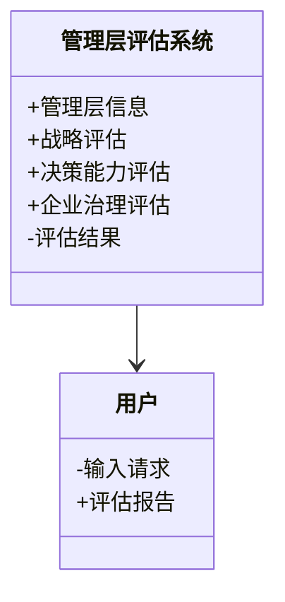
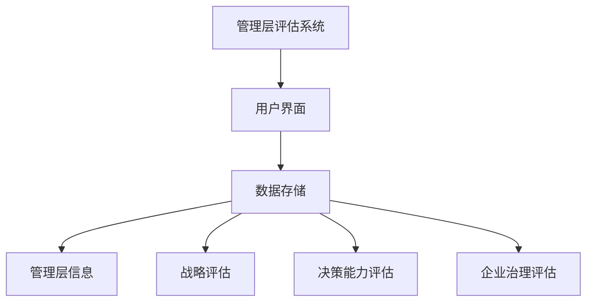
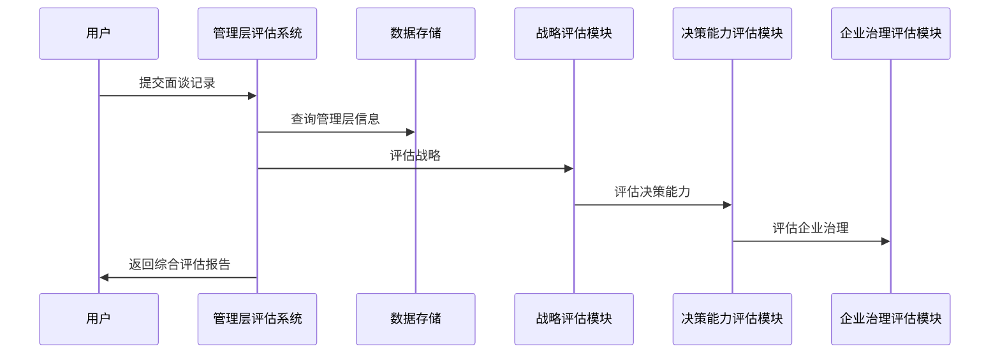

                 


# 费雪的'与经理人面谈'：深入了解公司管理层

**关键词**：费雪，公司管理层，投资策略，访谈方法，战略思维

**摘要**：本文深入探讨了费雪的“与经理人面谈”方法，分析了公司管理层的关键特征及其对企业发展的影响。通过费雪的投资理念和访谈技巧，结合数学模型和系统架构，本文详细讲解了如何评估和优化公司管理层，为投资者和企业管理者提供了实用的见解。

---

## 第一部分：费雪的“与经理人面谈”背景介绍

### 第1章：费雪的投资理念与访谈方法

#### 1.1 费雪的生平简介
彼得·费雪是价值投资的先驱，以其对公司管理层的深入分析闻名。他通过与经理人面谈，评估公司的潜力和风险，帮助投资者做出明智决策。

#### 1.2 费雪的投资理念
费雪强调长期投资和对公司基本面的深入研究。他认为，成功的投资取决于对公司管理层的理解和信任，而面谈是揭示管理层能力的关键工具。

#### 1.3 费雪的访谈方法
费雪的访谈方法包括准备、提问和分析三个阶段。他通过提问了解管理层的战略思维、决策能力和企业治理，评估公司的长期发展潜力。

---

### 第2章：公司管理层的重要性

#### 2.1 管理层对公司的影响
管理层的决策直接影响公司的业绩和价值。费雪认为，优秀的管理层能够识别机会、应对挑战，并推动公司持续增长。

#### 2.2 费雪访谈的核心问题
费雪在面谈中关注以下几个核心问题：
- 公司的未来发展方向
- 管理层的战略规划
- 风险管理和应对策略
- 企业的治理结构

---

## 第二部分：公司管理层的核心特征分析

### 第3章：管理层的战略思维

#### 3.1 战略思维的定义与特征
战略思维是指管理层能够从宏观视角审视公司发展方向，制定长期战略规划。

#### 3.2 战略思维的关键特征
- **前瞻性**：能够预见市场趋势和潜在机会
- **灵活性**：能够适应变化并调整战略
- **执行力**：能够有效执行战略计划

#### 3.3 战略思维的评估维度
- 战略规划的合理性
- 战略执行的效果
- 战略调整的及时性

---

### 第4章：管理层的决策能力

#### 4.1 决策能力的评估维度
- 决策的准确性
- 决策的及时性
- 决策的创新性

#### 4.2 决策能力的关键特征
- **准确性**：基于充分的信息和分析做出决策
- **及时性**：能够在关键时刻做出决策
- **创新性**：能够提出创新的解决方案

---

### 第5章：管理层的企业治理

#### 5.1 企业治理的核心要素
- 股权结构
- 董事会结构
- 高层管理团队

#### 5.2 企业治理的关键特征
- 股权结构的合理性
- 董事会的有效性
- 管理团队的稳定性

---

## 第三部分：费雪访谈方法的数学模型与算法

### 第6章：费雪访谈方法的数学模型

#### 6.1 费雪分析模型
费雪的分析模型包括以下几个步骤：
1. **收集信息**：通过面谈收集管理层的战略规划和财务数据。
2. **评估战略**：分析战略的合理性和可行性。
3. **评估管理能力**：评估管理层的决策能力和执行能力。
4. **综合评分**：根据多个维度对管理层进行综合评分。

#### 6.2 数学模型
费雪分析模型可以表示为：
$$
\text{管理层评分} = \sum_{i=1}^{n} w_i \cdot x_i
$$
其中，\(w_i\) 是第i个维度的权重，\(x_i\) 是第i个维度的评分。

---

## 第四部分：系统分析与架构设计方案

### 第7章：系统功能设计

#### 7.1 领域模型类图


#### 7.2 系统架构图


#### 7.3 系统接口设计
- 用户输入请求
- 系统返回评估报告

#### 7.4 系统交互序列图


---

## 第五部分：项目实战

### 第8章：环境安装与核心代码实现

#### 8.1 环境安装
安装Python和必要的库（如pandas、numpy）。

#### 8.2 核心代码实现
```python
def fisher_analysis(strategy, decision, governance):
    # 权重分配
    weight_strategy = 0.4
    weight_decision = 0.3
    weight_governance = 0.3
    # 综合评分
    total_score = weight_strategy * strategy + weight_decision * decision + weight_governance * governance
    return total_score

# 示例数据
strategy = 85
decision = 90
governance = 80

# 计算评分
score = fisher_analysis(strategy, decision, governance)
print(f"综合评分：{score}")
```

#### 8.3 代码解读
- **fisher_analysis**函数：根据战略、决策和治理评分计算综合评分。
- **权重分配**：战略占40%，决策占30%，治理占30%。

---

## 第六部分：最佳实践与总结

### 第9章：最佳实践 tips

#### 9.1 实践建议
- 定期与管理层面谈，了解公司动态。
- 结合财务数据和战略规划，综合评估管理层能力。
- 关注管理层的长期稳定性，确保企业治理的有效性。

#### 9.2 小结
费雪的面谈方法提供了评估管理层的重要工具，帮助投资者和企业管理者做出更明智的决策。

#### 9.3 注意事项
- 面谈前需充分准备，了解公司背景。
- 分析时需结合定量和定性数据，避免片面结论。
- 定期更新分析模型，适应市场变化。

---

## 结语

费雪的“与经理人面谈”方法为投资者和企业管理者提供了深入了解管理层的重要工具。通过系统的分析和评估，可以帮助我们更好地识别优秀管理层，推动公司持续发展。

---

**作者**：AI天才研究院/AI Genius Institute & 禅与计算机程序设计艺术 /Zen And The Art of Computer Programming

