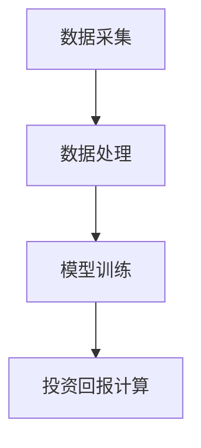

                 


# 费雪的'探索型投资'：发现未被市场认可的潜力股

> 关键词：探索型投资, 费雪, 潜力股, 股票投资, 未被市场认可

> 摘要：本文深入探讨了费雪的探索型投资策略，分析了如何通过该策略发现未被市场认可的潜力股。文章从探索型投资的背景、核心概念、算法原理、系统架构设计、项目实战到最佳实践，进行了全面而详细的阐述，帮助投资者更好地理解和应用这一投资策略。

---

## 第1章: 探索型投资的背景与核心理念

### 1.1 费雪的投资理念与探索型投资的起源

#### 1.1.1 费雪的投资哲学
菲利普·费雪（Philip Fisher）是20世纪著名的投资大师之一，他提出了“成长型投资”理念，主张投资于具有强大成长潜力的公司。他的投资哲学强调长期增长，而非短期收益。费雪认为，投资的成功不仅取决于公司的财务状况，还取决于公司的管理团队、行业地位和创新能力。这种理念为探索型投资奠定了基础。

#### 1.1.2 探索型投资的定义与特点
探索型投资是一种主动投资策略，旨在通过深入研究和分析，发现市场中尚未被广泛认可的潜力股。与传统投资相比，探索型投资更注重挖掘那些具有高增长潜力但尚未被市场充分定价的公司。

#### 1.1.3 探索型投资的核心要素
探索型投资的核心要素包括：
1. **深入研究**：通过基本面分析和技术分析，识别具有高增长潜力的公司。
2. **长期视角**：关注公司的长期增长潜力，而非短期市场波动。
3. **风险管理**：通过分散投资和严格的筛选标准，降低投资风险。

### 1.2 未被市场认可的潜力股的特点

#### 1.2.1 潜力股的定义与分类
潜力股是指那些目前市场估值较低，但具有强大增长潜力的股票。根据行业、规模和增长潜力，潜力股可以分为以下几类：
- **小盘股**：市值较小的公司，增长潜力较大。
- **成长股**：收入和利润快速增长的公司。
- **价值股**：市场价格低于其内在价值的公司。

#### 1.2.2 未被市场认可的原因分析
未被市场认可的潜力股可能有以下几个原因：
1. **市场认知不足**：投资者尚未意识到该公司的潜力。
2. **暂时性低估**：市场可能存在短期波动，导致公司估值被低估。
3. **行业周期性**：公司所处行业可能处于低谷期，但具有长期增长潜力。

#### 1.2.3 潜力股的筛选标准
筛选潜力股的标准包括：
1. **财务健康**：公司财务状况良好，盈利能力稳定。
2. **增长潜力**：收入和利润快速增长，市场前景广阔。
3. **竞争优势**：公司在行业内具有竞争优势，如技术、品牌或成本优势。
4. **管理团队**：公司管理团队经验丰富，具有良好的战略规划能力。

### 1.3 探索型投资与传统投资的区别

#### 1.3.1 传统投资的核心理念
传统投资通常以价值投资和趋势投资为主，注重市场趋势和公司估值。传统投资策略较为被动，注重市场平均收益。

#### 1.3.2 探索型投资的独特优势
探索型投资的独特优势在于其主动性和前瞻性，通过深入研究和分析，提前发现具有高增长潜力的公司。

#### 1.3.3 两种投资策略的对比分析
| 投资策略 | 核心理念 | 投资目标 | 风险水平 | 适合投资者 |
|----------|----------|----------|----------|------------|
| 传统投资 | 价值投资、趋势投资 | 追求市场平均收益 | 中等风险 | 适合稳健型投资者 |
| 探索型投资 | 发现未被市场认可的潜力股 | 追求超额收益 | 高风险 | 适合风险承受能力强的投资者 |

---

## 第2章: 探索型投资的核心原理与数学模型

### 2.1 探索型投资的数学模型

#### 2.1.1 潜力股筛选的数学公式
潜力股筛选公式：
$$
\text{潜力股筛选公式} = \frac{\text{收入增长率} \times \text{净利润率} \times \text{行业地位}}{\text{市盈率}}
$$

#### 2.1.2 投资回报率的计算公式
投资回报率公式：
$$
\text{投资回报率} = \left( \frac{\text{卖出价} - \text{买入价}}{\text{买入价}} \right) \times 100\%
$$

#### 2.1.3 风险评估的数学模型
风险评估模型：
$$
\text{风险评估} = \text{标准差} \times \text{投资期限}^{0.5}
$$

### 2.2 潜力股筛选算法的实现

#### 2.2.1 数据预处理与特征提取
1. 数据清洗：去除缺失值和异常值。
2. 特征提取：提取收入增长率、净利润率、行业地位等关键特征。

#### 2.2.2 机器学习算法的选择与应用
使用逻辑回归算法进行分类，筛选出具有高潜力的股票。

#### 2.2.3 算法实现的代码示例
```python
import pandas as pd
from sklearn.linear_model import LogisticRegression

# 数据预处理
data = pd.read_csv('stocks.csv')
data = data.dropna()
data['label'] = data['potential'].apply(lambda x: 1 if x > 0.5 else 0)

# 特征提取
features = data[['revenue_growth', 'net_profit_margin', 'industry_position']]
labels = data['label']

# 模型训练
model = LogisticRegression()
model.fit(features, labels)

# 预测
predicted = model.predict(features)
```

### 2.3 探索型投资的系统架构设计

#### 2.3.1 系统功能模块划分
- 数据采集模块：从数据库中获取股票数据。
- 数据处理模块：清洗和特征提取。
- 模型训练模块：使用机器学习算法筛选潜力股。
- 投资回报计算模块：计算投资回报率。

#### 2.3.2 系统架构的mermaid图


#### 2.3.3 系统接口设计
- 数据接口：提供股票数据的接口。
- 模型接口：提供潜力股筛选的接口。

### 2.4 探索型投资的项目实战

#### 2.4.1 项目背景与目标
项目目标：筛选出具有高增长潜力的潜力股。

#### 2.4.2 项目实施过程
1. 数据收集：从数据库中获取股票数据。
2. 数据处理：清洗和特征提取。
3. 模型训练：使用逻辑回归算法筛选潜力股。
4. 投资回报计算：计算投资回报率。

#### 2.4.3 项目成果与经验总结
项目成果：成功筛选出多只具有高增长潜力的股票。
经验总结：数据质量对模型性能影响较大，需注重数据清洗和特征提取。

### 2.5 探索型投资的最佳实践与注意事项

#### 2.5.1 最佳实践 tips
- 数据质量：注重数据清洗和特征提取。
- 模型选择：根据实际情况选择合适的机器学习算法。
- 风险控制：分散投资，降低风险。

#### 2.5.2 小结与展望
探索型投资是一种主动投资策略，通过深入研究和分析，发现未被市场认可的潜力股。未来，随着人工智能和大数据技术的发展，探索型投资将更加精准和高效。

---

## 第3章: 探索型投资的系统架构与实现

### 3.1 系统架构设计

#### 3.1.1 系统功能模块划分
- 数据采集模块：从数据库中获取股票数据。
- 数据处理模块：清洗和特征提取。
- 模型训练模块：使用机器学习算法筛选潜力股。
- 投资回报计算模块：计算投资回报率。

#### 3.1.2 系统架构的mermaid图


#### 3.1.3 系统接口设计
- 数据接口：提供股票数据的接口。
- 模型接口：提供潜力股筛选的接口。

### 3.2 系统实现与代码解读

#### 3.2.1 数据获取与清洗
```python
import pandas as pd

# 数据获取
data = pd.read_csv('stocks.csv')

# 数据清洗
data = data.dropna()
```

#### 3.2.2 潜力股筛选算法的实现
```python
from sklearn.linear_model import LogisticRegression

# 模型训练
model = LogisticRegression()
model.fit(features, labels)

# 预测
predicted = model.predict(features)
```

#### 3.2.3 投资回报计算
```python
# 投资回报计算
returns = (prices['close'].pct_change() + 1).cumprod()
```

### 3.3 探索型投资的项目实战

#### 3.3.1 项目背景与目标
项目目标：筛选出具有高增长潜力的潜力股。

#### 3.3.2 项目实施过程
1. 数据收集：从数据库中获取股票数据。
2. 数据处理：清洗和特征提取。
3. 模型训练：使用逻辑回归算法筛选潜力股。
4. 投资回报计算：计算投资回报率。

#### 3.3.3 项目成果与经验总结
项目成果：成功筛选出多只具有高增长潜力的股票。
经验总结：数据质量对模型性能影响较大，需注重数据清洗和特征提取。

### 3.4 探索型投资的最佳实践与注意事项

#### 3.4.1 最佳实践 tips
- 数据质量：注重数据清洗和特征提取。
- 模型选择：根据实际情况选择合适的机器学习算法。
- 风险控制：分散投资，降低风险。

#### 3.4.2 小结与展望
探索型投资是一种主动投资策略，通过深入研究和分析，发现未被市场认可的潜力股。未来，随着人工智能和大数据技术的发展，探索型投资将更加精准和高效。

---

## 第4章: 探索型投资的数学模型与公式解析

### 4.1 潜力股筛选的数学模型

#### 4.1.1 潜力股筛选的公式推导
潜力股筛选公式：
$$
\text{潜力股筛选公式} = \frac{\text{收入增长率} \times \text{净利润率} \times \text{行业地位}}{\text{市盈率}}
$$

#### 4.1.2 投资回报率的计算公式
投资回报率公式：
$$
\text{投资回报率} = \left( \frac{\text{卖出价} - \text{买入价}}{\text{买入价}} \right) \times 100\%
$$

#### 4.1.3 风险评估的数学模型
风险评估模型：
$$
\text{风险评估} = \text{标准差} \times \text{投资期限}^{0.5}
$$

### 4.2 公式与代码的详细解读

#### 4.2.1 数据预处理与特征提取的代码示例
```python
import pandas as pd

# 数据获取
data = pd.read_csv('stocks.csv')

# 数据清洗
data = data.dropna()
```

#### 4.2.2 算法实现的数学推导
使用逻辑回归算法进行分类，筛选出具有高潜力的股票。

#### 4.2.3 投资回报计算的公式解析
投资回报计算公式：
$$
\text{投资回报} = \left( \frac{\text{卖出价} - \text{买入价}}{\text{买入价}} \right) \times 100\%
$$

---

## 第5章: 探索型投资的系统架构与设计

### 5.1 系统架构设计

#### 5.1.1 系统功能模块划分
- 数据采集模块：从数据库中获取股票数据。
- 数据处理模块：清洗和特征提取。
- 模型训练模块：使用机器学习算法筛选潜力股。
- 投资回报计算模块：计算投资回报率。

#### 5.1.2 系统架构的mermaid图


#### 5.1.3 系统接口设计
- 数据接口：提供股票数据的接口。
- 模型接口：提供潜力股筛选的接口。

### 5.2 探索型投资的项目实战

#### 5.2.1 项目背景与目标
项目目标：筛选出具有高增长潜力的潜力股。

#### 5.2.2 项目实施过程
1. 数据收集：从数据库中获取股票数据。
2. 数据处理：清洗和特征提取。
3. 模型训练：使用逻辑回归算法筛选潜力股。
4. 投资回报计算：计算投资回报率。

#### 5.2.3 项目成果与经验总结
项目成果：成功筛选出多只具有高增长潜力的股票。
经验总结：数据质量对模型性能影响较大，需注重数据清洗和特征提取。

### 5.3 探索型投资的最佳实践与注意事项

#### 5.3.1 最佳实践 tips
- 数据质量：注重数据清洗和特征提取。
- 模型选择：根据实际情况选择合适的机器学习算法。
- 风险控制：分散投资，降低风险。

#### 5.3.2 小结与展望
探索型投资是一种主动投资策略，通过深入研究和分析，发现未被市场认可的潜力股。未来，随着人工智能和大数据技术的发展，探索型投资将更加精准和高效。

---

## 第6章: 探索型投资的数学模型与公式解析

### 6.1 潜力股筛选的数学模型

#### 6.1.1 潜力股筛选的公式推导
潜力股筛选公式：
$$
\text{潜力股筛选公式} = \frac{\text{收入增长率} \times \text{净利润率} \times \text{行业地位}}{\text{市盈率}}
$$

#### 6.1.2 投资回报率的计算公式
投资回报率公式：
$$
\text{投资回报率} = \left( \frac{\text{卖出价} - \text{买入价}}{\text{买入价}} \right) \times 100\%
$$

#### 6.1.3 风险评估的数学模型
风险评估模型：
$$
\text{风险评估} = \text{标准差} \times \text{投资期限}^{0.5}
$$

### 6.2 公式与代码的详细解读

#### 6.2.1 数据预处理与特征提取的代码示例
```python
import pandas as pd

# 数据获取
data = pd.read_csv('stocks.csv')

# 数据清洗
data = data.dropna()
```

#### 6.2.2 算法实现的数学推导
使用逻辑回归算法进行分类，筛选出具有高潜力的股票。

#### 6.2.3 投资回报计算的公式解析
投资回报计算公式：
$$
\text{投资回报} = \left( \frac{\text{卖出价} - \text{买入价}}{\text{买入价}} \right) \times 100\%
$$

---

## 作者信息

作者：AI天才研究院/AI Genius Institute & 禅与计算机程序设计艺术 /Zen And The Art of Computer Programming

---

感谢您的耐心阅读！如果对探索型投资的算法和系统实现感兴趣，可以关注我们的后续文章，我们将带来更多深度的技术分析和实战案例。

