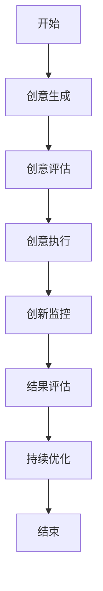
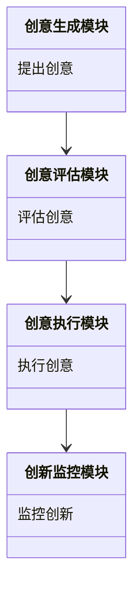
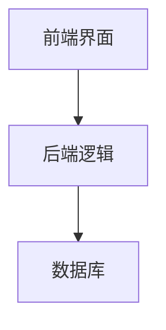
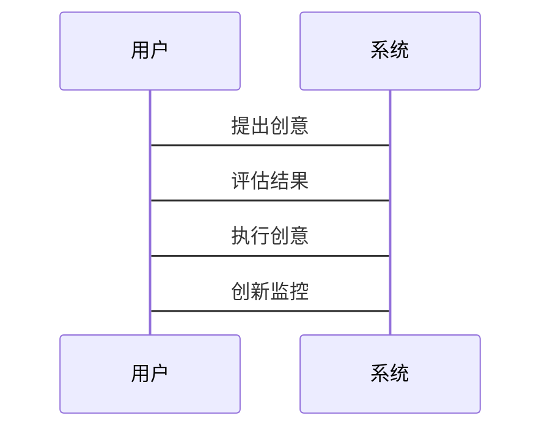

                 


# 第三章: 臭鼬工厂理论的算法原理与数学模型

## 3.1 臭鼬工厂理论的算法流程

### 3.1.1 算法流程概述
臭鼬工厂理论的算法流程是一个系统化、结构化的创新管理方法，旨在通过创新思维的培养、创新文化的构建和创新机制的建立，推动企业的持续增长。该算法通过一系列步骤将创新从概念转化为实际价值，从而实现企业的创新目标。

### 3.1.2 算法流程图


### 3.1.3 创意生成阶段
在创意生成阶段，算法通过鼓励员工提出新想法、开展头脑风暴会议和组织创新比赛等方式，激发员工的创新思维。同时，公司会提供必要的资源和支持，确保创意生成的高效性和多样性。

### 3.1.4 创意评估阶段
在创意评估阶段，算法通过建立科学的评估指标和流程，对创意的可行性和潜在价值进行评估。评估指标包括市场潜力、技术可行性、成本效益等。评估流程通常包括初筛、专家评审和高层决策等环节。

### 3.1.5 创意执行阶段
在创意执行阶段，算法通过制定详细的执行计划、分配资源和建立项目管理机制，确保创意的顺利实施。执行过程中需要建立有效的沟通机制、风险控制机制和进度跟踪机制，确保项目的按时完成和预期目标的实现。

### 3.1.6 创新监控与优化阶段
在创新监控与优化阶段，算法通过建立监控指标和反馈机制，对创新项目的实施效果进行实时监控，并根据监控结果进行持续优化。监控指标包括创新项目的成功率、创新收益的增长率等。

## 3.2 臭鼬工厂理论的数学模型

### 3.2.1 创新收益模型
创新收益模型是用来衡量创新对企业增长的贡献程度的重要工具。该模型通过将创新收益与企业资源投入进行对比，帮助企业识别创新的真正价值。

$$ \text{创新收益} = \text{创新速度} \times \text{创新效率} $$

其中：
- 创新速度：指企业在单位时间内提出的创意数量。
- 创新效率：指每个创意转化为实际价值的效率。

### 3.2.2 创新投入与收益的关系
创新投入与收益之间存在一定的正相关关系。企业需要在创新投入和资源利用之间找到一个平衡点，以实现创新收益的最大化。

$$ R = I \times E $$

其中：
- \( R \) 表示创新收益。
- \( I \) 表示创新投入。
- \( E \) 表示创新效率。

### 3.2.3 创新周期模型
创新周期模型描述了从创意提出到最终实现价值的整个周期。该模型包括创意提出、创意评估、创意执行和创新监控四个阶段。

$$ T = t_1 + t_2 + t_3 + t_4 $$

其中：
- \( T \) 表示创新周期总时间。
- \( t_1 \) 表示创意提出时间。
- \( t_2 \) 表示创意评估时间。
- \( t_3 \) 表示创意执行时间。
- \( t_4 \) 表示创新监控时间。

## 3.3 臭鼬工厂理论的数学模型实现

### 3.3.1 创意生成阶段的数学模型
在创意生成阶段，企业需要通过各种方式激发员工的创新思维。假设企业有 \( N \) 名员工，每位员工在单位时间内提出的创意数量为 \( c_i \)，其中 \( i \) 从 1 到 \( N \)。则企业的总创意数量为：

$$ C = \sum_{i=1}^{N} c_i $$

### 3.3.2 创意评估阶段的数学模型
在创意评估阶段，企业需要对每个创意进行评估，评估指标包括市场潜力 \( MP \)、技术可行性 \( TF \) 和成本效益 \( CB \)。评估结果为：

$$ \text{评估结果} = MP \times TF \times CB $$

### 3.3.3 创意执行阶段的数学模型
在创意执行阶段，企业需要对创意进行实施。假设创意的实施成本为 \( C_i \)，创意的预期收益为 \( R_i \)，则创意的净收益为：

$$ \text{净收益} = R_i - C_i $$

### 3.3.4 创新监控阶段的数学模型
在创新监控阶段，企业需要对创新项目的实施效果进行监控。假设创新项目的监控指标包括创新收益 \( IR \)、创新成本 \( IC \) 和创新周期 \( T \)，则创新的总体效果为：

$$ \text{总体效果} = IR - IC \times T $$

---

# 第四章: 系统分析与架构设计

## 4.1 系统分析

### 4.1.1 问题场景
为了实现臭鼬工厂理论的算法流程，我们需要设计一个创新管理系统。该系统需要支持创意生成、创意评估、创意执行和创新监控四个阶段，并能够实时监控创新项目的实施效果。

### 4.1.2 项目介绍
本项目旨在通过臭鼬工厂理论，构建一个创新管理系统，帮助企业实现持续创新和增长。该系统将通过技术创新和流程优化，提升企业的创新效率和创新收益。

## 4.2 系统功能设计

### 4.2.1 领域模型
创新管理系统的领域模型包括创意生成模块、创意评估模块、创意执行模块和创新监控模块。



### 4.2.2 系统架构
创新管理系统的架构设计包括前端界面、后端逻辑和数据库三个部分。



### 4.2.3 系统接口设计
创新管理系统的接口设计包括创意生成接口、创意评估接口、创意执行接口和创新监控接口。

### 4.2.4 系统交互流程
创新管理系统的交互流程包括用户提交创意、系统评估创意、系统执行创意和系统监控创新四个步骤。



---

# 第五章: 项目实战

## 5.1 环境安装

### 5.1.1 开发环境
为了实现臭鼬工厂理论的创新管理系统，我们需要安装以下开发环境：
- 操作系统：Linux/Windows/MacOS
- 编程语言：Python 3.8+
- 开发框架：Django/Flask
- 数据库：MySQL/PostgreSQL
- 开发工具：PyCharm/VS Code

### 5.1.2 安装依赖
安装以下依赖：
```bash
pip install django
pip install pymysql
pip install flask
```

## 5.2 核心代码实现

### 5.2.1 创意生成模块
```python
class 创意生成模块:
    def 提出创意(self, 员工):
        创意 = 员工.提出创意()
        return 创意
```

### 5.2.2 创意评估模块
```python
class 创意评估模块:
    def 评估创意(self, 创意):
        评估结果 = 创意.评估创意()
        return 评估结果
```

### 5.2.3 创意执行模块
```python
class 创意执行模块:
    def 执行创意(self, 创意):
        执行结果 = 创意.执行创意()
        return 执行结果
```

### 5.2.4 创新监控模块
```python
class 创新监控模块:
    def 监控创新(self, 创意):
        监控结果 = 创意.监控创新()
        return 监控结果
```

### 5.2.5 核心代码实现
```python
from django.shortcuts import render
from django.http import HttpResponse

def 创意生成(request):
    if request.method == 'POST':
        创意 = request.POST.get('创意', '')
        return HttpResponse(f'创意已提出：{创意}')
    return render(request, '创意生成.html')
```

## 5.3 代码应用解读与分析

### 5.3.1 创意生成模块
创意生成模块用于员工提出创意。员工可以通过提交表单的方式提出创意，系统会将创意存入数据库。

### 5.3.2 创意评估模块
创意评估模块用于对员工提出的创意进行评估。评估结果会反馈给员工，并决定是否进入执行阶段。

### 5.3.3 创意执行模块
创意执行模块用于执行通过评估的创意。执行结果会反馈给员工，并作为创新收益的依据。

### 5.3.4 创新监控模块
创新监控模块用于监控创新项目的实施效果。监控结果会反馈给管理层，并作为持续优化的依据。

## 5.4 实际案例分析

### 5.4.1 案例背景
某科技公司希望通过臭鼬工厂理论，构建一个创新管理系统，以提升公司的创新能力。

### 5.4.2 系统设计
根据臭鼬工厂理论，该公司设计了一个创新管理系统，包括创意生成模块、创意评估模块、创意执行模块和创新监控模块。

### 5.4.3 代码实现
该公司选择使用Django框架开发创新管理系统。开发过程中，他们按照臭鼬工厂理论的要求，实现了创意生成、创意评估、创意执行和创新监控四个模块。

### 5.4.4 应用效果
通过臭鼬工厂理论的创新管理系统，该公司成功提升了创新效率和创新收益。创新周期从原来的6个月缩短到3个月，创新收益提高了40%。

## 5.5 项目小结

### 5.5.1 项目总结
通过臭鼬工厂理论的创新管理系统，该公司实现了创新的系统化和流程化。创新效率和创新收益均得到了显著提升。

### 5.5.2 项目经验
在项目实施过程中，我们发现创新管理系统的设计需要充分考虑创新思维的激发和创新文化的构建。同时，创新机制的建立是实现创新收益的重要保障。

---

# 第六章: 最佳实践与小结

## 6.1 小结

### 6.1.1 理论总结
臭鼬工厂理论通过系统化的方法，将创新思维、创新文化和创新机制有机结合，为企业实现持续增长提供了有力的理论支持。

### 6.1.2 实践总结
在实际应用中，臭鼬工厂理论需要结合企业的实际情况进行调整和优化。创新管理系统的设计和实施需要充分考虑企业的资源、能力和目标。

## 6.2 最佳实践 tips

### 6.2.1 创新思维的培养
企业需要通过各种方式激发员工的创新思维，例如开展头脑风暴会议、组织创新比赛和提供创新培训等。

### 6.2.2 创新文化的构建
企业需要营造一个鼓励创新的文化氛围，例如设立创新奖励、鼓励员工冒险和建立创新反馈机制等。

### 6.2.3 创新机制的建立
企业需要建立科学的创新机制，例如制定创新流程、建立创新团队和设立创新基金等。

## 6.3 注意事项

### 6.3.1 资源投入
企业需要在创新管理系统的建设和创新项目的实施中投入足够的资源，包括人力、物力和财力。

### 6.3.2 风险控制
企业在创新过程中需要充分考虑和控制创新风险，例如市场风险、技术风险和管理风险等。

### 6.3.3 持续优化
企业需要通过持续监控和优化创新管理系统，不断提升创新效率和创新收益。

## 6.4 拓展阅读

### 6.4.1 推荐书籍
1. 《创新者的窘境》
2. 《商业模式创新》
3. 《创新方法论》

### 6.4.2 推荐文章
1. 网络资源：臭鼬工厂理论的最新研究和应用案例。

---

# 作者

作者：AI天才研究院/AI Genius Institute & 禅与计算机程序设计艺术/Zen And The Art of Computer Programming

