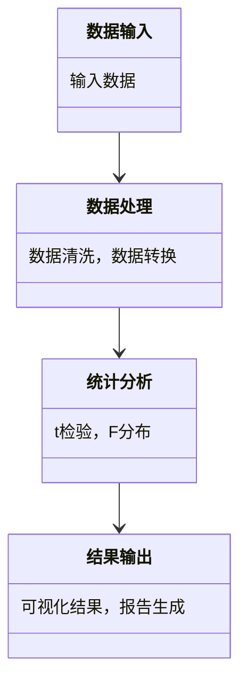
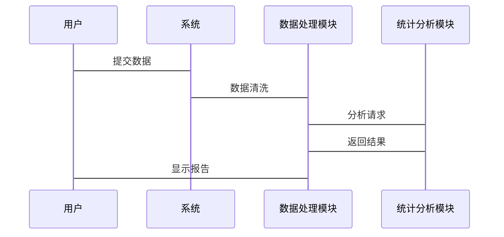

                 


# 费雪的产业发展趋势分析

> 关键词：费雪，统计方法，产业发展趋势，数据分析，趋势预测，统计检验

> 摘要：本文系统地介绍了费雪的统计方法及其在产业发展趋势分析中的应用。通过详细阐述费雪的t检验和F分布理论，结合实际案例分析，展示了这些方法在现代产业数据分析中的优势。文章还探讨了如何将费雪方法与其他数据分析技术结合，以更准确地预测产业趋势。最后，总结了费雪方法在产业发展中的重要性，并展望了未来的发展方向。

---

## 第一部分：费雪的产业发展趋势分析基础

### 第1章：费雪的统计方法与产业发展趋势分析

#### 1.1 费雪的统计方法概述

##### 1.1.1 费雪的背景与贡献

费雪（Fisher）是20世纪著名的统计学家，他在统计学领域做出了许多开创性的工作。费雪提出的t检验和F分布理论为现代统计学奠定了基础，广泛应用于科学实验和数据分析领域。他的工作不仅推动了统计学的发展，也为 industries trend analysis 提供了重要的方法论支持。

##### 1.1.2 费雪统计方法的核心思想

费雪的统计方法以假设检验为核心，强调通过概率论来推断数据背后的趋势和规律。他提出的t检验用于比较两组数据的均值差异，而F分布则用于分析多个组别之间的差异。这些方法在产业发展趋势分析中，可以帮助我们识别行业中的关键趋势和潜在风险。

##### 1.1.3 费雪方法在产业发展中的应用

费雪的方法在金融、经济、医疗等多个领域得到了广泛应用。特别是在产业分析中，费雪的t检验和F分布被用来分析不同产业之间的差异，以及同一产业在不同时间点的变化趋势。

#### 1.2 产业发展趋势分析的背景

##### 1.2.1 产业分析的基本概念

产业分析是指对某一行业或市场的整体情况进行研究，包括市场规模、竞争格局、发展趋势等。通过对产业数据的分析，可以帮助企业和投资者做出更明智的决策。

##### 1.2.2 产业发展趋势的定义与分类

产业发展趋势是指在一定时期内，行业或市场的主要变化方向。这些趋势可以分为长期趋势、中期趋势和短期趋势，也可以根据影响因素分为技术驱动、政策驱动和市场驱动等类型。

##### 1.2.3 产业发展趋势分析的意义

准确的趋势分析可以帮助企业把握市场动向，优化资源配置，规避风险。同时，趋势分析也是政策制定者制定产业政策的重要依据。

#### 1.3 费雪方法与产业发展趋势分析的结合

##### 1.3.1 费雪方法在趋势分析中的优势

费雪的统计方法以其严谨性和科学性著称。通过t检验和F分布，可以有效地识别数据中的显著差异和趋势，为产业分析提供可靠的支持。

##### 1.3.2 费雪方法与现代数据分析技术的融合

随着大数据技术的发展，费雪的统计方法与现代数据分析技术（如机器学习）相结合，进一步提升了趋势分析的准确性和深度。

##### 1.3.3 产业发展趋势分析的实际案例

以某行业为例，通过费雪的t检验分析不同市场区域的销售差异，利用F分布识别影响产业发展的关键因素。

#### 1.4 本章小结

本章介绍了费雪的统计方法及其在产业发展趋势分析中的应用，强调了这些方法在现代数据分析中的重要性。

---

## 第二部分：费雪统计方法的核心原理

### 第2章：费雪统计方法的核心原理

#### 2.1 费雪的t检验方法

##### 2.1.1 t检验的基本原理

t检验是一种用于比较两组数据均值差异的统计方法。其基本假设是两组数据来自正态分布的总体，并且方差相等。

##### 2.1.2 t检验的数学公式推导

假设两组数据的样本均值分别为$\bar{x}_1$和$\bar{x}_2$，样本标准差分别为$s_1$和$s_2$，样本容量分别为$n_1$和$n_2$。t检验的统计量为：

$$
t = \frac{\bar{x}_1 - \bar{x}_2}{\sqrt{\frac{s_1^2}{n_1} + \frac{s_2^2}{n_2}}}
$$

##### 2.1.3 t检验在产业分析中的应用

例如，在分析不同地区同一产业的销售数据时，可以通过t检验判断是否存在显著差异。

#### 2.2 费雪的F分布理论

##### 2.2.1 F分布的定义与性质

F分布用于比较两组数据的方差比。其概率密度函数为：

$$
f(F) = \frac{1}{\beta} \left( \frac{F}{\beta} \right)^{\nu_1/2 - 1} \left(1 + \frac{F}{\alpha}\right)^{-(\nu_1 + \nu_2)/2}
$$

其中，$\alpha$和$\beta$是形状参数，$\nu_1$和$\nu_2$是自由度。

##### 2.2.2 F分布在产业分析中的应用

例如，在分析多个市场区域的销售数据时，可以通过F分布判断是否存在显著差异。

#### 2.3 费雪方法的统计假设检验

##### 2.3.1 统计假设检验的基本步骤

1. 建立原假设和备择假设。
2. 计算检验统计量。
3. 确定显著性水平，查找临界值。
4. 判断是否拒绝原假设。

##### 2.3.2 费雪方法在假设检验中的应用

通过假设检验，可以判断产业数据中的趋势是否具有统计显著性。

##### 2.3.3 实际案例分析

以某行业为例，通过假设检验分析某政策对产业趋势的影响。

#### 2.4 本章小结

本章详细讲解了费雪的t检验和F分布的原理及其在统计假设检验中的应用。

---

## 第三部分：费雪方法在产业发展趋势分析中的应用

### 第3章：费雪方法在产业发展趋势分析中的应用

#### 3.1 产业发展趋势分析的常用方法

##### 3.1.1 时间序列分析

时间序列分析通过研究数据随时间的变化趋势，预测未来的产业发展方向。

##### 3.1.2 回归分析

回归分析用于研究变量之间的关系，帮助识别影响产业趋势的关键因素。

##### 3.1.3 聚类分析

聚类分析用于将相似的产业或市场区域归为一类，便于分析和比较。

#### 3.2 费雪方法与其他分析方法的对比

##### 3.2.1 费雪方法与时间序列分析的对比

费雪方法注重数据的统计显著性，而时间序列分析更注重趋势的连续性。

##### 3.2.2 费雪方法与回归分析的对比

费雪方法用于检验变量之间的关系，而回归分析用于建模变量之间的关系。

##### 3.2.3 费雪方法与聚类分析的对比

费雪方法用于检验差异，而聚类分析用于发现相似性。

#### 3.3 费雪方法在实际产业分析中的应用案例

##### 3.3.1 某行业趋势分析案例

以某行业为例，通过费雪的t检验分析不同市场区域的销售数据。

##### 3.3.2 案例分析的步骤与方法

1. 收集数据。
2. 建立假设。
3. 计算检验统计量。
4. 判断显著性。
5. 得出结论。

##### 3.3.3 案例分析的结果与启示

通过分析，识别出影响产业发展的关键因素，并为企业制定策略提供依据。

#### 3.4 本章小结

本章通过实际案例展示了费雪方法在产业发展趋势分析中的应用，并对比了其他方法。

---

## 第四部分：系统分析与架构设计

### 第4章：系统分析与架构设计方案

#### 4.1 问题场景介绍

我们希望通过构建一个系统，利用费雪的统计方法分析多个产业的趋势。

#### 4.2 项目介绍

系统名称：费雪产业趋势分析系统。

#### 4.3 系统功能设计

##### 4.3.1 领域模型（mermaid 类图）



#### 4.4 系统架构设计

##### 4.4.1 系统架构图（mermaid 架构图）


#### 4.5 系统接口设计

##### 4.5.1 接口描述

1. 数据输入接口：接收产业数据。
2. 数据处理接口：清洗和转换数据。
3. 统计分析接口：执行t检验和F分布。
4. 结果输出接口：生成可视化结果和报告。

#### 4.6 系统交互设计

##### 4.6.1 交互流程（mermaid 序列图）



#### 4.7 本章小结

本章设计了一个基于费雪方法的产业趋势分析系统，并通过mermaid图展示了系统的架构和交互流程。

---

## 第五部分：项目实战

### 第5章：项目实战

#### 5.1 项目环境安装

##### 5.1.1 安装Python

安装Python 3.x版本，推荐使用Anaconda。

##### 5.1.2 安装依赖库

安装numpy、pandas、scipy、matplotlib等库。

#### 5.2 系统核心实现源代码

##### 5.2.1 数据处理代码

```python
import numpy as np
import pandas as pd
from scipy import stats

# 示例数据
data = {
    'Market': ['A', 'A', 'B', 'B', 'B', 'C', 'C', 'C', 'C'],
    'Sales': [10, 12, 8, 9, 11, 7, 6, 8, 9]
}

df = pd.DataFrame(data)
```

##### 5.2.2 统计分析代码

```python
# 分组计算均值和标准差
grouped = df.groupby('Market')
means = grouped['Sales'].mean()
std_devs = grouped['Sales'].std()

# t检验
t_stat, p_val = stats.ttest_ind(grouped.get_group('A')['Sales'], grouped.get_group('B')['Sales'])

print(f"t统计量: {t_stat}, p值: {p_val}")
```

##### 5.2.3 可视化代码

```python
import matplotlib.pyplot as plt

means.plot.bar()
plt.title('Sales by Market')
plt.ylabel('Mean Sales')
plt.show()
```

#### 5.3 代码应用解读与分析

通过上述代码，我们可以分别计算各市场的均值和标准差，并执行t检验以判断市场之间是否存在显著差异。可视化结果直观展示了各市场的销售趋势。

#### 5.4 实际案例分析

以某行业为例，通过上述代码分析不同市场的销售数据，判断是否存在显著差异，并生成可视化报告。

#### 5.5 项目小结

本章通过实际案例展示了如何利用Python代码实现基于费雪方法的产业趋势分析。

---

## 第六部分：总结与展望

### 第6章：总结与展望

#### 6.1 总结

本文系统地介绍了费雪的统计方法及其在产业发展趋势分析中的应用。通过详细讲解t检验和F分布的原理，并结合实际案例，展示了这些方法在现代数据分析中的重要性。

#### 6.2 小结

费雪的统计方法以其严谨性和科学性著称，为产业发展趋势分析提供了重要的方法论支持。

#### 6.3 注意事项

在实际应用中，需要注意数据的假设条件，如正态性检验和方差齐性检验。

#### 6.4 拓展阅读

推荐阅读费雪的经典著作《The Design of Experiments》以及现代统计学相关书籍。

---

## 作者信息

作者：AI天才研究院/AI Genius Institute & 禅与计算机程序设计艺术 /Zen And The Art of Computer Programming

