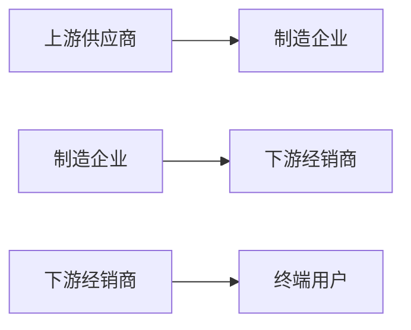
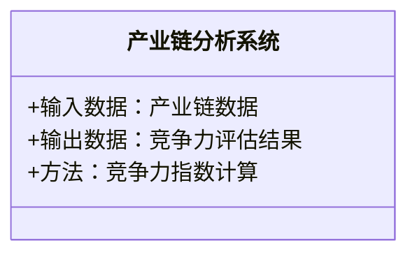
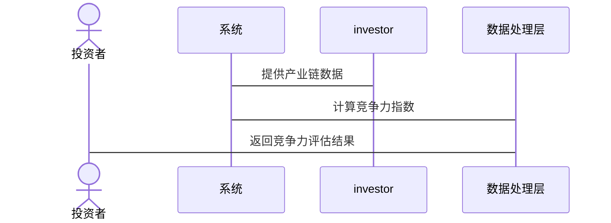

                 


# 费雪的产业链分析方法

> 关键词：费雪产业链分析方法、投资分析、产业链结构、竞争力评估、投资策略

> 摘要：费雪的产业链分析方法是一种基于投资分析的经典方法，通过对产业链的结构和关键环节的深入分析，评估企业的竞争力和投资价值。本文系统地介绍费雪产业链分析方法的核心概念、算法原理、系统架构设计以及实际项目案例，帮助读者掌握这一方法的应用技巧。

---

## 第一部分: 费雪的产业链分析方法基础

### 第1章: 产业链分析的定义与背景

#### 1.1 产业链的基本概念

- **1.1.1 产业链的定义**
  产业链是指从原材料供应到最终产品的生产和销售所形成的链条结构，包括上游供应商、中游制造企业以及下游经销商等环节。

- **1.1.2 产业链的构成要素**
  - 上游供应商：提供原材料或基础零部件的企业。
  - 中游制造企业：负责产品加工和组装的企业。
  - 下游经销商：将产品销售给终端用户的渠道。
  - 终端用户：最终消费者或使用产品的企业。

- **1.1.3 产业链的分类与特点**
  - 行业分类：如制造业、服务业、信息技术产业等。
  - 特点：上下游关系紧密，环节间依赖性强，整体竞争力取决于关键环节的表现。

#### 1.2 产业链分析的重要性

- **1.2.1 产业链分析在投资中的作用**
  - 帮助投资者识别行业中的关键环节，评估企业的竞争优势。
  - 通过分析上下游关系，预测行业发展趋势和风险。

- **1.2.2 产业链分析的核心价值**
  - 提供清晰的行业结构图，便于制定投资策略。
  - 识别行业中的龙头企业，评估其市场地位。

- **1.2.3 产业链分析的边界与外延**
  - 边界：产业链的起点和终点，通常从原材料到最终产品。
  - 外延：产业链延伸到相关行业，如物流、金融等。

---

### 第2章: 费雪产业链分析方法的核心要素

#### 2.1 费雪分析方法的起源

- **2.1.1 费雪投资理念的形成**
  彼得·费雪是著名的投资经理，他提出了“成长股投资法”，强调通过分析企业的基本面来选择具有持续增长潜力的股票。

- **2.1.2 费雪方法的核心思想**
  - 重点关注企业的竞争优势，尤其是其在产业链中的地位。
  - 通过分析上下游关系，评估企业的盈利能力和成长潜力。

- **2.1.3 费雪方法与现代投资分析的关系**
  费雪方法为现代投资分析提供了重要的理论基础，尤其是在产业链分析方面。

#### 2.2 费雪产业链分析的核心概念

- **2.2.1 产业链的关键环节**
  - 关键环节是决定企业竞争力的核心部分，通常集中在制造环节或核心技术环节。

- **2.2.2 产业链的上下游关系**
  - 上游供应商的质量和稳定性直接影响制造企业的成本和产品质量。
  - 下游经销商的渠道能力决定产品的市场覆盖和销售能力。

- **2.2.3 产业链的竞争力评估**
  - 通过分析各个环节的市场地位、成本优势和技术优势，评估整个产业链的竞争力。

---

### 第3章: 产业链分析的核心概念与联系

#### 3.1 产业链分析的实体关系图



- 说明：该图展示了产业链的基本结构，包括上游供应商、制造企业、下游经销商和终端用户之间的关系。

#### 3.2 产业链关键环节对比分析

| 环节 | 特点 | 竞争优势 |
|------|------|----------|
| 上游供应商 | 资源控制 | 成本优势 |
| 中游制造企业 | 生产能力 | 技术优势 |
| 下游经销商 | 市场渠道 | 售后服务 |

- 说明：表格对比了产业链中不同环节的特点和竞争优势，帮助投资者识别关键环节。

#### 3.3 费雪方法中的关键点

- **3.3.1 关键环节的识别**
  - 通过分析产业链的结构，识别出对整体竞争力影响最大的环节。

- **3.3.2 环节间的关系分析**
  - 研究各个环节之间的依赖关系，评估其协同效应和潜在风险。

- **3.3.3 竞争力的评估指标**
  - 市场份额、产品品质、成本控制、技术优势等。

---

### 第4章: 费雪产业链分析的算法原理

#### 4.1 产业链竞争力评估模型


- 说明：该流程图展示了竞争力评估的基本流程，包括数据输入、指标计算和结果输出。

#### 4.2 竞争力指标计算公式

$$ 竞争力指数 = \frac{\sum (市场份额 + 品质优势 + 成本优势)}{3} $$

- 说明：该公式综合考虑了市场份额、品质优势和成本优势三个指标，计算出竞争力指数。

#### 4.3 算法实现

```python
def calculate_competition_index(share, quality, cost):
    return (share + quality + cost) / 3

# 示例数据
share = 0.3
quality = 0.8
cost = 0.5
index = calculate_competition_index(share, quality, cost)
print(f"竞争力指数: {index}")
```

- 说明：该代码示例展示了如何计算竞争力指数，帮助读者理解算法的实现过程。

---

### 第5章: 系统分析与架构设计

#### 5.1 问题场景介绍

- **问题背景**：假设我们需要分析消费电子行业的产业链，评估其竞争力。

- **项目介绍**：通过构建一个产业链分析系统，帮助投资者识别行业中的龙头企业。

#### 5.2 系统功能设计

- **领域模型**：



- **系统架构设计**：


- **系统接口设计**：系统需要与数据库、数据源等进行交互，提供API接口。

- **系统交互设计**：



---

### 第6章: 项目实战

#### 6.1 环境安装

- 需要安装Python、数据分析库（如Pandas、NumPy）和可视化工具（如Matplotlib）。

#### 6.2 核心实现代码

```python
import pandas as pd
import numpy as np

def calculate_competition_index(share, quality, cost):
    return (share + quality + cost) / 3

# 示例数据
data = {
    '公司': ['A', 'B', 'C'],
    '市场份额': [0.3, 0.4, 0.2],
    '品质优势': [0.8, 0.6, 0.7],
    '成本优势': [0.5, 0.4, 0.6]
}

df = pd.DataFrame(data)
df['竞争力指数'] = df.apply(lambda row: calculate_competition_index(row['市场份额'], row['品质优势'], row['成本优势']), axis=1)
print(df)
```

- 说明：该代码展示了如何使用Python进行竞争力指数计算，并生成结果表格。

#### 6.3 案例分析

- 以消费电子行业为例，分析某制造企业的竞争力指数，评估其投资价值。

---

### 第7章: 最佳实践与总结

#### 7.1 小结

- 费雪的产业链分析方法通过分析产业链的结构和关键环节，帮助投资者识别企业的竞争优势。

#### 7.2 注意事项

- 数据的准确性和完整性对分析结果影响重大。
- 需要结合行业特点调整分析模型。

#### 7.3 拓展阅读

- 推荐阅读彼得·费雪的经典著作，深入了解其投资理念。

---

作者：AI天才研究院/AI Genius Institute & 禅与计算机程序设计艺术 /Zen And The Art of Computer Programming

