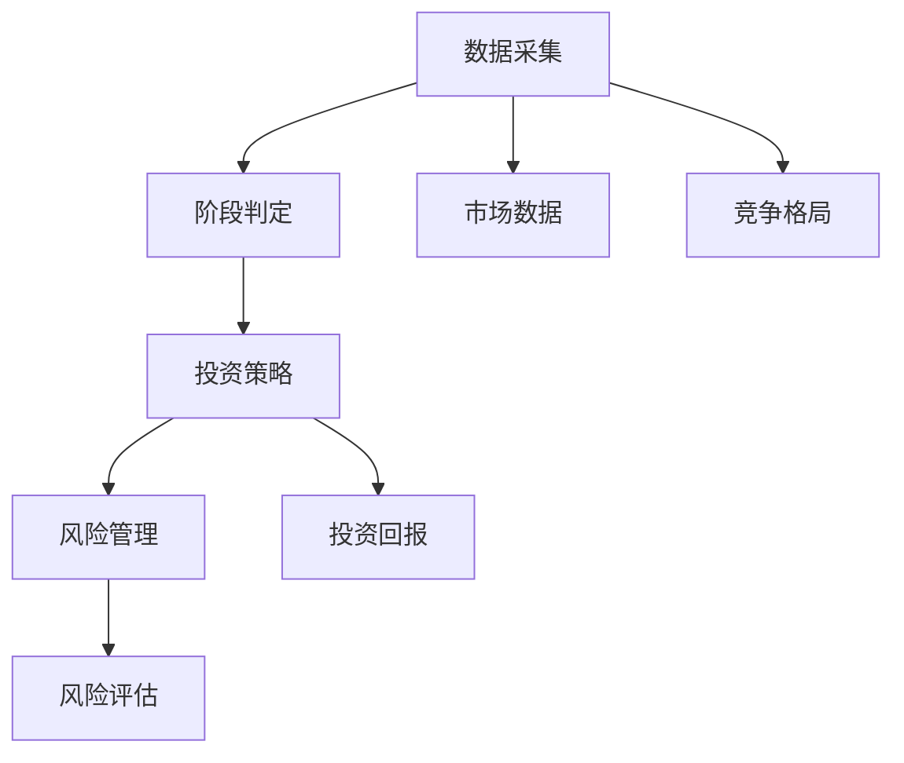

                 


# 《费雪的产品生命周期分析在投资中的应用》

## 关键词：费雪、产品生命周期、投资、风险管理、系统架构、算法原理

## 摘要：  
本文深入探讨了费雪提出的产品生命周期分析在投资决策中的应用，从理论基础、分析模型、系统架构到实际案例，逐步展开分析，揭示如何通过产品生命周期理论优化投资策略。文章结合数学模型、算法原理和系统设计，为投资者提供一套科学的投资分析框架，帮助他们在不同市场环境下制定有效的投资策略。

---

# 第一部分: 费雪的产品生命周期分析基础

## 第1章: 费雪产品生命周期分析的背景与核心概念

### 1.1 费雪产品生命周期分析的背景

#### 1.1.1 产品生命周期理论的起源与发展  
产品生命周期理论是20世纪中叶由美国经济学家菲利普·费雪提出的，旨在通过分析产品的市场生命周期阶段，为企业和投资者提供决策依据。费雪认为，产品的市场表现与其生命周期阶段密切相关，投资者可以通过识别产品所处阶段，制定相应的投资策略。  

#### 1.1.2 费雪对产品生命周期理论的贡献  
费雪在产品生命周期理论中引入了“阶段分析法”，将产品生命周期划分为引入期、成长期、成熟期和衰退期四个阶段，并提出了每个阶段的特征与投资策略。这种划分方法为后续的投资分析提供了理论基础。  

#### 1.1.3 产品生命周期分析在投资中的应用价值  
通过分析产品的生命周期阶段，投资者可以更好地判断市场的波动趋势，优化投资组合，降低投资风险。费雪的产品生命周期分析为投资者提供了一种系统化的投资工具，尤其在科技、消费和医药等行业具有重要意义。  

### 1.2 产品生命周期的核心概念

#### 1.2.1 产品生命周期的定义与特征  
产品生命周期是指产品从进入市场到退出市场的全过程，通常包括引入期、成长期、成熟期和衰退期。每个阶段的市场表现和投资价值具有显著差异。  

#### 1.2.2 费雪产品生命周期模型的结构  
费雪的产品生命周期模型将产品生命周期划分为四个阶段，并强调每个阶段的投资策略。模型通过分析产品的市场表现、供需关系和竞争格局，帮助投资者识别投资机会和风险。  

#### 1.2.3 产品生命周期与投资决策的关系  
产品生命周期阶段直接影响产品的市场表现和投资价值。例如，在引入期，产品市场风险较高，但潜在回报也较大；在衰退期，产品市场风险较低，但回报也较为有限。投资者需要根据产品所处阶段，制定相应的投资策略。  

### 1.3 费雪产品生命周期分析的框架

#### 1.3.1 产品生命周期的四个阶段  
1. **引入期**：产品刚进入市场，市场需求较低，竞争压力较小。  
2. **成长期**：市场需求迅速增长，产品逐渐被市场接受。  
3. **成熟期**：市场需求趋于稳定，竞争压力增大。  
4. **衰退期**：市场需求逐渐下降，产品逐渐退出市场。  

#### 1.3.2 每个阶段的特征与投资策略  
1. **引入期**：投资者需关注产品的创新性和市场潜力，风险较高，回报不确定性较大。  
2. **成长期**：投资者可增加投资，分享市场增长的红利。  
3. **成熟期**：投资者需关注行业竞争格局，选择具有竞争优势的企业。  
4. **衰退期**：投资者需逐步退出，避免市场风险。  

#### 1.3.3 生命周期模型的边界与外延  
费雪的产品生命周期模型不仅适用于单一产品，还可扩展至行业和经济周期分析，帮助投资者更好地把握市场趋势。  

---

## 第2章: 费雪产品生命周期分析的核心原理

### 2.1 产品生命周期的数学模型

#### 2.1.1 生命周期各阶段的数学表达  
产品生命周期的数学模型通过函数和参数描述各阶段的特征，例如引入期的市场需求函数和成长期的市场增长率模型。  

#### 2.1.2 产品生命周期的阶段划分标准  
通过数学模型分析市场需求增长率、市场份额变化率等指标，确定产品所处的生命周期阶段。  

#### 2.1.3 生命周期模型的参数解释  
模型参数包括市场需求弹性、成本结构、竞争程度等，这些参数影响产品的市场表现和投资价值。  

### 2.2 费雪产品生命周期分析的属性特征对比

#### 2.2.1 生命周期各阶段的特征对比表格  
| 阶段 | 市场需求 | 竞争程度 | 投资风险 | 投资回报 |
|------|----------|----------|----------|----------|
| 引入期 | 低       | 低       | 高       | 高       |
| 成长期 | 高       | 中       | 中       | 高       |
| 成熟期 | 稳定     | 高       | 低       | 中       |
| 衰退期 | 低       | 高       | 高       | 低       |

#### 2.2.2 生命周期阶段与投资策略的对应关系  
- 引入期：高风险、高回报，适合风险偏好较高的投资者。  
- 成长期：风险和回报均适中，适合大多数投资者。  
- 成熟期：低风险、稳定回报，适合保守型投资者。  
- 衰退期：高风险、低回报，适合风险承受能力较低的投资者。  

#### 2.2.3 生命周期模型的ER实体关系图  
```mermaid
er
    actor 投资者
    actor 市场数据
    actor 竞争格局
    entity 产品生命周期阶段
    entity 投资策略
    entity 市场风险
    entity 投资回报
    投资者 --> 产品生命周期阶段: 分析阶段
    投资者 --> 投资策略: 制定策略
    市场数据 --> 产品生命周期阶段: 提供数据
    竞争格局 --> 投资策略: 影响策略
```

### 2.3 费雪产品生命周期分析的算法原理

#### 2.3.1 生命周期阶段的判定算法  
通过市场需求增长率、市场份额变化率等指标，结合数学模型，判断产品所处的生命周期阶段。  

#### 2.3.2 投资策略的选择算法  
根据产品生命周期阶段，选择相应的投资策略，例如在引入期选择高风险高回报的投资组合。  

#### 2.3.3 生命周期模型的优化算法  
通过调整模型参数和优化算法，提高产品生命周期阶段判定的准确性和投资策略的科学性。  

---

## 第3章: 费雪产品生命周期分析的系统架构

### 3.1 系统分析与架构设计

#### 3.1.1 产品生命周期分析的系统功能模块  
1. 数据采集模块：收集市场数据、竞争格局等信息。  
2. 阶段判定模块：通过算法判断产品所处的生命周期阶段。  
3. 投资策略模块：根据阶段结果制定投资策略。  
4. 风险管理模块：评估和管理投资风险。  

#### 3.1.2 系统架构的Mermaid架构图  


#### 3.1.3 系统接口的设计与交互流程  
系统接口包括数据输入接口、算法调用接口和结果输出接口，实现模块间的高效交互和数据传递。  

### 3.2 系统实现与案例分析

#### 3.2.1 系统环境的安装与配置  
- 安装Python环境，配置相关库（如numpy、pandas、scikit-learn）。  
- 数据采集工具的安装与配置。  

#### 3.2.2 核心算法的Python源代码  
```python
import numpy as np
import pandas as pd
from sklearn import metrics

def productLifecycleAnalysis(data):
    # 数据预处理
    data = data.dropna()
    # 阶段判定
    growth_rates = data['market_growth'].values
    stage = []
    for gr in growth_rates:
        if gr > 0.3:
            stage.append('成长期')
        elif gr > 0:
            stage.append('成熟期')
        else:
            stage.append('衰退期')
    return stage

# 示例数据
data = pd.DataFrame({
    'market_growth': [0.4, 0.2, 0.1, -0.1]
})
result = productLifecycleAnalysis(data)
print(result)  # 输出：['成长期', '成熟期', '成熟期', '衰退期']
```

#### 3.2.3 代码应用解读与分析  
上述代码通过市场需求增长率判断产品所处的生命周期阶段，投资者可根据阶段结果制定相应的投资策略。  

#### 3.2.4 实际案例分析  
以某科技公司为例，分析其产品生命周期阶段，并制定相应的投资策略。  

---

## 第4章: 费雪产品生命周期分析的系统优化与风险管理

### 4.1 系统优化策略  
- 数据采集的优化：引入实时数据和更丰富的市场指标。  
- 算法优化：改进阶段判定算法，提高准确率。  

### 4.2 风险管理策略  
- 情景分析：分析不同市场环境下的投资风险。  
- 压力测试：评估极端市场条件下的投资组合表现。  
- 动态调整：根据市场变化及时调整投资策略。  

---

## 第5章: 费雪产品生命周期分析的行业应用与拓展

### 5.1 科技行业的应用  
- 分析科技产品的生命周期阶段，制定投资策略。  
- 案例：苹果、谷歌等科技公司的产品生命周期分析。  

### 5.2 消费行业的应用  
- 分析消费品的生命周期阶段，优化投资组合。  
- 案例：可口可乐、宝洁等消费品公司的产品生命周期分析。  

### 5.3 医药行业的应用  
- 分析药品的生命周期阶段，制定投资策略。  
- 案例：辉瑞、强生等医药公司的产品生命周期分析。  

### 5.4 周期性行业的应用  
- 分析周期性产品的生命周期阶段，优化投资策略。  
- 案例：钢铁、汽车等周期性行业的产品生命周期分析。  

---

## 第6章: 费雪产品生命周期分析的总结与展望

### 6.1 总结  
费雪的产品生命周期分析为投资者提供了一种系统化的投资工具，帮助其在不同市场环境下制定有效的投资策略。  

### 6.2 展望  
未来，随着人工智能和大数据技术的发展，费雪的产品生命周期分析将更加精准和高效，为投资者提供更有力的支持。  

---

## 作者：AI天才研究院/AI Genius Institute & 禅与计算机程序设计艺术 /Zen And The Art of Computer Programming

