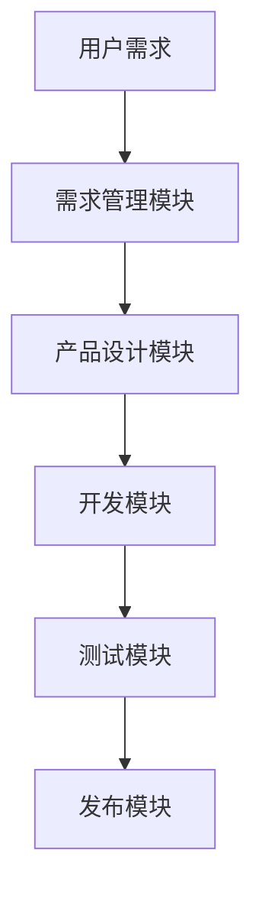

                 

# 费雪的产品生命周期分析：快速迭代时代的新思路

## 关键词：产品生命周期、快速迭代、产品管理、敏捷开发、创新策略

## 摘要：  
在快速迭代的时代，传统的 product lifecycle management (PLM) 方法面临新的挑战和机遇。本文深入分析了费雪的产品生命周期理论，探讨了如何在现代快速迭代的环境中优化产品管理策略。通过结合敏捷开发、持续交付和系统工程的方法，本文提出了新的思路，为产品经理和开发团队提供了实用的工具和最佳实践。

---

## 第一部分：产品生命周期概述

### 第1章：产品生命周期的定义与特点

#### 1.1 产品生命周期的定义与特点  
产品生命周期 (Product Lifecycle) 是指产品从构思、开发、上市、成熟到最终退市的整个过程。传统的 PLM 包括四个阶段：导入期、成长期、成熟期和衰退期。每个阶段都有其独特的特征和管理重点。

#### 1.2 快速迭代时代的挑战与机遇  
在快速迭代的时代，市场需求变化迅速，竞争激烈。传统 PLM 的线性模式已不足以应对这些变化。企业需要更加灵活、动态的管理方法，以快速响应市场反馈并优化产品。

---

## 第二部分：产品生命周期的阶段分析

### 第2章：导入期的策略与挑战

#### 2.1 导入期的特点  
导入期是产品的初始阶段，目标是验证市场需求和产品可行性。  
- **特点**：市场需求不确定，成本高，风险大。  
- **策略**：快速验证假设，小步快跑， MVP（最小可行产品）开发。  

#### 2.2 导入期的风险与应对  
- **风险**：市场需求不符合预期，资源浪费。  
- **应对**：持续市场调研，迭代开发，及时调整方向。  

#### 2.3 导入期的数学模型  
在导入期，产品成功的概率可以通过以下公式计算：  
$$P_{\text{success}} = \frac{\text{市场需求匹配度} \times \text{产品创新度}}{\text{竞争环境复杂度}}$$  

---

### 第3章：成长期的策略与优化

#### 3.1 成长期的特点  
- **特点**：市场需求快速增长，竞争加剧。  
- **策略**：扩大市场份额，优化产品功能，提升用户体验。  

#### 3.2 成长期的竞争分析  
通过构建竞争分析矩阵（如 SWOT 分析），企业可以识别自身优势和劣势，并制定针对性策略。  

#### 3.3 成长期的数学模型  
在成长期，企业可以通过以下公式优化市场份额：  
$$\text{市场份额} = \frac{\text{产品优势} + \text{市场推广力度}}{\text{竞争对手优势} + \text{市场饱和度}}$$  

---

### 第4章：成熟期的优化与转型

#### 4.1 成熟期的特点  
- **特点**：市场需求稳定，竞争激烈，利润空间缩小。  
- **策略**：优化成本，提升效率，探索新的增长点。  

#### 4.2 成熟期的成本优化  
通过 lean manufacturing（精益生产）和 automation（自动化）技术，企业可以显著降低生产成本。  

#### 4.3 成熟期的数学模型  
成熟期的成本优化可以通过以下公式实现：  
$$\text{总成本} = \text{固定成本} + \text{可变成本} \times \text{生产量}$$  

---

## 第三部分：快速迭代时代的产品创新

### 第5章：快速迭代方法论

#### 5.1 快速迭代的核心原则  
- **小步快跑**：通过短周期开发，快速验证假设。  
- **持续交付**：持续向用户交付价值，获取反馈。  
- **数据驱动**：通过数据分析优化产品。  

#### 5.2 快速迭代的数学模型  
快速迭代的开发周期可以通过以下公式计算：  
$$T_{\text{iteration}} = \frac{\text{开发周期}}{n}$$  
其中，$n$ 是迭代次数。  

---

### 第6章：敏捷开发与产品管理

#### 6.1 敏捷开发的核心理念  
- **客户合作**：强调与客户的持续互动。  
- **响应变化**：拥抱变化，灵活调整开发方向。  

#### 6.2 敏捷开发的数学模型  
敏捷团队的效率可以通过以下公式衡量：  
$$E_{\text{agile}} = \frac{\text{团队生产力} \times \text{反馈频率}}{\text{开发周期}}$$  

---

## 第四部分：系统分析与架构设计

### 第7章：系统架构设计

#### 7.1 产品生命周期管理的系统架构  
通过系统架构图（如下图所示），我们可以清晰地看到各个模块之间的关系和数据流。  

---

## 第五部分：项目实战与案例分析

### 第8章：案例分析

#### 8.1 成功案例：某互联网公司的产品迭代  
- **背景**：通过快速迭代方法，该公司在一年内将用户活跃度提升了 30%。  
- **分析**：通过 MVP 开发和持续反馈，该公司成功找到了市场切入点。  

#### 8.2 失败案例：传统制造业的产品衰退  
- **背景**：由于未能及时响应市场需求变化，该公司在成熟期后迅速衰退。  
- **分析**：缺乏灵活的迭代机制是失败的主要原因。  

---

## 第六部分：未来趋势与总结

### 第9章：未来趋势

#### 9.1 人工智能在产品生命周期中的应用  
- **预测市场趋势**：通过 AI 分析市场数据，预测产品生命周期的变化。  
- **自动化决策**：利用机器学习优化产品策略。  

#### 9.2 数字化转型与产品管理  
- **数据驱动决策**：通过大数据分析优化产品生命周期管理。  
- **数字化工具的应用**：使用 PLM 软件实现全生命周期管理。  

---

## 总结

费雪的产品生命周期分析为我们提供了在快速迭代时代优化产品管理的思路。通过结合敏捷开发、持续交付和系统工程的方法，企业可以更好地应对市场变化，提升竞争力。未来，随着人工智能和数字化技术的发展，产品生命周期管理将更加智能化和高效化。

---

## 作者：AI天才研究院/AI Genius Institute & 禅与计算机程序设计艺术 /Zen And The Art of Computer Programming

