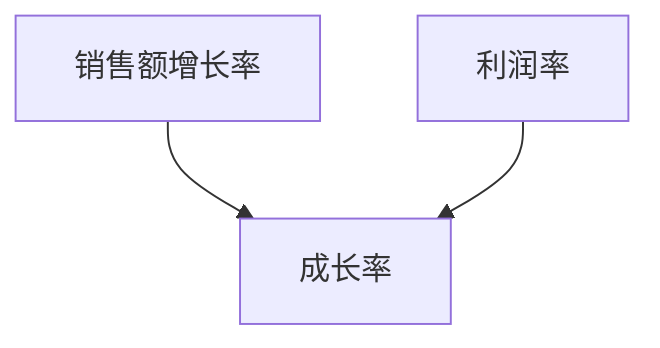
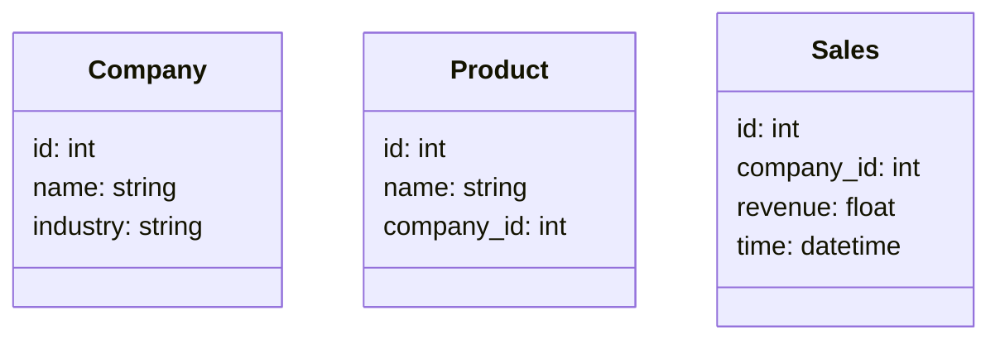
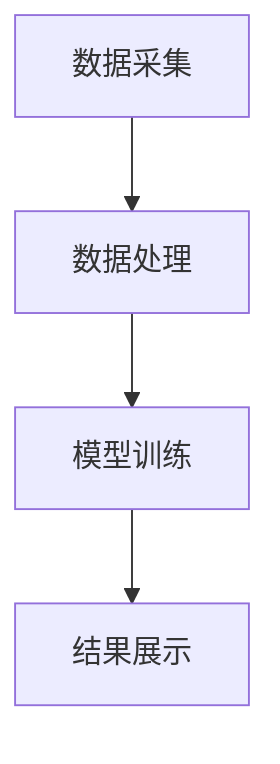
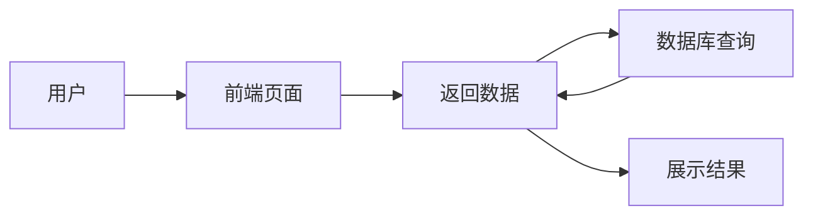

                 


# 费雪的产品生命周期分析：预测公司成长

**关键词：产品生命周期，费雪分析，公司成长，投资决策，市场竞争**

**摘要：**  
费雪的产品生命周期分析是一种通过分析产品在其市场生命周期的不同阶段，预测公司成长和投资价值的方法。本文详细介绍了费雪分析的基本原理、数学模型、数据处理方法，以及如何通过实际案例和系统架构设计来实现这一分析。文章还提供了完整的项目实战，帮助读者理解如何将费雪分析应用于实际投资决策和企业战略规划中。

---

# 费雪的产品生命周期分析：预测公司成长

## 第1章: 产品生命周期概述

### 1.1 产品生命周期的概念与特点
#### 1.1.1 产品生命周期的定义
产品生命周期（Product Life Cycle，PLC）指的是产品从进入市场到退出市场的整个过程。通常分为四个阶段：引入期（Introduction）、成长期（Growth）、成熟期（Maturity）和衰退期（Decline）。

#### 1.1.2 产品生命周期的四个阶段
| 阶段 | 特点 | 公司成长的影响 |
|------|------|----------------|
| 引入期 | 产品进入市场，需求较低，成本较高 | 初期投资大，利润低，但市场潜力大 |
| 成长期 | 销量迅速增长，成本下降 | 利润率上升，收入增长快 |
| 成熟期 | 销量稳定，竞争激烈 | 利润率趋于平稳，市场饱和 |
| 衰退期 | 销量下降，成本上升 | 利润率下降，市场被替代产品蚕食 |

#### 1.1.3 产品生命周期与公司成长的关系
产品生命周期的每个阶段都直接影响公司的财务表现和市场策略。例如，处于引入期的产品需要大量投资，而成熟期的产品则可能面临利润率下降的压力。

### 1.2 费雪分析法的基本原理
#### 1.2.1 费雪分析法的提出背景
费雪分析法由投资专家约翰·费雪提出，旨在通过分析产品生命周期的各个阶段，预测公司的未来成长和投资价值。

#### 1.2.2 费雪分析法的核心思想
费雪认为，产品的生命周期与其市场需求密切相关，通过分析产品在生命周期中的位置，可以预测公司的收入和利润变化。

#### 1.2.3 费雪分析法与其他分析方法的对比
| 方法 | 基于 | 优点 | 缺点 |
|------|------|-------|------|
| 费雪分析法 | 产品生命周期 | 预测准确性高 | 数据依赖性强 |
| 市盈率法 | 市场价格与净利润比值 | 简单易用 | 适用于稳定增长的企业 |
| ROE法 | 净资产收益率 | 反映盈利能力 | 未考虑成长性 |

### 1.3 产品生命周期分析的意义
#### 1.3.1 产品生命周期分析在投资决策中的作用
通过分析产品生命周期，投资者可以判断公司的成长潜力和投资价值。

#### 1.3.2 产品生命周期分析对企业发展战略的影响
帮助企业制定产品策略和市场进入策略，优化资源配置。

#### 1.3.3 产品生命周期分析在市场竞争中的应用
帮助企业识别市场机会和威胁，制定竞争策略。

### 1.4 本章小结
本章介绍了产品生命周期的基本概念和费雪分析法的核心思想，强调了产品生命周期分析在投资决策和企业发展中的重要性。

---

## 第2章: 费雪分析模型的核心要素

### 2.1 费雪分析模型的构成
#### 2.1.1 销售额增长率
销售额增长率是衡量产品市场表现的重要指标，通常用公式表示为：
$$ \text{销售额增长率} = \frac{\text{本期销售额} - \text{上期销售额}}{\text{上期销售额}} \times 100\% $$

#### 2.1.2 利润率
利润率反映产品的盈利能力，常用净利润率和销售利润率来衡量。

#### 2.1.3 市场占有率
市场占有率是公司产品在市场上的份额，可以用以下公式计算：
$$ \text{市场占有率} = \frac{\text{公司销售额}}{\text{市场总销售额}} \times 100\% $$

### 2.2 费雪模型的数学表达
#### 2.2.1 基本公式
费雪模型通过将销售额增长率和利润率结合起来，预测公司的成长率：
$$ \text{成长率} = \frac{\text{销售额增长率} + \text{利润率}}{1 + \text{销售额增长率}} $$

#### 2.2.2 模型的变量关系图


### 2.3 费雪模型的假设条件
#### 2.3.1 数据的连续性
模型假设产品生命周期的数据是连续的，没有重大市场波动干扰。

#### 2.3.2 市场环境的稳定
模型假设市场环境在分析期间保持稳定，没有政策或经济重大变化。

### 2.4 本章小结
本章详细讲解了费雪分析模型的构成要素及其数学表达，为后续的数据处理和建模奠定了基础。

---

## 第3章: 数据收集与预处理

### 3.1 数据收集方法
#### 3.1.1 数据来源
- 公司财务报表
- 市场调研报告
- 行业分析报告

#### 3.1.2 数据清洗步骤
- 处理缺失值
- 去除异常值
- 数据标准化

#### 3.1.3 数据可视化
使用Python的matplotlib库进行数据可视化：
```python
import matplotlib.pyplot as plt

plt.plot(time, revenue, label='Revenue')
plt.xlabel('Time')
plt.ylabel('Revenue')
plt.legend()
plt.show()
```

### 3.2 数据预处理
#### 3.2.1 时间序列数据的处理
将产品生命周期数据按时间排序，提取销售额和利润率等指标。

#### 3.2.2 数据特征工程
- 计算移动平均
- 添加滞后变量
- 处理季节性因素

### 3.3 数据存储与管理
#### 3.3.1 数据库设计
使用关系型数据库（如MySQL）存储公司和产品数据。

#### 3.3.2 数据库表结构


### 3.4 本章小结
本章介绍了数据收集与预处理的全过程，为后续建模提供了高质量的数据支持。

---

## 第4章: 建模与预测

### 4.1 建模方法
#### 4.1.1 线性回归模型
使用最小二乘法拟合数据，预测公司成长率：
$$ \hat{y} = a x + b $$

#### 4.1.2 时间序列模型
采用ARIMA模型预测未来销售额：
```python
from statsmodels.tsa.arima_model import ARIMA

model = ARIMA(data, order=(1,1,1))
model_fit = model.fit()
```

### 4.2 模型评估
#### 4.2.1 评估指标
- 均方误差（MSE）
- R平方值
- 残差分析

#### 4.2.2 模型调优
- 参数优化
- 模型交叉验证
- 模型鲁棒性测试

### 4.3 本章小结
本章详细讲解了建模方法和模型评估，展示了如何利用费雪分析模型进行公司成长预测。

---

## 第5章: 实际案例分析

### 5.1 案例背景
以某科技公司为例，分析其主打产品的生命周期。

### 5.2 数据分析
通过收集和处理该产品的销售数据，计算其销售额增长率和利润率。

### 5.3 模型预测
使用费雪模型预测公司未来3年的成长率。

### 5.4 结果解读
根据预测结果，调整投资策略和市场进入策略。

### 5.5 本章小结
本章通过实际案例展示了费雪分析模型的应用，帮助读者理解如何将理论应用于实践。

---

## 第6章: 系统架构设计

### 6.1 系统功能设计
#### 6.1.1 功能模块
- 数据采集模块
- 数据处理模块
- 模型训练模块
- 结果展示模块

#### 6.1.2 功能流程图


### 6.2 系统架构设计
#### 6.2.1 技术选型
- 前端：React
- 后端：Django
- 数据库：PostgreSQL

#### 6.2.2 系统架构图


### 6.3 接口设计
#### 6.3.1 RESTful API
- GET /api/data：获取数据
- POST /api/train：训练模型
- GET /api/predict：获取预测结果

### 6.4 交互流程图


### 6.5 本章小结
本章设计了完整的系统架构，展示了如何将费雪分析模型应用于实际系统中。

---

## 第7章: 项目实战

### 7.1 环境安装
#### 7.1.1 安装Python
```bash
python --version
pip install --upgrade pip
```

#### 7.1.2 安装依赖库
```bash
pip install numpy pandas matplotlib scikit-learn
```

### 7.2 核心代码实现
#### 7.2.1 数据处理代码
```python
import pandas as pd

data = pd.read_csv('data.csv')
data = data.dropna().reset_index(drop=True)
```

#### 7.2.2 模型训练代码
```python
from sklearn.linear_model import LinearRegression

model = LinearRegression()
model.fit(X_train, y_train)
```

#### 7.2.3 结果展示代码
```python
import matplotlib.pyplot as plt

plt.scatter(x_test, y_test, color='blue')
plt.plot(x_test, model.predict(x_test), color='red')
plt.xlabel('Time')
plt.ylabel('Growth Rate')
plt.show()
```

### 7.3 案例分析
以某公司为例，展示如何利用代码进行数据处理、模型训练和结果展示。

### 7.4 项目总结
通过项目实战，读者可以掌握费雪分析模型的实际应用方法，提升数据分析和建模能力。

### 7.5 本章小结
本章通过项目实战，帮助读者巩固所学内容，提升实际操作能力。

---

## 第8章: 最佳实践与注意事项

### 8.1 最佳实践
- 数据清洗是关键，确保数据质量。
- 选择合适的模型，避免过拟合。
- 结合行业知识，优化模型参数。

### 8.2 小结
费雪分析法是一种有效的公司成长预测工具，但需要结合实际情况灵活运用。

### 8.3 注意事项
- 数据的及时性
- 模型的适用性
- 市场环境的变化

### 8.4 拓展阅读
- 《投资学》
- 《数据分析实战》
- 《机器学习算法解析》

---

## 作者：AI天才研究院/AI Genius Institute & 禅与计算机程序设计艺术 /Zen And The Art of Computer Programming

---

这篇文章详细介绍了费雪的产品生命周期分析方法，从理论基础到实际应用，帮助读者掌握如何利用该方法预测公司成长。希望对您有所帮助！

