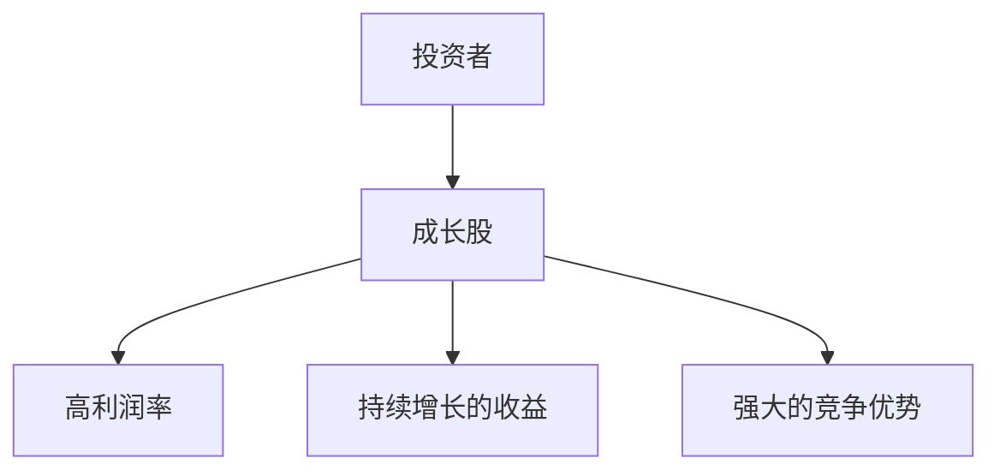
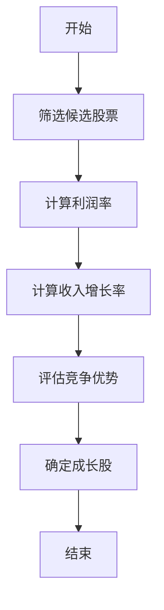
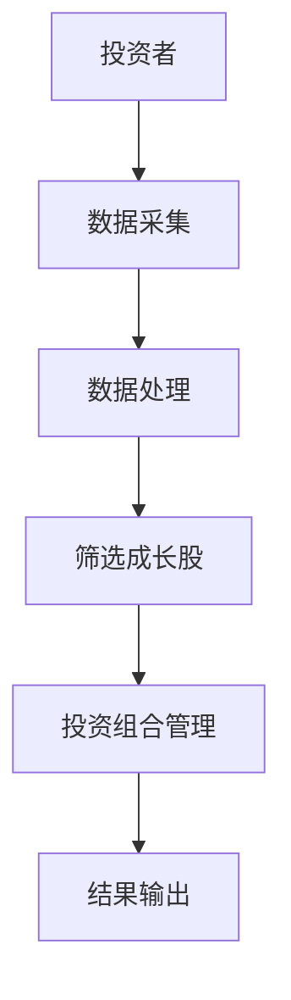
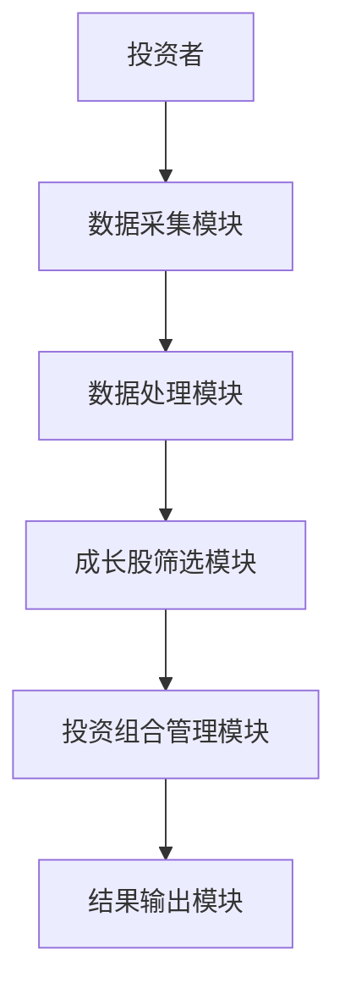

                 


# 费雪的优质成长股特征

## 关键词：费雪，成长股，投资理念，优质股票，股票分析

## 摘要：本文详细探讨了费雪的优质成长股投资理念，分析了成长股的核心特征，包括高利润率、持续增长的收益和强大的竞争优势。通过算法原理、数学模型和系统设计，深入解析了如何量化评估成长股，并结合实战案例，为投资者提供了实用的指导和建议。文章结构清晰，内容详实，适合对成长股投资感兴趣的技术和金融领域读者阅读。

---

## 第1章: 费雪的优质成长股投资背景与理念

### 1.1 费雪投资理念的起源与发展

#### 1.1.1 费雪投资理念的起源
菲利普·费雪（Philip Fisher）是20世纪著名的投资专家，被誉为“成长股之父”。他在1949年出版的《Common Stocks and Uncommon Profits》一书中首次系统地提出了成长股投资理论。费雪的理念与传统的价值投资有所不同，他更关注企业的成长性和未来盈利能力，而非仅仅依靠低估值寻找投资机会。

#### 1.1.2 费雪投资理念的核心思想
费雪认为，投资的最终目标是通过选择那些具有持续增长潜力的公司，实现长期稳定的收益。他强调，投资者应该关注企业的基本面，特别是企业的盈利能力、市场地位和管理团队的质量。

#### 1.1.3 费雪投资理念与现代投资理论的联系
费雪的成长股投资理念对现代投资理论产生了深远影响。特别是在主动管理型基金和量化投资领域，费雪的理念被广泛应用于筛选高增长潜力的公司。他的思想与技术分析、基本面分析等其他投资方法也有着密切的联系。

---

### 1.2 成长股的定义与特征

#### 1.2.1 成长股的定义
成长股是指那些收入和利润能够持续以高于行业平均水平的速度增长的公司股票。这些公司通常处于成长期，市场占有率不断提升，未来具有较大的增长空间。

#### 1.2.2 成长股的核心特征
成长股的核心特征包括：
1. **高利润率**：公司能够通过高效的运营和管理，实现较高的净利润率。
2. **持续增长的收益**：公司收入和利润能够保持稳定增长，通常年增长率超过行业平均水平。
3. **强大的竞争优势**：公司在市场上具有独特的竞争优势，例如技术创新、品牌优势或成本优势。

#### 1.2.3 成长股与价值股的区别
成长股与价值股的主要区别在于估值和投资逻辑：
- **价值股**：通常估值较低，市盈率、市净率等指标低于市场平均水平，投资者认为这些股票被市场低估。
- **成长股**：通常估值较高，市盈率、市净率等指标高于市场平均水平，但公司具有较高的成长潜力。

---

### 1.3 费雪的成长股投资策略

#### 1.3.1 费雪的成长股筛选标准
费雪提出了一系列筛选成长股的标准，包括：
1. **高利润率**：公司净利润率应高于行业平均水平。
2. **持续增长的收益**：公司过去几年的收入和利润应保持稳定增长。
3. **强大的竞争优势**：公司应具有独特的竞争优势，例如技术专利、品牌影响力或成本优势。

#### 1.3.2 费雪的成长股投资组合构建
费雪建议投资者在构建成长股投资组合时，应选择多个具有不同成长阶段和行业特点的公司，以分散风险。同时，投资者应定期审视投资组合，根据公司基本面的变化进行调整。

#### 1.3.3 费雪的成长股投资风险控制
成长股投资的风险较高，因此投资者需要采取有效的风险控制措施：
1. **分散投资**：通过投资多个成长股公司来分散风险。
2. **长期持有**：成长股投资需要耐心，投资者应避免频繁交易。
3. **定期评估**：定期评估投资组合中的公司基本面，及时调整投资策略。

---

## 第2章: 费雪成长股投资的核心概念与联系

### 2.1 成长股特征的核心要素

#### 2.1.1 高利润率
高利润率是成长股的重要特征之一。公司通过高效的运营和管理，能够实现较高的净利润率。例如，科技公司通常具有较高的利润率，因为它们的边际成本较低。

#### 2.1.2 持续增长的收益
持续增长的收益是成长股的核心特征之一。公司收入和利润的稳定增长是其未来继续增长的基础。例如，互联网公司的收入增长通常较快，具有较高的成长潜力。

#### 2.1.3 强大的竞争优势
强大的竞争优势是成长股的重要特征之一。公司通过技术创新、品牌优势或成本优势，能够在市场上占据领先地位。例如，苹果公司凭借其强大的品牌和技术优势，长期保持较高的市场占有率。

---

### 2.2 成长股特征对比表

#### 2.2.1 成长股与价值股的对比
| 特征     | 成长股         | 价值股         |
|----------|---------------|---------------|
| 估值     | 高            | 低            |
| 收益率   | 高            | 中等          |
| 成长性   | 高            | 低            |
| 风险     | 高            | 中等          |

#### 2.2.2 成长股与周期股的对比
| 特征     | 成长股         | 周期股         |
|----------|---------------|---------------|
| 估值     | 高            | 中等          |
| 收益率   | 高            | 中等          |
| 成长性   | 高            | 低            |
| 风险     | 高            | 高            |

#### 2.2.3 成长股与防御股的对比
| 特征     | 成长股         | 防御股         |
|----------|---------------|---------------|
| 估值     | 高            | 低            |
| 收益率   | 高            | 中等          |
| 成长性   | 高            | 低            |
| 风险     | 高            | 中等          |

---

### 2.3 成长股特征的ER实体关系图



---

## 第3章: 费雪成长股投资的算法原理

### 3.1 成长股筛选算法

#### 3.1.1 算法概述
成长股筛选算法旨在通过量化指标筛选出具有高成长潜力的公司。算法的核心是计算公司的利润率、收入增长率和竞争优势。

#### 3.1.2 算法步骤
1. 收集候选公司的财务数据，包括收入、利润、增长率等。
2. 计算公司的利润率（净利润率）。
3. 计算公司的收入增长率。
4. 评估公司的竞争优势，包括品牌影响力、技术优势等。
5. 根据筛选标准，选出符合要求的公司。

#### 3.1.3 算法实现
```python
def fisher_growth_stock_screening(stocks):
    selected_stocks = []
    for stock in stocks:
        # 计算利润率
        net_profit_margin = stock.net_profit / stock.revenue
        # 计算收入增长率
        revenue_growth_rate = (stock.current_revenue - stock.previous_revenue) / stock.previous_revenue
        # 评估竞争优势
        competitive_advantage = stock.brand_strength + stock技术创新能力
        if net_profit_margin > industry_average_margin and revenue_growth_rate > industry_average_growth_rate and competitive_advantage > industry_average_advantage:
            selected_stocks.append(stock)
    return selected_stocks
```

---

### 3.2 成长股评估算法

#### 3.2.1 评估指标
1. 净利润率（Net Profit Margin）
2. 收入增长率（Revenue Growth Rate）
3. 竞争优势（Competitive Advantage）

#### 3.2.2 评估模型
$$\text{综合得分} = \alpha \times \text{净利润率} + \beta \times \text{收入增长率} + \gamma \times \text{竞争优势}$$
其中，$\alpha$、$\beta$、$\gamma$是权重系数，通常根据行业特点和投资目标进行调整。

#### 3.2.3 评估流程
1. 计算候选公司的净利润率、收入增长率和竞争优势。
2. 根据权重系数计算综合得分。
3. 根据得分排序，选出综合得分最高的公司。

---

### 3.3 算法流程图



---

## 第4章: 成长股特征的数学模型与公式

### 4.1 成长股增长率模型

#### 4.1.1 复利增长公式
$$\text{未来价值} = \text{现值} \times (1 + \text{增长率})^n$$
其中，$n$是投资期限。

#### 4.1.2 增长率计算公式
$$\text{增长率} = \frac{\text{现期值} - \text{基期值}}{\text{基期值}}$$

---

### 4.2 成长股利润率模型

#### 4.2.1 净利润率公式
$$\text{净利润率} = \frac{\text{净利润}}{\text{营业收入}}$$

---

### 4.3 成长股竞争优势模型

#### 4.3.1 市场占有率公式
$$\text{市场占有率} = \frac{\text{公司销售额}}{\text{行业销售额}}$$

---

## 第5章: 成长股投资系统的分析与架构设计

### 5.1 投资管理系统概述

#### 5.1.1 系统目标
构建一个基于费雪成长股投资理念的投资管理系统，实现成长股的筛选、评估和投资组合管理。

#### 5.1.2 系统功能
1. 数据采集与处理：收集公司财务数据和市场数据。
2. 成长股筛选：根据费雪的筛选标准，筛选出符合条件的公司。
3. 投资组合管理：根据筛选结果，构建投资组合并进行动态调整。

#### 5.1.3 系统架构


---

### 5.2 系统功能设计

#### 5.2.1 数据采集与处理
系统需要采集公司财务数据、市场数据和行业数据。数据来源包括股票交易所、财经网站和行业报告。

#### 5.2.2 成长股筛选
根据费雪的筛选标准，系统通过计算公司利润率、收入增长率和竞争优势，筛选出符合条件的公司。

#### 5.2.3 投资组合管理
系统根据筛选结果，构建投资组合并进行动态调整，以应对市场变化和公司基本面的变化。

---

### 5.3 系统架构设计

#### 5.3.1 系统架构图


---

### 5.4 系统接口设计

#### 5.4.1 数据接口
系统需要与数据源进行交互，获取公司财务数据和市场数据。

#### 5.4.2 用户接口
系统需要提供友好的用户界面，方便投资者进行操作和查询。

---

## 第6章: 成长股投资系统的项目实战

### 6.1 环境安装与配置

#### 6.1.1 系统环境
- 操作系统：Windows/Mac/Linux
- 编程语言：Python
- 开发工具：PyCharm/VS Code
- 数据库：MySQL/SQLite

#### 6.1.2 第三方库安装
- Pandas
- NumPy
- Matplotlib
- Scikit-learn

---

### 6.2 系统核心实现

#### 6.2.1 数据采集与处理
```python
import pandas as pd

# 读取股票数据
data = pd.read_csv('stock_data.csv')

# 数据清洗
data = data.dropna()
data = data[数据满足筛选条件]
```

#### 6.2.2 成长股筛选
```python
def calculate_growth_rate(revenue):
    return (revenue['current'] - revenue['previous']) / revenue['previous']

selected_stocks = []
for stock in stocks:
    if calculate_growth_rate(stock.revenue) > industry_average_growth_rate and stock.net_profit_margin > industry_average_margin:
        selected_stocks.append(stock)
```

---

### 6.3 代码应用解读与分析

#### 6.3.1 代码功能解读
上述代码实现了成长股的筛选功能，通过计算收入增长率和利润率，筛选出符合条件的公司。

#### 6.3.2 代码实现细节
代码使用Python语言编写，利用Pandas库进行数据处理和分析。代码实现了数据清洗、筛选和输出功能。

---

### 6.4 实际案例分析

#### 6.4.1 案例背景
假设我们有以下几家公司作为候选股票：
- 公司A：收入增长率为20%，净利润率为15%，市场占有率为10%
- 公司B：收入增长率为15%，净利润率为12%，市场占有率为8%
- 公司C：收入增长率为25%，净利润率为18%，市场占有率为12%

#### 6.4.2 筛选结果
根据筛选标准，公司A和公司C符合成长股的特征，而公司B不符合。

---

## 第7章: 成长股投资系统的总结与展望

### 7.1 费雪成长股投资理念的现代应用
费雪的成长股投资理念在现代投资实践中得到了广泛应用。投资者可以通过量化分析和系统化的方法，更好地筛选和管理成长股投资组合。

### 7.2 投资策略的注意事项
1. **风险控制**：成长股投资风险较高，投资者应采取分散投资和长期持有的策略。
2. **数据质量**：数据的准确性和完整性对投资决策至关重要，投资者应选择可靠的数据显示。
3. **市场变化**：市场环境的变化可能影响成长股的表现，投资者应定期审视投资组合。

### 7.3 未来研究方向
1. **人工智能应用**：利用机器学习技术进一步优化成长股的筛选和评估。
2. **多因子模型**：结合多个因子，构建更复杂的成长股筛选模型。
3. **国际市场扩展**：研究不同市场环境下的成长股投资策略。

---

## 附录

### 附录A: 成长股特征术语表
- 净利润率：净利润与营业收入的比率。
- 收入增长率：收入的增长速度。
- 竞争优势：公司在市场上的独特优势。

### 附录B: 成长股筛选公式汇总
- 净利润率公式：$$\text{净利润率} = \frac{\text{净利润}}{\text{营业收入}}$$
- 收入增长率公式：$$\text{增长率} = \frac{\text{现期值} - \text{基期值}}{\text{基期值}}$$

### 附录C: 成长股投资系统代码仓库
```bash
# 代码仓库地址
https://github.com/yourusername/fisher-growth-stock-system
```

---

## 作者

作者：AI天才研究院/AI Genius Institute & 禅与计算机程序设计艺术 /Zen And The Art of Computer Programming

