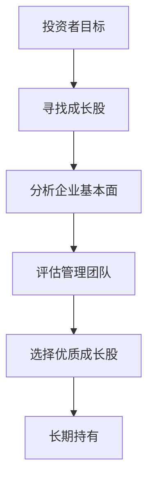
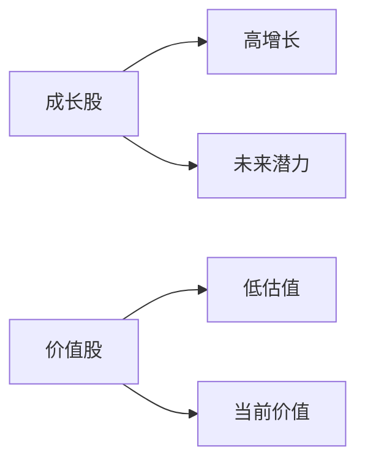
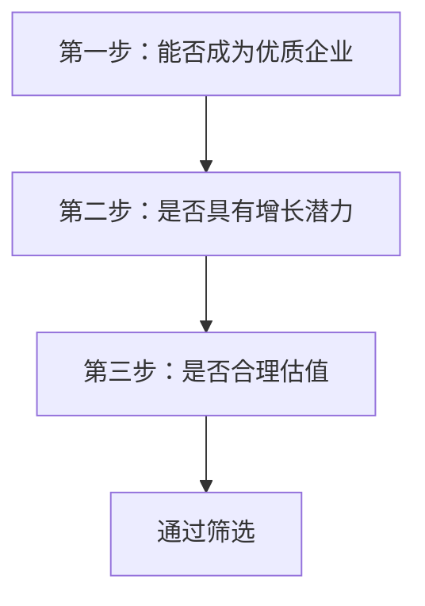
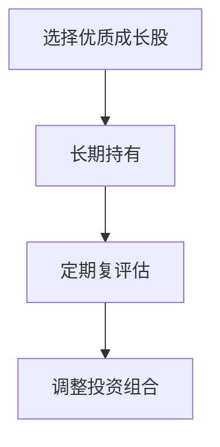
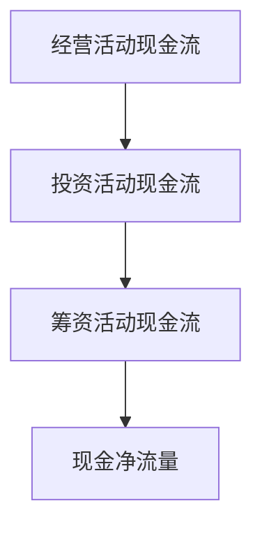
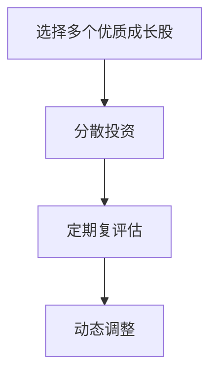
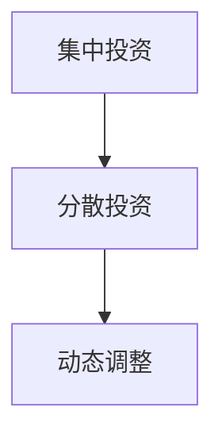

                 


# 费雪的优质成长股理论：寻找未来的赢家

## 关键词：  
费雪、成长股、投资策略、财务分析、行业分析、长期投资

## 摘要：  
本文深入探讨了菲利普·费雪的优质成长股理论，分析了其核心思想、分析框架、财务指标、行业选择和长期投资策略。通过结合实际案例和系统化的分析方法，揭示了如何在现代投资环境中应用费雪的理论，寻找具有长期成长潜力的企业。

---

## 正文

---

## 第一部分：背景介绍

### 第1章：费雪的投资理念与成长股理论概述

#### 1.1 费雪的投资理念

##### 1.1.1 费雪的生平与投资背景
菲利普·费雪（Philip Fisher）是20世纪美国著名的投资家，被誉为“成长股之父”。他出生于1907年，逝世于1999年。费雪在投资领域的主要贡献是提出了“成长股投资”的理念，强调长期关注具有持续增长潜力的企业。

**关键概念**：  
- 费雪的成长股理论：专注于投资那些具有强大竞争优势、管理优秀、财务健康且能够持续增长的企业。
- 投资理念的核心：寻找那些能够在未来几年内实现收入和利润快速增长的公司。

**图表**：  
以下是费雪投资理念的流程图：



##### 1.1.2 费雪的成长股理论核心思想
费雪的成长股理论强调以下几点：  
1. **长期增长**：投资那些具有持续增长潜力的企业，而非短期波动。  
2. **企业质量**：选择具有强大竞争优势、管理优秀且财务健康的企业。  
3. **深入研究**：通过对企业基本面的深入研究，识别出具有长期增长潜力的公司。  

##### 1.1.3 费雪理论的现代意义
尽管费雪的投资理论提出于20世纪中期，但其核心思想在现代投资环境中依然具有重要意义。尤其是在当前科技驱动的市场中，成长股的投资逻辑依然适用。

---

#### 1.2 成长股的定义与特征

##### 1.2.1 成长股的定义
成长股是指那些收入和利润能够持续以高于行业平均水平的速度增长的公司股票。这些公司通常处于高增长行业，具有强大的竞争优势和市场前景。

**关键概念**：  
- 收入增长率：衡量公司收入增长速度的重要指标。  
- 利润增长率：衡量公司盈利能力增长的重要指标。  
- 竞争优势：公司在市场中相对于竞争对手的独特优势。

##### 1.2.2 成长股的核心特征
以下是成长股的核心特征对比表：

| 特征          | 成长股特征              | 价值股特征              |
|---------------|-------------------------|-------------------------|
| 收入增长率    | 高                     | 低或稳定               |
| 利润增长率    | 高                     | 低或稳定               |
| 市盈率        | 较高                   | 较低                   |
| 未来潜力      | 高                     | 较低                   |
| 行业          | 高增长行业（如科技、消费） | 成熟行业（如公用事业、制造业） |

##### 1.2.3 成长股与价值股的对比
成长股和价值股在投资策略上有显著区别。成长股注重未来的增长潜力，而价值股注重当前的低估值。以下是一个对比图：



#### 1.3 费雪的成长股分析框架

##### 1.3.1 费雪的成长股筛选标准
费雪提出了“三重检验法”，即通过以下三个标准来筛选成长股：  
1. **能否成为优质企业**：分析企业的商业模式、竞争优势和管理团队。  
2. **是否具有增长潜力**：评估企业的收入和利润增长率。  
3. **是否合理估值**：通过市盈率、市净率等指标评估股票的估值是否合理。

**数学模型**：  
为了评估企业的增长潜力，可以使用以下公式：  

$$
\text{年复合增长率} = \left( \frac{\text{期末值}}{\text{期初值}} \right)^{\frac{1}{n}} - 1
$$  

其中，n为时间跨度。

##### 1.3.2 费雪的“三重检验法”
以下是“三重检验法”的流程图：



##### 1.3.3 费雪的成长股投资策略
费雪的投资策略强调长期持有优质成长股，避免频繁交易。以下是投资策略的步骤：



---

### 第2章：费雪成长股的财务分析方法

#### 2.1 财务分析的核心指标

##### 2.1.1 营业收入增长率
营业收入增长率是衡量企业收入增长速度的重要指标。其计算公式为：  

$$
\text{营业收入增长率} = \frac{\text{本期营业收入} - \text{上期营业收入}}{\text{上期营业收入}} \times 100\%
$$  

##### 2.1.2 净利润增长率
净利润增长率是衡量企业盈利能力增长的重要指标。其计算公式为：  

$$
\text{净利润增长率} = \frac{\text{本期净利润} - \text{上期净利润}}{\text{上期净利润}} \times 100\%
$$  

##### 2.1.3 毛利率与净利率
毛利率 = (营业收入 - 营业成本) / 营业收入 × 100%  
净利率 = 净利润 / 营业收入 × 100%

##### 2.1.4 现金流分析
现金流是衡量企业财务健康的重要指标。经营活动现金流为正的企业通常具有较强的盈利能力和造血能力。

**图表**：  
以下是现金流分析的流程图：



#### 2.2 费雪的成长股财务筛选模型

##### 2.2.1 模型的构建逻辑
费雪的财务筛选模型基于以下逻辑：  
1. 企业应具有稳定的收入和利润增长。  
2. 企业的毛利率和净利率应处于行业较高水平。  
3. 企业的现金流应为正且稳定。

##### 2.2.2 模型的数学公式
以下是财务筛选模型的核心公式：  

$$
\text{综合评分} = \left( \frac{\text{收入增长率}}{2} \right) + \left( \frac{\text{净利润增长率}}{2} \right) + \left( \frac{\text{毛利率}}{2} \right) + \left( \frac{\text{净利率}}{2} \right)
$$  

综合评分高于行业平均水平的企业可被视为优质成长股。

##### 2.2.3 模型的适用场景
该模型适用于高增长行业，如科技、消费和医疗行业。

#### 2.3 财务数据的可视化分析

##### 2.3.1 财务数据的图表展示
以下是财务数据的可视化图表：


##### 2.3.2 数据可视化工具的选择
常用的财务数据分析工具包括Excel、Power BI、Tableau和Python的Matplotlib库。

##### 2.3.3 数据可视化的实际案例
以下是某科技公司财务数据的可视化案例：

```mermaid
line_chart
    title 收入与利润增长
    xlabel 年份
    ylabel 收入（亿元）和利润（亿元）
    "2018": 10, 3
    "2019": 15, 4.5
    "2020": 20, 6
    "2021": 25, 7.5
```

---

### 第3章：费雪成长股的行业分析与投资策略

#### 3.1 行业分析的核心要素

##### 3.1.1 行业生命周期
行业生命周期分为四个阶段：导入期、成长期、成熟期和衰退期。成长股通常出现在成长期行业。

##### 3.1.2 行业竞争结构
行业竞争结构包括供应商、买家、竞争对手、潜在进入者和替代品威胁。具有强大竞争优势的行业更有可能出现优质成长股。

##### 3.1.3 行业增长潜力
行业增长潜力取决于市场需求、技术进步和政策环境。高增长行业更有可能出现优质成长股。

#### 3.2 费雪成长股的行业筛选标准

##### 3.2.1 行业的成长空间
行业应处于高增长阶段，市场需求大，未来发展空间广阔。

##### 3.2.2 行业的竞争优势
企业应具有独特的竞争优势，如专利、品牌、技术或成本优势。

##### 3.2.3 行业的政策环境
行业应受到政策支持，政策环境稳定，有利于企业长期发展。

#### 3.3 费雪成长股的投资组合管理

##### 3.3.1 投资组合的构建逻辑
投资组合应包含多个优质成长股，分散投资风险。以下是投资组合构建的流程图：



##### 3.3.2 投资组合的风险控制
风险控制包括设定止损点、定期评估投资组合表现和分散投资。

##### 3.3.3 投资组合的动态调整
根据市场变化和企业基本面的变化，定期调整投资组合。

---

### 第4章：费雪成长股的长期投资策略

#### 4.1 长期投资的核心理念

##### 4.1.1 长期投资的定义
长期投资是指将资金投入优质资产，以获取长期稳定的收益。

##### 4.1.2 长期投资的优势
长期投资的优势包括复利效应和税收优势。

##### 4.1.3 长期投资的风险
长期投资的风险包括市场波动、企业基本面变化和政策风险。

#### 4.2 费雪成长股的长期投资策略

##### 4.2.1 长期投资的选股标准
长期投资应选择那些具有强大竞争优势、管理优秀且财务健康的企业。

##### 4.2.2 长期投资的仓位管理
仓位管理包括集中投资和分散投资两种策略。以下是仓位管理的流程图：



##### 4.2.3 长期投资的持有策略
长期投资应避免频繁交易，耐心持有优质成长股。

#### 4.3 长期投资的案例分析

##### 4.3.1 经典案例分析
以某科技公司为例，分析其长期投资的可行性。

##### 4.3.2 案例的启示与总结
长期投资的成功关键在于选择优质成长股和耐心持有。

##### 4.3.3 案例的拓展
长期投资的未来趋势包括科技、消费和医疗行业。

---

## 第五部分：项目实战与最佳实践

### 第5章：项目实战

#### 5.1 环境安装
需要安装Python和相关数据分析库（如Pandas、Matplotlib）。

#### 5.2 核心实现

##### 5.2.1 数据获取
从股票数据库中获取目标企业的财务数据。

##### 5.2.2 数据清洗
对数据进行清洗和预处理，确保数据的准确性和完整性。

##### 5.2.3 数据分析
使用Pandas进行数据分析，计算收入增长率、净利润增长率等关键指标。

##### 5.2.4 可视化展示
使用Matplotlib进行数据可视化，生成财务数据的图表。

##### 5.2.5 投资决策
根据分析结果，判断是否为优质成长股。

##### 5.2.6 投资组合管理
根据分析结果，构建投资组合并进行动态调整。

#### 5.3 实战案例分析

##### 5.3.1 案例介绍
以某科技公司为例，分析其是否为优质成长股。

##### 5.3.2 案例分析
详细分析该公司的财务数据和行业地位。

##### 5.3.3 案例总结
总结分析结果，并提出投资建议。

#### 5.4 代码实现

##### 5.4.1 数据获取与清洗
以下是数据获取与清洗的代码示例：

```python
import pandas as pd
import requests

# 获取股票数据
url = "https://www.example.com/stock_data.csv"
response = requests.get(url)
data = pd.read_csv(url)
data = data.dropna()  # 删除缺失值
data = data.drop_duplicates()  # 删除重复值
```

##### 5.4.2 数据分析与可视化
以下是数据分析与可视化的代码示例：

```python
import matplotlib.pyplot as plt

# 绘制收入与利润增长曲线
plt.plot(data['年份'], data['收入'], label='收入')
plt.plot(data['年份'], data['利润'], label='利润')
plt.xlabel('年份')
plt.ylabel('金额（亿元）')
plt.title('收入与利润增长曲线')
plt.legend()
plt.show()
```

#### 5.5 最佳实践 tips

##### 5.5.1 投资实战中的注意事项
1. 避免盲目跟风，注重基本面分析。  
2. 长期持有优质成长股，避免频繁交易。  
3. 定期复评估投资组合，及时调整。  

##### 5.5.2 投资风险管理
1. 设定止损点，控制风险敞口。  
2. 分散投资，避免过度集中。  
3. 关注宏观经济和行业政策变化。  

##### 5.5.3 拓展阅读
1. 费雪的《成长股投资策略》  
2. 现代投资组合理论  

##### 5.5.4 项目小结
通过本项目，读者可以掌握如何利用费雪的成长股理论进行投资分析，并能够实际操作，找到优质的成长股。

---

## 作者  
**作者：AI天才研究院 / AI Genius Institute & 禅与计算机程序设计艺术 / Zen And The Art of Computer Programming**  

---

以上是《费雪的优质成长股理论：寻找未来的赢家》的完整目录大纲和内容概要。希望这篇文章能为您提供有价值的见解和实用的投资策略！

