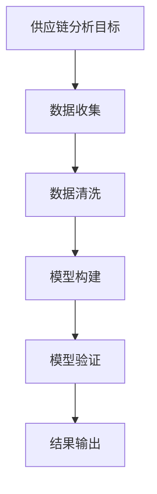
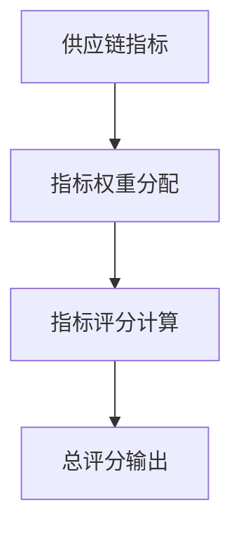
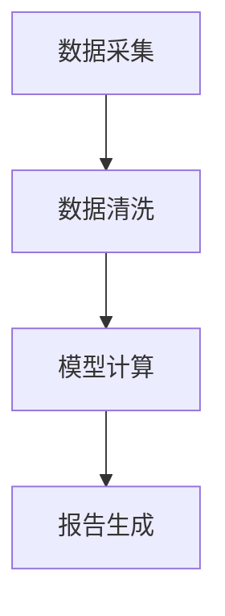
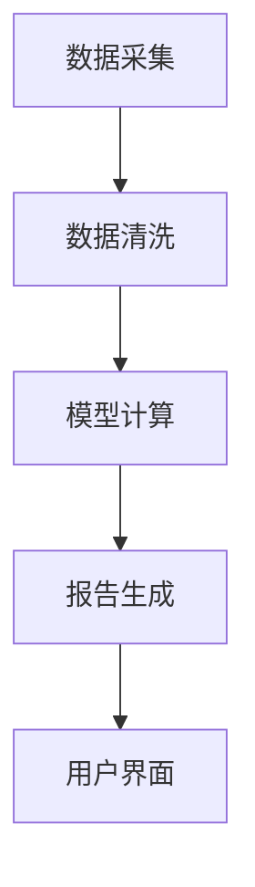
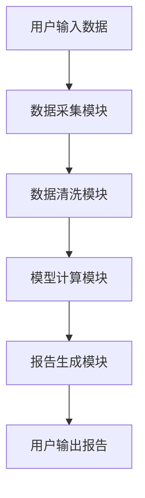

                 


# 费雪的供应链分析在投资中的应用

> 关键词：供应链分析、投资分析、费雪模型、企业价值评估、供应链管理

> 摘要：本文系统地探讨了费雪的供应链分析在投资中的应用，从供应链分析的基本概念到其数学模型的构建，再到实际案例的分析，详细介绍了如何将供应链分析应用于投资决策。通过丰富的理论知识和实际案例，本文为投资者提供了一套科学的投资分析方法。

---

## 第一部分: 费雪的供应链分析基础

## 第1章: 供应链分析的核心概念与应用背景

### 1.1 供应链分析的基本原理

#### 1.1.1 供应链的定义与组成部分

供应链是指从原材料采购到最终产品交付给客户的一系列过程，包括供应商、制造商、分销商、零售商和消费者等多个环节。供应链的核心组成部分包括：

1. 供应商：提供原材料或零部件的企业。
2. 制造商：将原材料转化为产品的工厂。
3. 分销商：将产品分发到不同地区的中间商。
4. 零售商：直接面向消费者的销售终端。
5. 消费者：最终产品或服务的使用方。

供应链的高效运作依赖于各个环节之间的协同合作，任何环节的瓶颈都可能影响整个供应链的效率。

#### 1.1.2 供应链分析的定义与核心要素

供应链分析是指通过对供应链各环节的运行效率、成本、风险等关键指标的量化分析，评估供应链的整体表现，并为优化供应链管理和投资决策提供数据支持。其核心要素包括：

1. 成本：供应链各环节的总成本，包括采购成本、物流成本、库存成本等。
2. 效率：供应链的运作效率，包括交货时间、库存周转率等。
3. 风险：供应链的潜在风险，如供应商的稳定性、物流中断的可能性等。
4. 可扩展性：供应链在业务增长时的适应能力。

#### 1.1.3 供应链分析在投资中的重要性

在投资决策中，供应链分析可以帮助投资者评估企业的运营效率、成本控制能力和风险抵御能力。通过分析供应链的各个环节，投资者可以更好地理解企业的核心竞争力，从而做出更明智的投资决策。此外，供应链分析还可以帮助投资者发现潜在的风险点，提前制定应对策略。

---

### 1.2 供应链分析与投资的关系

#### 1.2.1 供应链分析在投资决策中的作用

供应链分析为投资者提供了以下几个方面的信息：

1. **成本优势**：通过分析企业的供应链成本，投资者可以判断企业是否具有成本竞争优势。
2. **效率提升**：高效的供应链能够降低企业的运营成本，提高利润率。
3. **风险控制**：通过分析供应链的稳定性，投资者可以评估企业抵御外部风险的能力。

#### 1.2.2 供应链分析如何影响企业价值评估

企业价值评估通常包括对企业未来现金流的折现。供应链分析可以帮助投资者更准确地预测企业的未来现金流，因为高效的供应链能够提高企业的运营效率，从而增加净利润。

#### 1.2.3 供应链分析与其他投资分析方法的对比

传统的投资分析方法，如财务指标分析和市场分析，往往关注企业的财务状况和市场环境。而供应链分析则从企业的运营效率和成本控制角度出发，提供了更全面的企业分析视角。

---

## 第2章: 费雪的供应链分析模型

### 2.1 费雪供应链分析模型的构成

#### 2.1.1 模型的基本框架

费雪供应链分析模型的核心思想是将供应链的各个环节进行量化分析，并通过数学模型评估供应链的整体表现。模型主要包括以下几个部分：

1. **数据收集**：收集供应链各环节的成本、效率和风险数据。
2. **数据清洗**：对收集到的数据进行预处理，剔除异常值。
3. **模型构建**：基于数据构建供应链效率和风险的数学模型。
4. **模型验证**：通过实际案例验证模型的准确性和可靠性。

#### 2.1.2 模型的核心假设

1. 供应链各环节的成本、效率和风险可以通过量化指标进行评估。
2. 供应链的整体效率是各环节效率的加权平均值。
3. 供应链的风险可以通过对各环节风险的加权求和得到。

#### 2.1.3 模型的输入与输出

- **输入**：供应链各环节的成本、效率和风险数据。
- **输出**：供应链的整体效率评分和风险评分。

---

### 2.2 费雪供应链分析模型的数学公式

#### 2.2.1 供应链效率的量化公式

$$ \text{供应链效率} = \frac{\text{供应链成本}}{\text{供应链总成本}} $$

其中，供应链成本是指企业在供应链各环节上的实际支出，而供应链总成本包括采购成本、物流成本、库存成本等。

#### 2.2.2 供应链风险的评估公式

$$ \text{供应链风险} = \sum_{i=1}^{n} w_i \times r_i $$

其中，\( w_i \) 为风险因子的权重，\( r_i \) 为风险因子的值。风险因子可能包括供应商的稳定性、物流中断的可能性等。

---

### 2.3 费雪供应链分析模型的流程图



---

## 第3章: 供应链分析的核心指标与评分体系

### 3.1 供应链核心指标

#### 3.1.1 交货周期

交货周期是指从订单发出到产品交付给客户所需的时间。交货周期越短，供应链的效率越高。

#### 3.1.2 成本占比

成本占比是指供应链各环节的成本占总成本的比例。成本占比越低，企业的成本控制能力越强。

#### 3.1.3 供应商稳定性

供应商稳定性是指供应商在供应链中的可靠程度。供应商稳定性越高，供应链的风险越小。

#### 3.1.4 库存周转率

库存周转率是指单位时间内库存的销售情况。库存周转率越高，供应链的效率越高。

#### 3.1.5 供应链弹性

供应链弹性是指供应链在面对外部环境变化时的适应能力。弹性越强，供应链的风险抵御能力越强。

---

### 3.2 供应链评分体系的构建

#### 3.2.1 评分标准的制定

评分标准的制定需要根据供应链各环节的核心指标来确定。例如，交货周期的评分标准可以是：交货周期 ≤ 5天得满分，交货周期每增加1天，得分减少10%。

#### 3.2.2 评分权重的分配

评分权重的分配需要根据各指标对供应链整体表现的影响程度来确定。例如，交货周期和成本占比的权重可以各占30%，供应商稳定性和库存周转率的权重可以各占20%。

#### 3.2.3 评分流程的优化

评分流程的优化可以通过自动化工具来实现。例如，可以通过ERP系统自动收集供应链各环节的数据，并根据预设的评分标准自动生成评分结果。

---

### 3.3 供应链评分体系的数学模型



---

## 第4章: 供应链分析在投资中的应用案例

### 4.1 案例背景介绍

#### 4.1.1 案例企业简介

某制造企业A是一家专注于电子产品的制造商。该公司目前面临供应链效率低下的问题，导致生产成本较高，交货周期较长。

#### 4.1.2 投资目标与分析需求

投资者希望通过供应链分析，评估该企业的供应链效率和风险，并制定相应的优化策略。

---

### 4.2 数据收集与分析

#### 4.2.1 数据收集

收集该企业的供应链数据，包括供应商信息、生产成本、物流成本、库存周转率等。

#### 4.2.2 数据清洗

对收集到的数据进行预处理，剔除异常值和错误数据。

#### 4.2.3 数据分析

根据供应链分析模型，计算该企业的供应链效率和风险评分。

---

### 4.3 模型应用与结果解读

#### 4.3.1 模型应用

通过费雪供应链分析模型，计算出该企业的供应链效率得分为75分，风险评分为60分。

#### 4.3.2 结果解读

供应链效率得分为75分，表明该企业的供应链效率处于中等水平。风险评分为60分，表明该企业的供应链存在一定的风险，主要体现在供应商稳定性和物流中断风险方面。

---

### 4.4 投资决策

#### 4.4.1 投资建议

基于供应链分析的结果，投资者可以提出以下建议：

1. 优化供应链结构，提高交货周期。
2. 与多个供应商建立合作关系，降低供应链风险。
3. 优化库存管理，提高库存周转率。

---

## 第5章: 系统分析与架构设计方案

### 5.1 问题场景介绍

某投资者希望开发一个基于费雪供应链分析模型的投资决策系统，用于分析多个企业的供应链效率和风险。

---

### 5.2 系统功能设计

#### 5.2.1 系统功能模块

1. 数据采集模块：负责采集企业的供应链数据。
2. 数据处理模块：对数据进行清洗和预处理。
3. 模型计算模块：基于费雪供应链分析模型计算供应链效率和风险评分。
4. 报告生成模块：生成投资分析报告。

#### 5.2.2 系统功能流程图



---

### 5.3 系统架构设计

#### 5.3.1 系统架构图



---

### 5.4 系统接口设计

#### 5.4.1 系统接口描述

1. 数据采集接口：用于从企业系统中采集供应链数据。
2. 模型计算接口：用于调用费雪供应链分析模型进行计算。
3. 报告生成接口：用于生成投资分析报告。

---

### 5.5 系统交互设计

#### 5.5.1 系统交互流程图



---

## 第6章: 项目实战

### 6.1 环境安装

#### 6.1.1 系统要求

- 操作系统：Windows 10 或更高版本，或 macOS 10.15 或更高版本。
- 内存：至少4GB。
- 硬盘空间：至少10GB。

#### 6.1.2 工具安装

- Python 3.8 或更高版本。
- pip 包管理工具。
- 安装必要的库：numpy, pandas, matplotlib。

---

### 6.2 系统核心实现源代码

#### 6.2.1 数据采集模块

```python
import pandas as pd

def collect_data():
    data = pd.read_csv('supply_chain.csv')
    return data
```

#### 6.2.2 数据清洗模块

```python
import pandas as pd

def clean_data(data):
    data.dropna(inplace=True)
    data = data[~data.duplicated()]
    return data
```

#### 6.2.3 模型计算模块

```python
import numpy as np
import pandas as pd

def calculate_efficiency(data):
    efficiency = np.mean(data['efficiency'])
    return efficiency

def calculate_risk(data):
    risk = np.mean(data['risk'])
    return risk
```

#### 6.2.4 报告生成模块

```python
import matplotlib.pyplot as plt

def generate_report(efficiency, risk):
    plt.figure(figsize=(10, 6))
    plt.bar('Efficiency', efficiency, color='blue')
    plt.bar('Risk', risk, color='red')
    plt.title('Supply Chain Analysis Report')
    plt.show()
```

---

### 6.3 代码应用解读与分析

#### 6.3.1 代码解读

- `collect_data()` 函数用于从CSV文件中读取供应链数据。
- `clean_data()` 函数用于清洗数据，去除缺失值和重复值。
- `calculate_efficiency()` 函数用于计算供应链效率。
- `calculate_risk()` 函数用于计算供应链风险。
- `generate_report()` 函数用于生成可视化报告。

#### 6.3.2 代码分析

通过上述代码，投资者可以轻松地收集、清洗和分析供应链数据，并生成直观的报告。

---

## 第7章: 最佳实践、小结与注意事项

### 7.1 最佳实践

1. 定期更新供应链数据，确保分析结果的准确性。
2. 与企业的业务目标相结合，制定个性化的供应链分析策略。
3. 利用自动化工具提高供应链分析的效率和准确性。

### 7.2 小结

通过本文的介绍，读者可以系统地了解费雪的供应链分析在投资中的应用。从基本概念到数学模型，再到实际案例，本文为投资者提供了一套完整的供应链分析方法。

### 7.3 注意事项

- 供应链分析需要结合企业的实际情况，避免生搬硬套。
- 数据的准确性和完整性是供应链分析的基础，必须高度重视。
- 供应链分析结果仅供参考，最终决策需要结合其他因素。

---

## 第8章: 拓展阅读

### 8.1 相关书籍

1. 《供应链管理：原理与应用》
2. 《投资学》

### 8.2 相关研究论文

1. "The Application of Supply Chain Analysis in Investment Decision Making"
2. "Efficient Supply Chain Management for Investors"

### 8.3 在线资源

- 供应链管理协会（APICS）官方网站
- 投资分析与风险管理论坛

---

## 作者信息

作者：AI天才研究院/AI Genius Institute & 禅与计算机程序设计艺术 /Zen And The Art of Computer Programming

---

以上是《费雪的供应链分析在投资中的应用》的文章大纲和内容。希望对您有所帮助！

