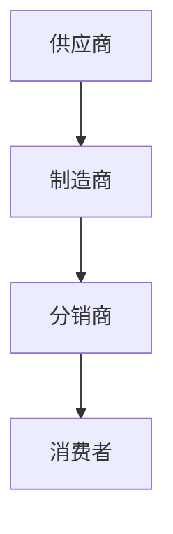
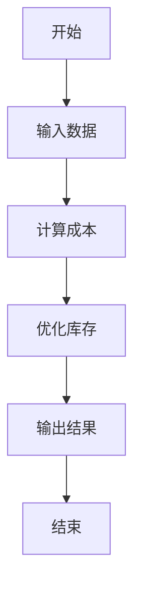
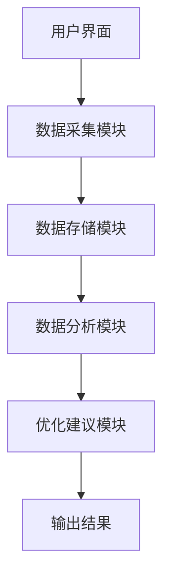

                 


# 费雪的供应链分析：了解公司的上下游

> 关键词：供应链分析，供应商关系，供应商评估，成本控制，库存管理，系统架构

> 摘要：供应链分析是企业优化上下游合作、降低成本、提高效率的重要手段。本文从供应链的基本概念出发，详细探讨了供应链分析的核心概念、算法原理、系统架构、实战案例、工具与技术，以及未来的发展趋势。

---

## 第1章: 供应链分析的背景与重要性

### 1.1 供应链的定义与核心要素

供应链是指围绕核心企业，从供应商到制造商，再到分销商和最终消费者的整个链条。其核心要素包括：

- **供应商**：提供原材料或零部件的企业。
- **制造商**：将原材料转化为产品的主体。
- **分销商**：负责产品分发和销售的中间商。
- **消费者**：最终的产品使用者或服务接收者。

供应链的运作机制涉及采购、生产、库存、物流等多个环节，各环节之间相互依赖，共同确保产品的高效流通。

### 1.2 供应链分析的重要性

供应链分析通过优化各个环节的协作，显著提升企业的竞争力。其重要性体现在：

- **成本控制**：通过分析供应链各环节的成本，发现浪费并降低成本。
- **提高效率**：优化库存管理和物流配送，减少资源浪费。
- **增强灵活性**：快速响应市场需求变化，调整供应链策略。

### 1.3 供应链的核心概念结构

供应链的核心概念可以通过以下结构图表示：



该图展示了供应链的基本构成和各角色之间的关系。

---

## 第2章: 供应链分析的核心概念与联系

### 2.1 供应链的核心要素分析

供应链的核心要素分析包括：

- **供应商的角色与作用**：供应商是供应链的起点，提供原材料或零部件。其稳定性直接影响生产效率。
- **制造商的角色与作用**：制造商负责将原材料转化为成品，是供应链的核心环节。
- **分销商的角色与作用**：分销商负责将产品分发到各个销售渠道，确保产品覆盖更广。

### 2.2 供应链的核心属性特征对比

供应链的核心属性可以通过以下表格对比：

| 属性 | 灵活性 | 响应速度 | 成本效率 |
|------|--------|----------|----------|
| 描述 | 是否能快速调整生产计划 | 是否能快速响应市场需求 | 是否能在降低成本的同时保证质量 |

### 2.3 供应链的实体关系图

供应链的实体关系图如下：

```mermaid
er
    供应商(Supplier) -[提供]-> 制造商(Manufacturer)
    制造商(Manufacturer) -[生产]-> 产品(Product)
    产品(Product) -[分销]-> 分销商(Distributor)
    分销商(Distributor) -[销售]-> 消费者(Customer)
```

该图展示了供应链中各实体之间的关系。

---

## 第3章: 供应链分析的算法原理

### 3.1 供应链分析的数学模型

供应链分析涉及多种数学模型，其中线性规划模型是常用的优化工具。例如，库存成本优化模型可以表示为：

$$ \text{总成本} = \text{采购成本} + \text{库存持有成本} + \text{运输成本} $$

通过线性规划，可以找到最优库存水平，使总成本最小化。

### 3.2 供应链分析的算法流程图

供应链分析的算法流程图如下：



### 3.3 供应链分析的Python实现

以下是一个简单的供应链成本优化的Python代码示例：

```python
import numpy as np

# 示例数据
cost = np.array([10, 15, 20])  # 采购成本
inventory = np.array([5, 10, 15])  # 库存数量
holding_cost = 5  # 库存持有成本

# 计算总成本
total_cost = np.dot(cost, inventory) + (holding_cost * np.sum(inventory))

print("总成本:", total_cost)
```

---

## 第4章: 供应链分析的系统架构

### 4.1 系统功能设计

供应链分析系统的功能模块包括：

- **数据采集**：收集供应商、制造商、分销商的数据。
- **数据分析**：分析成本、库存、物流等数据。
- **优化建议**：基于分析结果提出优化建议。

### 4.2 系统架构设计

供应链分析系统的架构如下：



---

## 第5章: 供应链分析的实战案例

### 5.1 零售业的供应链分析

以某零售企业为例，通过分析库存和销售数据，优化采购策略，减少库存积压。

### 5.2 制造业的供应链分析

以某汽车制造商为例，通过分析供应商交货时间和成本，选择最优供应商。

### 5.3 科技行业的供应链分析

以某电子产品制造商为例，通过分析全球供应链的不确定性，制定风险管理策略。

---

## 第6章: 供应链分析的工具与技术

### 6.1 常用工具

- **ERP系统**：如SAP、Oracle，用于数据管理。
- **数据分析工具**：如Excel、Python、R，用于数据分析和建模。

### 6.2 相关技术

- **大数据分析**：处理海量数据，提取有价值的信息。
- **机器学习**：预测市场需求，优化供应链策略。

---

## 第7章: 结论与未来展望

供应链分析是企业优化运营的关键工具。未来，随着人工智能和大数据技术的发展，供应链分析将更加智能化和自动化。

---

## 作者：AI天才研究院/AI Genius Institute & 禅与计算机程序设计艺术 /Zen And The Art of Computer Programming

