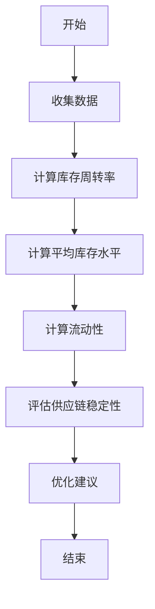
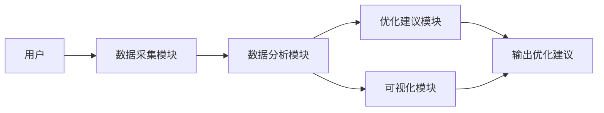

                 


# 费雪的供应链分析：全球化重构下的新思路

---

## 关键词：
供应链分析，全球化重构，费雪供应链模型，系统架构设计，项目实战，最佳实践

---

## 摘要：
在全球化重构的背景下，供应链分析的重要性愈发凸显。本文将从供应链的基本概念出发，逐步深入探讨费雪供应链分析的核心思想与方法，结合实际案例分析，展示如何在新的全球化环境中优化供应链管理。文章不仅提供了理论支持，还通过系统架构设计和项目实战，为读者提供可操作的解决方案，最后总结了最佳实践和注意事项，帮助读者更好地应对全球化重构下的供应链挑战。

---

## 第一部分：供应链分析的背景与基础

### 第1章：供应链分析的基本概念

#### 1.1 供应链的基本定义与构成要素
供应链是指从原材料采购到产品交付给最终用户的整个过程中的所有参与方和活动的网络。它包括供应商、制造商、分销商、零售商和消费者等节点，涉及物流、信息流和资金流的流动。供应链的核心目标是实现资源的有效配置和流程的优化，以降低成本、提高效率和增强竞争力。

#### 1.2 全球化背景下的供应链特点
- **复杂性增加**：全球化使得供应链跨越多个国家和地区，涉及更多的参与者和复杂的法律法规。
- **不确定性增强**：全球化带来了更多的外部风险，如自然灾害、政治动荡和疫情等，可能导致供应链中断。
- **效率与成本优化**：全球化要求企业在全球范围内优化资源分配，降低运营成本，同时提高供应链的响应速度。

#### 1.3 费雪供应链分析的背景与意义
费雪供应链分析是由经济学家 Irving Fisher 提出的一种分析方法，主要用于评估供应链中的流动性和稳定性。在全球化重构的背景下，费雪供应链分析提供了新的视角，帮助企业识别和应对供应链中的潜在风险，优化资源分配，并提高整体供应链的抗风险能力。

---

## 第二部分：供应链分析的核心概念与联系

### 第2章：供应链分析的核心要素与关系

#### 2.1 供应链分析的核心要素
供应链分析的核心要素包括：
- **节点**：供应链中的各个参与者，如供应商、制造商、分销商和零售商。
- **流**：包括物流（物理商品的流动）、信息流（数据和信息的传递）和资金流（财务交易）。
- **网络结构**：供应链中各节点之间的连接方式和互动关系。

#### 2.2 供应链分析中的关键概念
- **供应链的稳定性**：指供应链在面对外部干扰时的恢复能力和适应能力。
- **供应链的透明度**：指供应链各节点之间的信息共享程度，透明度越高，供应链的协调性越好。
- **供应链的风险管理**：指识别、评估和应对供应链中的潜在风险，如供应中断、成本波动等。

#### 2.3 供应链分析的核心模型
费雪供应链分析模型将供应链视为一个动态系统，强调流动性与稳定性的平衡。模型通过分析供应链中的资金流动和库存水平，评估供应链的整体健康状况，并提出优化建议。

---

## 第三部分：供应链分析的算法原理

### 第3章：费雪供应链分析的算法原理

#### 3.1 费雪供应链分析的数学模型
费雪供应链分析模型通过以下公式评估供应链的流动性与稳定性：

$$
\text{流动性} = \frac{\text{库存周转率}}{\text{平均库存水平}}
$$

$$
\text{稳定性} = \frac{\text{供应链的抗风险能力}}{\text{供应链的复杂性}}
$$

其中，库存周转率和平均库存水平是衡量供应链流动性的关键指标，而供应链的抗风险能力则是评估供应链稳定性的核心指标。

#### 3.2 费雪供应链分析的流程
以下是费雪供应链分析的流程图：



#### 3.3 算法实现
以下是一个简单的费雪供应链分析算法的Python实现：

```python
def calculate_liqundance(inventory_turnover, average_inventory):
    return inventory_turnover / average_inventory

def assess_stability(liqundance, complexity):
    return liqundance / complexity

# 示例数据
inventory_turnover = 5
average_inventory = 2
complexity = 3

liqundance = calculate_liqundance(inventory_turnover, average_inventory)
stability = assess_stability(liqundance, complexity)

print(f"流动性：{liqundance}")
print(f"稳定性：{stability}")
```

---

## 第四部分：供应链分析的系统架构设计

### 第4章：供应链分析的系统架构

#### 4.1 问题场景介绍
在全球化重构的背景下，企业需要一个高效的供应链分析系统来实时监控和优化供应链的运作。该系统需要整合来自全球各节点的数据，提供实时分析和优化建议。

#### 4.2 系统功能设计
以下是供应链分析系统的功能模块：

- 数据采集模块：负责收集供应链各节点的数据，包括物流、信息流和资金流。
- 数据分析模块：使用费雪供应链分析算法对数据进行处理和分析，生成流动性与稳定性指标。
- 可视化模块：将分析结果以图表形式展示，帮助用户直观理解供应链的状态。
- 优化建议模块：基于分析结果，提供供应链优化的具体建议。

#### 4.3 系统架构设计
以下是供应链分析系统的架构图：



---

## 第五部分：供应链分析的项目实战

### 第5章：项目实战

#### 5.1 环境安装
- **Python**：需要安装Python 3.8及以上版本。
- **依赖库**：安装 `mermaid` 和 `matplotlib` 库，用于数据可视化。

```bash
pip install mermaid matplotlib
```

#### 5.2 核心代码实现
以下是一个简单的供应链分析代码示例：

```python
import matplotlib.pyplot as plt

# 示例数据
suppliers = ['A', 'B', 'C']
costs = [100, 150, 200]

# 绘制柱状图
plt.bar(suppliers, costs)
plt.title('供应商成本分析')
plt.xlabel('供应商')
plt.ylabel('成本')
plt.show()
```

#### 5.3 案例分析
假设我们有一个全球供应链，涉及三个供应商和一个制造商。通过费雪供应链分析，我们发现供应商B的成本最高，建议优化与供应商B的合作关系，寻找更具成本效益的供应商。

---

## 第六部分：最佳实践与总结

### 第6章：总结与注意事项

#### 6.1 最佳实践
- 定期监控供应链的流动性与稳定性指标。
- 建立实时数据采集和分析系统，以应对突发事件。
- 优化供应链中的关键节点，降低整体成本。

#### 6.2 小结
费雪供应链分析为企业在全球化重构的背景下优化供应链管理提供了新的思路。通过系统的架构设计和实际案例分析，我们可以更好地理解和应用这一分析方法。

#### 6.3 注意事项
- 数据采集的准确性和及时性是供应链分析的关键。
- 在优化供应链时，需综合考虑成本、效率和风险。

#### 6.4 拓展阅读
- 《供应链管理：策略与实践》
- 《费雪经济理论与现代应用》

---

## 作者：
AI天才研究院/AI Genius Institute  
禅与计算机程序设计艺术/Zen And The Art of Computer Programming

