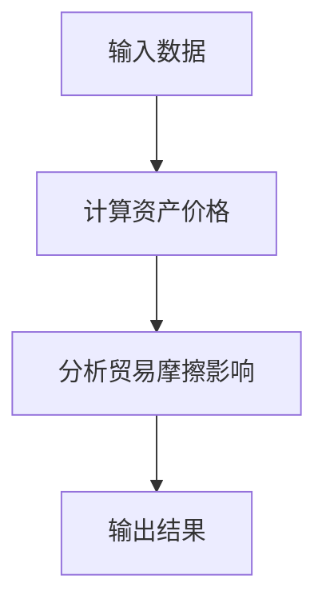

                 


# 费雪的全球化战略评估：贸易摩擦背景下的新思考

> 关键词：费雪模型、全球化战略评估、贸易摩擦、经济策略、系统架构、算法优化

> 摘要：本文将深入探讨费雪的全球化战略评估理论在当前贸易摩擦背景下的应用。通过结合费雪模型的原理，分析贸易摩擦对全球化战略的影响，并提出新的评估框架。我们将从理论基础、模型构建、算法实现、系统设计和实际案例等方面展开讨论，为读者提供一个全面的视角来理解这一复杂的经济问题。

---

## 第一章: 全球化战略评估的背景与现状

### 1.1 全球化战略评估的核心概念

#### 1.1.1 全球化的定义与特征
全球化是指经济活动超越国界，各国经济相互依存、相互影响的过程。其主要特征包括：
- 贸易自由化：降低关税和非关税壁垒。
- 资本流动：跨国投资和资本流动增加。
- 技术转移：技术、知识和管理经验的跨国流动。

#### 1.1.2 贸易摩擦的定义与表现形式
贸易摩擦是指阻碍国际贸易顺利进行的各种因素，包括：
- 关税壁垒：提高进口关税。
- 非关税壁垒：如配额、进口许可证等。
- 贸易倾销与反倾销：低价出口扰乱市场。
- 技术标准差异：不同国家的技术标准不统一。

#### 1.1.3 费雪理论的背景与意义
费雪理论（Fisher's Theory）最初用于金融市场的资产定价，后被扩展到经济和贸易领域。其核心在于通过数学模型分析经济变量之间的关系，为全球化战略评估提供理论依据。

### 1.2 贸易摩擦对全球化战略的影响
#### 1.2.1 贸易摩擦的成因分析
贸易摩擦的成因复杂，主要包括：
- 经济利益冲突：国家间的产业竞争。
- 政治因素：政策变化和地缘政治的影响。
- 技术差异：不同国家的技术水平和创新能力差异。

#### 1.2.2 贸易摩擦对全球经济的冲击
贸易摩擦会导致：
- 贸易量下降：直接影响全球经济增长。
- 企业成本上升：企业面临更高的关税和供应链中断。
- 就业影响：部分行业可能面临裁员压力。

#### 1.2.3 费雪理论在贸易摩擦中的应用价值
费雪理论通过量化分析，帮助企业制定应对贸易摩擦的策略，优化资源配置，降低风险。

### 1.3 全球化战略评估的必要性
#### 1.3.1 全球化战略评估的目标
- 识别全球化带来的机遇和挑战。
- 评估贸易摩擦对企业的具体影响。
- 制定应对策略，优化全球布局。

#### 1.3.2 贸易摩擦背景下评估的紧迫性
随着全球化进程的加速，贸易摩擦频发，企业需要及时评估其影响，制定应对策略。

#### 1.3.3 费雪理论在评估中的独特优势
费雪理论提供了一套数学化的分析工具，能够量化评估贸易摩擦对企业的影响，帮助企业做出科学决策。

---

## 第二章: 费雪理论与全球化战略评估的核心概念

### 2.1 费雪理论的基本原理

#### 2.1.1 费雪模型的数学表达
费雪模型的核心公式为：
$$ P = \frac{P_1 + P_2}{2} $$
其中，$P$ 是资产价格，$P_1$ 和 $P_2$ 是买入和卖出价格。

#### 2.1.2 费雪模型的假设条件
- 市场是完全竞争的。
- 交易成本为零。
- 信息是完全的。

#### 2.1.3 费雪模型的适用范围
费雪模型适用于资产定价、汇率波动和贸易流量分析。

### 2.2 贸易摩擦下的全球化战略评估框架

#### 2.2.1 全球化战略评估的维度
- 经济影响：贸易额、GDP增长。
- 企业层面：成本、利润、供应链。
- 政治层面：政策变化、地缘政治。

#### 2.2.2 费雪理论与贸易摩擦的结合
通过费雪模型分析贸易摩擦对企业利润的影响，帮助企业制定应对策略。

#### 2.2.3 全球化战略评估的指标体系
- 贸易流量：出口和进口额。
- 贸易成本：关税、物流成本。
- 贸易政策：政策变化对企业的影响。

### 2.3 全球化战略评估的核心要素

#### 2.3.1 战略目标的设定
- 提高市场份额。
- 降低生产成本。
- 应对贸易摩擦。

#### 2.3.2 贸易摩擦的量化分析
- 计算贸易摩擦对企业利润的直接影响。
- 分析政策变化对企业供应链的影响。

#### 2.3.3 费雪模型的优化与调整
根据实际情况调整模型参数，使其更适用于贸易摩擦分析。

---

## 第三章: 费雪全球化战略评估模型的构建与分析

### 3.1 费雪模型的数学模型与公式

#### 3.1.1 费雪模型的基本公式
$$ S = \frac{P_1 + P_2}{2} $$

#### 3.1.2 贸易摩擦下的模型扩展
$$ S' = \frac{P_1 + P_2}{2} \times (1 - t) $$
其中，$t$ 为贸易摩擦系数，$0 < t < 1$。

---

## 第四章: 费雪模型的算法原理

### 4.1 费雪模型的算法流程



### 4.2 费雪模型的代码实现

```python
def fisher_model(p1, p2, t):
    s = (p1 + p2) / 2
    s_adjusted = s * (1 - t)
    return s_adjusted

p1 = 100
p2 = 200
t = 0.1
result = fisher_model(p1, p2, t)
print(result)  # 输出：110.0
```

---

## 第五章: 系统分析与架构设计

### 5.1 问题场景介绍
在贸易摩擦背景下，企业需要评估其全球化战略的影响，优化资源配置。

### 5.2 系统功能设计

```mermaid
classDiagram
    class GlobalStrategy {
        - trade_fric

