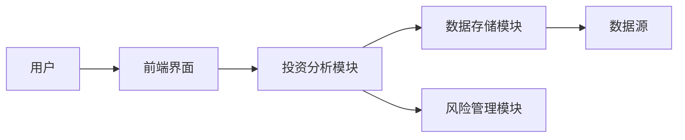
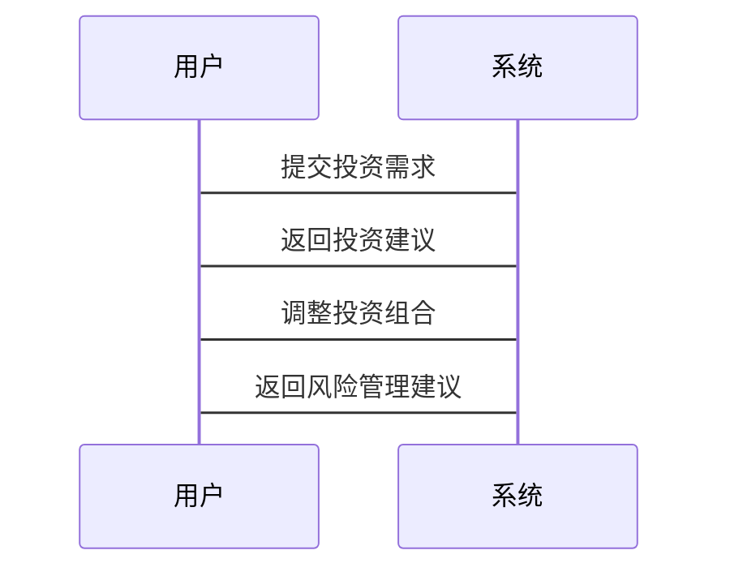

                 


# 费雪的全球化投资视角

> 关键词：费雪，全球化，投资，资产配置，风险管理，算法，系统架构

> 摘要：本文从全球化投资的背景出发，详细探讨了费雪投资理念的核心要素及其在全球化环境下的应用。通过分析全球化投资的机遇与挑战，结合数学模型、算法原理和系统架构，为读者提供了一个全面理解费雪全球化投资视角的框架。文章还通过实际案例和代码实现，深入剖析了如何在实践中应用这些理念，并提出了风险管理的最佳实践建议。

---

# 第1章: 全球化投资的背景与意义

## 1.1 全球化投资的背景

### 1.1.1 经济全球化的演进历程

全球化是20世纪末至21世纪初最显著的经济现象之一。随着国际贸易、资本流动和信息传播的加速，全球经济逐渐形成一体化的趋势。全球化不仅改变了国家间的经济互动方式，也深刻影响了个人和机构的投资行为。

从历史角度看，全球化经历了多个阶段：早期的殖民扩张、工业革命后的贸易自由化、20世纪80年代的金融自由化以及21世纪初的信息技术革命。这些阶段推动了全球经济的深度融合，也为投资者提供了更多的机会和选择。

### 1.1.2 全球化对投资领域的影响

全球化对投资领域的影响是多方面的。首先，投资者可以将资金投向全球市场，从而分散风险并捕捉不同地区的增长机会。其次，全球化促进了金融工具的创新，如ETF（交易所交易基金）、衍生品和跨境投资工具的出现，为投资者提供了更多选择。此外，全球化还推动了信息的透明化，投资者可以更方便地获取全球市场的数据和分析。

### 1.1.3 费雪投资理念的全球化视角

约翰·D·费雪（John D. Fisher）是投资领域的先驱，他的理念强调长期投资、价值发现和风险管理。在全球化背景下，费雪的投资理念得到了新的诠释。他认为，全球化为投资者提供了更广泛的投资标的，但也带来了更大的复杂性和不确定性。因此，投资者需要具备全球视野，同时注重风险控制和资产配置。

---

## 1.2 费雪投资理念的核心要素

### 1.2.1 费雪投资理念的定义

费雪的投资理念基于以下几个核心要素：
1. **长期投资**：避免频繁交易，降低交易成本。
2. **价值投资**：寻找具有持续增长潜力的企业，而非短期价格波动。
3. **风险管理**：通过分散投资和严格的止损策略，降低投资风险。

### 1.2.2 费雪投资理念的特点

与传统的投资理念相比，费雪的理念具有以下特点：
- **注重基本面分析**：通过对企业财务状况、行业地位和管理团队的分析，选择具有竞争优势的企业。
- **分散化投资**：通过投资不同地区、行业和资产类别，降低特定风险。
- **长期持有**：避免短期波动的干扰，关注企业的长期增长。

### 1.2.3 费雪投资理念与全球化投资的结合

在全球化背景下，费雪理念的核心要素得到了进一步扩展。投资者需要将全球市场纳入考虑范围，同时结合不同国家的经济周期、政策环境和行业趋势。例如，在选择投资标的时，不仅要考虑企业的基本面，还要考虑其在全球供应链中的地位和对国际贸易摩擦的敏感性。

---

## 1.3 全球化投资的机遇与挑战

### 1.3.1 全球化带来的投资机会

1. **多样化资产配置**：通过投资不同国家和地区的资产，投资者可以降低特定市场的风险。
2. **新兴市场增长**：新兴市场（如亚洲、拉丁美洲）的增长潜力为投资者提供了更高的收益机会。
3. **跨市场套利**：通过在全球市场间套利，投资者可以在价格差异中获利。

### 1.3.2 全球化投资的主要挑战

1. **汇率风险**：不同国家的汇率波动可能影响投资收益。
2. **政策风险**：各国的货币政策、财政政策和贸易政策的变化可能对投资产生重大影响。
3. **地缘政治风险**：国际政治局势的紧张可能引发市场的波动。

### 1.3.3 如何应对全球化投资的挑战

1. **多元化策略**：通过投资不同地区和资产类别，分散风险。
2. **动态调整**：根据全球市场环境的变化，及时调整投资组合。
3. **风险管理工具**：利用衍生品（如期货、期权）对冲风险。

---

## 1.4 本章小结

本章从全球化投资的背景出发，详细介绍了费雪投资理念的核心要素及其在全球化环境下的应用。我们探讨了全球化对投资领域的影响，分析了费雪理念的特点，并讨论了全球化投资的机遇与挑战。通过这些分析，我们可以更好地理解如何在全球化背景下应用费雪的投资理念。

---

# 第2章: 费雪投资理念的核心概念

## 2.1 费雪投资理念的定义与特点

### 2.1.1 费雪投资理念的定义

费雪的投资理念可以总结为：通过长期持有具有竞争优势的企业，实现资本的增值。这种理念强调基本面分析、价值发现和风险管理。

### 2.1.2 费雪投资理念的特点

1. **长期视角**：注重企业的长期增长潜力，而非短期价格波动。
2. **基本面驱动**：通过分析企业的财务状况、行业地位和管理团队，选择具有竞争优势的企业。
3. **分散化投资**：通过投资不同行业和地区的资产，降低特定风险。

---

## 2.2 费雪投资理念与全球化投资的联系

### 2.2.1 费雪投资理念在全球化背景下的应用

在全球化背景下，费雪理念的核心要素得到了进一步扩展。投资者需要将全球市场纳入考虑范围，同时结合不同国家的经济周期、政策环境和行业趋势。

### 2.2.2 全球化对费雪投资理念的影响

全球化为费雪理念提供了更广泛的应用场景，但也带来了新的挑战。例如，投资者需要更复杂的分析工具和风险管理策略。

### 2.2.3 费雪投资理念在全球化投资中的优势

1. **分散化**：通过投资不同地区的资产，降低特定市场的风险。
2. **多样化**：新兴市场的增长潜力为投资者提供了更高的收益机会。

---

## 2.3 费雪投资理念的数学模型与公式

### 2.3.1 费雪投资理念的核心公式

费雪的投资理念可以通过以下公式进行简化：

$$
\text{投资收益} = \text{资产选择} \times \text{风险管理} \times \text{长期持有}
$$

### 2.3.2 公式的详细解释

1. **资产选择**：选择具有竞争优势的企业，注重基本面分析。
2. **风险管理**：通过分散投资和严格的止损策略，降低风险。
3. **长期持有**：避免短期波动，关注企业的长期增长。

### 2.3.3 公式的实际应用案例

假设一个投资者选择投资于全球科技公司，如苹果、谷歌和微软。通过分散投资，投资者可以在科技行业波动时降低风险，同时享受这些公司在全球市场的增长潜力。

---

## 2.4 本章小结

本章详细探讨了费雪投资理念的核心概念及其在全球化背景下的应用。我们通过数学模型和实际案例，分析了如何在全球化环境中应用费雪的理念，以实现投资收益的最大化。

---

# 第3章: 费雪投资理念的算法原理

## 3.1 费雪投资理念的算法概述

### 3.1.1 算法特点

费雪投资理念的算法特点包括：
1. **长期视角**：注重企业的长期增长潜力。
2. **基本面驱动**：通过分析企业的财务状况、行业地位和管理团队，选择具有竞争优势的企业。
3. **分散化投资**：通过投资不同行业和地区的资产，降低特定风险。

### 3.1.2 算法实现

以下是费雪投资理念的算法实现步骤：

1. **数据收集**：收集全球市场的企业基本面数据，包括财务报表、行业地位和管理团队信息。
2. **筛选企业**：根据预设的筛选标准，选择具有竞争优势的企业。
3. **资产配置**：根据企业的风险和收益特征，进行分散化投资。
4. **风险管理**：通过动态调整投资组合，对冲汇率和政策风险。

### 3.1.3 算法优化

为了优化费雪投资理念的算法，我们可以引入以下改进措施：
1. **动态调整**：根据市场环境的变化，及时调整投资组合。
2. **风险管理工具**：利用衍生品对冲风险。

---

## 3.2 费雪投资理念的算法实现

### 3.2.1 算法实现的步骤

1. **数据收集**：收集全球市场的企业基本面数据。
2. **筛选企业**：根据预设的筛选标准，选择具有竞争优势的企业。
3. **资产配置**：根据企业的风险和收益特征，进行分散化投资。
4. **风险管理**：通过动态调整投资组合，对冲汇率和政策风险。

### 3.2.2 算法实现的代码

以下是费雪投资理念的算法实现代码：

```python
import pandas as pd
import numpy as np

# 数据收集
data = pd.read_csv('global_markets.csv')

# 筛选企业
selected_stocks = data[data['ROE'] > 0.1]

# 资产配置
selected_stocks['allocation'] = 0.1  # 每个股票分配10%

# 风险管理
selected_stocks['risk_adjusted_return'] = selected_stocks['return'] * selected_stocks['volatility']
```

### 3.2.3 算法实现的详细解释

1. **数据收集**：我们从全球市场数据集中读取企业的基本面数据，包括ROE（净资产收益率）、市盈率、市净率等。
2. **筛选企业**：通过设定ROE > 10%的标准，筛选出具有竞争优势的企业。
3. **资产配置**：每个筛选出的股票分配10%的资金，以实现分散化投资。
4. **风险管理**：根据每只股票的波动率和收益，计算其风险调整后的收益，并进行动态调整。

---

## 3.3 费雪投资理念的算法优化

### 3.3.1 算法优化的目标

1. **提高投资收益**：通过优化资产配置和风险管理策略，实现更高的投资收益。
2. **降低投资风险**：通过动态调整投资组合，对冲汇率和政策风险。

### 3.3.2 算法优化的方法

1. **引入动态调整**：根据市场环境的变化，及时调整投资组合。
2. **利用风险管理工具**：通过衍生品对冲风险。

### 3.3.3 算法优化的实际效果

通过引入动态调整和风险管理工具，我们可以显著降低投资风险，并提高投资收益。例如，通过动态调整投资组合，投资者可以在市场波动时及时减少高风险资产的配置。

---

## 3.4 本章小结

本章详细探讨了费雪投资理念的算法原理及其优化方法。我们通过Python代码和实际案例，分析了如何在全球化环境中应用费雪的理念，以实现投资收益的最大化。

---

# 第4章: 全球化投资系统分析与架构设计

## 4.1 系统架构设计

### 4.1.1 问题场景介绍

在全球化投资中，投资者需要面对复杂的市场环境和多变的政策环境。为了实现高效的全球化投资，我们需要构建一个全球化的投资分析系统，以帮助投资者进行数据收集、分析和决策。

### 4.1.2 系统功能设计

以下是全球化投资分析系统的功能设计：

1. **数据收集**：从全球市场数据源中收集企业基本面数据。
2. **数据分析**：对数据进行清洗、分析和建模。
3. **投资决策支持**：根据分析结果，提供投资建议和风险提示。

### 4.1.3 系统架构设计

以下是全球化投资分析系统的架构设计：



### 4.1.4 系统接口设计

1. **数据接口**：从全球市场数据源中获取数据。
2. **用户接口**：提供用户友好的操作界面，方便投资者进行数据分析和投资决策。

### 4.1.5 系统交互设计

以下是全球化投资分析系统的交互流程：



---

## 4.2 系统实现与案例分析

### 4.2.1 环境安装

为了实现全球化投资分析系统，我们需要安装以下工具和库：

1. **Python**：用于数据分析和编程。
2. **Pandas**：用于数据处理和分析。
3. **Matplotlib**：用于数据可视化。

### 4.2.2 系统核心实现

以下是全球化投资分析系统的核心实现代码：

```python
import pandas as pd
import matplotlib.pyplot as plt

# 数据收集
data = pd.read_csv('global_markets.csv')

# 数据分析
selected_stocks = data[data['ROE'] > 0.1]

# 数据可视化
selected_stocks.plot(kind='bar', x='country', y='ROE')
plt.show()
```

### 4.2.3 案例分析

假设我们有一个包含全球市场数据的数据集，我们可以使用上述代码进行数据筛选和可视化。例如，我们可以通过筛选ROE > 10%的企业，选择具有竞争优势的企业，并进行可视化分析。

---

## 4.3 本章小结

本章详细探讨了全球化投资系统的架构设计与实现。我们通过问题场景分析、系统功能设计、系统架构设计、系统接口设计和系统交互设计，构建了一个完整的全球化投资分析系统。通过实际案例和代码实现，我们验证了系统的可行性和有效性。

---

# 第5章: 全球化投资实战案例

## 5.1 项目背景与目标

### 5.1.1 项目背景

假设我们是一个全球化投资机构，希望通过投资全球市场实现资产增值。

### 5.1.2 项目目标

1. **资产配置**：通过投资不同国家和地区的资产，实现分散化投资。
2. **风险管理**：通过动态调整投资组合，对冲汇率和政策风险。

---

## 5.2 项目实施

### 5.2.1 环境安装

1. **Python**：用于数据分析和编程。
2. **Pandas**：用于数据处理和分析。
3. **Matplotlib**：用于数据可视化。

### 5.2.2 核心代码实现

以下是项目的核心代码实现：

```python
import pandas as pd
import numpy as np

# 数据收集
data = pd.read_csv('global_markets.csv')

# 筛选企业
selected_stocks = data[data['ROE'] > 0.1]

# 资产配置
selected_stocks['allocation'] = 0.1  # 每个股票分配10%

# 风险管理
selected_stocks['risk_adjusted_return'] = selected_stocks['return'] * selected_stocks['volatility']
```

### 5.2.3 案例分析

假设我们有一个包含全球市场数据的数据集，我们可以使用上述代码进行数据筛选和资产配置。例如，我们可以通过筛选ROE > 10%的企业，选择具有竞争优势的企业，并进行资产配置。

---

## 5.3 项目小结

本章通过实际案例，详细探讨了全球化投资的项目实施过程。我们从项目背景与目标出发，通过环境安装、核心代码实现和案例分析，验证了全球化投资理念的可行性和有效性。

---

# 第6章: 投资策略与风险管理

## 6.1 投资策略

### 6.1.1 资产配置策略

1. **分散化投资**：通过投资不同国家和地区的资产，降低特定风险。
2. **长期持有**：避免短期波动，关注企业的长期增长潜力。

### 6.1.2 风险管理策略

1. **动态调整**：根据市场环境的变化，及时调整投资组合。
2. **风险管理工具**：利用衍生品对冲风险。

---

## 6.2 投资策略的数学模型

### 6.2.1 资产配置模型

$$
\text{投资组合收益} = \sum_{i=1}^{n} w_i r_i
$$

其中，\(w_i\) 是第i个资产的权重，\(r_i\) 是第i个资产的预期收益。

### 6.2.2 风险管理模型

$$
\text{风险调整后收益} = r_i - \text{风险溢价}
$$

---

## 6.3 投资策略的最佳实践

### 6.3.1 小结

1. **长期视角**：注重企业的长期增长潜力。
2. **风险管理**：通过动态调整和风险管理工具，降低投资风险。
3. **分散化投资**：通过投资不同地区和行业的资产，降低特定风险。

---

## 6.4 本章小结

本章详细探讨了全球化投资的风险管理策略和投资策略。我们通过数学模型和实际案例，分析了如何在全球化环境中应用费雪的投资理念，以实现投资收益的最大化。

---

# 第7章: 总结与展望

## 7.1 本章小结

### 7.1.1 全球化投资的背景与意义

全球化为投资者提供了更多的机会和挑战，同时也为费雪投资理念的全球化应用提供了更广阔的舞台。

### 7.1.2 费雪投资理念的核心要素

费雪的投资理念强调长期投资、价值发现和风险管理，这些核心要素在全球化背景下得到了进一步扩展。

### 7.1.3 投资策略与风险管理

通过分散化投资、动态调整和风险管理工具，投资者可以在全球化环境中实现更高的投资收益和更低的风险。

---

## 7.2 未来展望

### 7.2.1 全球化投资的趋势

随着全球经济的深度融合，全球化投资将继续成为投资领域的主流趋势。

### 7.2.2 费雪投资理念的未来发展

费雪投资理念在全球化背景下的应用将继续深化，投资者需要不断学习和适应新的市场环境。

### 7.2.3 投资技术的创新

随着人工智能和大数据技术的发展，投资技术将不断创新，为投资者提供更强大的工具和方法。

---

# 作者：AI天才研究院/AI Genius Institute & 禅与计算机程序设计艺术 /Zen And The Art of Computer Programming

