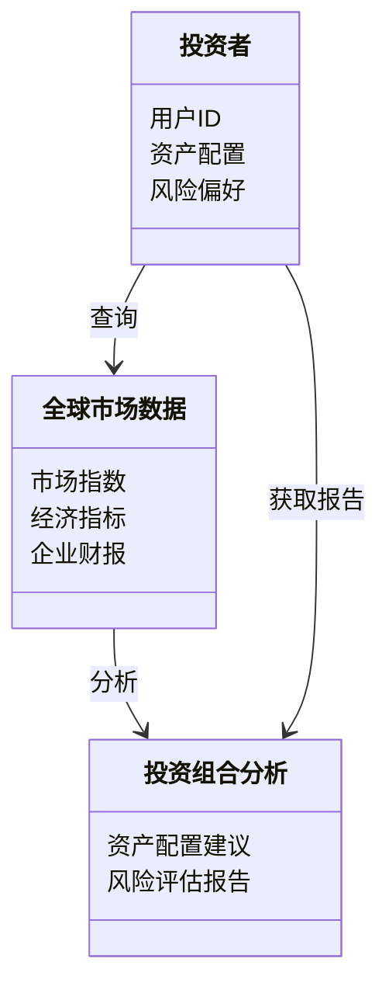
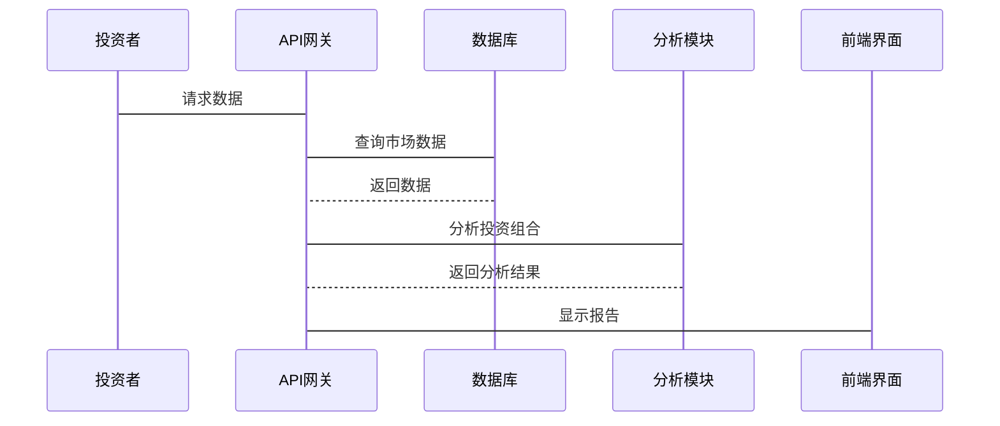

                 

# 费雪的全球化视角：如何在国际市场中寻找投资机会

> 关键词：全球化投资，费雪投资理念，国际市场分析，风险管理，资产配置，投资策略，经济指标

> 摘要：本文从费雪的全球化视角出发，分析如何在全球化背景下寻找国际市场的投资机会。通过探讨费雪的投资理念、全球化投资策略、风险管理和资产配置等核心问题，结合实际案例和系统架构设计，为投资者提供深度分析和实战指导，帮助读者在国际市场上做出明智的投资决策。

---

# 第一部分: 全球化与投资机会的背景

## 第1章: 全球化概述

### 1.1 全球化的概念与历史演变

#### 1.1.1 全球化的定义
全球化是指经济、文化、政治等领域的国际一体化过程，通过跨国贸易、资本流动和技术创新实现各国之间的深度融合。

#### 1.1.2 全球化的历史演变
全球化经历了多个阶段，从早期的贸易保护主义到现在的自由贸易和跨国公司主导，每个阶段都推动了全球经济的深度融合。

#### 1.1.3 全球化对经济的影响
全球化促进了资源的优化配置，提高了生产效率，但也带来了贫富差距扩大和经济不稳定的挑战。

### 1.2 全球化与投资机会的关系

#### 1.2.1 全球化如何影响投资
全球化使投资者能够跨越国界，投资于全球市场，从而分散风险，寻找更高的回报。

#### 1.2.2 投资者如何利用全球化的机会
通过全球化，投资者可以进入新兴市场，利用不同国家的比较优势，实现资产的多元化配置。

#### 1.2.3 全球化带来的风险与挑战
全球化也带来了汇率风险、政治风险和经济波动等挑战，需要投资者具备全球视野和风险管理能力。

### 1.3 费雪的全球化视角

#### 1.3.1 费雪的投资理念
费雪强调长期投资和价值投资，注重企业的基本面分析和管理层素质。

#### 1.3.2 费雪视角下的全球化投资
费雪认为全球化为投资者提供了更多的机会，但需要结合当地市场特征和经济趋势进行分析。

#### 1.3.3 费雪全球化投资的实践案例
通过具体案例，展示费雪如何在全球市场中寻找投资机会，分析企业的竞争优势和行业趋势。

---

## 第2章: 国际市场分析基础

### 2.1 国际市场的主要参与者

#### 2.1.1 主要国家的经济特征
分析美国、欧洲、中国等主要经济体的经济特征，如GDP增长、通货膨胀率、失业率等。

#### 2.1.2 主要国际组织的作用
如IMF、世界银行等机构在维护全球经济稳定中的作用。

#### 2.1.3 跨国公司的角色
跨国公司如何在全球市场中布局，影响全球产业链。

### 2.2 国际市场的经济指标

#### 2.2.1 主要经济指标的定义与作用
如GDP、CPI、失业率等指标的定义和作用。

#### 2.2.2 经济指标的分析方法
如何通过经济指标预测市场趋势和企业盈利状况。

#### 2.2.3 经济指标对投资决策的影响
分析经济指标如何帮助投资者做出决策，如货币政策变化对企业的影响。

---

## 第3章: 全球化视角下的投资策略

### 3.1 全球化投资的基本原则

#### 3.1.1 投资分散化的重要性
通过分散投资降低风险，避免单一市场的波动影响整体投资组合。

#### 3.1.2 风险管理的核心作用
制定风险管理策略，如止损机制、风险对冲等。

#### 3.1.3 长期投资的价值
长期投资能够平滑短期波动，实现资产的稳健增长。

### 3.2 费雪视角下的全球化投资策略

#### 3.2.1 费雪的投资理念与全球化结合
将费雪的价值投资理念应用到全球市场中，寻找具有持续竞争优势的企业。

#### 3.2.2 全球化视角下的资产配置
根据全球经济趋势和市场周期，调整资产配置比例。

#### 3.2.3 费雪全球化投资的实战技巧
如行业选择、市场进入时机、企业基本面分析等。

---

## 第4章: 全球化投资的行业分析

### 4.1 全球化视角下的行业选择

#### 4.1.1 行业分析的基本方法
如SWOT分析、PEST分析等工具的应用。

#### 4.1.2 全球化视角下的行业趋势
分析科技、金融、制造业等行业的全球化发展趋势。

#### 4.1.3 行业选择的实战案例
如科技行业的全球化投资机会分析。

### 4.2 主要行业的全球化投资机会

#### 4.2.1 高科技行业的全球化机会
如人工智能、5G通信等领域的投资机会。

#### 4.2.2 金融行业的全球化机会
如跨境金融、金融科技等领域的投资机会。

#### 4.2.3 制造业的全球化机会
如新能源汽车、高端装备制造等领域的投资机会。

---

## 第5章: 全球化投资的风险管理

### 5.1 全球化投资的主要风险

#### 5.1.1 政治风险
如政策变化、贸易摩擦等对投资的影响。

#### 5.1.2 经济风险
如经济衰退、通货膨胀等对投资的影响。

#### 5.1.3 市场风险
如市场波动、流动性风险等对投资的影响。

### 5.2 风险管理的策略与方法

#### 5.2.1 风险分散化
通过投资多元化、资产类别多样化等策略降低风险。

#### 5.2.2 风险对冲
如使用衍生工具对冲汇率风险和市场波动风险。

#### 5.2.3 风险监控与预警
建立风险监控体系，及时发现和应对潜在风险。

---

## 第6章: 系统分析与架构设计方案

### 6.1 投资分析系统的项目介绍

#### 6.1.1 项目背景
构建一个全球化投资分析系统，帮助投资者进行多市场分析和风险评估。

#### 6.1.2 项目目标
提供全球市场数据的实时监控、投资组合分析、风险评估等功能。

### 6.2 系统功能设计

#### 6.2.1 领域模型（Mermaid 类图）

#### 6.2.2 系统架构设计（Mermaid 架构图）

### 6.3 系统接口设计

#### 6.3.1 系统接口

#### 6.3.2 接口交互流程
投资者通过前端界面提交查询请求，API网关接收并转发到数据库，获取市场数据后返回给分析模块，分析结果展示在前端。

---

## 第7章: 项目实战

### 7.1 环境安装

#### 7.1.1 系统环境
需要安装Python、Jupyter Notebook、Mermaid工具等。

#### 7.1.2 数据库安装
安装MySQL或PostgreSQL等数据库系统，用于存储市场数据。

### 7.2 核心实现

#### 7.2.1 数据收集模块
编写Python脚本，从公开数据源获取全球市场数据。

#### 7.2.2 数据分析模块
使用Pandas进行数据分析，生成投资组合报告。

#### 7.2.3 可视化模块
使用Matplotlib或Seaborn进行数据可视化，展示市场趋势和投资组合风险。

### 7.3 应用解读与分析

#### 7.3.1 投资组合优化
通过优化算法，寻找最优资产配置比例。

#### 7.3.2 风险评估
计算投资组合的波动率、VaR等风险指标。

### 7.4 案例分析

#### 7.4.1 某新兴市场的投资分析
分析某新兴市场的经济指标、行业趋势，制定投资策略。

---

## 第8章: 最佳实践

### 8.1 小结

#### 8.1.1 全球化投资的核心观点
全球化为投资者提供了更多机会，但也带来了更多风险，需要系统化的方法进行分析和管理。

#### 8.1.2 费雪视角的重要性
费雪的投资理念为全球化投资提供了宝贵的指导，帮助投资者在复杂市场中做出明智决策。

### 8.2 注意事项

#### 8.2.1 风险管理的重要性
始终将风险管理放在首位，避免重大损失。

#### 8.2.2 持续学习与适应
全球经济环境不断变化，投资者需要持续学习和调整策略。

### 8.3 拓展阅读

#### 8.3.1 推荐书籍
《投资学精要》、《全球投资策略》等。

#### 8.3.2 在线资源
推荐一些权威的金融分析网站和工具，供读者深入学习。

---

# 小结

通过本文的分析，我们从费雪的全球化视角出发，探讨了如何在全球市场中寻找投资机会。结合理论分析、系统设计和项目实战，为投资者提供了全面的指导，帮助他们在复杂多变的国际市场上做出明智的投资决策。

---

作者：AI天才研究院/AI Genius Institute & 禅与计算机程序设计艺术 /Zen And The Art of Computer Programming

