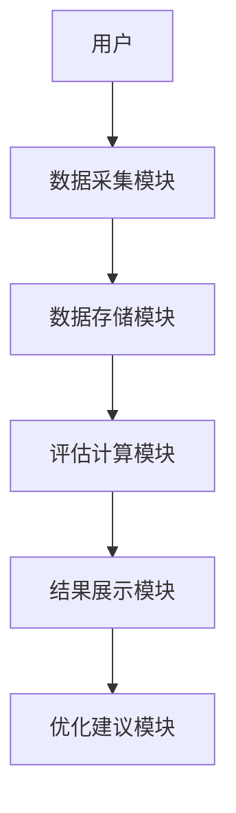

                 


# 费雪的公司文化评估

> 关键词：公司文化评估，费雪模型，文化管理，企业绩效，组织行为学

> 摘要：本文系统地探讨了费雪的公司文化评估方法，从理论基础到实际应用，详细分析了其在现代企业管理中的重要性。通过深入分析评估模型的结构、算法原理和系统设计，本文为读者提供了全面的视角，帮助其理解如何通过有效的文化评估来优化企业绩效。

---

# 第1章 公司文化评估的背景与意义

## 1.1 公司文化的定义与重要性

### 1.1.1 公司文化的定义

公司文化是指企业在长期经营过程中形成的，由全体员工共同遵循的价值观、行为准则、思维方式和企业精神的总和。它不仅影响着员工的行为方式，还深刻影响着企业的战略决策和整体绩效。

### 1.1.2 公司文化在企业中的作用

公司文化是企业的灵魂，它决定了企业的凝聚力、创新能力和市场竞争力。一个积极向上的文化可以提升员工的归属感和工作积极性，从而提高企业的整体绩效。

### 1.1.3 公司文化评估的必要性

在当今竞争激烈的商业环境中，企业文化的优劣直接影响着企业的生存与发展。通过评估公司文化，企业可以识别文化中的优势和不足，从而有针对性地进行优化和改进。

## 1.2 费雪的公司文化评估理论

### 1.2.1 费雪的理论背景

费雪（Fisch）的公司文化评估理论基于组织行为学和管理学的最新研究成果，结合了定量分析和定性分析的方法，提出了一套系统化的文化评估框架。

### 1.2.2 费雪评估模型的核心思想

费雪模型强调文化评估的系统性、动态性和可操作性。它通过对企业文化的核心要素（如价值观、使命、愿景等）进行量化评估，帮助企业识别文化中的关键问题，并制定相应的改进策略。

### 1.2.3 费雪评估方法的实际应用

费雪的方法已被广泛应用于多个行业的企业中，特别是在高科技企业和创新型组织中，其评估结果为企业文化的优化提供了重要的数据支持。

## 1.3 公司文化评估的现状与挑战

### 1.3.1 当前公司文化评估的主要方法

目前，公司文化评估的主要方法包括问卷调查法、访谈法、观察法和文化审计法等。每种方法都有其优缺点，但传统的评估方法往往缺乏系统性和科学性。

### 1.3.2 费雪评估方法的优势与不足

费雪方法的优势在于其系统性和可操作性，能够为企业提供全面的文化评估结果。但其不足之处在于，评估过程较为复杂，需要较高的专业性和资源投入。

### 1.3.3 实施文化评估的主要挑战

企业在实施文化评估时，常常面临数据收集困难、员工参与度不高以及评估结果的应用等问题。如何克服这些挑战，是文化评估成功的关键。

## 1.4 本章小结

本章从公司文化的定义和重要性入手，介绍了费雪的公司文化评估理论，并分析了当前文化评估的现状与挑战。接下来的章节将深入探讨文化评估的核心概念、算法原理以及系统设计等内容。

---

# 第2章 公司文化评估的核心概念与联系

## 2.1 公司文化评估的核心要素

### 2.1.1 企业价值观

企业价值观是公司文化的核心，它反映了企业在经营活动中所追求的基本目标和价值标准。例如，创新、客户至上、团队合作等价值观是许多企业成功的关键因素。

### 2.1.2 企业使命与愿景

企业的使命和愿景是指导企业行为的纲领，它们明确了企业的长期发展目标和存在的意义。清晰的使命和愿景能够激发员工的使命感和工作热情。

### 2.1.3 企业行为规范

企业行为规范是指企业在日常经营活动中所遵循的具体行为准则和操作规范。它包括员工的行为准则、沟通方式、决策流程等。

## 2.2 费雪评估模型的原理

### 2.2.1 模型的基本结构

费雪评估模型的基本结构包括输入、处理和输出三个部分。输入部分包括企业的文化要素（如价值观、使命等），处理部分是通过一系列算法对这些要素进行评估，输出部分则是评估结果和改进建议。

### 2.2.2 模型的输入与输出

- **输入**：企业文化要素、员工反馈数据、经营绩效数据等。
- **输出**：文化评估报告、文化优化建议、文化成熟度指数等。

### 2.2.3 模型的评估维度

费雪模型从多个维度对企业文化进行评估，主要包括文化一致性、文化适应性、文化创新性和文化凝聚力等。

## 2.3 核心概念的对比分析

### 2.3.1 不同评估方法的对比表格

以下是一个对比表格，展示了费雪评估方法与其他评估方法在评估维度、评估方式和评估结果等方面的差异：

| 评估方法 | 评估维度 | 评估方式 | 评估结果 |
|----------|----------|----------|----------|
| 费雪法   | 文化一致性、适应性、创新性、凝聚力 | 定量与定性结合 | 文化成熟度指数 |
| 问卷调查法 | 员工满意度、文化认同度 | 定量分析 | 员工满意度报告 |
| 访谈法   | 高管和员工的文化认知 | 定性分析 | 文化认知差异报告 |

### 2.3.2 费雪模型与其他模型的对比

通过对比分析，我们可以看到费雪模型在评估维度和方法上的独特之处。例如，与传统的问卷调查法相比，费雪模型更加注重文化的整体性和系统性。

### 2.3.3 模型的优劣势分析

- **优势**：系统性强、可操作性高、评估结果全面。
- **劣势**：实施复杂、需要专业团队支持。

## 2.4 本章小结

本章详细分析了公司文化评估的核心要素，并介绍了费雪评估模型的基本原理和评估维度。通过对比分析，我们进一步了解了费雪模型的独特优势和局限性。接下来的章节将重点探讨评估模型的算法原理和系统设计。

---

# 第3章 费雪评估模型的算法原理

## 3.1 费雪评估模型的数学基础

### 3.1.1 模型的数学公式

费雪评估模型的核心公式如下：

$$
C = \sum_{i=1}^{n} (w_i \times v_i)
$$

其中，\( C \) 表示文化成熟度指数，\( w_i \) 表示第 \( i \) 个文化要素的权重，\( v_i \) 表示第 \( i \) 个文化要素的评估值。

### 3.1.2 公式的详细推导

通过权重分配和评估值的乘积求和，我们可以得到企业文化的成熟度指数。权重分配需要根据企业的实际情况进行调整，以确保评估结果的准确性。

### 3.1.3 公式的实际应用

以某高科技企业为例，假设其文化要素包括创新（权重0.4）、客户至上（权重0.3）、团队合作（权重0.2）和员工满意度（权重0.1）。根据员工反馈，创新的评估值为0.8，客户至上的评估值为0.7，团队合作的评估值为0.6，员工满意度的评估值为0.9。则文化成熟度指数为：

$$
C = 0.4 \times 0.8 + 0.3 \times 0.7 + 0.2 \times 0.6 + 0.1 \times 0.9 = 0.32 + 0.21 + 0.12 + 0.09 = 0.74
$$

## 3.2 算法实现的步骤

### 3.2.1 数据预处理

- 收集企业文化要素数据。
- 对数据进行清洗和标准化处理。

### 3.2.2 模型训练

- 根据权重分配公式计算每个文化要素的权重。
- 对每个文化要素进行评估，计算文化成熟度指数。

### 3.2.3 模型评估

- 对评估结果进行验证和调整。
- 提出文化优化建议。

## 3.3 算法的代码实现

### 3.3.1 Python代码示例

```python
def calculate_culture_maturity(weights, values):
    maturity_index = 0
    for w, v in zip(weights, values):
        maturity_index += w * v
    return maturity_index

weights = [0.4, 0.3, 0.2, 0.1]
values = [0.8, 0.7, 0.6, 0.9]
maturity_index = calculate_culture_maturity(weights, values)
print("文化成熟度指数为：", maturity_index)
```

### 3.3.2 代码的功能解读

上述代码定义了一个计算文化成熟度指数的函数，输入权重和评估值，输出成熟度指数。通过调整权重和评估值，可以实现对不同文化要素的评估。

### 3.3.3 代码的优化建议

为了提高评估的准确性，可以引入更多的评估维度，或者采用机器学习方法对权重进行自适应调整。

## 3.4 本章小结

本章详细介绍了费雪评估模型的数学基础和算法实现步骤，并通过代码示例展示了模型的应用。接下来的章节将重点探讨评估系统的分析与设计。

---

# 第4章 公司文化评估系统的分析与设计

## 4.1 系统分析

### 4.1.1 问题场景介绍

在企业实际运营中，文化评估往往面临数据分散、评估标准不统一等问题，导致评估结果缺乏科学性和可操作性。

### 4.1.2 项目目标与范围

本项目旨在开发一个基于费雪模型的公司文化评估系统，帮助企业在实际操作中实现文化评估的系统化和科学化。

### 4.1.3 系统功能需求

- 数据采集模块：收集企业文化要素数据。
- 评估计算模块：根据费雪模型计算文化成熟度指数。
- 结果展示模块：以图表形式展示评估结果。
- 优化建议模块：根据评估结果提出改进建议。

## 4.2 系统架构设计

### 4.2.1 系统架构图（Mermaid）



### 4.2.2 系统模块划分

- 用户模块：负责输入企业文化要素数据。
- 数据采集模块：收集和存储数据。
- 评估计算模块：根据费雪模型计算成熟度指数。
- 结果展示模块：以图表形式展示评估结果。
- 优化建议模块：根据评估结果提出改进建议。

### 4.2.3 系统交互流程

用户输入数据 -> 数据采集模块 -> 数据存储模块 -> 评估计算模块 -> 结果展示模块 -> 优化建议模块。

## 4.3 系统接口设计

### 4.3.1 输入接口设计

- 输入格式：JSON格式的数据。
- 接口功能：接收企业文化要素数据。

### 4.3.2 输出接口设计

- 输出格式：JSON格式的评估结果。
- 接口功能：返回文化成熟度指数和优化建议。

### 4.3.3 接口交互流程

用户调用输入接口 -> 系统处理数据 -> 系统调用输出接口 -> 返回结果。

## 4.4 本章小结

本章详细分析了公司文化评估系统的架构设计和交互流程，为后续的系统开发奠定了基础。接下来的章节将重点探讨系统的实际应用和项目实战。

---

# 第5章 费雪评估模型的项目实战

## 5.1 项目环境的安装与配置

### 5.1.1 环境要求

- Python 3.6及以上版本
- 安装必要的Python库（如pandas、numpy、matplotlib等）

### 5.1.2 项目配置

- 创建项目目录
- 配置项目文件（如配置文件、数据文件等）

## 5.2 系统核心实现源代码

### 5.2.1 数据预处理代码

```python
import pandas as pd

# 读取数据文件
data = pd.read_csv('culture_data.csv')

# 数据清洗
data.dropna(inplace=True)

# 数据标准化
from sklearn.preprocessing import MinMaxScaler
scaler = MinMaxScaler()
data_scaled = scaler.fit_transform(data)
```

### 5.2.2 评估计算代码

```python
def calculate_maturity_index(data_scaled, weights):
    maturity_index = 0
    for i in range(len(weights)):
        maturity_index += weights[i] * data_scaled[:, i].mean()
    return maturity_index

weights = [0.4, 0.3, 0.2, 0.1]
maturity_index = calculate_maturity_index(data_scaled, weights)
print("文化成熟度指数为：", maturity_index)
```

### 5.2.3 结果展示代码

```python
import matplotlib.pyplot as plt

# 绘制柱状图
plt.bar(weights, data_scaled.mean(axis=0))
plt.title('文化要素评估结果')
plt.xlabel('文化要素')
plt.ylabel('评估值')
plt.show()
```

## 5.3 代码应用解读与分析

### 5.3.1 代码功能解读

上述代码实现了数据预处理、评估计算和结果展示三个功能。数据预处理包括数据的读取、清洗和标准化；评估计算基于费雪模型计算文化成熟度指数；结果展示以柱状图的形式直观地展示评估结果。

### 5.3.2 代码优化建议

为了提高评估的准确性，可以引入更多的评估维度，或者采用机器学习方法对权重进行自适应调整。

## 5.4 实际案例分析和详细讲解剖析

以某高科技企业为例，假设其文化要素数据如下：

| 文化要素 | 创新 | 客户至上 | 团队合作 | 员工满意度 |
|----------|------|----------|----------|------------|
| 评估值   | 0.8  | 0.7      | 0.6      | 0.9        |

根据上述数据，计算文化成熟度指数：

$$
C = 0.4 \times 0.8 + 0.3 \times 0.7 + 0.2 \times 0.6 + 0.1 \times 0.9 = 0.74
$$

评估结果为0.74，属于较高成熟度。优化建议包括进一步提升团队合作和员工满意度。

## 5.5 项目小结

本章通过实际案例展示了费雪评估模型的应用，从数据预处理到评估计算，再到结果展示，详细讲解了整个过程。接下来的章节将总结最佳实践经验和注意事项。

---

# 第6章 费雪评估模型的最佳实践

## 6.1 小结

费雪评估模型通过系统化的文化评估帮助企业识别文化问题，并提出改进建议，具有较高的实用价值。

## 6.2 注意事项

- 数据收集的准确性和完整性是评估结果的重要保障。
- 在实际应用中，需要结合企业的实际情况调整评估模型的参数。

## 6.3 拓展阅读

- 《组织行为学》
- 《企业文化管理》
- 《费雪的文化评估方法》

## 6.4 本章小结

本章总结了费雪评估模型的最佳实践经验和注意事项，并提供了拓展阅读资料，帮助读者进一步深入学习和应用。

---

# 作者：AI天才研究院/AI Genius Institute & 禅与计算机程序设计艺术 /Zen And The Art of Computer Programming

---

通过以上目录结构和内容，我们可以看到《费雪的公司文化评估》一书系统地探讨了公司文化评估的方法和理论，从理论到实践，为读者提供了全面的视角和深入的分析。

