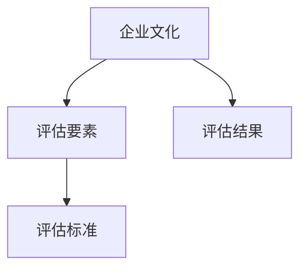

                 

# 费雪的公司文化评估：优秀企业的隐形资产

> 关键词：公司文化评估，费雪方法，企业隐形资产，文化管理，文化价值

> 摘要：公司文化是企业的灵魂，是企业长期发展的核心驱动力。费雪的公司文化评估方法作为一种创新的管理工具，能够帮助企业识别和优化其文化资产，从而提升企业的竞争力和可持续发展能力。本文将深入探讨费雪文化评估的核心概念、方法论、系统架构以及实际应用，为企业管理者提供有价值的参考。

---

# 第一部分: 公司文化评估的背景与重要性

## 第1章: 公司文化评估的核心概念

### 1.1 公司文化评估的定义与背景

#### 1.1.1 公司文化的定义与内涵

公司文化是企业在长期发展过程中形成的独特价值观、行为准则、思维方式和企业精神的总和。它包括企业的使命、愿景、核心价值观、员工的行为规范以及企业与外部环境的互动方式。公司文化不仅是企业的软实力，更是企业区别于竞争对手的核心竞争力。

#### 1.1.2 公司文化评估的定义

公司文化评估是对企业文化的构成要素进行系统性测量、分析和评价的过程。它通过量化和定性分析，帮助企业识别文化中的优势和问题，从而为企业的战略决策和管理改进提供依据。

#### 1.1.3 公司文化评估的重要性

公司文化评估的重要性体现在以下几个方面：

1. **提升企业竞争力**：通过评估文化，企业可以识别其文化优势，并进一步放大这些优势，从而在市场竞争中占据优势。
2. **优化企业治理**：文化评估能够帮助企业发现文化中存在的问题，并通过改进文化要素，优化企业治理结构。
3. **促进企业创新**：文化评估有助于企业发现文化中的僵化和障碍，从而推动企业创新，适应市场变化。
4. **提升员工幸福感**：通过评估文化，企业可以识别员工的需求，并通过优化文化要素，提升员工的幸福感和满意度。

### 1.2 费雪的公司文化评估方法

#### 1.2.1 费雪公司文化评估的起源

费雪的公司文化评估方法是由费雪集团提出的一种系统性文化评估工具。这种方法结合了定量分析和定性分析，能够全面、客观地评估企业文化的优缺点。

#### 1.2.2 费雪文化评估的核心理念

费雪文化评估的核心理念是将企业文化分解为多个核心要素，并通过科学的方法对这些要素进行测量和分析。其核心理念包括：

1. **系统性**：将企业文化分解为多个核心要素，进行全面评估。
2. **可量化**：通过定量分析，将文化要素转化为可测量的指标。
3. **可操作性**：通过分析文化要素，提出具体的改进措施，帮助企业优化文化。

#### 1.2.3 费雪文化评估的独特性与优势

费雪文化评估的独特性体现在以下几个方面：

1. **系统性**：将企业文化分解为多个核心要素，进行全面评估。
2. **可量化**：通过定量分析，将文化要素转化为可测量的指标。
3. **可操作性**：通过分析文化要素，提出具体的改进措施，帮助企业优化文化。
4. **灵活性**：可以根据不同企业的特点，灵活调整评估指标和方法。

### 1.3 公司文化评估的边界与外延

#### 1.3.1 公司文化评估的范围界定

公司文化评估的范围包括以下几个方面：

1. **企业使命与愿景**：评估企业的使命和愿景是否清晰，是否能够激励员工。
2. **核心价值观**：评估企业的核心价值观是否符合企业的发展战略。
3. **企业精神**：评估企业的精神是否能够激励员工，推动企业发展。
4. **员工行为规范**：评估员工的行为规范是否符合企业文化的要求。
5. **企业与外部环境的关系**：评估企业与外部环境的关系是否协调，是否能够为企业创造良好的外部环境。

#### 1.3.2 公司文化评估与其他管理工具的区别

公司文化评估与其他管理工具的区别主要体现在以下几个方面：

1. **关注点不同**：公司文化评估关注的是企业的文化要素，而其他管理工具关注的是企业的业务流程、组织结构等。
2. **方法不同**：公司文化评估主要采用定性分析和定量分析相结合的方法，而其他管理工具可能更多地采用定量分析方法。
3. **目的不同**：公司文化评估的目的是为了优化企业文化，而其他管理工具的目的是为了优化企业的业务流程或组织结构。

#### 1.3.3 公司文化评估的适用场景

公司文化评估的适用场景包括以下几个方面：

1. **企业战略调整**：企业在进行战略调整时，需要评估其文化是否能够支持新的战略目标。
2. **企业并购**：企业在进行并购时，需要评估目标企业的文化是否能够与自身文化融合。
3. **企业文化建设**：企业需要通过文化评估，识别文化中的问题，并提出改进措施。
4. **企业绩效改进**：企业需要通过文化评估，识别文化对绩效的影响，并通过优化文化要素，提升企业绩效。

### 1.4 公司文化评估的核心要素

#### 1.4.1 核心要素的构成

公司文化评估的核心要素包括以下几个方面：

1. **企业使命与愿景**：企业的使命和愿景是企业文化的灵魂，是企业文化的核心。
2. **核心价值观**：企业的核心价值观是企业文化的基石，是企业文化的重要组成部分。
3. **企业精神**：企业精神是企业文化的灵魂，是企业文化的重要组成部分。
4. **员工行为规范**：员工行为规范是企业文化的具体体现，是企业文化的重要组成部分。
5. **企业与外部环境的关系**：企业与外部环境的关系是企业文化的重要组成部分，是企业文化的重要体现。

#### 1.4.2 核心要素之间的关系

公司文化评估的核心要素之间存在密切的关系：

1. **企业使命与愿景**与**核心价值观**：企业的使命和愿景是企业价值观的体现，核心价值观是企业使命和愿景的支撑。
2. **核心价值观**与**企业精神**：企业的核心价值观是企业精神的体现，企业精神是核心价值观的具体表现。
3. **企业精神**与**员工行为规范**：企业精神是员工行为规范的指导，员工行为规范是企业精神的具体体现。
4. **员工行为规范**与**企业与外部环境的关系**：员工行为规范是企业与外部环境关系的体现，企业与外部环境的关系是员工行为规范的外部表现。

#### 1.4.3 核心要素的评估维度

公司文化评估的核心要素可以从以下几个维度进行评估：

1. **清晰度**：企业文化要素是否清晰，是否能够被员工理解和认同。
2. **一致性**：企业文化要素是否一致，是否能够形成统一的企业文化。
3. **激励性**：企业文化要素是否能够激励员工，推动企业发展。
4. **适应性**：企业文化要素是否能够适应企业的战略调整和外部环境的变化。

## 1.5 本章小结

---

# 第二部分: 费雪公司文化评估模型

## 第2章: 费雪文化评估模型的原理与框架

### 2.1 费雪文化评估模型的原理

#### 2.1.1 模型的基本假设

费雪文化评估模型的基本假设包括以下几个方面：

1. **企业文化是可以测量的**：企业文化是由多个核心要素组成的，可以通过科学的方法进行测量。
2. **企业文化是可以优化的**：通过评估和分析，可以识别文化中的问题，并提出改进措施。
3. **企业文化与企业绩效密切相关**：企业文化是影响企业绩效的重要因素，可以通过优化企业文化，提升企业绩效。

#### 2.1.2 模型的核心假设

费雪文化评估模型的核心假设包括以下几个方面：

1. **企业文化要素是可以分解的**：企业文化可以分解为多个核心要素，每个要素都有其独特的特征和作用。
2. **企业文化要素之间存在相互作用**：企业文化要素之间存在相互作用，共同影响企业文化的整体表现。
3. **企业文化是可以量化的**：企业文化可以通过定量和定性分析，转化为可测量的指标。

#### 2.1.3 模型的理论基础

费雪文化评估模型的理论基础包括以下几个方面：

1. **系统论**：企业文化是一个复杂的系统，各个要素之间相互作用，共同影响企业文化的整体表现。
2. **行为科学**：企业文化通过影响员工的行为，进而影响企业绩效。
3. **管理学**：企业文化是企业管理的重要组成部分，是企业战略实施的重要保障。

### 2.2 费雪文化评估模型的框架

#### 2.2.1 模型的层次结构

费雪文化评估模型的层次结构包括以下几个层次：

1. **企业使命与愿景**：企业使命和愿景是企业文化的核心，是文化评估的起点。
2. **核心价值观**：核心价值观是企业文化的基础，是文化评估的重要内容。
3. **企业精神**：企业精神是企业文化的重要组成部分，是文化评估的关键要素。
4. **员工行为规范**：员工行为规范是企业文化的具体体现，是文化评估的重要内容。
5. **企业与外部环境的关系**：企业与外部环境的关系是企业文化的重要组成部分，是文化评估的重要内容。

#### 2.2.2 模型的模块划分

费雪文化评估模型的模块划分包括以下几个方面：

1. **企业使命与愿景评估模块**：评估企业的使命和愿景是否清晰，是否能够激励员工。
2. **核心价值观评估模块**：评估企业的核心价值观是否符合企业的发展战略。
3. **企业精神评估模块**：评估企业精神是否能够激励员工，推动企业发展。
4. **员工行为规范评估模块**：评估员工行为规范是否符合企业文化的要求。
5. **企业与外部环境关系评估模块**：评估企业与外部环境的关系是否协调，是否能够为企业创造良好的外部环境。

#### 2.2.3 模型的输入与输出

费雪文化评估模型的输入包括以下几个方面：

1. **企业使命与愿景**：企业的使命和愿景。
2. **核心价值观**：企业的核心价值观。
3. **企业精神**：企业的精神。
4. **员工行为规范**：员工的行为规范。
5. **企业与外部环境的关系**：企业与外部环境的关系。

模型的输出包括以下几个方面：

1. **文化评估报告**：企业文化评估报告，包括文化要素的评估结果和改进措施。
2. **文化优化建议**：基于评估结果，提出的文化优化建议。
3. **企业文化指数**：企业文化指数，用于衡量企业文化的优劣。

### 2.3 费雪文化评估模型的属性特征对比

#### 2.3.1 模型的可操作性

费雪文化评估模型的可操作性体现在以下几个方面：

1. **系统性**：将企业文化分解为多个核心要素，进行全面评估。
2. **可量化**：通过定量分析，将文化要素转化为可测量的指标。
3. **可操作性**：通过分析文化要素，提出具体的改进措施，帮助企业优化文化。

#### 2.3.2 模型的可扩展性

费雪文化评估模型的可扩展性体现在以下几个方面：

1. **灵活性**：可以根据不同企业的特点，灵活调整评估指标和方法。
2. **适应性**：可以适应企业的战略调整和外部环境的变化。
3. **可扩展性**：可以根据需要，扩展评估的内容和范围。

#### 2.3.3 模型的可解释性

费雪文化评估模型的可解释性体现在以下几个方面：

1. **清晰性**：模型的结构清晰，易于理解和应用。
2. **直观性**：模型的评估结果直观，易于解释和沟通。
3. **可操作性**：模型的改进措施具体可行，易于实施。

### 2.4 费雪文化评估模型的ER实体关系图

### 2.5 本章小结

---

# 第三部分: 费雪公司文化评估的算法原理

## 第3章: 费雪文化评估算法的数学模型

### 3.1 算法原理概述

#### 3.1.1 算法的基本思路

费雪文化评估算法的基本思路是将企业文化分解为多个核心要素，对每个要素进行量化评估，并根据评估结果，提出改进措施。

#### 3.1.2 算法的主要步骤

费雪文化评估算法的主要步骤包括以下几个方面：

1. **确定评估要素**：根据企业文化的核心要素，确定评估要素。
2. **设定评估标准**：为每个评估要素设定评估标准。
3. **收集评估数据**：通过问卷调查、访谈等方式，收集企业文化要素的评估数据。
4. **评估数据处理**：对收集到的数据进行清洗、转换和标准化处理。
5. **计算评估结果**：根据评估标准，计算每个评估要素的得分，并生成企业文化评估报告。
6. **提出改进措施**：根据评估结果，提出改进措施，并制定文化优化方案。

#### 3.1.3 算法的输入输出

费雪文化评估算法的输入包括以下几个方面：

1. **企业使命与愿景**：企业的使命和愿景。
2. **核心价值观**：企业的核心价值观。
3. **企业精神**：企业的精神。
4. **员工行为规范**：员工的行为规范。
5. **企业与外部环境的关系**：企业与外部环境的关系。

算法的输出包括以下几个方面：

1. **文化评估报告**：企业文化评估报告，包括文化要素的评估结果和改进措施。
2. **文化优化建议**：基于评估结果，提出的文化优化建议。
3. **企业文化指数**：企业文化指数，用于衡量企业文化的优劣。

### 3.2 算法的数学模型

#### 3.2.1 模型的数学表达式

$$
\text{文化评估得分} = \sum_{i=1}^{n} w_i \cdot x_i
$$

其中，$w_i$ 是第 $i$ 个评估要素的权重，$x_i$ 是第 $i$ 个评估要素的得分。

---

# 作者：AI天才研究院/AI Genius Institute & 禅与计算机程序设计艺术 /Zen And The Art of Computer Programming

---

以上就是《费雪的公司文化评估：优秀企业的隐形资产》的目录大纲和文章内容，涵盖了从背景介绍到实际应用的各个方面，旨在为企业管理者提供有价值的参考和指导。

