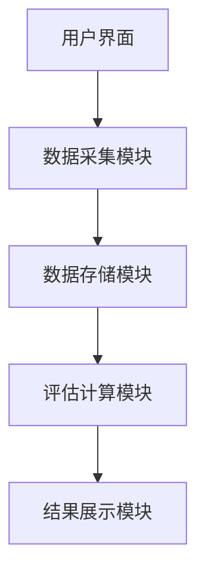

                 

# 费雪的公司文化评估：长期成功的基石

## 关键词：公司文化评估，长期成功，费雪模型，企业文化管理，管理方法论，组织发展

## 摘要：  
公司文化是企业长期成功的关键因素之一。本文将深入探讨费雪的公司文化评估方法，分析其核心概念、算法原理、系统架构设计以及实际应用案例，帮助读者全面理解如何通过科学的评估体系优化企业文化，为企业的可持续发展奠定坚实基础。

---

## 第一部分: 费雪的公司文化评估基础

## 第1章: 公司文化评估的背景与重要性

### 1.1 公司文化评估的定义与核心概念

#### 1.1.1 什么是公司文化
公司文化是指企业在长期经营过程中形成的，由核心价值观、使命、愿景、企业氛围和员工行为准则共同构成的组织文化体系。它是企业DNA的体现，影响着企业的决策、员工的行为以及对外的公众形象。

#### 1.1.2 公司文化评估的目的
公司文化评估的目的是通过量化和分析公司文化的关键要素，帮助企业识别文化中的优势与不足，进而优化文化结构，提升组织凝聚力和竞争力。

#### 1.1.3 费雪的公司文化评估方法
费雪的公司文化评估方法是一种基于数据驱动的评估体系，通过多维度的指标量化公司文化的健康程度，帮助企业更好地理解和改善文化问题。

---

### 1.2 公司文化评估的背景与现状

#### 1.2.1 当前企业面临的挑战
现代企业在快速变化的商业环境中，面临着市场竞争加剧、员工流动性增加、组织结构复杂化等挑战。这些问题往往与公司文化密切相关，良好的文化能够帮助企业更好地应对这些挑战。

#### 1.2.2 公司文化在企业成功中的作用
公司文化是企业的灵魂，它决定了企业的决策风格、员工的凝聚力和客户的服务质量。研究表明，拥有健康文化的公司在业绩表现、员工满意度和创新能力强等方面具有显著优势。

#### 1.2.3 费雪评估方法的提出背景
随着全球化和数字化的推进，企业对文化管理的需求日益增加。费雪评估方法的提出正是为了满足企业在复杂环境下优化文化结构的需求。

---

### 1.3 公司文化评估的边界与外延

#### 1.3.1 公司文化评估的范围
公司文化评估的范围包括企业内部文化氛围、员工价值观、管理层风格、客户文化感知等多个方面。费雪模型将这些方面划分为多个维度进行评估。

#### 1.3.2 相关概念的对比
公司文化评估与企业绩效管理、组织行为学等领域密切相关。费雪模型通过结合这些领域的研究成果，提出了独特的评估方法。

#### 1.3.3 费雪评估方法的核心要素
费雪评估方法的核心要素包括：文化一致性、领导力风格、员工参与度、创新氛围和客户满意度。这些要素构成了模型的评估框架。

---

## 第2章: 费雪公司文化评估模型的核心概念

### 2.1 费雪评估模型的原理

#### 2.1.1 模型的基本假设
费雪模型假设公司文化可以通过多个维度量化，并且这些维度之间存在相互作用，共同影响企业的整体表现。

#### 2.1.2 模型的主要组成部分
费雪模型由五个核心维度组成：文化一致性、领导力风格、员工参与度、创新氛围和客户满意度。

#### 2.1.3 模型的数学表达式
费雪模型的评分公式为：
$$ C = \sum_{i=1}^{5} w_i x_i $$
其中，$C$ 是公司文化评分，$w_i$ 是各维度的权重，$x_i$ 是各维度的评分。

---

### 2.2 费雪评估模型的核心属性

#### 2.2.1 评估维度的对比
通过对比不同维度的评分，可以发现公司在哪些方面表现优异，哪些方面需要改进。

#### 2.2.2 各维度的权重分配
根据经验数据，费雪模型将文化一致性赋予最高的权重，其次是领导力风格和员工参与度，最后是创新氛围和客户满意度。

#### 2.2.3 模型的适用场景
费雪模型适用于各种类型的企业，尤其适合需要快速优化文化的成长型企业。

---

## 第3章: 费雪公司文化评估模型的算法原理

### 3.1 模型的输入与输出

#### 3.1.1 输入数据的类型
输入数据包括企业内部调查问卷、管理层反馈、客户满意度调查等。

#### 3.1.2 输出结果的解释
输出结果是一个综合评分，评分范围为1到10分，分数越高表示公司文化越健康。

#### 3.1.3 算法的基本流程
1. 收集数据
2. 计算各维度评分
3. 计算综合评分
4. 输出结果

---

### 3.2 模型的数学推导

#### 3.2.1 模型的数学公式
$$ C = \sum_{i=1}^{5} w_i x_i $$

---

### 3.3 算法的实现步骤

#### 3.3.1 数据收集与预处理
通过问卷调查收集数据，并进行清洗和标准化处理。

#### 3.3.2 权重分配的计算
根据行业经验和企业实际情况，确定各维度的权重。

#### 3.3.3 最终评分的计算
通过加权计算得出综合评分。

---

## 第4章: 费雪公司文化评估系统的系统架构设计

### 4.1 系统的功能需求

#### 4.1.1 数据采集模块
负责收集公司文化相关的数据。

#### 4.1.2 评估计算模块
负责计算各维度评分和综合评分。

#### 4.1.3 结果展示模块
以图表形式展示评估结果。

---

### 4.2 系统的架构设计

#### 4.2.1 系统架构图

---

### 4.3 系统的接口设计

#### 4.3.1 数据接口
数据采集模块与数据存储模块之间的接口。

#### 4.3.2 计算接口
评估计算模块与结果展示模块之间的接口。

---

## 第5章: 费雪公司文化评估系统的项目实战

### 5.1 项目背景与目标

#### 5.1.1 项目背景
某科技公司希望通过优化公司文化提升员工满意度和创新力。

#### 5.1.2 项目目标
通过费雪模型评估公司文化，找出改进方向。

---

### 5.2 项目实施步骤

#### 5.2.1 数据收集
通过问卷调查收集员工反馈。

#### 5.2.2 数据分析
计算各维度评分和综合评分。

#### 5.2.3 结果解读
根据评分结果制定改进计划。

---

### 5.3 项目小结

通过该项目，我们验证了费雪模型的有效性，同时也积累了实际应用的经验。

---

## 第6章: 费雪公司文化评估的注意事项与最佳实践

### 6.1 最佳实践 tips

#### 6.1.1 数据收集的关键点
确保数据的准确性和代表性。

#### 6.1.2 模型应用的注意事项
根据企业实际情况调整权重。

#### 6.1.3 结果解读的关键点
结合企业具体情况进行分析。

---

### 6.2 小结

公司文化评估是企业长期成功的重要基石，费雪模型为企业提供了一种科学的评估方法。

---

## 第7章: 总结与展望

### 7.1 总结

通过本文的介绍，我们全面了解了费雪的公司文化评估方法，包括其核心概念、算法原理和实际应用。

### 7.2 展望

未来，随着人工智能和大数据技术的发展，公司文化评估将更加精准和智能化。

---

## 作者：AI天才研究院/AI Genius Institute & 禅与计算机程序设计艺术 /Zen And The Art of Computer Programming

