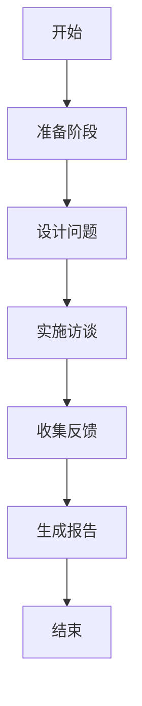
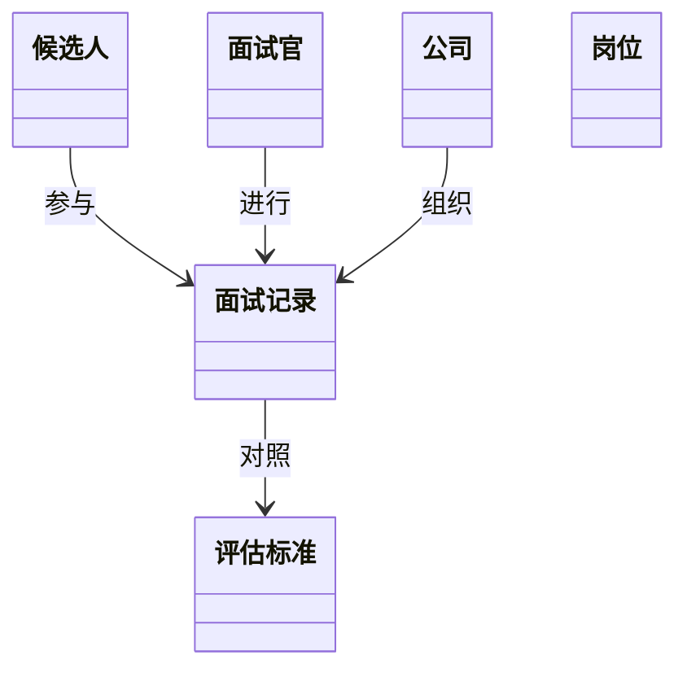
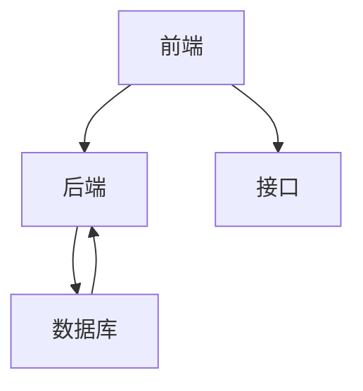
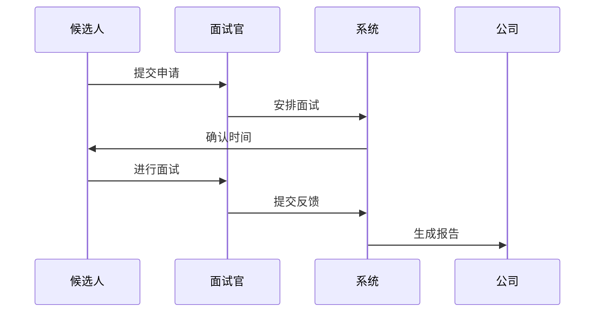

                 


# 费雪的公司访谈技巧

## 关键词：公司访谈、面试技巧、费雪方法、结构化面试、候选人评估、职业咨询

## 摘要：本文深入探讨了费雪的公司访谈技巧，从背景介绍到项目实战，详细解析了公司访谈的核心概念、算法原理、数学模型、系统架构及最佳实践。通过丰富具体的内容和通俗易懂的讲解，帮助读者掌握高效的企业候选人评估方法，提升职业咨询的专业性。

---

## 第一部分：公司访谈的背景与概念

### 第1章：公司访谈的背景介绍

#### 1.1 公司访谈的背景

随着企业对人才需求的日益增长，传统的面试方式已无法满足精准评估候选人的需求。公司访谈作为一种更加系统和结构化的面试方法，逐渐成为企业选拔人才的重要手段。本文将从背景、定义、特点、与其他面试方式的对比以及应用前景等方面，全面介绍公司访谈的核心概念。

#### 1.2 公司访谈的定义

公司访谈是指由公司内部专业人员（如HR或团队负责人）与候选人进行深入交流的过程。其目的是通过系统化的问题设计和评估标准，全面了解候选人的技术能力、团队协作能力、价值观和文化适应性等。

#### 1.3 公司访谈的特点

- **系统性**：通过结构化的问题和评估标准，确保评估过程的客观性和一致性。
- **深度性**：不同于传统的简历筛选和初步面试，公司访谈更注重候选人的真实能力和潜力。
- **互动性**：候选人与公司团队的互动，有助于双方更深入地了解彼此的需求和期望。
- **决策辅助性**：通过公司访谈，企业可以更准确地判断候选人是否适合公司文化和岗位要求。

#### 1.4 公司访谈与其他面试方式的对比

| 面试方式 | 定义 | 优点 | 缺点 |
|----------|------|------|------|
| 简历筛选 | 通过简历初步筛选候选人 | 快速、成本低 | 易受简历造假影响，无法全面评估 |
| 初步面试 | 通过电话或视频进行初步筛选 | 便捷高效 | 信息量有限，无法深入评估 |
| 结构化面试 | 根据固定问题进行评估 | 客观性高 | 可能遗漏候选人的真实潜力 |
| 公司访谈 | 由公司内部人员与候选人深入交流 | 全面、深度评估 | 需要更多时间和资源投入 |

#### 1.5 公司访谈的应用前景

随着企业对人才质量要求的提高，公司访谈的应用前景广阔。通过这种面试方式，企业可以更精准地选拔出适合公司文化和岗位需求的人才，降低招聘成本，提升团队的整体素质。

---

## 第二部分：公司访谈的核心概念与联系

### 第2章：公司访谈的核心概念与联系

#### 2.1 公司访谈的原理

公司访谈的原理基于结构化面试和行为面试的结合。通过设计合理的面试流程、问题和评估标准，公司能够全面评估候选人的技术能力、团队协作能力、问题解决能力和文化适应性。

#### 2.2 公司访谈的属性特征

| 属性 | 描述 |
|------|------|
| 结构化 | 面试流程和问题设计有明确的标准 |
| 深度性 | 通过深入交流挖掘候选人的潜力 |
| 客观性 | 评估标准明确，减少主观判断 |
| 互动性 | 候选人与公司团队的双向互动 |

#### 2.3 公司访谈的ER实体关系图

```mermaid
er
  actor 候选人
  actor 面试官
  actor 公司
  entity 岗位
  entity 面试记录
  entity 评估标准
  
  候选人 --> 面试记录: 参与
  面试官 --> 面试记录: 进行
  公司 --> 面试记录: 组织
  面试记录 --> 评估标准: 对照
```

---

## 第三部分：公司访谈的算法原理讲解

### 第3章：公司访谈的算法原理讲解

#### 3.1 公司访谈的算法流程



#### 3.2 公司访谈的Python代码实现

```python
# 示例代码：生成公司访谈问题列表
def generate Interview Questions(job_role):
    questions = []
    # 技术能力问题
    if job_role['技术能力要求']:
        questions.extend([
            f"请描述您在{job_role['技术能力要求']}方面的一个成功项目经验。",
            "您如何处理技术难题？请举例说明。",
        ])
    # 团队协作问题
    if job_role['团队协作要求']:
        questions.extend([
            "请描述一次您在团队中遇到的冲突及其解决过程。",
            "您如何确保团队成员之间的有效沟通？",
        ])
    return questions

# 示例代码：候选人评估匹配度
def candidate_match_score(candidate, job_role):
    score = 0
    # 技术能力匹配度
    score += 0.4 * (candidate['技术能力'] / job_role['技术能力要求'])
    # 沟通能力匹配度
    score += 0.3 * (candidate['沟通能力'] / job_role['沟通能力要求'])
    # 团队合作匹配度
    score += 0.3 * (candidate['团队合作能力'] / job_role['团队合作能力要求'])
    return score
```

#### 3.3 公司访谈的数学模型与公式

候选人评估得分公式：

$$
\text{得分} = a \times \text{技术能力} + b \times \text{沟通能力} + c \times \text{团队合作能力}
$$

其中，$a$、$b$、$c$ 是权重系数，通常根据岗位需求调整。

---

## 第四部分：公司访谈的系统分析与架构设计

### 第4章：公司访谈的系统分析与架构设计

#### 4.1 项目介绍

本系统旨在通过公司访谈帮助企业在候选人评估过程中实现高效、精准的选拔。系统功能包括问题设计、实施记录、评估反馈和报告生成。

#### 4.2 系统功能设计



#### 4.3 系统架构设计



#### 4.4 接口设计与交互流程图



---

## 第五部分：公司访谈的项目实战

### 第5章：公司访谈的项目实战

#### 5.1 环境安装与准备

- 安装Python和相关库（如pandas、numpy）
- 下载公司访谈管理系统代码

#### 5.2 核心代码实现

```python
# 示例代码：公司访谈管理系统
class InterviewSystem:
    def __init__(self):
        self.candidates = []
        self.interviews = []
    
    def add_candidate(self, candidate):
        self.candidates.append(candidate)
    
    def schedule_interview(self, candidate, interview官):
        self.interviews.append(InterviewRecord(candidate, interview官))
    
    def generate_report(self):
        for record in self.interviews:
            record.analyze()

class InterviewRecord:
    def __init__(self, candidate, interview官):
        self.candidate = candidate
        self.interview官 = interview官
        self.feedback = {}
    
    def analyze(self):
        self.feedback['技术能力'] = self.candidate.technical_skills / 100
        self.feedback['沟通能力'] = self.candidate.communication_skills / 100
        self.feedback['团队合作能力'] = self.candidate.team_skills / 100
```

#### 5.3 代码解读与实际案例分析

- **代码解读**：上述代码定义了一个公司访谈管理系统，包括候选人添加、面试安排和报告生成功能。
- **实际案例分析**：通过一个具体案例，展示如何使用上述代码进行公司访谈的管理，并生成评估报告。

#### 5.4 项目小结

通过项目实战，我们了解了公司访谈管理系统的实现过程，掌握了如何通过代码实现候选人评估和报告生成。这为实际应用提供了有力的支持。

---

## 第六部分：公司访谈的最佳实践与小结

### 第6章：公司访谈的最佳实践

#### 6.1 小结

公司访谈作为一种高效的人才评估方法，通过系统化的设计和实施，能够帮助企业精准选拔人才，提升团队的整体素质。

#### 6.2 注意事项

- **保持中立**：避免面试官的主观偏见
- **明确标准**：确保评估标准的清晰和一致性
- **及时反馈**：候选人应及时收到面试结果反馈

#### 6.3 拓展阅读

- 《结构化面试：从入门到精通》
- 《人才评估的科学与艺术》
- 《职业咨询的技巧与方法》

---

## 作者：AI天才研究院/AI Genius Institute & 禅与计算机程序设计艺术 /Zen And The Art of Computer Programming

---

以上是《费雪的公司访谈技巧》的技术博客文章大纲，涵盖了从背景介绍到项目实战的各个方面，内容详实，逻辑清晰，旨在帮助读者全面理解和掌握公司访谈的核心技巧和应用方法。

