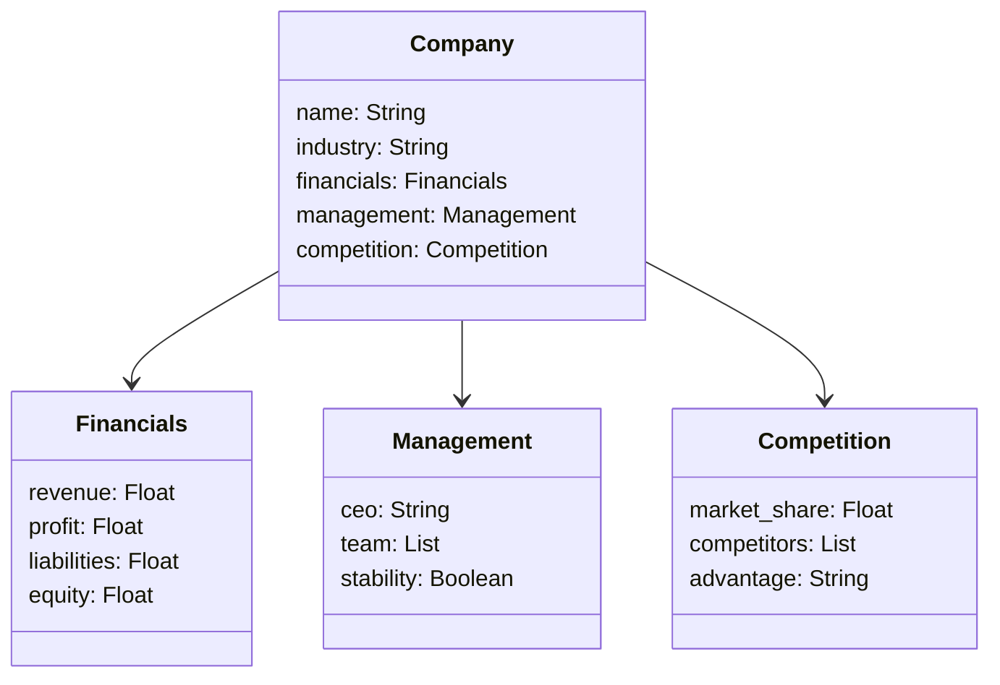

                 


# 费雪的公司调研技巧

## 关键词：费雪投资理念、公司调研、财务分析、竞争优势分析、管理层评估

## 摘要：  
本文深入探讨了费雪的公司调研技巧，结合其投资理念，详细分析了如何通过公司调研来评估管理层、财务状况和竞争优势。文章从背景介绍到实战案例，全面解析了费雪的调研方法，并结合技术语言和实际操作，为读者提供了系统化的指导。

---

## 第一部分: 费雪投资理念的背景与核心思想

### 1.1 费雪投资理论的背景

#### 1.1.1 费雪投资理论的背景  
费雪（Philip A. Fisher）是20世纪的投资大师，他的投资理念以“成长股投资”为核心，强调对公司基本面的深入研究。费雪的投资理论诞生于20世纪30年代至60年代，当时美国股市经历了多次剧烈波动，他通过长期观察和实践，提出了许多独特的投资理念，尤其是对公司调研的重视。

#### 1.1.2 费雪投资理论的核心思想  
费雪的核心思想是“投资于优秀的公司”，而非单纯追求低价股票。他认为，投资成功的的关键在于选择那些具有强大竞争优势、良好管理层和持续增长潜力的公司。他强调长期持有和持续关注公司发展。

#### 1.1.3 费雪投资理论的现实意义  
尽管费雪的投资理念提出于几十年前，但其核心思想至今仍具有重要的现实意义。尤其是在当前的数字化时代，企业竞争格局发生了巨大变化，但优秀公司的核心特质（如强大的管理层、健康的财务状况和竞争优势）并未改变。

### 1.2 公司调研的基本概念与方法

#### 1.2.1 公司调研的定义  
公司调研是指通过收集和分析公司的相关信息，评估其经营状况、财务健康性和未来发展潜力的过程。它是投资决策的重要基础。

#### 1.2.2 公司调研的核心要素  
- **管理层分析**：评估公司高管的素质、决策能力和稳定性。  
- **财务状况分析**：分析公司的财务报表，评估其盈利能力、偿债能力和成长性。  
- **竞争优势分析**：识别公司在行业中的竞争优势，包括技术、品牌、市场占有率等。  

#### 1.2.3 公司调研的基本方法  
- **定量分析**：通过财务指标（如市盈率、ROE等）评估公司价值。  
- **定性分析**：通过行业研究报告、公司访谈等方式，了解公司的经营策略和市场地位。  
- **实地调研**：通过参观公司、与管理层交流等方式，获取第一手信息。  

---

## 第二部分: 费雪公司调研的核心技巧

### 2.1 管理层分析

#### 2.1.1 管理层的素质评估  
- **领导能力**：评估管理层是否具有战略眼光和决策能力。  
- **团队稳定性**：考察管理层的人员构成是否稳定，是否存在频繁变动的情况。  
- **行业经验**：管理层是否在行业中有丰富的经验，是否能够应对行业变化。  

#### 2.1.2 管理层的决策能力  
- **决策效率**：管理层是否能够快速做出决策，并在市场变化中及时调整策略。  
- **决策质量**：管理层的决策是否符合公司长期利益，是否能够推动公司持续增长。  

#### 2.1.3 管理层的稳定性分析  
- **高管团队稳定性**：考察公司高管的变动频率，是否频繁更换CEO等重要职位。  
- **公司治理结构**：分析公司治理是否完善，是否存在大股东操控等问题。  

### 2.2 财务状况分析

#### 2.2.1 财务报表的基本构成  
财务报表包括资产负债表、利润表和现金流量表。  
- **资产负债表**：反映公司资产、负债和所有者权益的状况。  
- **利润表**：反映公司在一定时期内的收入、成本和利润情况。  
- **现金流量表**：反映公司在一定时期内的现金流入和流出情况。  

#### 2.2.2 财务指标的计算与解读  
- **市盈率（P/E）**：  
  $$ P/E = \frac{Price}{Earnings} $$  
  该指标用于衡量股票价格是否合理，反映了市场对公司未来盈利的预期。  
- **净资产收益率（ROE）**：  
  $$ ROE = \frac{Net\ Profit}{Total\ Equity} $$  
  该指标用于衡量公司运用股东资产创造利润的能力。  
- **资产负债率**：  
  $$ Debt-to-Asset\ Ratio = \frac{Total\ Liabilities}{Total\ Asse} $$  
  该指标用于评估公司财务杠杆的风险。  

#### 2.2.3 财务健康状况的评估  
- **盈利能力分析**：分析公司是否具有持续的盈利能力。  
- **偿债能力分析**：评估公司是否能够按时偿还债务。  
- **成长能力分析**：分析公司未来是否具有增长潜力。  

### 2.3 竞争优势分析

#### 2.3.1 行业地位的评估  
- **市场占有率**：公司是否在行业中占据领先地位。  
- **竞争对手分析**：分析公司在行业中的竞争优势和劣势。  

#### 2.3.2 核心竞争力的识别  
- **技术优势**：公司是否拥有独特的技术或专利。  
- **品牌优势**：公司品牌是否具有强大的市场影响力。  
- **成本优势**：公司是否在生产或运营成本上具有优势。  

#### 2.3.3 市场前景的分析  
- **行业增长潜力**：分析行业未来的发展趋势和增长空间。  
- **市场需求分析**：评估公司产品或服务的市场需求情况。  

---

## 第三部分: 费雪调研方法的系统化框架

### 3.1 调研流程的标准化

#### 3.1.1 调研计划的制定  
- **调研目标**：明确调研的目的和范围。  
- **调研时间表**：制定调研的时间安排，包括资料收集和分析阶段。  
- **调研团队构成**：确定调研团队的成员及其职责分工。  

#### 3.1.2 调研步骤的分解  
- **第一步**：收集公司相关信息，包括财务报表、行业报告等。  
- **第二步**：分析管理层的素质和决策能力。  
- **第三步**：评估公司的财务状况和竞争优势。  

#### 3.1.3 调研结果的整理与分析  
- **数据整理**：将收集到的资料进行分类整理，形成系统的分析报告。  
- **数据分析**：结合定量分析和定性分析，得出调研结论。  

### 3.2 调研工具与资源的运用

#### 3.2.1 财务分析工具的使用  
- **Excel**：用于财务指标的计算和数据可视化。  
- **Python**：用于复杂的数据分析和建模。  

#### 3.2.2 行业分析工具的使用  
- **Morningstar**：提供公司财务数据和行业分析报告。  
- **Bloomberg**：提供实时市场数据和公司新闻。  

#### 3.2.3 数据收集与处理工具  
- **网络爬虫**：用于从网站上抓取公司相关信息。  
- **数据库查询**：通过专业数据库获取公司数据。  

---

## 第四部分: 费雪调研技巧的数学模型与算法

### 4.1 财务指标的数学模型

#### 4.1.1 市盈率（P/E）的计算  
$$ P/E = \frac{Price}{Earnings} $$  
其中，Price为股票价格，Earnings为每股收益（EPS）。  

#### 4.1.2 净资产收益率（ROE）的计算  
$$ ROE = \frac{Net\ Profit}{Total\ Equity} $$  
其中，Net Profit为净利润，Total Equity为股东权益。  

#### 4.1.3 资产负债率的计算  
$$ Debt-to-Asset\ Ratio = \frac{Total\ Liabilities}{Total\ Asse} $$  
其中，Total Liabilities为总负债，Total Asse为总资产。  

### 4.2 竞争优势分析的算法

#### 4.2.1 竞争优势评估模型  
- **指标权重**：根据行业特点，确定各个竞争优势指标的权重。  
- **综合评分**：通过加权计算，得出公司的竞争优势评分。  

#### 4.2.2 算法实现  
```python
def calculate_competitive_edge(company_data):
    # company_data 包含各个竞争优势指标及其权重
    competitive_edge = 0
    for indicator, weight in company_data.items():
        competitive_edge += (indicator_score[indicator] * weight)
    return competitive_edge
```

---

## 第五部分: 系统分析与架构设计方案

### 5.1 系统功能设计

#### 5.1.1 领域模型（Mermaid 类图）  


### 5.2 系统架构设计

#### 5.2.1 系统架构图（Mermaid 架构图）  


---

## 第六部分: 项目实战

### 6.1 环境安装

#### 6.1.1 安装工具  
- **Python**：用于数据分析和建模。  
- **Pandas**：用于数据处理和分析。  
- **Matplotlib**：用于数据可视化。  

#### 6.1.2 安装命令  
```bash
pip install numpy pandas matplotlib
```

### 6.2 核心实现源代码

#### 6.2.1 数据分析代码  
```python
import pandas as pd
import numpy as np

def analyze_financials(dataframe):
    # 计算市盈率
    dataframe['P/E'] = dataframe['Price'] / dataframe['Earnings']
    # 计算净资产收益率
    dataframe['ROE'] = dataframe['Net Profit'] / dataframe['Total Equity']
    return dataframe

# 示例数据
data = {
    'Company': ['A', 'B', 'C'],
    'Price': [100, 80, 120],
    'Earnings': [20, 25, 15],
    'Net Profit': [10, 15, 20],
    'Total Equity': [50, 60, 70]
}
df = pd.DataFrame(data)
result = analyze_financials(df)
print(result)
```

---

## 第七部分: 最佳实践

### 7.1 小结与注意事项

- **持续学习**：投资市场的变化迅速，需要不断学习新的知识和技巧。  
- **风险管理**：即使选择了优秀的公司，也需要注意分散投资，控制风险。  
- **长期视角**：投资不是短期的交易，而是长期的价值创造。  

### 7.2 拓展阅读

- **书籍推荐**：《投资学原理》、《股票作手回忆录》。  
- **网站推荐**：Morningstar、Bloomberg、雪球财经。  

---

## 作者：AI天才研究院/AI Genius Institute & 禅与计算机程序设计艺术 /Zen And The Art of Computer Programming

