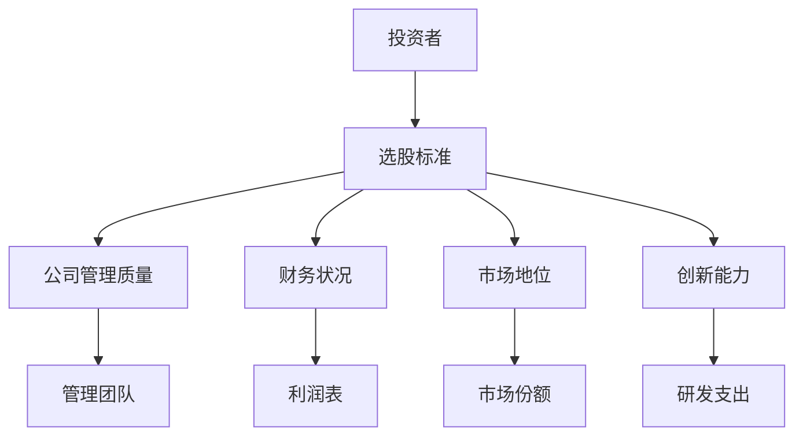
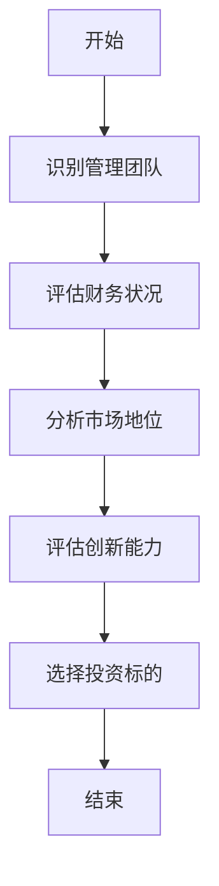
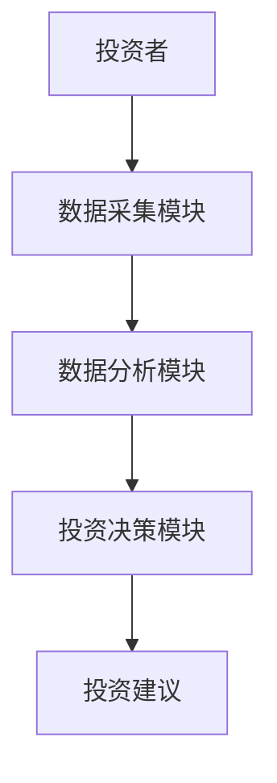

                 


# 费雪的创新企业投资法则

## 关键词：费雪投资法则，成长股投资，长期持有，十倍股，投资策略，复利效应

## 摘要：菲利普·费雪是成长股投资的先驱，他的投资法则强调长期持有优质股票，注重公司管理质量和成长潜力。本文将详细探讨费雪的投资理念、选股标准、长期投资策略，结合数学模型和系统架构，分析其投资法则的创新之处，并通过项目实战展示如何应用这些原则构建投资系统。文章最后总结了最佳实践和注意事项，为投资者提供实用的指导。

---

## 第一部分：费雪投资理念概述

### 第1章：费雪投资理念的背景与核心概念

#### 1.1 投资的基本问题与背景

- **投资的基本概念与问题背景**
  投资是通过购买资产以期获得未来收益的行为。在金融市场中，投资者面临的主要问题包括如何选择合适的资产、如何分散风险以及如何最大化收益。传统的投资方法通常关注短期价格波动，而费雪则提出了一种基于长期价值增长的投资策略。

- **费雪投资法则的提出与意义**
  菲利普·费雪（Philip Fisher）是20世纪著名的投资专家，他的投资法则强调长期持有优质股票，关注公司的管理质量和成长潜力。这种方法为成长股投资奠定了基础，改变了传统的价值投资观念。

- **投资领域的核心挑战与解决方案**
  投资领域的核心挑战在于如何识别具有长期增长潜力的公司。费雪提出，投资者应关注公司的管理团队、研发能力以及市场地位，而不是仅仅关注短期的财务指标。

#### 1.2 费雪投资理念的核心概念

- **费雪投资法则的定义与内涵**
  费雪的投资法则基于对公司未来成长潜力的评估，强调选择那些具有强大管理团队、良好财务状况和持续创新能力的公司。这种方法被称为“成长股投资”。

- **费雪法则与传统投资方法的区别**
  传统投资方法通常关注市盈率、股息率等财务指标，而费雪法则更注重公司的基本面和长期增长潜力。费雪认为，选择具有强大管理团队和创新能力的公司，能够带来长期的超额收益。

- **费雪法则的核心要素与边界**
  费雪法则的核心要素包括公司管理质量、财务健康状况、市场地位和创新能力。其边界在于，投资者需要避免选择那些财务状况不佳或管理层不稳定的企业。

---

## 第二部分：费雪的投资策略与选股标准

### 第2章：费雪的长期投资策略

#### 2.1 长期投资的核心原则

- **长期投资的定义与优势**
  长期投资是指将资金投入优质资产，持有数年至数十年，以获得复利效应带来的收益。其优势在于能够避免短期市场波动的影响，充分利用复利效应实现财富增长。

- **费雪长期投资策略的特点**
  费雪的长期投资策略强调选择具有持续增长潜力的公司，并长期持有这些股票。他认为，频繁的交易会增加成本并降低收益。

- **长期投资与短期投机的对比分析**
  长期投资注重公司的基本面和长期增长潜力，而短期投机则关注市场的短期价格波动。费雪认为，长期投资是更稳定和可持续的投资方式。

#### 2.2 费雪的“十倍股”概念

- **十倍股的定义与特征**
  十倍股是指那些在十年内股价增长十倍以上的股票。这些公司通常具有强大的管理团队、创新能力和市场地位，能够在较长的时间内实现持续增长。

- **十倍股的筛选标准与方法**
  费雪提出了一些筛选十倍股的标准，包括公司的管理质量、财务健康状况、市场地位和创新能力。投资者需要通过深入研究和分析，选择那些具有长期增长潜力的公司。

- **十倍股投资的潜在风险与应对策略**
  十倍股投资的风险在于市场的波动性和公司的经营风险。投资者需要通过分散投资、长期持有和持续关注公司基本面来降低风险。

---

## 第三部分：费雪投资法则的核心概念与联系

### 第3章：费雪投资法则的核心概念原理

#### 3.1 费雪法则的核心原理

- **费雪法则的核心理论基础**
  费雪法则的核心理论是成长股投资，即选择那些具有持续增长潜力的公司。他认为，公司的成长潜力是决定股价长期表现的关键因素。

- **费雪法则的逻辑框架与模型**
  费雪的逻辑框架包括以下几个步骤：首先，识别具有强大管理团队和创新能力的公司；其次，评估公司的财务状况和市场地位；最后，选择那些具有长期增长潜力的公司进行投资。

- **费雪法则与现代投资理论的结合**
  费雪法则与现代投资组合理论（MPT）相结合，可以通过分散投资来降低风险。同时，费雪法则强调长期投资，与现代投资理论的长期视角一致。

#### 3.2 核心概念的属性特征对比表格

| 核心概念 | 费雪法则 | 传统投资方法 |
|----------|----------|---------------|
| 投资目标 | 长期资本增值 | 短期收益最大化 |
| 选股标准 | 公司管理质量、成长潜力 | 市盈率、股息率等财务指标 |
| 投资策略 | 长期持有优质股票 | 频繁交易、短期套利 |

#### 3.3 ER实体关系图架构（Mermaid流程图）



---

## 第四部分：费雪投资法则的系统分析与架构设计

### 第4章：投资决策系统的算法原理

#### 4.1 算法原理

费雪投资法则的算法原理可以总结为以下步骤：

1. **识别具有强大管理团队的公司**
2. **评估公司的财务状况**
3. **分析公司的市场地位**
4. **评估公司的创新能力**
5. **选择具有长期增长潜力的公司进行投资**

#### 4.2 算法流程图（Mermaid流程图）



#### 4.3 数学模型与公式

费雪法则中的复利效应可以用以下公式表示：

$$
\text{最终收益} = \text{初始投资} \times (1 + r)^n
$$

其中，\( r \) 是年化收益率，\( n \) 是投资年数。

---

## 第五部分：费雪投资法则的项目实战

### 第5章：基于费雪法则的股票筛选系统

#### 5.1 项目介绍

本项目旨在构建一个基于费雪法则的股票筛选系统，帮助投资者识别具有长期增长潜力的公司。

#### 5.2 系统功能设计

- **数据采集模块**：从公开数据源获取公司的财务数据、管理团队信息和市场地位数据。
- **数据分析模块**：对公司的财务状况、管理质量、市场地位和创新能力进行分析。
- **投资决策模块**：根据分析结果，筛选出具有长期增长潜力的公司，生成投资建议。

#### 5.3 系统架构设计（Mermaid架构图）



#### 5.4 代码实现

```python
import pandas as pd

# 数据采集模块
def collect_data():
    # 从数据源获取数据
    data = pd.read_csv('stock_data.csv')
    return data

# 数据分析模块
def analyze_data(data):
    # 计算财务指标
    data['PE'] = data['股价'] / data['每股收益']
    data['ROE'] = data['净利润'] / data['股东权益']
    return data

# 投资决策模块
def make_investment_decision(data):
    # 筛选具有高ROE和合理PE的公司
    selected_stocks = data[(data['ROE'] > 15) & (data['PE'] < 15)]
    return selected_stocks

if __name__ == '__main__':
    data = collect_data()
    data = analyze_data(data)
    selected_stocks = make_investment_decision(data)
    print("投资建议：", selected_stocks)
```

#### 5.5 实际案例分析

假设我们有一个包含以下数据的股票列表：

| 公司名称 | 股价 | 每股收益 | 净利润 | 股东权益 | ROE |
|----------|------|----------|--------|----------|-----|
| 公司A    | 100  | 5        | 100    | 1000     | 10% |
| 公司B    | 80   | 4        | 160    | 2000     | 8%  |
| 公司C    | 120  | 6        | 180    | 1500     | 12% |

根据我们的筛选标准（ROE > 15% 且 PE < 15），没有公司符合筛选条件。因此，系统将不会生成投资建议。

---

## 第六部分：最佳实践、小结、注意事项和拓展阅读

### 第6章：最佳实践与小结

- **最佳实践**
  - 长期持有优质股票，避免频繁交易。
  - 选择具有强大管理团队和创新能力的公司。
  - 分散投资，降低风险。

- **小结**
  费雪的投资法则是一种基于长期价值增长的投资策略，强调选择具有强大管理团队和创新能力的公司。通过长期持有这些股票，投资者可以实现财富的长期增长。

### 第7章：注意事项和拓展阅读

- **注意事项**
  - 投资有风险，需谨慎选择投资标的。
  - 长期投资需要耐心和信心，避免被短期市场波动影响。
  - 分散投资是降低风险的有效方法。

- **拓展阅读**
  - 《彼得·林奇的股票投资策略》
  - 《价值投资： Warren Buffett的选股艺术》
  - 《投资的智慧： Benjamin Graham的理论与实践》

---

## 作者：AI天才研究院/AI Genius Institute & 禅与计算机程序设计艺术 /Zen And The Art of Computer Programming

